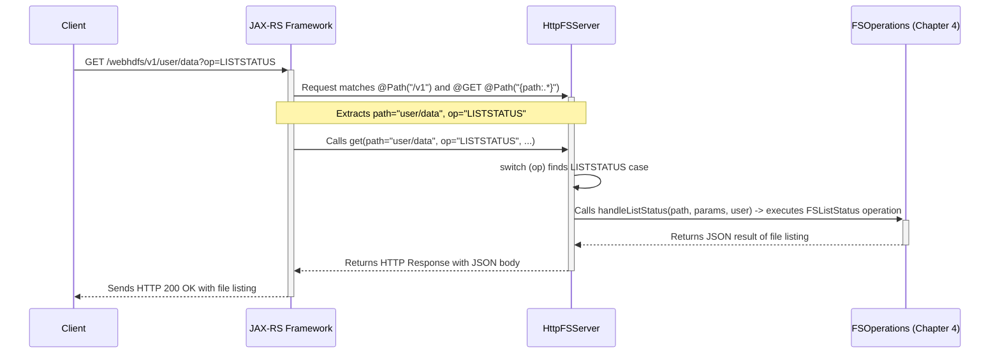

# Chapter 1: HTTP Request Routing & Handling (HttpFSServer)

Welcome to the `httpfsgateway` tutorial! This project acts as a bridge, allowing you to interact with a distributed filesystem (like HDFS or Ozone) using standard web (HTTP) requests, just like you browse the internet.

Imagine you want to list the files in a specific folder on the filesystem, but you want to do it using a simple web request from your browser or a script, instead of using complex filesystem commands. How does the gateway know *what* you want to do (list files) and *where* you want to do it (which folder)? That's where our first component comes in!

In this chapter, we'll explore the `HttpFSServer`, the main entry point for all incoming requests to the gateway. Think of it as the main reception desk in a large office building. When someone arrives (an HTTP request comes in), the receptionist (`HttpFSServer`) looks at who they want to see (the URL path) and what they want to do (the HTTP method like GET, PUT, POST, DELETE, and specific 'op' parameters) and directs them to the correct department (the specific Java code that handles the request).

## The Problem: Understanding Web Requests

Web applications receive requests from clients (like your web browser or a command-line tool like `curl`). These requests typically have:

1.  **An HTTP Method:** This tells the server the *kind* of action the client wants to perform. Common methods include:
    *   `GET`: Retrieve data (e.g., get a file's content, list a directory).
    *   `PUT`: Create or replace data (e.g., upload a file, create a directory).
    *   `POST`: Send data for processing (e.g., append to a file, trigger an action).
    *   `DELETE`: Remove data (e.g., delete a file or directory).
2.  **A URL Path:** This specifies the *resource* the client wants to interact with (e.g., `/webhdfs/v1/user/mydata/myfile.txt`).
3.  **Query Parameters (Optional):** Extra information provided after a `?` in the URL (e.g., `?op=LISTSTATUS`). These often specify the exact operation when the path and method aren't enough.
4.  **A Request Body (Optional):** Data sent with PUT or POST requests (e.g., the content of a file being uploaded).

Our `httpfsgateway` needs a way to look at all these parts of an incoming request and decide *exactly* which piece of Java code should handle it.

## The Solution: JAX-RS Annotations in `HttpFSServer`

`HttpFSServer` uses a standard Java technology called JAX-RS (Java API for RESTful Web Services) to handle this routing. JAX-RS allows developers to use simple "annotations" (special markers starting with `@`) in the Java code to map incoming HTTP requests to specific Java methods.

Here are the key annotations used in `HttpFSServer`:

*   `@Path`: Specifies the URL path segment that a class or method handles. For example, `@Path("/v1")` on the `HttpFSServer` class means it handles requests starting with `/webhdfs/v1`. `@Path("{path:.*}")` on a method means it handles any path *after* the initial `/v1` and makes that path available in a variable named `path`.
*   `@GET`, `@PUT`, `@POST`, `@DELETE`: These annotations map the corresponding HTTP method to a Java method. A request using `GET` will be directed to a method marked with `@GET`.
*   `@PathParam`: Extracts a part of the URL path defined in `@Path` and makes it available as a variable in the Java method.
*   `@QueryParam`: Extracts a query parameter from the URL (like `op=LISTSTATUS`) and makes it available as a variable in the Java method.
*   `@Consumes`: Specifies the type of data the method expects in the request body (e.g., `@Consumes({"*/*"})` means it can accept any type).
*   `@Produces`: Specifies the type of data the method will send back in the response (e.g., `@Produces(MediaType.APPLICATION_JSON)` means it sends back JSON data).

## Use Case: Listing Files in a Directory

Let's say you want to list the contents of the directory `/user/data`. Using the WebHDFS API standard (which `httpfsgateway` follows), you would send an HTTP `GET` request like this:

```
GET /webhdfs/v1/user/data?op=LISTSTATUS HTTP/1.1
Host: your-gateway-host:port
```

How does `HttpFSServer` handle this?

1.  The gateway receives the `GET` request for the path `/webhdfs/v1/user/data` with the query parameter `op=LISTSTATUS`.
2.  JAX-RS sees that `HttpFSServer` is annotated with `@Path("/v1")` (constants make it `/webhdfs/v1`, but let's simplify to `/v1` for now). This matches the first part of the path.
3.  It looks for a method inside `HttpFSServer` that handles `GET` requests and matches the rest of the path (`/user/data`). The method `get()` is annotated with `@GET` and `@Path("{path:.*}")`. This is a match!
4.  JAX-RS extracts the path part `user/data` using `@PathParam("path")` and the query parameter `LISTSTATUS` using `@QueryParam("op")`.
5.  It calls the `get()` Java method, passing `path = "user/data"` and `op = LISTSTATUS` as arguments.

## Diving into the Code

Let's look at simplified snippets from `HttpFSServer.java` to see this in action.

First, the class itself is mapped to the base path:

```java
// --- File: src/main/java/org/apache/ozone/fs/http/server/HttpFSServer.java ---

// This annotation tells JAX-RS that this class handles requests
// starting with the path defined in HttpFSConstants.SERVICE_VERSION (e.g., "/v1")
@Path(HttpFSConstants.SERVICE_VERSION)
public class HttpFSServer {
    // ... class contents ...
}
```

This annotation sets the base context. Any `@Path` inside this class is relative to `/webhdfs/v1`.

Now, let's look at the `get()` method that handles `GET` requests for specific paths:

```java
// --- File: src/main/java/org/apache/ozone/fs/http/server/HttpFSServer.java ---

    // Handles HTTP GET requests
    @GET
    // Matches any path after the base /v1 path
    @Path("{path:.*}")
    // Specifies what kind of data this method can return (JSON or raw bytes)
    @Produces({MediaType.APPLICATION_OCTET_STREAM + "; " + JettyUtils.UTF_8,
               MediaType.APPLICATION_JSON + "; " + JettyUtils.UTF_8})
    public Response get(@PathParam("path") String path, // Gets the path from the URL
                      @Context UriInfo uriInfo, // Provides URI details
                      @QueryParam(OperationParam.NAME) OperationParam op, // Gets 'op' param
                      @Context HttpServletRequest request) // Raw request access
      throws IOException, FileSystemAccessException {

        // ... (authentication check happens here - covered in Chapter 2) ...

        UserGroupInformation user = HttpUserGroupInformation.get(); // Get user info
        final Parameters params = getParams(request); // Parse all parameters
        Response response;
        path = makeAbsolute(path); // Ensure path starts with "/"

        // Decide what to do based on the 'op' parameter
        switch (op.value()) {
            case LISTSTATUS:
                // If op=LISTSTATUS, call the specific handler method
                response = handleListStatus(path, params, user);
                break;
            case GETFILESTATUS:
                response = handleGetFileStatus(path, user);
                break;
            case OPEN: // Requesting file content
                response = handleOpen(path, uriInfo, params, user);
                break;
            // ... other cases for different GET operations ...
            default:
                throw new IOException("Invalid HTTP GET operation: " + op.value());
        }
        return response; // Send the response back to the client
    }
```

This `get()` method acts like the main dispatcher for all `GET` operations.
*   `@GET`: Matches the HTTP `GET` method.
*   `@Path("{path:.*}")`: Matches any sub-path like `/user/data` and captures it into the `path` variable.
*   `@PathParam("path") String path`: Injects the captured path (`user/data`) into the `path` variable.
*   `@QueryParam("op") OperationParam op`: Injects the value of the `op` query parameter (`LISTSTATUS`) into the `op` variable.
*   The `switch (op.value())` statement then looks at the specific operation requested (`LISTSTATUS` in our example) and calls the appropriate helper method (`handleListStatus`).

The actual filesystem interaction doesn't happen directly here. This method's job is just *routing*. It delegates the real work to other methods (like `handleListStatus`) which in turn use components we'll discuss in later chapters, like [Filesystem Operation Execution (FSOperations)](04_filesystem_operation_execution__fsoperations__.md).

## Internal Implementation Walkthrough

Let's visualize the flow for our `GET /webhdfs/v1/user/data?op=LISTSTATUS` request:



1.  **Client Sends Request:** Your browser or script sends the `GET` request.
2.  **JAX-RS Routes:** The web server (using the JAX-RS framework) intercepts the request. It uses the annotations (`@Path`, `@GET`) to find the `HttpFSServer.get()` method.
3.  **Parameter Extraction:** JAX-RS automatically extracts the path (`user/data`) and query parameter (`LISTSTATUS`) and passes them to the `get()` method.
4.  **Operation Dispatch:** The `get()` method uses a `switch` statement based on the `op` parameter to determine the exact action.
5.  **Delegation:** It calls the specific handler method (`handleListStatus`) for that operation.
6.  **Filesystem Interaction (Later Chapters):** The handler method interacts with the underlying filesystem via abstractions covered in [Filesystem Operation Execution (FSOperations)](04_filesystem_operation_execution__fsoperations__.md) and [Filesystem Access Layer (FileSystemAccessService)](05_filesystem_access_layer__filesystemaccessservice__.md).
7.  **Response Generation:** The result (e.g., a JSON list of files) is packaged into an HTTP Response object.
8.  **Client Receives Response:** The JAX-RS framework sends the HTTP response back to the client.

## The Reception Desk Analogy Revisited

So, `HttpFSServer` acts as the friendly receptionist:

*   **Incoming Visitor/Call:** An HTTP request arrives.
*   **Receptionist:** `HttpFSServer` instance.
*   **Directory/Instructions:** JAX-RS annotations (`@Path`, `@GET`, `@POST`, etc.) tell the receptionist which department handles which type of request for which resource.
*   **Asking "Who are you visiting?"**: `@PathParam` extracts the target resource from the URL path.
*   **Asking "What's the purpose?"**: `@QueryParam` extracts specific operations like `op=LISTSTATUS`. `@GET`/`@POST`/etc. indicate the general purpose.
*   **Directing the Visitor:** The Java method calls the appropriate handler function (like sending the visitor to the correct department).

## Conclusion

You've now seen how `httpfsgateway` uses `HttpFSServer` and JAX-RS annotations to act as the main entry point for HTTP requests. It intelligently routes incoming requests based on their URL path, HTTP method, and query parameters to the correct internal Java methods that will eventually perform the desired filesystem operations.

But before the gateway performs any action like listing or creating files, it needs to know *who* is making the request and if they are *allowed* to do so. This crucial step is handled by the Authentication and Authorization layer, which we will explore in the next chapter.

Ready to see how the gateway verifies user identity? Let's move on to [Chapter 2: Authentication & Authorization](02_authentication___authorization_.md)!

---

Generated by [AI Codebase Knowledge Builder](https://github.com/The-Pocket/Tutorial-Codebase-Knowledge)