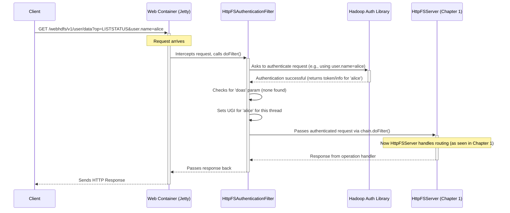

# Chapter 2: Authentication & Authorization

Welcome back! In [Chapter 1: HTTP Request Routing & Handling (HttpFSServer)](01_http_request_routing___handling__httpfsserver__.md), we saw how `httpfsgateway` acts like a receptionist, figuring out *what* operation the client wants to perform and *where* based on the incoming HTTP request. But before letting just *anyone* read, write, or delete files, the gateway needs to perform a crucial security check.

## The Problem: Who Are You and What Can You Do?

Imagine our filesystem is like a secure office building. Chapter 1 showed us how the receptionist (`HttpFSServer`) directs visitors based on who they want to see (the URL path) and what they want to do (the HTTP method and `op` parameter).

But think about it: should *anyone* who walks up to the reception desk be allowed to just wander into any office or access sensitive files? Absolutely not! The building needs a security checkpoint right at the entrance.

This checkpoint needs to answer two fundamental questions for every incoming request (visitor):

1.  **Authentication:** *Who are you?* Can you prove your identity? (Like showing a valid ID card).
2.  **Authorization:** *Are you allowed to do what you're asking?* Even if we know who you are, do you have permission for this specific action? (Like checking if your ID card grants access to the requested floor/office).

Furthermore, sometimes a trusted user (like an administrator or a service) might need to perform an action *on behalf of* another user. This is called **impersonation** or acting as a **proxy user**. The security checkpoint also needs to verify if the person trying to act on behalf of someone else is actually authorized to do so.

## The Solution: The `HttpFSAuthenticationFilter` Security Checkpoint

In `httpfsgateway`, this security checkpoint is primarily handled by a component called `HttpFSAuthenticationFilter`. It's a special piece of code (a "servlet filter") that intercepts *every* incoming HTTP request *before* it reaches the main request handler (`HttpFSServer` from Chapter 1).

Think of it like a security guard standing between the building entrance and the reception desk.

Here's what the `HttpFSAuthenticationFilter` does:

1.  **Checks Identity (Authentication):** It looks at the incoming request for credentials. How it does this depends on how the gateway is configured:
    *   **Simple Authentication:** It might just trust a username provided in the request parameters (e.g., `user.name=alice`). This is common in less secure test environments.
    *   **Kerberos Authentication:** In secure environments (like most real Hadoop clusters), it expects the user to present a cryptographic "ticket" (a Kerberos token) proving their identity, which the filter validates against a central security server (KDC).
    *   **Other Methods:** It can be configured for other standard authentication methods too.
2.  **Checks Impersonation Rules (Proxy User Authorization):** If the request includes a `doas=<username>` parameter (meaning the authenticated user wants to act *as* another user), the filter checks specific configuration rules (e.g., `httpfs.proxyuser.<AuthUser>.hosts`, `httpfs.proxyuser.<AuthUser>.groups`, `httpfs.proxyuser.<AuthUser>.users`). These rules define which users are allowed to impersonate whom, and from where.
3.  **Establishes User Context:** If authentication (and proxy user authorization, if applicable) succeeds, the filter establishes the *effective user* for this request (either the authenticated user or the user being impersonated). This user identity is then made available for subsequent steps, like checking file permissions.
4.  **Blocks Unauthorized Requests:** If authentication fails or the proxy user request is not allowed, the filter immediately stops the request and sends back an error response (e.g., `401 Unauthorized` or `403 Forbidden`), preventing it from ever reaching the filesystem operation logic.

## Use Case: Alice Accesses Her Files

Let's revisit Alice wanting to list her home directory `/user/alice`. Her request might look like this (using simple authentication for simplicity):

```
GET /webhdfs/v1/user/alice?op=LISTSTATUS&user.name=alice HTTP/1.1
Host: your-gateway-host:port
```

Here's how the security filter handles it:

1.  **Request Arrives:** The gateway receives the `GET` request.
2.  **Filter Intercepts:** Before `HttpFSServer` sees the request, `HttpFSAuthenticationFilter` intercepts it.
3.  **Authentication:** The filter sees `user.name=alice`. Since the gateway is configured for simple auth (we assume), it accepts "alice" as the authenticated user.
4.  **Authorization (Proxy User):** There's no `doas=` parameter, so no proxy user check is needed.
5.  **Set Context:** The filter marks this request as being performed by user "alice".
6.  **Pass Through:** The filter allows the request to proceed to the next step – the `HttpFSServer` routing we saw in Chapter 1.

Now, when the code eventually tries to list files in `/user/alice` (covered in [Chapter 4: Filesystem Operation Execution (FSOperations)](04_filesystem_operation_execution__fsoperations__.md) and [Chapter 5: Filesystem Access Layer (FileSystemAccessService)](05_filesystem_access_layer__filesystemaccessservice__.md)), it will do so *as user "alice"*. The underlying filesystem will then check if "alice" actually has permission to list that directory.

If Bob tried to access Alice's directory:

```
GET /webhdfs/v1/user/alice?op=LISTSTATUS&user.name=bob HTTP/1.1
Host: your-gateway-host:port
```

The filter would authenticate "bob". Later, when the filesystem checks permissions, it would likely deny Bob access to `/user/alice` (unless specific permissions were granted), even though Bob successfully authenticated. This shows the difference between *authentication* (proving who you are) and *authorization* (checking if you have permission for the action/resource).

## Diving into the Code (Conceptual)

The `HttpFSAuthenticationFilter` is configured as part of the web application setup. It extends a standard Hadoop authentication filter, inheriting much of its power.

Its core logic resides in a method conceptually similar to this (simplified):

```java
// --- Simplified conceptual logic within HttpFSAuthenticationFilter ---

public void doFilter(ServletRequest request, ServletResponse response, FilterChain chain)
    throws IOException, ServletException {

    HttpServletRequest httpRequest = (HttpServletRequest) request;
    HttpServletResponse httpResponse = (HttpServletResponse) response;

    try {
        // 1. Attempt to authenticate the user based on request credentials
        //    (e.g., user.name param, Kerberos token, etc.)
        //    This uses underlying Hadoop Authentication libraries.
        AuthenticationToken authToken = authenticate(httpRequest);

        // 2. If authenticated, get the UserGroupInformation (UGI)
        UserGroupInformation ugi = UserGroupInformation.getCurrentUser(); // Or derived from token

        // 3. Check for proxy user ("doas") parameter
        String doAsUser = httpRequest.getParameter("doas");
        if (doAsUser != null) {
            // 4. Verify if the authenticated user (ugi) is allowed
            //    to impersonate 'doAsUser' based on proxyuser config.
            //    Throws exception if not allowed.
            ProxyUsers.authorize(ugi, doAsUser, httpRequest.getRemoteAddr());

            // 5. If allowed, create a UGI for the 'doAsUser'
            ugi = UserGroupInformation.createProxyUser(doAsUser, ugi);
        }

        // 6. Set the final UGI for this request thread
        HttpUserGroupInformation.set(ugi);

        // 7. If all checks passed, continue the request processing
        chain.doFilter(request, response);

    } catch (AuthenticationException | AuthorizationException ex) {
        // Authentication or Proxy User Auth failed!
        // Send an error response (e.g., 401 Unauthorized or 403 Forbidden)
        httpResponse.sendError(HttpServletResponse.SC_UNAUTHORIZED, ex.getMessage());
    } finally {
        // Clean up the user context for this thread
        HttpUserGroupInformation.set(null);
    }
}
```

*   **`doFilter`:** This is the standard method for servlet filters. It gets the request and response objects.
*   **`authenticate`:** This internal step uses Hadoop's authentication libraries to check credentials based on the configured method (Simple, Kerberos, etc.).
*   **`ProxyUsers.authorize`:** This checks the proxy user configuration rules (loaded from `httpfs.proxyuser.*` settings).
*   **`UserGroupInformation` (UGI):** This is Hadoop's standard way of representing a user and their groups. The filter ensures the correct UGI (either the authenticated user or the `doAs` user) is set.
*   **`HttpUserGroupInformation.set(ugi)`:** This makes the determined user information available to later parts of the request processing code.
*   **`chain.doFilter`:** If authentication succeeds, this passes the request along to the next filter or ultimately to the `HttpFSServer`.
*   **Error Handling:** If any check fails, an error response is sent immediately.

The filter itself is configured in the web application deployment descriptor (`web.xml`) or programmatically to intercept requests matching the `/webhdfs/v1/*` pattern.

## Internal Implementation Walkthrough

Let's trace the flow for a request needing authentication:



1.  **Client Sends Request:** The client includes credentials (like `user.name=alice` or a Kerberos token).
2.  **Web Container Receives:** The underlying web server (like Jetty) gets the request.
3.  **Filter Intercepts:** The container routes the request first to `HttpFSAuthenticationFilter` because it's configured to intercept these paths.
4.  **Authentication:** The filter uses Hadoop's authentication libraries (`hadoop-auth`) to validate the credentials based on its configuration (`httpfs.authentication.type`, etc., read from `HttpFSAuthenticationFilter.java` using `getConfiguration`).
5.  **Proxy Check:** It checks for a `doas` parameter and verifies against proxy user rules (`getProxyuserConfiguration` in `HttpFSAuthenticationFilter.java`).
6.  **Set User Context:** It establishes the `UserGroupInformation` for the request.
7.  **Forward Request:** If successful, it calls `chain.doFilter()`, passing the request to the next component, which is usually the `HttpFSServer`'s JAX-RS handler.
8.  **Operation Execution:** `HttpFSServer` (and subsequently components like [FSOperations](04_filesystem_operation_execution__fsoperations__.md) and [FileSystemAccessService](05_filesystem_access_layer__filesystemaccessservice__.md)) will now use the user context set by the filter to perform actions *as that user*.
9.  **Response:** The response flows back through the filter chain.

## The Security Checkpoint Analogy Revisited

*   **Visitor Arrives:** An HTTP request comes in.
*   **Security Guard:** `HttpFSAuthenticationFilter` stops the request.
*   **"Show me your ID":** The filter checks `user.name`, Kerberos ticket, etc. (Authentication).
*   **"Are you visiting on behalf of someone? Show me your authorization letter":** The filter checks the `doas` parameter and proxy user rules (Proxy User Authorization).
*   **Access Denied:** If checks fail, the guard turns the visitor away (sends HTTP 401/403).
*   **Access Granted:** If checks pass, the guard notes who the visitor is (and who they represent, if applicable) and lets them proceed to the Reception Desk (`HttpFSServer`).
*   **Reception Desk:** `HttpFSServer` (Chapter 1) now directs the *verified* visitor to the correct department.
*   **Department:** Filesystem operations ([Chapter 4](04_filesystem_operation_execution__fsoperations__.md), [Chapter 5](05_filesystem_access_layer__filesystemaccessservice__.md)) perform the task, respecting the permissions of the *verified* user.

## Conclusion

You've now learned about the critical role of Authentication and Authorization in `httpfsgateway`. The `HttpFSAuthenticationFilter` acts as a security checkpoint, intercepting every request to verify the user's identity and their right to potentially act as a proxy user *before* any filesystem operations are attempted. This ensures that only legitimate users can access and modify data according to their permissions.

With the user verified, the gateway now needs to precisely understand all the details of the requested operation (like block size for creating a file, or replication factor). How does it parse all the different parameters that can accompany an HTTP request? That's the job of the [HTTP Parameter Parsing Framework](03_http_parameter_parsing_framework_.md), which we'll explore next!

---

Generated by [AI Codebase Knowledge Builder](https://github.com/The-Pocket/Tutorial-Codebase-Knowledge)