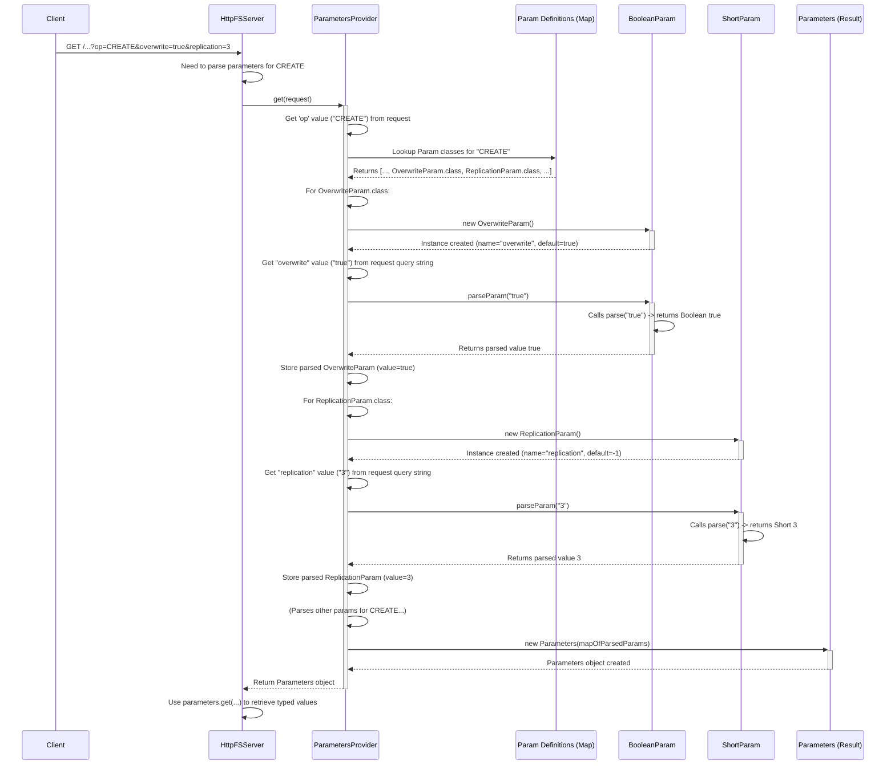

# Chapter 3: HTTP Parameter Parsing Framework

Welcome back! In [Chapter 1: HTTP Request Routing & Handling (HttpFSServer)](01_http_request_routing___handling__httpfsserver__.md), we saw how `httpfsgateway` figures out *what* the user wants to do (like `LISTSTATUS`). Then, in [Chapter 2: Authentication & Authorization](02_authentication___authorization_.md), we learned how it verifies *who* the user is and if they're allowed to make requests.

Now, let's think about the details. Many filesystem operations need extra information. For example, when you create a file, you might want to specify if it should overwrite an existing file, or how many copies (replication factor) it should have. This information is usually passed in the URL's query string, like `?op=CREATE&overwrite=true&replication=3`.

## The Problem: Making Sense of Request Details

Imagine you're filling out an online form. The form has fields like "Name", "Age", "Email", and maybe checkboxes like "Subscribe to newsletter?". When you submit the form, the website needs to:

1.  **Read** the values you entered for each field.
2.  **Validate** them (e.g., is "Age" actually a number? Is "Email" in a valid format?).
3.  **Convert** them into a format the server code can easily use (e.g., convert the text "30" into an actual number, convert the checkbox state into `true` or `false`).

Our `httpfsgateway` faces a similar challenge with HTTP request parameters. The raw query string (`?op=CREATE&overwrite=true&replication=3`) is just text. The Java code that handles the `CREATE` operation needs these values as proper Java types (like `Boolean` for `overwrite` and `Short` for `replication`), and it needs to know what the default values should be if a parameter isn't provided. It also needs to handle cases where the user provides invalid input (like `&replication=three`).

## The Solution: A Framework for Parsing Parameters

`httpfsgateway` uses a small, dedicated framework to handle this, acting just like that online form processor. It defines the "fields" and their "rules" and then uses a processor to read and validate the incoming request data against these definitions.

Here are the key pieces:

1.  **`Param<T>` (The Base Field Definition):** This is the fundamental building block. Think of it as the abstract idea of a "form field".
    *   It knows the **name** of the parameter (e.g., "overwrite", "replication").
    *   It knows the **default value** if the user doesn't provide one.
    *   It defines a general way (`parseParam`) to take the raw text string from the URL and try to convert it into the correct Java type (`T`).
    *   It requires specific types of parameters to implement the actual conversion logic (`parse` method).

2.  **Specific `Param` Subclasses (The Field Types):** These extend the base `Param` and define the rules for specific data types. They are like the specific field types on our form (text field, number field, checkbox). Examples include:
    *   `BooleanParam`: Handles `true`/`false` values (like our `overwrite` checkbox).
    *   `ShortParam`: Handles small integer numbers (like `replication`).
    *   `LongParam`: Handles large integer numbers.
    *   `StringParam`: Handles text values, optionally checking against a pattern.
    *   `EnumParam<E>`: Handles values that must be one of a predefined set (like `op=LISTSTATUS` where `LISTSTATUS` is one of the allowed operations).

3.  **`ParametersProvider` (The Form Processor):** This class is the engine that does the work.
    *   It's configured with a map that says: "For *this* operation (e.g., `CREATE`), *these* are the expected parameter types (e.g., `OverwriteParam`, `ReplicationParam`)."
    *   When a request comes in, the provider is given the request object.
    *   It reads the `op` parameter to know which operation is being performed.
    *   It looks up the expected `Param` definitions for that operation.
    *   For each expected parameter, it finds the corresponding value(s) in the request's query string.
    *   It uses the `parseParam` method of the specific `Param` subclass (e.g., `BooleanParam.parseParam("true")`) to validate and convert the string value.
    *   If a parameter is missing, it uses the default value defined in the `Param` subclass.
    *   If parsing fails (e.g., `replication=foo`), it throws an error.

4.  **`Parameters` (The Filled Form):** This is a simple container object returned by the `ParametersProvider`. It holds the successfully parsed and validated values for all the parameters relevant to the current request. The main request handling code (in `HttpFSServer`) can then easily retrieve the typed values from this object.

## Use Case: Creating a File with Options

Let's trace our example: `GET /webhdfs/v1/data/newfile?op=CREATE&overwrite=true&replication=3`

1.  **Request Arrives:** `HttpFSServer` receives the request.
2.  **Identify Operation:** It sees `op=CREATE`.
3.  **Invoke Parser:** Inside `HttpFSServer`, a helper method calls `HttpFSParametersProvider.get(request)`.
4.  **Provider Gets Definitions:** The `HttpFSParametersProvider` knows that for `Operation.CREATE`, the expected parameters include `OverwriteParam` and `ReplicationParam` (among others). Let's look at their definitions (simplified):

    ```java
    // --- Simplified from: src/main/java/org/apache/ozone/fs/http/server/HttpFSParametersProvider.java ---

    // Defines the 'overwrite' parameter
    public static class OverwriteParam extends BooleanParam {
        public static final String NAME = HttpFSConstants.OVERWRITE_PARAM; // "overwrite"
        public OverwriteParam() {
            super(NAME, true); // Default value is true
        }
    }

    // Defines the 'replication' parameter
    public static class ReplicationParam extends ShortParam {
        public static final String NAME = HttpFSConstants.REPLICATION_PARAM; // "replication"
        public ReplicationParam() {
            super(NAME, (short) -1); // Default value is -1 (means use system default)
        }
    }
    ```
    *   `OverwriteParam` extends `BooleanParam`. Its name is "overwrite", and its default value is `true`. The `BooleanParam` base class knows how to parse "true" or "false".
    *   `ReplicationParam` extends `ShortParam`. Its name is "replication", and its default value is `-1`. The `ShortParam` base class knows how to parse a string into a `short` integer.

5.  **Provider Parses Request:**
    *   It finds `overwrite=true` in the query string. It calls `OverwriteParam.parseParam("true")`, which uses `BooleanParam.parse("true")` and successfully gets the `Boolean` value `true`.
    *   It finds `replication=3` in the query string. It calls `ReplicationParam.parseParam("3")`, which uses `ShortParam.parse("3")` and successfully gets the `Short` value `3`.
    *   It checks for other expected parameters for `CREATE`. If they are missing (like `blocksize`), it uses their defined default values.

6.  **Return Filled Form:** The provider bundles these parsed values (`overwrite=true`, `replication=3`, etc.) into a `Parameters` object.

7.  **Use Parsed Values:** The `HttpFSServer` code that handles the `CREATE` operation receives this `Parameters` object. It can now easily get the typed values:

    ```java
    // --- Simplified Usage inside HttpFSServer's CREATE handler ---

    // parameters is the Parameters object returned by the provider
    Parameters parameters = ... // get parameters from provider

    // Get the boolean value for 'overwrite'
    Boolean overwrite = parameters.get(OverwriteParam.NAME, OverwriteParam.class);

    // Get the short value for 'replication'
    Short replication = parameters.get(ReplicationParam.NAME, ReplicationParam.class);

    // Now use the 'overwrite' and 'replication' variables (which are Boolean and Short)
    // when actually creating the file...
    // If the parameters were not provided in the URL, these variables
    // would hold the default values (true and -1 in this case).

    System.out.println("Overwrite flag: " + overwrite); // Output: Overwrite flag: true
    System.out.println("Replication factor: " + replication); // Output: Replication factor: 3
    ```

This framework ensures that the code performing the filesystem operation doesn't have to deal with raw strings, default values, or parsing errors – it just gets the validated, typed data it needs.

## Diving into the Code

Let's look at the core `Param` class and an example subclass.

**`Param<T>` - The Base Definition**

```java
// --- File: src/main/java/org/apache/ozone/lib/wsrs/Param.java ---

public abstract class Param<T> {
  private String name;
  protected T value; // Holds the parsed value or the default

  public Param(String name, T defaultValue) {
    this.name = name;
    this.value = defaultValue; // Store the default initially
  }

  public String getName() { return name; }
  public T value() { return value; } // Get the final value

  // Takes the raw string, calls the specific parse logic, handles errors
  public T parseParam(String str) {
    try {
      // Only parse if string is not null or empty
      value = (str != null && str.trim().length() > 0) ? parse(str) : value;
    } catch (Exception ex) {
      // If parse(str) throws an error, wrap it in a user-friendly message
      throw new IllegalArgumentException(
        MessageFormat.format("Parameter [{0}], invalid value [{1}], " +
                "value must be [{2}]", name, str, getDomain()));
    }
    return value;
  }

  // What kind of values are allowed? (e.g., "a boolean", "an integer") Used for error messages.
  protected abstract String getDomain();

  // The core parsing logic - implemented by subclasses (BooleanParam, LongParam, etc.)
  protected abstract T parse(String str) throws Exception;
}
```
This base class handles the common parts: storing the name, default value, and the overall process of calling the specific `parse` method with error handling.

**`BooleanParam` - A Specific Field Type**

```java
// --- File: src/main/java/org/apache/ozone/lib/wsrs/BooleanParam.java ---

public abstract class BooleanParam extends Param<Boolean> {

  public BooleanParam(String name, Boolean defaultValue) {
    super(name, defaultValue);
  }

  // The specific parsing logic for booleans
  @Override
  protected Boolean parse(String str) throws Exception {
    if (str.equalsIgnoreCase("true")) {
      return true;
    } else if (str.equalsIgnoreCase("false")) {
      return false;
    }
    // If it's not "true" or "false", throw an error
    throw new IllegalArgumentException(MessageFormat
        .format("Invalid value [{0}], must be a boolean", str));
  }

  // Describe the allowed values for error messages
  @Override
  protected String getDomain() {
    return "a boolean";
  }
}
```
`BooleanParam` implements the `parse` method to specifically handle "true" and "false" strings (case-insensitive) and defines its `getDomain` for error messages. `OverwriteParam` simply extends this, providing the specific name ("overwrite") and default value (`true`).

## Internal Implementation Walkthrough

How does the `ParametersProvider` actually use these definitions?



1.  **`HttpFSServer` calls `ParametersProvider.get(request)`**.
2.  **Get Operation:** The provider extracts the `op` parameter value (e.g., "CREATE").
3.  **Lookup Definitions:** It uses the `op` value as a key into its internal map (`PARAMS_DEF` in `HttpFSParametersProvider`) to find the list of `Param` *classes* expected for this operation (e.g., `[..., OverwriteParam.class, ReplicationParam.class, ...]`).
4.  **Iterate and Parse:** For each `Param` class in the list:
    *   It creates a new instance of that class (e.g., `new OverwriteParam()`). This instance knows its name and default value.
    *   It looks for that parameter name in the actual HTTP request's query string.
    *   If found, it calls the `parseParam(stringValue)` method on the instance. This triggers the specific `parse` logic (e.g., `BooleanParam.parse` or `ShortParam.parse`).
    *   If not found, the instance retains its default value.
    *   It stores the resulting `Param` object (which now holds either the parsed value or the default value).
5.  **Create Result Object:** Once all expected parameters for the operation are processed, the provider collects them into a map (`Map<String, List<Param<?>>>`).
6.  **Return `Parameters`:** It creates and returns a `Parameters` object, passing in the map of parsed parameter objects.
7.  **`HttpFSServer` Uses Result:** The server code can now call `parameters.get("param_name", ParamSubclass.class)` to easily retrieve the strongly-typed, validated value.

Here's a peek at the `PARAMS_DEF` map in `HttpFSParametersProvider` that defines which parameters belong to which operation:

```java
// --- File: src/main/java/org/apache/ozone/fs/http/server/HttpFSParametersProvider.java ---

public class HttpFSParametersProvider extends ParametersProvider {

  // Map: Operation Enum -> Array of Param classes for that operation
  private static final Map<Enum, Class<Param<?>>[]> PARAMS_DEF
      = new HashMap<Enum, Class<Param<?>>[]>();

  static {
    // Example: For the OPEN operation...
    PARAMS_DEF.put(Operation.OPEN,
        // ...expect these parameters:
        new Class[]{OffsetParam.class, LenParam.class, NoRedirectParam.class});

    // Example: For the CREATE operation...
    PARAMS_DEF.put(Operation.CREATE,
        // ...expect these parameters:
        new Class[]{PermissionParam.class, OverwriteParam.class,
            ReplicationParam.class, BlockSizeParam.class, DataParam.class,
            UnmaskedPermissionParam.class, NoRedirectParam.class});

    // ... many other operation definitions ...
  }

  public HttpFSParametersProvider() {
    // Tell the base provider which parameter holds the operation name ('op')
    // and provide the map of definitions.
    super(HttpFSConstants.OP_PARAM, HttpFSConstants.Operation.class,
          PARAMS_DEF);
  }

  // Inner classes defining specific parameters like OverwriteParam, ReplicationParam, etc.
  // ... (as shown before) ...
}
```
This static map is the core configuration that tells the `ParametersProvider` how to interpret the query string for each specific filesystem operation.

## Conclusion

You've now seen how `httpfsgateway` uses a structured framework (`Param` classes and `ParametersProvider`) to reliably parse, validate, and convert HTTP query parameters. This is like having a smart form processor that takes the user's raw input, checks it against predefined rules, converts it to usable data types, and hands the clean, validated data over to the code that needs it. This keeps the main operation logic clean and focused on its core task.

With the request routed, the user authenticated, and the parameters parsed, what's next? The gateway needs to actually *perform* the requested filesystem action (like creating the file, listing the directory, etc.). That's the job of the [Filesystem Operation Execution (FSOperations)](04_filesystem_operation_execution__fsoperations__.md) layer, which we'll explore in the next chapter!

---

Generated by [AI Codebase Knowledge Builder](https://github.com/The-Pocket/Tutorial-Codebase-Knowledge)