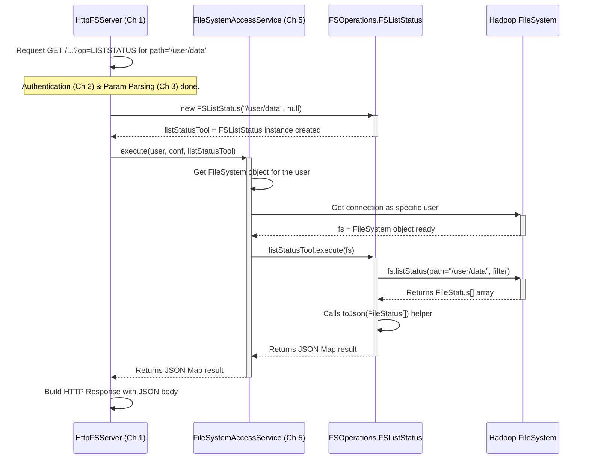

# Chapter 4: Filesystem Operation Execution (FSOperations)

Welcome back! In [Chapter 3: HTTP Parameter Parsing Framework](03_http_parameter_parsing_framework_.md), we saw how `httpfsgateway` takes the raw details from an HTTP request (like `?op=LISTSTATUS&overwrite=true`) and turns them into neatly organized, ready-to-use information. We know *who* is asking (from [Chapter 2: Authentication & Authorization](02_authentication___authorization_.md)), *what* they want to do, and *what* specific options they've chosen.

But how does the gateway actually *do* the work? If the request is to list files, what piece of code actually interacts with the filesystem to get that list?

## The Problem: Doing the Actual Work

Imagine our gateway is like a busy workshop.
*   The reception desk (`HttpFSServer`, Chapter 1) takes the order (HTTP request).
*   Security (`HttpFSAuthenticationFilter`, Chapter 2) checks the customer's ID.
*   The order form clerk (`ParametersProvider`, Chapter 3) makes sure all the details on the order form (parameters) are clear and correct.

Now, the order form goes to the workshop floor. Someone needs to take the instructions (e.g., "List contents of shelf /user/data") and the materials (access to the filesystem) and actually perform the task using the right tools. How is this organized? We need a dedicated component for each specific task (listing, creating, deleting, etc.).

## The Solution: `FSOperations` - The Workshop Tools

This is where the `FSOperations` component comes in. Think of `FSOperations.java` as the main toolbox or workshop area. Inside this toolbox, there are many specialized tools, each designed for one specific filesystem task.

Each "tool" is actually a small, focused Java class defined *inside* the main `FSOperations` class. Examples include:

*   `FSOperations.FSListStatus`: The tool specifically designed to list the contents of a directory.
*   `FSOperations.FSCreate`: The tool for creating a new file.
*   `FSOperations.FSDelete`: The tool for deleting a file or directory.
*   `FSOperations.FSMkdirs`: The tool for creating new directories.
*   ...and many more, one for each supported filesystem operation.

When `HttpFSServer` (the reception desk) gets a processed request (e.g., `op=LISTSTATUS` for path `/user/data`), it knows it needs the "List Status" tool. It takes the `FSOperations.FSListStatus` tool from the toolbox, gives it the details (the path `/user/data`), and tells it to "execute".

## How It Works: Using the Right Tool

Let's follow our familiar use case: listing files in `/user/data`.

1.  **Request Processed:** The request `GET /webhdfs/v1/user/data?op=LISTSTATUS` arrives. `HttpFSServer` handles routing (Chapter 1), authentication happens (Chapter 2), and parameters are parsed (Chapter 3). The server now knows the user wants to perform the `LISTSTATUS` operation on the path `/user/data`.
2.  **Tool Selection:** `HttpFSServer` looks at the operation (`LISTSTATUS`) and determines that the correct tool is `FSOperations.FSListStatus`.
3.  **Tool Preparation:** It creates an instance of `FSOperations.FSListStatus`, telling it which path to work on (`/user/data`).
4.  **Execution:** `HttpFSServer` doesn't directly run the tool. Instead, it hands the prepared tool (`FSListStatus` instance) and the user's credentials over to another component, the [Filesystem Access Layer (FileSystemAccessService)](05_filesystem_access_layer__filesystemaccessservice__.md). We'll cover this layer in the next chapter, but for now, just know it's responsible for providing the actual connection to the filesystem *as the correct user*.
5.  **Doing the Work:** The `FileSystemAccessService` takes the `FSListStatus` tool and runs its `execute` method, providing it with a live `FileSystem` connection. Inside the `execute` method, `FSListStatus` performs the core logic:
    *   It calls the standard Hadoop `FileSystem` method: `fs.listStatus(path)`. This is the actual interaction with the underlying filesystem (like HDFS or Ozone).
    *   It gets back an array of `FileStatus` objects (information about each file/directory).
6.  **Formatting the Result:** The `execute` method then takes this array of `FileStatus` objects and converts it into a structured format that can be sent back over HTTP. This format is usually JSON (JavaScript Object Notation), which is easy for web applications and scripts to understand. It uses helper methods (like `toJson`) within `FSOperations` for this.
7.  **Returning the Result:** The JSON result is passed back up through the `FileSystemAccessService` to `HttpFSServer`, which then builds the final HTTP response to send back to the client.

## Use Case Solved: Listing Files with `FSListStatus`

Let's focus on the specific tool, `FSOperations.FSListStatus`.

*   **Input:** When created, it receives the path (e.g., `/user/data`) and potentially a filter (e.g., `*.txt`).
*   **Action (`execute` method):**
    1.  Receives a `FileSystem` object (from the `FileSystemAccessService`).
    2.  Calls `fileSystem.listStatus(path, filter)`.
    3.  Receives an array like `[FileStatus{path=/user/data/file1.txt, ...}, FileStatus{path=/user/data/subdir, ...}]`.
    4.  Calls an internal helper `toJson(FileStatus[])` to convert this array into JSON.
*   **Output:** Returns a JSON structure representing the file listing, ready to be sent back to the client. For example (simplified):

```json
{
  "FileStatuses": {
    "FileStatus": [
      {
        "pathSuffix": "file1.txt",
        "type": "FILE",
        "length": 1024,
        "owner": "alice",
        "group": "users",
        "permission": "644",
        "accessTime": 1678886400000,
        "modificationTime": 1678886400000,
        "blockSize": 134217728,
        "replication": 3
      },
      {
        "pathSuffix": "subdir",
        "type": "DIRECTORY",
        "length": 0,
        "owner": "alice",
        "group": "users",
        "permission": "755",
        "accessTime": 1678886500000,
        "modificationTime": 1678886500000,
        "blockSize": 0,
        "replication": 0
      }
    ]
  }
}
```

## Diving into the Code

The `FSOperations.java` file contains a collection of static inner classes. Each inner class implements the `FileSystemAccess.FileSystemExecutor<T>` interface. This interface simply requires the class to have an `execute(FileSystem fs)` method.

```java
// --- File: src/main/java/org/apache/ozone/fs/http/server/FSOperations.java ---

// Main class is final, cannot be extended
public final class FSOperations {

    // Private constructor - this class is just a container for static inner classes
    private FSOperations() { }

    // Helper method to convert FileStatus array to JSON
    private static Map<String, Object> toJson(FileStatus[] fileStatuses,
        boolean isFile) {
        // ... logic to build the JSON structure shown above ...
        // (details omitted for brevity)
        return jsonResult;
    }

    // --- The "List Status" Tool ---
    @InterfaceAudience.Private
    public static class FSListStatus
        implements FileSystemAccess.FileSystemExecutor<Map> { // Returns a Map (JSON)

        private Path path; // The directory path to list
        private PathFilter filter; // Optional filter for file names

        public FSListStatus(String path, String filter) throws IOException {
            this.path = new Path(path);
            // Create a filter if provided, otherwise accept all files
            this.filter = (filter == null) ? p -> true : new GlobFilter(filter);
        }

        // The core logic executed by the FileSystemAccessService
        @Override
        public Map execute(FileSystem fs) throws IOException {
            // 1. Call the actual filesystem operation
            FileStatus[] fileStatuses = fs.listStatus(path, filter);

            // 2. Increment metrics (covered in Chapter 7)
            HttpFSServerWebApp.get().getMetrics().incrOpsListing();

            // 3. Convert the result to JSON using the helper method
            return toJson(fileStatuses, fs.getFileStatus(path).isFile());
        }
    } // End of FSListStatus class

    // --- Other "Tools" (Inner Classes) ---
    // public static class FSCreate implements FileSystemExecutor<Void> { ... }
    // public static class FSOpen implements FileSystemExecutor<InputStream> { ... }
    // public static class FSMkdirs implements FileSystemExecutor<JSONObject> { ... }
    // ... and many more ...

} // End of FSOperations class
```

*   **`FSOperations`:** The outer class is just a container.
*   **`FSListStatus`:** This inner class is our specific tool.
    *   It implements `FileSystemAccess.FileSystemExecutor<Map>`, meaning its `execute` method will return a `Map` (which easily converts to JSON).
    *   The constructor (`FSListStatus(String path, String filter)`) takes the path and optional filter provided by `HttpFSServer` based on the parsed parameters.
    *   The `execute(FileSystem fs)` method is the heart. It receives the actual `FileSystem` object from the [Filesystem Access Layer (FileSystemAccessService)](05_filesystem_access_layer__filesystemaccessservice__.md). It calls the standard `fs.listStatus()` method and then uses the `toJson()` helper to format the output.

Each filesystem operation (create, open, delete, set permission, etc.) has a similar inner class within `FSOperations.java`, implementing the specific logic for that operation using the provided `FileSystem` object.

## Internal Implementation Walkthrough

Let's visualize how the `LISTSTATUS` operation flows through these components:



1.  **`HttpFSServer` Receives & Prepares:** After routing, auth, and parsing, `HttpFSServer` knows it needs to perform `LISTSTATUS` on `/user/data`.
2.  **Create Operation Object:** It creates an instance of the specific tool: `new FSOperations.FSListStatus("/user/data", null)`.
3.  **Delegate Execution:** `HttpFSServer` calls the `execute` method of the [Filesystem Access Layer (FileSystemAccessService)](05_filesystem_access_layer__filesystemaccessservice__.md), passing the user information, configuration, and the `FSListStatus` object (`listStatusTool`).
4.  **Get Filesystem Handle:** The `FileSystemAccessService` obtains the actual `FileSystem` connection, properly configured to act *as the requesting user*. (More on this in the next chapter!)
5.  **Run the Tool:** The `FileSystemAccessService` calls the `execute(fs)` method on the `FSListStatus` object (`listStatusTool`), providing the live `FileSystem` connection (`fs`).
6.  **Filesystem Interaction:** Inside `FSListStatus.execute()`, the code calls `fs.listStatus(...)`. This is the actual call to the underlying filesystem library (e.g., HDFS client).
7.  **Format Result:** The `FileStatus[]` array returned by the filesystem is formatted into a JSON `Map` by the `toJson()` helper method.
8.  **Return Result:** The JSON `Map` is returned back up the call chain to `HttpFSServer`.
9.  **Send Response:** `HttpFSServer` packages the JSON into an HTTP response and sends it back to the client.

## The Workshop Analogy Revisited

*   **Order:** HTTP Request (`LISTSTATUS` for `/user/data`).
*   **Reception Desk:** `HttpFSServer` identifies the task.
*   **Tool Selection:** Chooses the `FSOperations.FSListStatus` tool.
*   **Foreman:** [Filesystem Access Layer (FileSystemAccessService)](05_filesystem_access_layer__filesystemaccessservice__.md) gets the right worker (user context) and the right machine (FileSystem connection).
*   **Worker with Tool:** The Foreman tells the worker (acting as the user) to use the `FSListStatus` tool on the machine (`FileSystem`).
*   **Execution:** The `FSListStatus` tool's `execute` method guides the worker to perform the `listStatus` action on the machine.
*   **Packaging:** The `execute` method packages the result (list of items) into a standard box (JSON).
*   **Delivery:** The box (JSON) is returned to the Reception Desk, ready for the customer.

## Conclusion

You've now seen how `httpfsgateway` organizes the actual logic for performing different filesystem tasks. The `FSOperations` class acts as a container for many specific "executor" classes (like `FSListStatus`, `FSCreate`, etc.), each responsible for a single operation. These executors take the parsed parameters, use a `FileSystem` object provided by the next layer, perform the action, and format the result (usually as JSON).

But where does that crucial `FileSystem` object come from? How does the gateway manage connections to potentially different filesystems (like HDFS, Ozone) and ensure each operation runs with the correct user's permissions? That's the role of the layer we've hinted at: the [Filesystem Access Layer (FileSystemAccessService)](05_filesystem_access_layer__filesystemaccessservice__.md). Let's dive into that in the next chapter!

---

Generated by [AI Codebase Knowledge Builder](https://github.com/The-Pocket/Tutorial-Codebase-Knowledge)