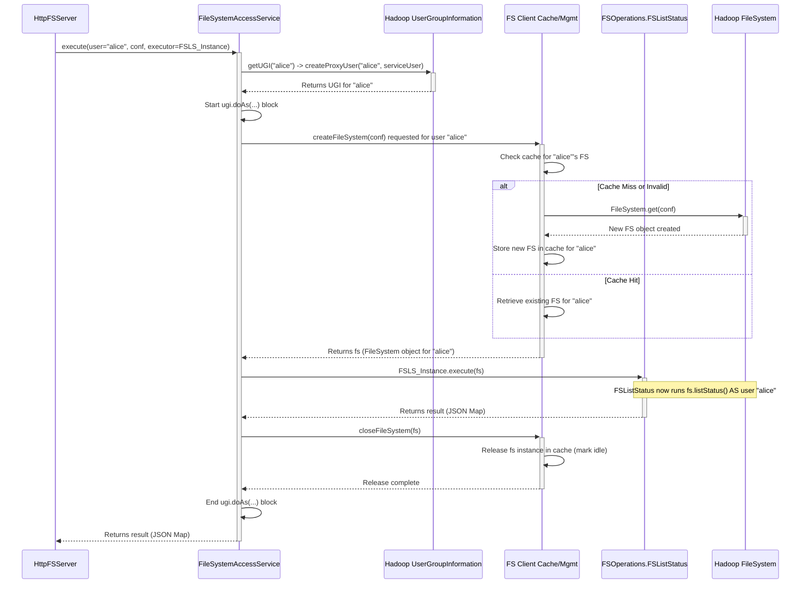

# Chapter 5: Filesystem Access Layer (FileSystemAccessService)

Welcome back! In [Chapter 4: Filesystem Operation Execution (FSOperations)](04_filesystem_operation_execution__fsoperations__.md), we saw how specific tools like `FSListStatus` or `FSCreate` contain the logic to perform actual filesystem tasks (listing files, creating files). We also saw that these tools need a `FileSystem` object – a live connection to the underlying Hadoop filesystem (like HDFS or Ozone FS) – to do their work.

But where does this crucial `FileSystem` object come from? And how does the gateway ensure the operation is performed *as the correct user* with the right permissions?

## The Problem: Managing Secure Connections

Imagine the filesystem (HDFS or Ozone) is a highly secure vault. The `FSOperations` tools (like `FSListStatus`) know *how* to interact with the contents of the vault (list items, add items), but they don't have the keys or the security clearance themselves.

Just creating a direct connection (`FileSystem` object) from within each `FSOperation` tool would be problematic:

1.  **Who is Accessing?** How do we ensure the connection operates with the identity and permissions of the user who made the original HTTP request (e.g., "alice")? We need to handle **user impersonation**.
2.  **Security Setup:** If the cluster uses strong security like Kerberos, how is the connection authenticated? This setup needs to be managed centrally.
3.  **Efficiency:** Creating a brand new, secure connection for every single request can be slow and resource-intensive. Can we reuse connections safely (**caching**)?
4.  **Configuration:** Where does the connection get the necessary details like the NameNode address (`fs.defaultFS`)?

We need a dedicated manager – like a secure vault manager – to handle these complexities.

## The Solution: `FileSystemAccessService` - The Vault Manager

This is exactly the role of the `FileSystemAccessService`. It acts as the central, trusted intermediary responsible for providing and managing `FileSystem` connections to the underlying storage.

Think of it as the **Vault Manager**:

*   **Verifies Identity:** It works closely with the user information established by the [Authentication & Authorization](02_authentication___authorization_.md) layer.
*   **Gets the Right Keys:** It uses Hadoop's security mechanisms (`UserGroupInformation` or UGI) to get the "keys" needed to act *as* the requesting user (impersonation).
*   **Opens the Secure Box:** It creates or retrieves a `FileSystem` client instance, properly configured and authenticated for that specific user and the target filesystem.
*   **Manages Connections:** It handles the lifecycle of these `FileSystem` instances, potentially caching them for reuse to improve performance.
*   **Oversees the Operation:** It takes the specific task (an `FSOperation` executor object) and runs it using the secure connection it prepared.
*   **Ensures Security:** It handles the complexities of setting up security, like Kerberos authentication for the gateway itself, if configured.

In essence, `FileSystemAccessService` shields the rest of the application (like `HttpFSServer` and `FSOperations`) from the low-level details of Hadoop security and connection management.

## Use Case: Getting the `FileSystem` for `LISTSTATUS`

Let's revisit our `LISTSTATUS` example for user "alice".

1.  **Request Processed:** `HttpFSServer` has received the request, authenticated "alice", parsed parameters, and created the `FSOperations.FSListStatus` object (the "tool").
2.  **Delegation to Vault Manager:** Instead of running the tool directly, `HttpFSServer` calls the `execute` method of the `FileSystemAccessService`. It passes:
    *   The user's name ("alice").
    *   The necessary Hadoop configuration.
    *   The `FSListStatus` object (which implements the `FileSystemExecutor` interface).
3.  **Vault Manager Takes Over:** The `FileSystemAccessService` now performs its magic:
    *   It uses Hadoop's `UserGroupInformation.doAs(...)` mechanism to prepare a context where actions will be performed *as user "alice"*.
    *   Inside this context, it calls its internal `createFileSystem` method.
    *   `createFileSystem` either creates a new `FileSystem` object for "alice" or retrieves a cached one. This object is now a live, authenticated connection to HDFS/Ozone, acting *as "alice"*.
    *   It takes the `FSListStatus` object passed in by `HttpFSServer`.
    *   It calls the `execute(fs)` method on the `FSListStatus` object, handing it the precious `FileSystem` object (`fs`) it just prepared.
4.  **Tool Executes:** The `FSListStatus.execute(fs)` method now runs, using the provided `fs` object to call `fs.listStatus(...)`. Since `fs` is configured for "alice", the underlying filesystem correctly checks "alice"'s permissions.
5.  **Cleanup:** After `FSListStatus.execute(fs)` finishes (returning the JSON map), the `FileSystemAccessService` cleans up, potentially releasing the `FileSystem` object back to its cache using `closeFileSystem`.
6.  **Result Returned:** The final result (the JSON map from `FSListStatus`) is passed back to `HttpFSServer`.

## Diving into the Code (Conceptual)

The core interaction is defined by the `FileSystemAccess` interface. The `HttpFSServer` uses this interface to ask the service to run a filesystem task.

```java
// --- File: src/main/java/org/apache/ozone/lib/service/FileSystemAccess.java ---

// Interface defining the service
public interface FileSystemAccess {

  // Interface for the task to be executed
  interface FileSystemExecutor<T> {
    // The actual work happens here, using the provided FileSystem
    T execute(FileSystem fs) throws IOException;
  }

  // The main method used by HttpFSServer
  <T> T execute(String user,                // Who is making the request?
                Configuration conf,         // Filesystem configuration
                FileSystemExecutor<T> executor) // What task to perform?
      throws FileSystemAccessException;

  // Method to create a FS object directly (less common for ops)
  FileSystem createFileSystem(String user, Configuration conf)
      throws IOException, FileSystemAccessException;

  // Method to release a FS object created by createFileSystem
  void releaseFileSystem(FileSystem fs) throws IOException;

  // Get base configuration
  Configuration getFileSystemConfiguration();
}
```

*   **`FileSystemExecutor<T>`:** This inner interface is implemented by all the operation classes in `FSOperations` (like `FSListStatus`). It guarantees they have an `execute(FileSystem fs)` method.
*   **`execute(...)`:** This is the key method. `HttpFSServer` calls this, providing the username, configuration, and the specific `FileSystemExecutor` instance (e.g., the `FSListStatus` object). The service handles getting the `FileSystem` and running the executor's `execute` method.

The main implementation is `FileSystemAccessService`. Its `execute` method orchestrates the process:

```java
// --- File: src/main/java/org/apache/ozone/lib/service/hadoop/FileSystemAccessService.java ---

public class FileSystemAccessService extends BaseService
    implements FileSystemAccess {
  // ... (fields for configuration, cache, etc.) ...

  @Override
  public <T> T execute(String user,           // e.g., "alice"
                       final Configuration conf, // Hadoop config
                       final FileSystemExecutor<T> executor) // e.g., FSListStatus obj
      throws FileSystemAccessException {
    // ... (Input validation checks) ...

    try {
      // 1. Get Hadoop UserGroupInformation (UGI) for the target user
      UserGroupInformation ugi = getUGI(user); // Handles impersonation setup

      // 2. Execute the operation within the user's context
      return ugi.doAs(new PrivilegedExceptionAction<T>() {
        @Override
        public T run() throws Exception {
          FileSystem fs = null;
          try {
            // 3. Get/Create the FileSystem object for this user/conf
            fs = createFileSystem(conf); // Uses caching internally

            // 4. Run the actual task (e.g., FSListStatus.execute)
            //    passing the user-specific FileSystem object
            return executor.execute(fs);
          } finally {
            // 5. Release the FileSystem object back to the cache/pool
            if (fs != null) {
              closeFileSystem(fs);
            }
          }
        }
      });
    } catch (Exception ex) {
      // Handle errors
      throw new FileSystemAccessException(
          FileSystemAccessException.ERROR.H03, ex);
    }
  }

  // Helper to get/create UGI (handles impersonation)
  protected UserGroupInformation getUGI(String user) throws IOException {
     return UserGroupInformation.createProxyUser(user,
        UserGroupInformation.getLoginUser()); // Login user is HttpFS service user
  }

  // Helper to get FileSystem from cache or create new one
  protected FileSystem createFileSystem(Configuration conf) throws IOException {
    // ... logic using fsCache (ConcurrentHashMap) ...
    // ... calls FileSystem.get(conf) if not cached ...
    return fileSystem;
  }

  // Helper to release FileSystem back to cache
  protected void closeFileSystem(FileSystem fs) throws IOException {
    // ... logic to update cache status or close if needed ...
  }

  // ... (init() method handles Kerberos login if configured) ...
  // ... (caching logic using CachedFileSystem inner class) ...
}
```

*   **`getUGI(user)`:** Creates a `UserGroupInformation` object that represents the target `user` ("alice") but is authorized by the gateway's own service user (logged in via Kerberos or simple auth during startup). This is how impersonation works.
*   **`ugi.doAs(...)`:** This is a standard Hadoop pattern. The code inside the `run()` method is executed with the privileges and identity of the `ugi` ("alice").
*   **`createFileSystem(conf)`:** Gets a `FileSystem` instance. This method encapsulates the logic for caching connections based on the user and configuration.
*   **`executor.execute(fs)`:** Calls the specific operation logic (e.g., `FSListStatus.execute`) with the correctly impersonated `FileSystem` object.
*   **`closeFileSystem(fs)`:** Releases the `FileSystem` instance, allowing the cache to manage it (e.g., mark it as idle, potentially close it later if unused).

## Internal Implementation Walkthrough

Let's visualize the flow when `HttpFSServer` asks `FileSystemAccessService` to execute the `FSListStatus` operation for user "alice":



1.  **`HFS` calls `FSASvc.execute`:** Passes user, config, and the `FSListStatus` executor.
2.  **`FSASvc` gets UGI:** Calls `getUGI` which uses Hadoop's `UserGroupInformation.createProxyUser` to set up impersonation for "alice".
3.  **`FSASvc` enters `doAs` block:** Actions inside will now run as "alice".
4.  **`FSASvc` requests Filesystem:** Calls `createFileSystem` (delegating to internal cache logic).
5.  **`FSCache` checks cache:** Looks for an existing, valid `FileSystem` for "alice".
6.  **Cache Hit/Miss:** If found, returns it. If not (or expired), creates a new one using `FileSystem.get(conf)` (this call inherently uses the current UGI, which is "alice" because we are inside `doAs`) and caches it.
7.  **`FSASvc` receives `FileSystem`:** Gets the `fs` object configured for "alice".
8.  **`FSASvc` calls `Executor`:** Invokes `FSLS_Instance.execute(fs)`.
9.  **`FSLS` interacts with `FS`:** The `FSListStatus` code runs `fs.listStatus(...)`. The underlying filesystem checks "alice"'s permissions because `fs` represents her identity.
10. **Result Returned:** `FSLS` returns the JSON map result to `FSASvc`.
11. **`FSASvc` releases Filesystem:** Calls `closeFileSystem(fs)` to notify the cache that this instance is no longer actively used for this request.
12. **`FSASvc` exits `doAs` block.**
13. **`FSASvc` returns result:** Passes the JSON map back to `HFS`.

### Kerberos and Caching

*   **Kerberos:** If Kerberos is enabled in the `httpfs-site.xml` configuration (`hadoop.authentication.type=kerberos`), the `FileSystemAccessService`'s `init()` method performs a one-time login using the configured keytab and principal when the gateway starts. This authenticates the *gateway service itself*. The `getUGI` method then uses this logged-in service identity to gain the authority to impersonate other users like "alice".
*   **Caching:** The `FileSystemAccessService` uses a `ConcurrentHashMap` (`fsCache`) mapping usernames to `CachedFileSystem` objects. The `CachedFileSystem` inner class manages the actual `FileSystem` instance, keeping track of how many requests are currently using it (`count`) and when it was last used (`lastUse`). A background task (`FileSystemCachePurger`) periodically checks for idle connections (based on `purgeTimeout`) and closes them to free up resources.

## The Vault Manager Analogy Revisited

*   **Customer Request:** `HttpFSServer` brings the request ("List items in `/user/alice`") and the customer's verified ID ("alice").
*   **Vault Manager:** `FileSystemAccessService` takes the request and ID.
*   **Getting Keys:** Uses `getUGI("alice")` to get the special keys (`UserGroupInformation`) allowing access *as* "alice".
*   **Unlocking the Vault:** Uses `createFileSystem` (within the `doAs` context) to unlock and open the specific section of the vault belonging to "alice" (gets the `FileSystem` object). This might involve fetching keys from a cache if recently used.
*   **Performing the Task:** The Manager hands the specific tool (`FSListStatus` executor) the opened vault section (`FileSystem` object) and tells it to perform the requested action (`execute(fs)`). The tool works inside, inherently respecting the boundaries of that section (permissions).
*   **Locking Up:** Once the task is done, the Manager takes back the tool, locks the vault section (`closeFileSystem`), and potentially returns the keys to the cache.
*   **Returning Result:** The Manager gives the result of the task back to the `HttpFSServer`.

## Conclusion

The `FileSystemAccessService` is a vital component that acts as a secure and efficient gateway to the underlying Hadoop filesystem. It handles the complexities of user impersonation, security configurations like Kerberos, and connection management through caching. By providing a clean `FileSystemAccess` interface and managing the `FileSystem` objects, it allows the rest of the application, particularly the [Filesystem Operation Execution (FSOperations)](04_filesystem_operation_execution__fsoperations__.md), to focus solely on the logic of the filesystem operations themselves, without worrying about the underlying connection details and security contexts.

So far, we've seen how requests are received, routed, authenticated, parsed, executed, and how secure connections are managed. But what happens when things go wrong? An invalid path, a permission error, a network issue? Next, we'll look at how `httpfsgateway` handles errors in [Chapter 6: Exception Handling](06_exception_handling_.md).

---

Generated by [AI Codebase Knowledge Builder](https://github.com/The-Pocket/Tutorial-Codebase-Knowledge)