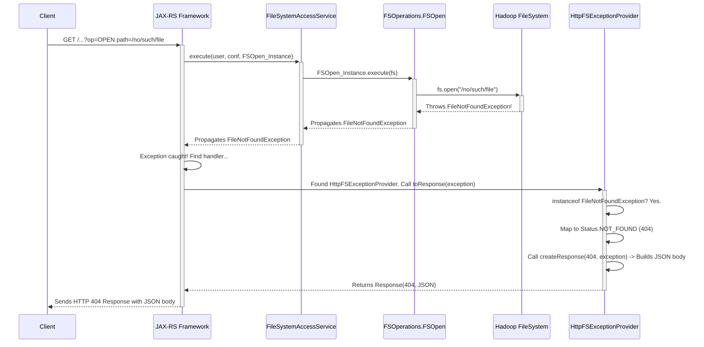

# Chapter 6: Exception Handling

Welcome back! In [Chapter 5: Filesystem Access Layer (FileSystemAccessService)](05_filesystem_access_layer__filesystemaccessservice__.md), we saw how the gateway securely connects to the underlying filesystem and performs actions as the correct user. Everything runs smoothly when requests are valid and the user has the right permissions.

But what happens when things go wrong? What if a user tries to access a file that doesn't exist? Or tries to delete a file they don't have permission to? Or maybe there's a temporary network glitch talking to the filesystem?

## The Problem: Dealing with Errors Gracefully

Imagine you call a company's customer service hotline. If there's an issue with your order (maybe an item is out of stock, or your address is wrong), you don't want the representative to just hang up or shout random technical codes at you. You expect them to:

1.  **Identify** the specific problem.
2.  **Communicate** it clearly and understandably.
3.  Provide a **consistent** response format, maybe referencing an error code you can use.

Similarly, when an HTTP client (like a script or web application) talks to `httpfsgateway`, and an error occurs, the client needs clear and consistent feedback. If the gateway just crashes or sends back a cryptic error page, the client won't know what went wrong or how to potentially fix it (e.g., correct a path, check permissions).

We need a mechanism to "catch" these internal problems (Java exceptions) and translate them into standard, informative HTTP error responses.

## The Solution: The Exception Handling Framework (JAX-RS ExceptionMapper)

`httpfsgateway` uses a standard feature of the JAX-RS framework (which we first saw in [Chapter 1: HTTP Request Routing & Handling (HttpFSServer)](01_http_request_routing___handling__httpfsserver__.md)) called `ExceptionMapper`.

Think of an `ExceptionMapper` as the gateway's dedicated **Customer Service Department** for errors.

1.  **Catching Problems:** When an error (a Java `Exception`) occurs anywhere during the request processing (e.g., in `FSOperations` when a file isn't found, or in `HttpFSAuthenticationFilter` if authentication fails), the JAX-RS framework automatically catches it.
2.  **Finding the Right Handler:** JAX-RS looks for a registered `ExceptionMapper` that knows how to handle that specific type of exception. In `httpfsgateway`, the main handler is `HttpFSExceptionProvider`.
3.  **Translating the Problem:** The `HttpFSExceptionProvider` examines the Java exception to understand what kind of error it is (e.g., `FileNotFoundException`, `SecurityException`, generic `IOException`).
4.  **Creating a Standard Response:** Based on the exception type, it decides on the appropriate HTTP status code (like `404 Not Found`, `401 Unauthorized`, `500 Internal Server Error`).
5.  **Formatting the Message:** It then constructs a standard JSON error message containing details about the exception (its type, message, etc.). This follows the WebHDFS standard format.
6.  **Sending the Response:** It packages the status code and the JSON message into an HTTP `Response` object, which JAX-RS sends back to the client.

This ensures that clients always receive predictable error responses they can parse and understand.

## Use Case: Trying to Open a Non-Existent File

Let's say a client sends this request:

```
GET /webhdfs/v1/path/to/nosuchfile.txt?op=OPEN HTTP/1.1
Host: your-gateway-host:port
User-Agent: curl/7.68.0
```

Here's how the exception handling flow works:

1.  **Request Processing:** The request goes through routing (Chapter 1), authentication (Chapter 2), parameter parsing (Chapter 3).
2.  **Operation Execution:** `HttpFSServer` delegates the `OPEN` operation to `FSOperations.FSOpen` via the `FileSystemAccessService` (Chapter 5).
3.  **Error Occurs:** Inside `FSOpen.execute(FileSystem fs)`, the code calls `fs.open(path)`. The underlying Hadoop `FileSystem` cannot find `/path/to/nosuchfile.txt` and throws a `java.io.FileNotFoundException`.
4.  **Exception Propagation:** This exception travels back up the call stack – out of `FSOpen.execute`, through `FileSystemAccessService.execute`, and into the JAX-RS framework managing the `HttpFSServer` request handler.
5.  **JAX-RS Catches Exception:** The JAX-RS framework catches the `FileNotFoundException`.
6.  **Mapper Lookup:** JAX-RS looks for a registered `ExceptionMapper` capable of handling `FileNotFoundException`. It finds our `HttpFSExceptionProvider` (because it's registered to handle `Throwable`, the parent of all exceptions).
7.  **Mapper Processing:** JAX-RS calls `HttpFSExceptionProvider.toResponse(theFileNotFoundException)`.
8.  **Mapping Logic:** Inside `toResponse`, the code checks: `if (throwable instanceof FileNotFoundException)`. This is true.
9.  **Status Code Selection:** The code sets the HTTP status to `Response.Status.NOT_FOUND` (which corresponds to 404).
10. **Response Creation:** It calls `createResponse(Status.NOT_FOUND, theFileNotFoundException)`. This helper method (inherited from `ExceptionProvider`) uses `HttpExceptionUtils.createJerseyExceptionResponse` to generate the standard JSON error body.
11. **Response Sent:** The `HttpFSExceptionProvider` returns the `Response` object (containing the 404 status and JSON body) to JAX-RS, which sends it back to the client.

The client receives:

```http
HTTP/1.1 404 Not Found
Content-Type: application/json
Content-Length: ...

{
  "RemoteException": {
    "exception": "FileNotFoundException",
    "javaClassName": "java.io.FileNotFoundException",
    "message": "File /path/to/nosuchfile.txt does not exist."
  }
}
```

The client gets a clear 404 status and a JSON message explaining the exact error.

## Diving into the Code

The core component is `HttpFSExceptionProvider`.

```java
// --- File: src/main/java/org/apache/ozone/fs/http/server/HttpFSExceptionProvider.java ---

// @Provider tells JAX-RS to register this class as an Exception handler
@Provider
@InterfaceAudience.Private
public class HttpFSExceptionProvider extends ExceptionProvider {
  // ... (Logger setup) ...

  // This is the main method called by JAX-RS when an exception occurs
  @Override
  public Response toResponse(Throwable throwable) {
    Response.Status status;

    // Handle specific exception types wrapped by FileSystemAccessService
    if (throwable instanceof FileSystemAccessException) {
      throwable = throwable.getCause(); // Look at the original cause
    }
    // Handle specific Ozone exceptions (unwrap them too)
    if (throwable instanceof ContainerException) {
      throwable = throwable.getCause(); // Look at the original cause
    }

    // --- Main Mapping Logic ---
    if (throwable instanceof SecurityException) {
      // Security issues (like permission denied) map to 401/403 (handled by base class)
      status = Response.Status.UNAUTHORIZED;
    } else if (throwable instanceof FileNotFoundException) {
      // File not found maps to 404
      status = Response.Status.NOT_FOUND;
    } else if (throwable instanceof IOException) {
      // Most other I/O errors map to 500 Internal Server Error
      status = Response.Status.INTERNAL_SERVER_ERROR;
      logErrorFully(status, throwable); // Log details for server admin
    } else if (throwable instanceof UnsupportedOperationException) {
      // Trying an operation not supported (e.g., CONCAT on Ozone)
      status = Response.Status.BAD_REQUEST; // 400 Bad Request
      logErrorFully(status, throwable);
    } else if (throwable instanceof IllegalArgumentException) {
      // Invalid parameters provided by the client (e.g., bad permission format)
      status = Response.Status.BAD_REQUEST; // 400 Bad Request
      logErrorFully(status, throwable);
    } else {
      // Any other unexpected exception maps to 500 Internal Server Error
      status = Response.Status.INTERNAL_SERVER_ERROR;
      logErrorFully(status, throwable);
    }

    // Call the base class helper to create the Response object
    // with the chosen status and the standard JSON body
    return createResponse(status, throwable);
  }

  // Override logging to include request details from MDC
  @Override
  protected void log(Response.Status status, Throwable throwable) {
    // ... (Code to log method, path, status, and error message for auditing) ...
  }

  private void logErrorFully(Response.Status status, Throwable throwable) {
    LOG.debug("Failed with {}", status, throwable);
  }
}
```

*   `@Provider`: This annotation tells the JAX-RS framework to automatically discover and use this class for handling exceptions.
*   `extends ExceptionProvider`: It inherits common functionality, especially the `createResponse` method.
*   `toResponse(Throwable throwable)`: This method receives the caught exception. Its job is to figure out the right HTTP status and return a `Response`.
*   `instanceof` Checks: The core logic uses `instanceof` to determine the type of the exception and map it to an appropriate `Response.Status` (like `NOT_FOUND`, `UNAUTHORIZED`, `INTERNAL_SERVER_ERROR`, `BAD_REQUEST`).
*   Unwrapping Exceptions: It checks for wrapper exceptions like `FileSystemAccessException` and gets the underlying `cause` to determine the root problem.
*   `createResponse(status, throwable)`: This method (from the base `ExceptionProvider`) takes the decided status and the original exception and uses Hadoop's `HttpExceptionUtils.createJerseyExceptionResponse` to build the final `Response` object with the standard WebHDFS JSON error format.

**The Standard JSON Error Format**

The `createResponse` method ensures errors look like this:

```json
{
  "RemoteException": {
    "exception": "ShortClassName", // e.g., "FileNotFoundException"
    "javaClassName": "full.java.class.Name", // e.g., "java.io.FileNotFoundException"
    "message": "Exception message string" // e.g., "File /path/does/not/exist not found."
  }
}
```
This consistent structure makes it easy for clients to parse and understand the error.

**Structured Exceptions (`XException`)**

Within the `httpfsgateway` codebase itself (e.g., in the services layer), a base exception class `XException` is often used.

```java
// --- File: src/main/java/org/apache/ozone/lib/lang/XException.java ---

public class XException extends Exception {

  // Interface for defining structured error codes (like enums)
  public interface ERROR {
    String getTemplate(); // Message template like "File [{0}] not found"
  }

  private ERROR error;

  // Constructor takes an ERROR code and parameters
  public XException(ERROR error, Object... params) {
    // ... (formats message using template and params) ...
  }

  public ERROR getError() {
    return error;
  }
}
```

Specific exception types like `FileSystemAccessException` or `ServerException` extend `XException` and define their own `ERROR` enums. This provides more structured error handling *within* the server code, though these are often unwrapped by `HttpFSExceptionProvider` to get to the root cause (like `IOException`, `SecurityException`) for mapping to HTTP statuses.

## Internal Implementation Walkthrough

Here's how the exception handling flow looks when a `FileNotFoundException` occurs:



1.  **Request & Operation:** Client sends request, JAX-RS routes it, eventually `FSOpen.execute` is called.
2.  **Filesystem Error:** `FileSystem.open` fails, throwing `FileNotFoundException`.
3.  **Propagation:** The exception travels up the call stack back to the JAX-RS layer.
4.  **Catch & Map:** JAX-RS catches the exception and finds `HttpFSExceptionProvider`. It calls `toResponse`.
5.  **Translate:** `HttpFSExceptionProvider` identifies the exception type, chooses the HTTP status (404), and builds the standard JSON error response.
6.  **Respond:** JAX-RS sends the generated 404 response back to the client.

## The Customer Service Analogy Revisited

*   **Internal Problem:** An operation fails inside the gateway (e.g., `FileNotFoundException`).
*   **Exception Thrown:** The internal system signals an error.
*   **Call Transferred:** JAX-RS intercepts the error signal and transfers it to the designated department.
*   **Customer Service Dept:** `HttpFSExceptionProvider` receives the error details.
*   **Diagnosis & Script:** The provider analyzes the error type (`instanceof`) and consults its "script" (mapping logic) to find the standard response.
*   **Standard Explanation:** It generates a clear, consistent explanation: an HTTP status code (like 404) and a standard message format (the JSON body).
*   **Communication:** This standard response is sent back to the "customer" (the HTTP client).

## Conclusion

You've now seen how `httpfsgateway` handles errors in a robust and client-friendly way. By using JAX-RS `ExceptionMapper` (`HttpFSExceptionProvider`), it catches internal Java exceptions, translates them into appropriate HTTP status codes (like 404, 403, 500), and formats detailed error information into a standard JSON structure. This ensures that clients receive meaningful feedback when things go wrong, making the gateway easier to interact with and debug.

We've covered how the gateway processes requests from start to finish, including routing, security, parameter parsing, execution, filesystem access, and now error handling. But how do we monitor the gateway's health and performance? How many requests is it handling? How long are operations taking? Are there errors occurring frequently? That's where monitoring comes in, which we'll explore in the next chapter on [Instrumentation & Metrics](07_instrumentation___metrics__.md).

---

Generated by [AI Codebase Knowledge Builder](https://github.com/The-Pocket/Tutorial-Codebase-Knowledge)