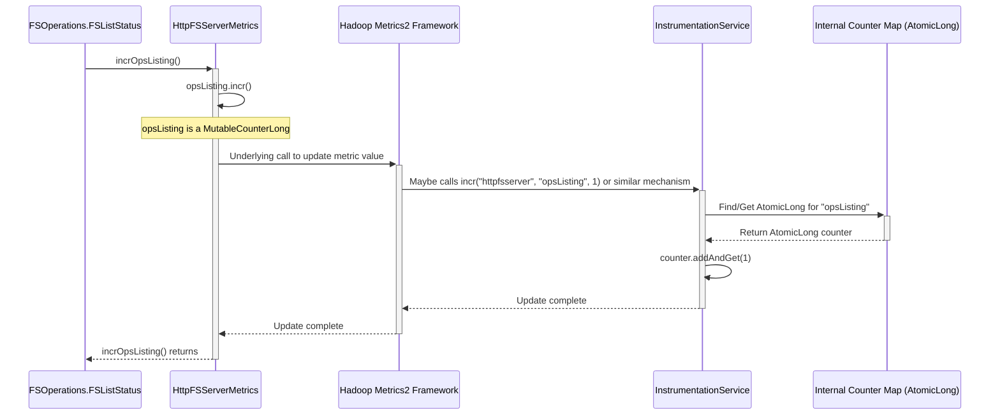

# Chapter 7: Instrumentation & Metrics

Welcome back! In [Chapter 6: Exception Handling](06_exception_handling_.md), we learned how `httpfsgateway` handles errors gracefully, sending clear and consistent responses back to the client when something goes wrong. We've seen the entire lifecycle of a request, from arrival to execution and response (or error).

But how do we know how well the gateway is performing? Is it handling requests quickly? How many files are being read or written? Is the server healthy? Just like a car needs a dashboard to show its speed, fuel level, and engine temperature, our gateway needs a way to monitor its own vital signs.

## The Problem: Understanding What's Happening Inside

Imagine running the `httpfsgateway` service for many users. Questions will naturally arise:
*   Is the service overloaded?
*   How many files are being listed per second?
*   How much data is being uploaded or downloaded?
*   Is the server running out of memory?

Without a way to measure these things, we're flying blind! We can't tell if the service is healthy, how heavily it's being used, or where potential bottlenecks might be.

## The Solution: The Gateway's Dashboard (Instrumentation & Metrics)

`httpfsgateway` has a built-in "dashboard" system. This system collects data about the gateway's performance and activity. This process of gathering data is called **Instrumentation**, and the data points themselves are called **Metrics**.

Think of it like this:
*   **Instrumentation:** The act of installing sensors and gauges in a car. In our gateway, this involves adding code to measure specific events (like counting operations or tracking data size). The `InstrumentationService` is the underlying system that manages these "sensors" and organizes the data.
*   **Metrics:** The actual readings from those sensors and gauges (speed, fuel level, temperature). In our gateway, these are things like:
    *   Number of `LISTSTATUS` operations performed.
    *   Total bytes read from files (`OPEN` operations).
    *   Total bytes written to files (`CREATE`, `APPEND` operations).
    *   Information about the Java Virtual Machine (JVM) running the gateway (memory usage, etc.).
    *   Counts for other operations (`MKDIRS`, `DELETE`, `RENAME`, etc.).

The primary component that exposes these specific gateway metrics is `HttpFSServerMetrics`. It acts like the car's dashboard display, presenting the key metrics collected by the `InstrumentationService`.

## Use Case: Counting File Listing Operations

Let's go back to our familiar example: a client requests to list files in a directory using `op=LISTSTATUS`.

1.  **Request Processing:** The request flows through routing, authentication, parsing, and reaches the `FSOperations.FSListStatus` tool, as we saw in [Chapter 4: Filesystem Operation Execution (FSOperations)](04_filesystem_operation_execution__fsoperations__.md).
2.  **Execution:** The `FSListStatus.execute()` method interacts with the filesystem via the `FileSystemAccessService`.
3.  **Instrumentation Point:** *Right after* successfully getting the list of files from the filesystem, `FSListStatus.execute()` makes a call to update the metrics. Specifically, it tells `HttpFSServerMetrics`: "Hey, we just completed one `LISTSTATUS` operation!"
4.  **Metric Updated:** `HttpFSServerMetrics` receives this message and increments its internal counter for listing operations.

If another `LISTSTATUS` request comes in, the same process happens, and the counter increases again. Over time, this counter gives us a clear picture of how many listing operations the gateway has handled.

Similarly, when a file is opened (`FSOpen.execute`) and bytes are read, the code would call a method like `HttpFSServerMetrics.incrBytesRead(numberOfBytes)` to update the total bytes read metric.

## Diving into the Code

Let's see how this looks in the code.

**1. Defining the Metrics (`HttpFSServerMetrics`)**

This class defines the specific counters we want to track. It uses special annotations (`@Metric`) from the Hadoop Metrics2 library to declare them.

```java
// --- File: src/main/java/org/apache/ozone/fs/http/server/metrics/HttpFSServerMetrics.java ---

// @Metrics annotation provides context for this set of metrics
@Metrics(about = "HttpFSServer metrics", context = "httpfs")
public class HttpFSServerMetrics {

    // A registry to hold the metrics
    private final MetricsRegistry registry = new MetricsRegistry("httpfsserver");

    // @Metric annotation marks this field as a metric to be exposed
    // MutableCounterLong is a thread-safe counter for long integers
    @Metric private MutableCounterLong bytesWritten;
    @Metric private MutableCounterLong bytesRead;

    // --- Operation Counters ---
    @Metric private MutableCounterLong opsCreate;
    @Metric private MutableCounterLong opsAppend;
    @Metric private MutableCounterLong opsDelete;
    @Metric private MutableCounterLong opsMkdir;
    @Metric private MutableCounterLong opsOpen;
    @Metric("Number of file listing operations") // Optional description
            private MutableCounterLong opsListing;
    @Metric private MutableCounterLong opsStat;
    // ... other metrics ...

    private JvmMetrics jvmMetrics = null; // Also tracks JVM stats

    // Constructor initializes the registry and gets JVM metrics
    public HttpFSServerMetrics(String name, String sessionId,
                               final JvmMetrics jvmMetrics) {
        this.registry.tag(SessionId, sessionId); // Adds identifying tags
        this.jvmMetrics = jvmMetrics;
    }

    // --- Methods to Increment Counters ---

    public void incrBytesRead(long bytes) {
        bytesRead.incr(bytes); // Increment the counter by 'bytes'
    }

    public void incrOpsListing() {
        opsListing.incr(); // Increment the counter by 1
    }

    public void incrOpsOpen() {
        opsOpen.incr(); // Increment the counter by 1
    }

    // ... methods for other counters (incrOpsCreate, incrBytesWritten, etc.) ...

    // Method to get the underlying JVM metrics object
    public JvmMetrics getJvmMetrics() {
        return jvmMetrics;
    }

    // Method to create and register the metrics instance
    public static HttpFSServerMetrics create(Configuration conf,
                                             String serverName) {
        // ... (uses Hadoop's DefaultMetricsSystem to register) ...
        MetricsSystem ms = DefaultMetricsSystem.instance();
        JvmMetrics jm = JvmMetrics.create("HttpFSServer", /*...*/);
        return ms.register(serverName, null,
                new HttpFSServerMetrics(serverName, /*...*/, jm));
    }

    // Allows shutting down the metrics system
    public void shutdown() {
        DefaultMetricsSystem.shutdown();
    }
}
```

*   `@Metrics`: Marks this class as a source of metrics.
*   `@Metric`: Marks individual fields (like `opsListing` or `bytesRead`) as metrics. These are usually `MutableCounterLong` objects, which are designed for efficiently counting things.
*   `incrOpsListing()`: A simple method that increments the `opsListing` counter by one.
*   `incrBytesRead(long bytes)`: Increments the `bytesRead` counter by the specified number of bytes.
*   `create()`: A static method used during gateway startup (in `HttpFSServerWebApp`) to initialize and register these metrics with the underlying Hadoop metrics system.

**2. Updating the Metric (`FSOperations.FSListStatus`)**

Here's where the `incrOpsListing()` method is actually called:

```java
// --- File: src/main/java/org/apache/ozone/fs/http/server/FSOperations.java ---

public final class FSOperations {
    // ... (other code) ...

    @InterfaceAudience.Private
    public static class FSListStatus
        implements FileSystemAccess.FileSystemExecutor<Map> {
        // ... (fields and constructor) ...

        @Override
        public Map execute(FileSystem fs) throws IOException {
            // 1. Call the actual filesystem operation
            FileStatus[] fileStatuses = fs.listStatus(path, filter);

            // ===> 2. Increment the listing operation counter! <===
            HttpFSServerWebApp.get().getMetrics().incrOpsListing();

            // 3. Convert the result to JSON
            boolean isFile = fs.exists(path) && fs.getFileStatus(path).isFile();
            return toJson(fileStatuses, isFile);
        }
    }
    // ... (other operations like FSOpen, FSCreate) ...
}
```
*   `HttpFSServerWebApp.get().getMetrics()`: This retrieves the singleton instance of `HttpFSServerMetrics`.
*   `.incrOpsListing()`: This calls the increment method we saw earlier, updating the counter.

**3. The Underlying Engine (`InstrumentationService`)**

While `HttpFSServerMetrics` provides the specific counters for the gateway, the low-level mechanics of managing counters, timers, and other variables are handled by the `InstrumentationService`. `HttpFSServerMetrics` uses this service behind the scenes (via the Hadoop Metrics2 framework).

The `Instrumentation` interface defines the basic operations:

```java
// --- File: src/main/java/org/apache/ozone/lib/service/Instrumentation.java ---

@InterfaceAudience.Private
public interface Instrumentation {

  // Interface for timing operations
  interface Cron { /* ... */ }

  // Interface for exposing arbitrary values
  interface Variable<T> { /* ... */ }

  // Increment a named counter
  void incr(String group, String name, long count);

  // Add a timed operation
  void addCron(String group, String name, Cron cron);

  // Add a variable metric
  void addVariable(String group, String name, Variable<?> variable);

  // Add a sampler (calculates rate over time)
  void addSampler(String group, String name, int samplingSize,
                  Variable<Long> variable);

  // Get a snapshot of all current metrics
  Map<String, Map<String, ?>> getSnapshot();
}
```

The `InstrumentationService` implements this interface, typically using thread-safe mechanisms like `AtomicLong` for counters and storing everything in nested maps.

```java
// --- File: src/main/java/org/apache/ozone/lib/service/instrumentation/InstrumentationService.java ---

@InterfaceAudience.Private
public class InstrumentationService extends BaseService
    implements Instrumentation {

    // Maps to store different types of metrics
    private Map<String, Map<String, AtomicLong>> counters;
    private Map<String, Map<String, Timer>> timers; // For timing operations
    private Map<String, Map<String, VariableHolder>> variables; // Arbitrary values
    // ... (other fields like locks, samplers) ...

    // All metrics combined for snapshotting
    private Map<String, Map<String, ?>> all;

    @Override
    public void init() throws ServiceException {
        // Initialize maps, locks, etc.
        counters = new ConcurrentHashMap<>();
        timers = new ConcurrentHashMap<>();
        variables = new ConcurrentHashMap<>();
        all = new LinkedHashMap<>();
        all.put("counters", (Map) counters);
        all.put("timers", (Map) timers);
        all.put("variables", (Map) variables);
        // ... (add default JVM metrics like free memory) ...
    }

    @Override
    public void incr(String group, String name, long count) {
        // Find or create the AtomicLong for the group/name
        AtomicLong counter = getToAdd(group, name, AtomicLong.class,
                                     /*..lock..*/, counters);
        // Atomically add the count
        counter.addAndGet(count);
    }

    // Helper method to safely get/create metric holders in the maps
    private <T> T getToAdd(String group, String name, Class<T> klass,
                         Lock lock, Map<String, Map<String, T>> map) {
        // ... (thread-safe logic to find or create entry in nested map) ...
        return element;
    }

    @Override
    public Map<String, Map<String, ?>> getSnapshot() {
        // Update JVM variables before returning snapshot
        // ...
        return all;
    }
    // ... (implementations for addCron, addVariable, etc.) ...
}
```
*   The service maintains maps (`counters`, `timers`, `variables`) to store metrics, grouped by category.
*   The `incr` method uses `AtomicLong` and locking (`getToAdd`) to ensure that counter updates are safe even when multiple requests happen concurrently.
*   `getSnapshot` provides a way to retrieve all the current metric values.

## Internal Implementation Walkthrough

Let's visualize how incrementing the `opsListing` counter works:



1.  **`FSListStatus` calls `incrOpsListing()`:** The operation code triggers the metric update.
2.  **`HttpFSServerMetrics` updates counter:** It calls the `incr()` method on its `opsListing` field (`MutableCounterLong`).
3.  **Hadoop Framework Interaction:** The `MutableCounterLong` interacts with the Hadoop Metrics2 framework. This framework might internally delegate the actual storage and update to a service like our `InstrumentationService`.
4.  **`InstrumentationService` Updates:** The service finds the correct `AtomicLong` counter in its internal map (e.g., `counters.get("httpfsserver").get("opsListing")`).
5.  **Atomic Increment:** It calls `addAndGet(1)` on the `AtomicLong`, safely incrementing the value.
6.  **Return:** The call completes. The `opsListing` metric now reflects the new count.

**Initialization:** The `HttpFSServerMetrics` instance itself is created and registered when the gateway starts up, typically within the `HttpFSServerWebApp.init()` method. This ensures the metrics system is ready before requests start arriving.

```java
// --- File: src/main/java/org/apache/ozone/fs/http/server/HttpFSServerWebApp.java ---
public class HttpFSServerWebApp extends ServerWebApp {
  // ...
  private static HttpFSServerMetrics metrics;

  @Override
  public void init() throws ServerException {
    // ... (other initialization) ...
    super.init();
    // ===> Initialize and store the metrics instance <===
    setMetrics(getConfig());
    LOG.info("Metrics system initialized.");
    // ...
  }

  private static void setMetrics(Configuration config) {
    LOG.info("Initializing HttpFSServerMetrics");
    // Calls HttpFSServerMetrics.create() to register with Hadoop Metrics
    metrics = HttpFSServerMetrics.create(config, "HttpFSServer");
    // ... (Initialize JVM Pause Monitor, etc.) ...
    DefaultMetricsSystem.initialize("HttpFSServer");
  }

  // Public getter for other parts of the code to access metrics
  public static HttpFSServerMetrics getMetrics() {
    return metrics;
  }
  // ...
}
```

## Accessing the Metrics Data

So, the gateway is collecting all this data. How can you, as an administrator or developer, actually see it?

1.  **JMX (Java Management Extensions):** The Hadoop Metrics2 framework, which `httpfsgateway` uses, typically exposes these metrics via JMX. You can use standard JMX tools (like `jconsole`, `jvisualvm`, or monitoring systems like Prometheus with a JMX exporter) to connect to the running `httpfsgateway` process and browse the metrics. You'd look for MBeans related to "httpfs" or "HttpFSServer".
2.  **Metrics Sink:** The Hadoop Metrics2 framework can be configured with different "sinks" (e.g., writing to a file, sending to Graphite, Prometheus, etc.). This configuration usually happens outside the `httpfsgateway` code itself, in Hadoop configuration files (`hadoop-metrics2.properties`).
3.  **Internal Snapshot:** The `InstrumentationService.getSnapshot()` method provides a way to get all metrics programmatically, although this isn't typically exposed directly via an HTTP endpoint in `httpfsgateway` itself.

## The Car Dashboard Analogy Revisited

*   **Sensors Installed:** Code added to `FSOperations` etc. to call `metrics.incrXxx()`. This is the **Instrumentation**.
*   **Wiring & Engine Computer:** The `InstrumentationService` and Hadoop Metrics2 framework collect, store (`AtomicLong`, maps), and organize the data.
*   **Dashboard Display:** `HttpFSServerMetrics` defines *which* specific metrics are important for the gateway (like `opsListing`, `bytesRead`).
*   **Reading the Gauges:** Using JMX or configured metrics sinks allows administrators to see the current values of the **Metrics**.

## Conclusion

You've now learned about the importance of Instrumentation and Metrics in `httpfsgateway`. You saw how the system uses `HttpFSServerMetrics` to define key performance indicators and how operations like `FSListStatus` update these metrics. We also briefly looked at the underlying `InstrumentationService` that manages the raw data collection. This "dashboard" is crucial for monitoring the health, performance, and usage patterns of the gateway service.

We've covered almost all the core functional pieces of the gateway. But how does the server itself start up, manage its internal services (like the `FileSystemAccessService` or `InstrumentationService`), and shut down cleanly? That's the topic of our final chapter: [Chapter 8: Server & Service Lifecycle Management](08_server___service_lifecycle_management_.md).

---

Generated by [AI Codebase Knowledge Builder](https://github.com/The-Pocket/Tutorial-Codebase-Knowledge)