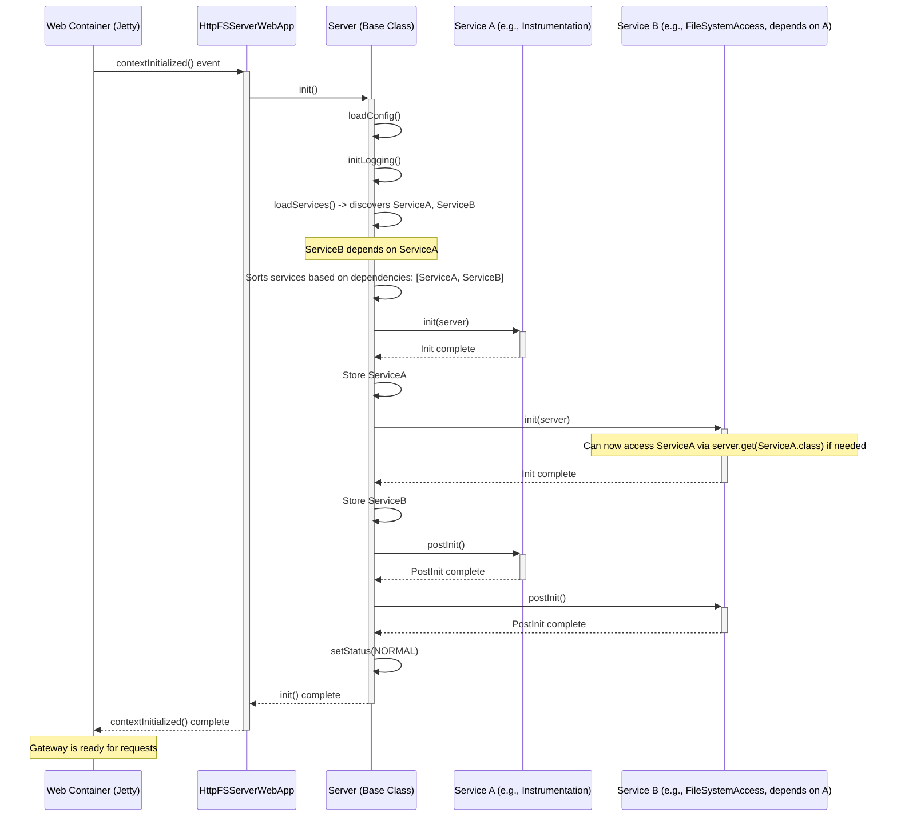

# Chapter 8: Server & Service Lifecycle Management

Welcome to the final chapter! In [Chapter 7: Instrumentation & Metrics](07_instrumentation___metrics__.md), we saw how `httpfsgateway` keeps track of its own performance and activity using built-in "sensors" and "gauges". We've now explored all the major parts of how the gateway handles requests: routing, security, parsing parameters, executing operations, accessing the filesystem securely, handling errors, and monitoring itself.

But how does this whole application actually *start* running? How does it make sure all its internal parts, like the [Filesystem Access Layer (FileSystemAccessService)](05_filesystem_access_layer__filesystemaccessservice__.md) or the [Instrumentation & Metrics](07_instrumentation___metrics__.md) system, are ready before processing requests? And how does it shut down cleanly when stopped?

## The Problem: Starting the Engine and Keeping It Running

Think about starting a car. You don't just magically start driving. You turn the key, and a complex sequence happens:
1.  The battery provides power.
2.  The starter motor cranks the engine.
3.  The fuel pump delivers fuel.
4.  The engine control unit manages spark plugs and timing.
5.  The alternator starts generating power for the electronics.
6.  Only when all these systems are running correctly can you put the car in gear and drive.

Similarly, our `httpfsgateway` application is made of several internal components (we'll call them **Services**) that need to be initialized in the right order. The application itself (the **Server**) needs a way to manage this startup process, handle configuration, and then cleanly shut everything down when needed. We need an "ignition system" and an "engine control unit" for our software.

## The Solution: Server, Services, and the WebApp Bridge

`httpfsgateway` uses a structured approach for this, built around three main concepts:

1.  **`Service`:** Represents an internal component with a specific job. Think of these as the car's essential parts: the fuel pump (`FileSystemAccessService`), the dashboard gauges (`InstrumentationService`), etc. Each `Service` has:
    *   An `init()` method: Code to run when the service starts.
    *   A `destroy()` method: Code to run when the service stops.
    *   A way to declare dependencies: Which *other* Services need to be running *before* this one can start?

2.  **`Server`:** This is the main engine block and control system. It's responsible for:
    *   Loading the overall configuration (like reading the car's manual).
    *   Knowing which `Service` components are needed (based on configuration).
    *   Initializing the `Service` components in the correct order based on their dependencies.
    *   Managing the overall status of the application (Starting, Running, Stopping, Stopped).
    *   Shutting down the `Service` components cleanly in the reverse order of startup.

3.  **`ServerWebApp`:** This class acts as the bridge connecting the `Server` (the engine) to the environment it runs in – usually a web server (like Jetty). Think of it as putting the engine into the car's chassis and connecting the ignition key.
    *   It listens for signals from the web server (like "application starting" or "application stopping").
    *   When the web server says "start", `ServerWebApp` tells the `Server` to `init()`.
    *   When the web server says "stop", `ServerWebApp` tells the `Server` to `destroy()`.
    *   `HttpFSServerWebApp` is the specific implementation for our gateway.

## Use Case: Starting the HttpFS Gateway

When you deploy and start the `httpfsgateway` web application in a web server (like Jetty or Tomcat):

1.  **Web Server Starts:** The web server initializes itself.
2.  **WebApp Notified:** The web server finds `HttpFSServerWebApp` (because it's configured as a `ServletContextListener` in the web deployment descriptor `web.xml`) and tells it "the application context is being initialized". This is like turning the ignition key.
3.  **`ServerWebApp` Takes Action:** The `contextInitialized()` method in `HttpFSServerWebApp` is triggered. This method simply calls its own `init()` method (inherited from `Server`).
4.  **`Server` Initializes:** The `Server.init()` method runs:
    *   Loads configuration files (`httpfs-default.xml`, `httpfs-site.xml`).
    *   Initializes logging.
    *   Reads the `httpfs.services` configuration property to find out which `Service` classes to load (e.g., `FileSystemAccessService`, `InstrumentationService`).
    *   Creates instances of these `Service` classes.
    *   Sorts the services based on their dependencies (e.g., `FileSystemAccessService` might need basic configuration read first).
    *   Calls the `init()` method on each `Service` in the correct order.
    *   Calls a `postInit()` method on each service after all have been initialized (for any setup that needs all services to be initially ready).
    *   Sets the overall server status to `NORMAL` (or another configured startup status).
5.  **Gateway Ready:** The gateway is now fully initialized and ready to accept HTTP requests. The engine is running smoothly!

When the web application is stopped:
1.  **WebApp Notified:** The web server tells `HttpFSServerWebApp` "the application context is being destroyed".
2.  **`ServerWebApp` Takes Action:** The `contextDestroyed()` method calls `Server.destroy()`.
3.  **`Server` Shuts Down:** The `Server.destroy()` method:
    *   Calls the `destroy()` method on each `Service` in the *reverse* order they were initialized.
    *   Shuts down logging.
    *   Sets the server status to `SHUTDOWN`.
4.  **Gateway Stopped:** The application has shut down cleanly.

## Diving into the Code

**1. Connecting to the Web Server (`ServerWebApp`)**

This class listens for web server events.

```java
// --- File: src/main/java/org/apache/ozone/lib/servlet/ServerWebApp.java ---

// Implements ServletContextListener to hook into web server lifecycle
public abstract class ServerWebApp extends Server
       implements ServletContextListener {

    // ... (Constructor and config loading) ...

    // Called by the web server when the application starts
    @Override
    public void contextInitialized(ServletContextEvent event) {
        try {
            init(); // Call the main Server initialization logic
        } catch (ServerException ex) {
            // Log error and stop if init fails
            event.getServletContext().log("ERROR: " + ex.getMessage());
            throw new RuntimeException(ex);
        }
    }

    // Called by the web server when the application stops
    @Override
    public void contextDestroyed(ServletContextEvent event) {
        destroy(); // Call the main Server destruction logic
    }

    // ... (other methods) ...
}
```
*   `implements ServletContextListener`: This standard Java interface lets the class react to web application startup and shutdown.
*   `contextInitialized()`: Triggered on startup, it calls `init()` from the base `Server` class.
*   `contextDestroyed()`: Triggered on shutdown, it calls `destroy()` from the base `Server` class.
*   `HttpFSServerWebApp` extends this, providing the specific server name ("httpfs").

**2. The Main Control System (`Server`)**

This class orchestrates the lifecycle.

```java
// --- File: src/main/java/org/apache/ozone/lib/server/Server.java ---

public class Server {
    // ... (Fields: status, name, config, services map) ...

    // --- Initialization ---
    public void init() throws ServerException {
        if (status != Status.UNDEF) {
            throw new IllegalStateException("Server already initialized");
        }
        status = Status.BOOTING;
        // ... (Verify dirs, init logging, load config) ...
        initConfig();

        log.debug("Loading services");
        // Load service classes listed in config (e.g., httpfs.services)
        List<Service> serviceList = loadServices();

        try {
            log.debug("Initializing services");
            // Initialize services respecting dependencies
            initServices(serviceList);
            log.info("Services initialized");
        } catch (ServerException ex) {
            log.error("Services init failure, destroying services");
            destroyServices(); // Rollback on failure
            throw ex;
        }

        // Set final startup status (usually NORMAL)
        Status startupStatus = Status.valueOf(getConfig().get(
            getPrefixedName(CONF_STARTUP_STATUS), Status.NORMAL.toString()));
        setStatus(startupStatus);
        log.info("Server [{}] started!, status [{}]", name, startupStatus);
    }

    // Helper to load and de-duplicate services from config
    protected List<Service> loadServices() throws ServerException {
        // ... (Reads CONF_SERVICES, CONF_SERVICES_EXT, creates instances) ...
        return list;
    }

    // Helper to initialize services in order
    protected void initServices(List<Service> serviceList)
        throws ServerException {
        for (Service service : serviceList) {
            log.debug("Initializing service [{}]", service.getInterface());
            // Ensure dependencies are already initialized
            checkServiceDependencies(service);
            // Call the service's own init method
            service.init(this);
            // Store the initialized service
            this.services.put(service.getInterface(), service);
        }
        // Call postInit after all services are initially ready
        for (Service service : serviceList) {
            service.postInit();
        }
    }

    // --- Shutdown ---
    public void destroy() {
        // ... (Ensure server is running) ...
        destroyServices(); // Call destroy() on all services
        // ... (Shutdown logging) ...
        status = Status.SHUTDOWN;
    }

    // Helper to destroy services in reverse order
    protected void destroyServices() {
        List<Service> list = new ArrayList<Service>(services.values());
        Collections.reverse(list); // Reverse the initialization order
        for (Service service : list) {
            try {
                log.debug("Destroying service [{}]", service.getInterface());
                service.destroy(); // Call the service's destroy method
            } catch (Throwable ex) {
                log.error("Could not destroy service [{}], {}", service.getInterface(), ex);
            }
        }
        log.info("Services destroyed");
    }

    // ... (Methods: checkServiceDependencies, getConfig, get(Service), etc.) ...
}
```
*   `init()`: Orchestrates the startup sequence: config -> logging -> load services -> init services -> post-init services -> set status.
*   `loadServices()`: Reads configuration to find service classes.
*   `initServices()`: Iterates through loaded services, checks dependencies (`checkServiceDependencies`), calls `service.init(this)`, stores it, and finally calls `postInit()` on all.
*   `destroy()`: Calls `destroyServices()`.
*   `destroyServices()`: Gets the list of running services, *reverses* it, and calls `destroy()` on each one.

**3. The Component Interface (`Service`)**

Defines the contract for manageable components.

```java
// --- File: src/main/java/org/apache/ozone/lib/server/Service.java ---

public interface Service {

    // Called during Server initialization.
    void init(Server server) throws ServiceException;

    // Called after all services have been initialized.
    void postInit() throws ServiceException;

    // Called during Server destruction.
    void destroy();

    // Returns the classes of Services this Service depends on.
    // These dependencies must be initialized before this Service.
    Class[] getServiceDependencies();

    // Returns the main interface this Service implements.
    // Used by Server.get(Class) to retrieve the service.
    Class getInterface();

    // ... (serverStatusChange method - less critical for basic understanding) ...
}
```
*   `init(Server server)`: The core initialization logic for the service. It receives the `Server` instance to access configuration or other services.
*   `destroy()`: Cleanup logic for the service.
*   `getServiceDependencies()`: Crucial for startup order. Returns an array of other `Service` interface classes that must be initialized *before* this one.
*   `getInterface()`: Returns the primary interface this service provides (e.g., `FileSystemAccess.class`).

**4. A Base Implementation (`BaseService`)**

Provides common boilerplate for services.

```java
// --- File: src/main/java/org/apache/ozone/lib/server/BaseService.java ---

public abstract class BaseService implements Service {
    private String prefix; // Service-specific config prefix
    private Server server; // Reference to the main Server
    private Configuration serviceConfig; // Config filtered for this service

    public BaseService(String prefix) { this.prefix = prefix; }

    // Final implementation of Service.init()
    @Override
    public final void init(Server s) throws ServiceException {
        this.server = s;
        // Extract configuration specific to this service based on its prefix
        String servicePrefix = getPrefixedName(""); // e.g., "httpfs.filesystemaccess."
        serviceConfig = new Configuration(false);
        // ... (Code to copy only relevant keys from server config) ...

        // Call the subclass's specific init logic
        init();
    }

    // Abstract method for subclasses to implement their init logic
    protected abstract void init() throws ServiceException;

    // Default implementations for other Service methods (postInit, destroy, etc.)
    @Override public void postInit() throws ServiceException { }
    @Override public void destroy() { }
    @Override public Class[] getServiceDependencies() { return new Class[0]; }

    protected Server getServer() { return server; }
    protected Configuration getServiceConfig() { return serviceConfig; }
    // ...
}
```
*   `BaseService` handles extracting the service-specific configuration automatically.
*   Subclasses (like `FileSystemAccessService`) extend `BaseService`, provide their prefix, implement the abstract `init()` method for their specific setup, and override `destroy()` and `getServiceDependencies()` as needed.

## Internal Implementation Walkthrough (Startup)

Let's visualize the startup sequence managed by the `Server`:



1.  **Web Container Event:** The web server signals the application start.
2.  **`WebApp` calls `Server.init()`:** The bridge connects the event to the server logic.
3.  **`Server` Core Init:** Loads config, logging.
4.  **`Server` Loads & Sorts Services:** Finds `ServiceA` and `ServiceB` from config, notes that `ServiceB` depends on `ServiceA`, and determines the init order `[A, B]`.
5.  **`Server` Initializes Services (in order):**
    *   Calls `ServiceA.init()`.
    *   Calls `ServiceB.init()`.
6.  **`Server` Post-Initializes Services:**
    *   Calls `ServiceA.postInit()`.
    *   Calls `ServiceB.postInit()`.
7.  **`Server` Sets Status:** Marks the server as `NORMAL` (ready).
8.  **Return:** Control returns to the web container.

Shutdown follows the reverse order for `destroy()` calls (`ServiceB.destroy()`, then `ServiceA.destroy()`).

## The Car Analogy Revisited

*   **Turning the Key:** Web server sends `contextInitialized`.
*   **Ignition System (`ServerWebApp`):** Relays the start signal to the engine control unit.
*   **Engine Control Unit (`Server`):**
    *   Reads configuration (`httpfs-site.xml` - the car's settings).
    *   Identifies necessary components (`Service`s listed in config - fuel pump, alternator, etc.).
    *   Checks dependencies (alternator needs engine running).
    *   Starts components (`Service.init()`) in the correct sequence.
    *   Performs final checks (`Service.postInit()`).
    *   Sets status to "Running" (`NORMAL`).
*   **Turning Off the Key:** Web server sends `contextDestroyed`.
*   **Engine Control Unit (`Server`):**
    *   Shuts down components (`Service.destroy()`) in the reverse order (e.g., stop fuel pump before engine fully stops).
    *   Sets status to "Stopped" (`SHUTDOWN`).

## Conclusion

Congratulations! You've reached the end of the `httpfsgateway` tutorial. In this final chapter, we explored the crucial role of the `Server`, `Service`, and `ServerWebApp` components in managing the application's lifecycle. You learned how the `Server` orchestrates the startup and shutdown of internal `Service` components, respecting their dependencies, ensuring that the gateway initializes correctly and terminates cleanly. This structured approach is essential for building robust and maintainable server applications.

Throughout this series, you've journeyed through the core concepts of `httpfsgateway`:
*   How it handles incoming web requests ([Chapter 1](01_http_request_routing___handling__httpfsserver__.md)).
*   How it ensures security through authentication and authorization ([Chapter 2](02_authentication___authorization_.md)).
*   How it parses request details ([Chapter 3](03_http_parameter_parsing_framework_.md)).
*   How it executes specific filesystem tasks ([Chapter 4](04_filesystem_operation_execution__fsoperations__.md)).
*   How it manages secure connections to the filesystem ([Chapter 5](05_filesystem_access_layer__filesystemaccessservice__.md)).
*   How it handles errors gracefully ([Chapter 6](06_exception_handling_.md)).
*   How it monitors its own performance ([Chapter 7](07_instrumentation___metrics__.md)).
*   And finally, how the entire application starts and stops ([Chapter 8](08_server___service_lifecycle_management_.md)).

We hope this tour has given you a solid understanding of how `httpfsgateway` works internally. With this knowledge, you should be better equipped to use, configure, monitor, and even contribute to the project!

---

Generated by [AI Codebase Knowledge Builder](https://github.com/The-Pocket/Tutorial-Codebase-Knowledge)