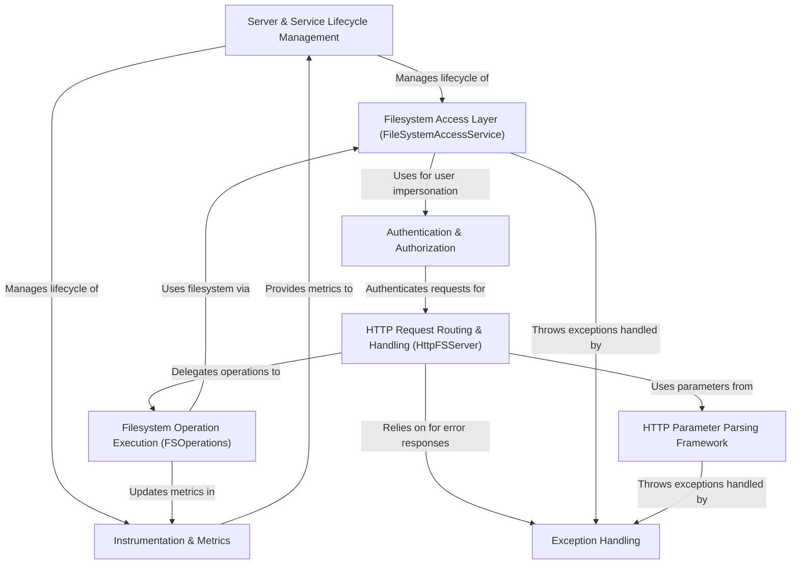

# Tutorial: httpfsgateway

HttpFSServer acts as a **web gateway** for Hadoop's HDFS (or Ozone FS).
It allows clients to interact with the filesystem using standard *HTTP requests* (GET, PUT, POST, DELETE) instead of needing the native HDFS client libraries.
Think of it as translating web calls into filesystem actions like reading files, writing data, or listing directories, while also handling things like *authentication* and *permissions*.

**Source Repository:** [None](None)

## Chapters

1. [HTTP Request Routing & Handling (HttpFSServer)
](01_http_request_routing___handling__httpfsserver__.md)
2. [Authentication & Authorization
](02_authentication___authorization_.md)
3. [HTTP Parameter Parsing Framework
](03_http_parameter_parsing_framework_.md)
4. [Filesystem Operation Execution (FSOperations)
](04_filesystem_operation_execution__fsoperations__.md)
5. [Filesystem Access Layer (FileSystemAccessService)
](05_filesystem_access_layer__filesystemaccessservice__.md)
6. [Exception Handling
](06_exception_handling_.md)
7. [Instrumentation & Metrics
](07_instrumentation___metrics_.md)
8. [Server & Service Lifecycle Management
](08_server___service_lifecycle_management_.md)

---

Generated by [AI Codebase Knowledge Builder](https://github.com/The-Pocket/Tutorial-Codebase-Knowledge)