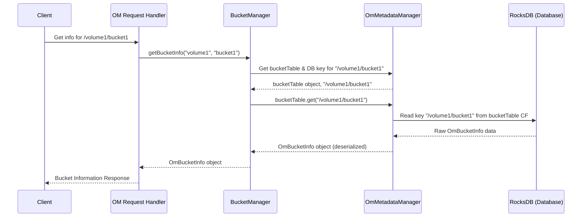

# Chapter 1: OM Metadata Management

Welcome to the Ozone Manager (OM) tutorial series! We're starting our journey by looking at the very core of how the Ozone Manager keeps track of everything: **Metadata Management**.

Imagine you're building a huge digital library (like Ozone) to store millions or even billions of files (called "keys" or "objects" in Ozone). How do you find a specific file later? How do you know who owns which section ("volume") or shelf ("bucket")? You need a reliable catalog system!

That's exactly what **OM Metadata Management** provides for the Ozone Manager. It's the central catalog or database interface that OM uses to remember all the important details *about* your data, but not the data itself.

**Think of it like this:**

*   **Your Data (Keys/Objects):** The actual books in the library.
*   **Metadata:** The library card catalog entry for each book – title, author, shelf number, who checked it out, etc. It's information *about* the book.
*   **Ozone Manager (OM):** The head librarian.
*   **OM Metadata Manager:** The librarian's organized filing cabinet system (the card catalog) where all the metadata cards are stored.

This chapter will explain how this filing system works.

## What is Metadata in Ozone?

Metadata is "data about data". In Ozone, it includes things like:

*   **Volumes:** Who owns a volume? When was it created?
*   **Buckets:** What's the name of the bucket? Which volume does it belong to? What are its storage settings (like replication)?
*   **Keys (Files/Objects):** What's the name of the key? Which bucket is it in? How big is it? Where are its actual data blocks stored on the DataNodes?

The OM needs quick access to all this information to manage the Ozone cluster effectively.

## The Metadata Manager: `OmMetadataManagerImpl`

The main Java class responsible for handling metadata is `OmMetadataManagerImpl`. This class acts as the interface to Ozone Manager's underlying metadata storage, which is typically a key-value database called RocksDB.

**Analogy:** `OmMetadataManagerImpl` is like the chief clerk in charge of the library's entire filing cabinet system (RocksDB). They know exactly which drawer (Table) holds which type of information card (metadata record).

Its primary jobs are:

1.  **Storing Metadata:** When you create a volume, bucket, or key, the OM tells the `OmMetadataManager` to save its details.
2.  **Retrieving Metadata:** When you ask for information (e.g., list files in a bucket), the OM asks the `OmMetadataManager` to look it up.
3.  **Updating Metadata:** When things change (e.g., you rename a key), the `OmMetadataManager` updates the record.
4.  **Deleting Metadata:** When you delete something, the `OmMetadataManager` removes its record (or marks it for later cleanup).

## Organizing the Metadata: Tables (Column Families)

The `OmMetadataManager` doesn't just dump all metadata into one big pile. It uses different "Tables" (which correspond to Column Families in RocksDB) to keep things organized. Think of these as different drawers in the filing cabinet:

*   One drawer for Volume information (`volumeTable`).
*   One drawer for Bucket information (`bucketTable`).
*   One drawer for Key (file/object) information (`keyTable` or `fileTable`).
*   Drawers for security tokens (`dTokenTable`), S3 secrets (`s3SecretTable`), deleted items (`deletedTable`), and many more!

Here's a peek at how some of these tables are defined in the code:

```java
// File: src/main/java/org/apache/hadoop/ozone/om/OmMetadataManagerImpl.java

/**
 * OM RocksDB Structure .
 * <p>
 * OM DB stores metadata as KV pairs in different column families.
 * <p>
 * OM DB Schema: (Simplified Example)
 * <pre>
 * {@code
 * |----------------------------------------------------------------------|
 * |  Column Family     |        KEY              -> VALUE                 |
 * |----------------------------------------------------------------------|
 * | volumeTable        |     /volumeName         -> VolumeInfo            |
 * |----------------------------------------------------------------------|
 * | bucketTable        |     /volumeName/bucketName -> BucketInfo           |
 * |----------------------------------------------------------------------|
 * | keyTable           | /volumeName/bucketName/keyName -> KeyInfo          |
 * |----------------------------------------------------------------------|
 * | deletedTable       | /volumeName/bucketName/keyName -> Info about deletion |
 * |----------------------------------------------------------------------|
 * // ... many other tables for different purposes ...
 * }
 * </pre>
 */

// Constants defining the names of these tables
public static final String USER_TABLE = "userTable";
public static final String VOLUME_TABLE = "volumeTable";
public static final String BUCKET_TABLE = "bucketTable";
public static final String KEY_TABLE = "keyTable"; // For Object Store layout
public static final String DELETED_TABLE = "deletedTable";
public static final String FILE_TABLE = "fileTable"; // For File System Optimized layout
// ... etc
```

This organization makes it efficient to find specific types of metadata. For example, if the OM needs info about a bucket, it knows to look *only* in the `bucketTable`.

## Accessing Metadata: The Managers

While `OmMetadataManager` handles the low-level database interactions, other components within the OM usually work with more specialized managers:

*   `VolumeManager`: Handles volume-related operations.
*   `BucketManager`: Handles bucket-related operations.
*   `KeyManager`: Handles key/file-related operations.
*   `PrefixManager`: Handles directory/prefix related operations (especially for file system layouts).

These specialized managers *use* the `OmMetadataManager` behind the scenes to get the data they need.

**Analogy:** You usually don't talk directly to the head librarian (`OmMetadataManager`) for everything. If you need help finding books on a specific subject, you might talk to the librarian at the Subject Information desk (`KeyManager` or `BucketManager`). That librarian then uses the main card catalog (`OmMetadataManager`) to find what you need.

The `OmMetadataManager` provides methods for these other managers to get access to the underlying tables:

```java
// File: src/main/java/org/apache/hadoop/ozone/om/OmMetadataManagerImpl.java

// Method used by VolumeManager to get the volume table
@Override
public Table<String, OmVolumeArgs> getVolumeTable() {
  return volumeTable;
}

// Method used by BucketManager to get the bucket table
@Override
public Table<String, OmBucketInfo> getBucketTable() {
  return bucketTable;
}

// Method used by KeyManager to get the key/file table
@Override
public Table<String, OmKeyInfo> getKeyTable(BucketLayout bucketLayout) {
  // Depending on the bucket type, it returns the correct table
  if (bucketLayout.isFileSystemOptimized()) {
    return fileTable; // Used for directory-like structures
  }
  return keyTable; // Used for flat object store structures
}

// ... methods to get other tables ...
```

Let's see a simplified conceptual example of how the `BucketManager` might use the `OmMetadataManager` to get information about a specific bucket:

```java
// Example (Conceptual) - How BucketManagerImpl might use MetadataManager
// (This is a simplified representation, not exact code)

public class BucketManagerImpl implements BucketManager {
    private OMMetadataManager metadataManager; // Has a reference to the metadata manager

    // Constructor gets the metadataManager instance
    public BucketManagerImpl(OMMetadataManager metaMgr) {
        this.metadataManager = metaMgr;
    }

    @Override
    public OmBucketInfo getBucketInfo(String volumeName, String bucketName) throws IOException {
        // 1. Ask MetadataManager for the bucket table
        Table<String, OmBucketInfo> bucketTable = metadataManager.getBucketTable();

        // 2. Ask MetadataManager to create the database key for this bucket
        //    (e.g., combines volume and bucket names like "/vol1/buck1")
        String dbBucketKey = metadataManager.getBucketKey(volumeName, bucketName);

        // 3. Use the table object to get the information stored under that key
        OmBucketInfo bucketInfo = bucketTable.get(dbBucketKey);

        if (bucketInfo == null) {
            // Handle case where the bucket doesn't exist
            throw new OMException("Bucket not found", ResultCodes.BUCKET_NOT_FOUND);
        }

        // 4. Return the found bucket information
        return bucketInfo;
    }
    // ... other BucketManager methods ...
}
```

In this example, `BucketManagerImpl` doesn't need to know the details of RocksDB. It just asks the `OmMetadataManager` for the right table and uses standard methods (`get`, `put`, `delete`) provided by the `Table` interface to interact with the metadata.

## Under the Hood: A Request Example

Let's trace how a request to get bucket information might flow through the system:

**Use Case:** A user (client) asks the OM: "Tell me about the bucket named `bucket1` inside the volume `volume1`."

**Steps:**

1.  **Client Request:** The client sends a "Get Bucket Info" request for `/volume1/bucket1` to the OM.
2.  **OM Request Handling:** An internal OM component (like a request handler) receives the request and identifies it needs bucket information. We'll learn more about this in [Chapter 4: OM Request Handling (Write Path)](04_om_request_handling__write_path__.md) and [Chapter 7: OM Client Response Handling](07_om_client_response_handling_.md).
3.  **Call BucketManager:** The request handler calls the `BucketManager.getBucketInfo("volume1", "bucket1")` method.
4.  **Call MetadataManager:** The `BucketManager` needs the metadata, so it interacts with the `OmMetadataManager`. It asks for the `bucketTable` and the database key for `/volume1/bucket1`.
5.  **Database Query:** The `OmMetadataManager` uses the `bucketTable` object (which represents the connection to the specific RocksDB table/column family) to query the database for the key `/volume1/bucket1`.
6.  **RocksDB Lookup:** RocksDB looks up the key `/volume1/bucket1` within its `bucketTable` column family and finds the associated value (the stored `OmBucketInfo` data).
7.  **Return Data:** RocksDB returns the raw data to `OmMetadataManager`.
8.  **Deserialize & Return:** `OmMetadataManager` (or the `Table` object) deserializes the raw data back into an `OmBucketInfo` Java object and returns it to the `BucketManager`.
9.  **Return to Handler:** `BucketManager` returns the `OmBucketInfo` object to the OM request handler.
10. **Client Response:** The request handler packages the information and sends it back to the client.

Here's a diagram illustrating this flow:



## Defining the Database Schema: `OMDBDefinition`

How does the `OmMetadataManager` know which tables exist and what kind of data they store? This is formally defined in the `OMDBDefinition.java` file.

This class acts like a blueprint for the OM's database. It lists every table (Column Family), its name, and specifies how the keys and values should be converted (serialized/deserialized) to be stored in RocksDB. These converters are called "Codecs".

```java
// File: src/main/java/org/apache/hadoop/ozone/om/codec/OMDBDefinition.java

// Defines the structure for the 'bucketTable'
public static final DBColumnFamilyDefinition<String, OmBucketInfo>
        BUCKET_TABLE =
        new DBColumnFamilyDefinition<>(
                OmMetadataManagerImpl.BUCKET_TABLE, // Table name constant ("bucketTable")
                StringCodec.get(),                 // Keys are Strings
                OmBucketInfo.getCodec());          // Values are OmBucketInfo objects

// Defines the structure for the 'volumeTable'
public static final DBColumnFamilyDefinition<String, OmVolumeArgs>
        VOLUME_TABLE =
        new DBColumnFamilyDefinition<>(
                OmMetadataManagerImpl.VOLUME_TABLE, // Table name constant ("volumeTable")
                StringCodec.get(),                 // Keys are Strings
                OmVolumeArgs.getCodec());          // Values are OmVolumeArgs objects

// ... definitions for all other tables (keyTable, deletedTable, etc.) ...

// Constructor uses these definitions to set up the database structure
private OMDBDefinition() {
    super(COLUMN_FAMILIES); // COLUMN_FAMILIES is a map containing all table definitions
}
```

This definition ensures consistency and tells the system how to correctly read and write metadata to the database.

## Conclusion

The **OM Metadata Manager** (`OmMetadataManagerImpl`) is the fundamental component responsible for organizing, storing, and retrieving all the critical information *about* the data stored in Ozone. It uses an underlying key-value store (RocksDB) and organizes metadata into different **Tables** (Column Families) like `volumeTable`, `bucketTable`, and `keyTable`. Other specialized managers (`VolumeManager`, `BucketManager`, `KeyManager`) rely on the `OmMetadataManager` to interact with this persistent metadata storage.

Understanding metadata management is crucial because almost every operation in Ozone (creating buckets, writing files, reading files, checking permissions) involves reading or modifying metadata.

Now that we have a basic idea of how OM remembers things, the next important question is: how does it control *who* can see or change this information? That leads us to the next chapter.

**Next:** [Chapter 2: Security (Authentication & Authorization)](02_security__authentication___authorization__.md)

---

Generated by [AI Codebase Knowledge Builder](https://github.com/The-Pocket/Tutorial-Codebase-Knowledge)