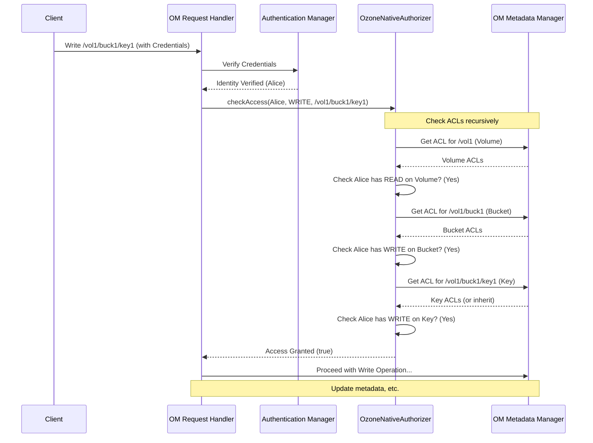

# Chapter 2: Security (Authentication & Authorization)

In [Chapter 1: OM Metadata Management](01_om_metadata_management_.md), we learned how the Ozone Manager (OM) keeps track of all the information *about* your data, like a library's card catalog. But just like a library needs rules about who can enter and who can borrow which books, Ozone needs a security system.

Imagine our digital library again. We need to ensure:

1.  Only registered members can enter (Authentication).
2.  Members can only borrow books they are allowed to (Authorization). We don't want someone checking out books from the restricted section without permission!

This chapter explains how the Ozone Manager handles these crucial security tasks.

## What's the Problem? Keeping Data Safe

Ozone is designed to store vast amounts of data, potentially from many different users and applications. Without security, anyone could read, change, or delete anyone else's data. That would be chaos!

We need a system to:

*   **Verify Identity (Authentication):** Make sure users are who they claim to be.
*   **Check Permissions (Authorization):** Make sure users only perform actions they have been granted permission for.

**Analogy:** Think of the Ozone Manager's security system as the library's front desk security guard and the rules written on each bookshelf.

*   **Authentication:** The guard checks your library card (your identity) when you enter.
*   **Authorization:** The rules on the shelf (or the librarian) tell you if you're allowed to borrow a specific book (check your permissions).

## Key Security Concepts

Ozone's security relies on two main ideas:

1.  **Authentication ("Who are you?")**: This is the process of proving your identity. When you connect to Ozone, you need to present some form of credentials. Ozone supports different ways to do this:
    *   **Kerberos:** A widely used, strong authentication system often found in large organizations. Think of it like a corporate ID badge system.
    *   **Delegation Tokens:** Short-term, temporary credentials. Imagine getting a temporary visitor pass from the security guard instead of using your main ID everywhere inside the building. This is useful for jobs or services acting on your behalf.
    *   **S3 Secrets:** Special access keys (like a username and password pair) used specifically when accessing Ozone through its S3-compatible gateway.

2.  **Authorization ("What are you allowed to do?")**: Once Ozone knows *who* you are, it needs to determine *what* you're allowed to do. This is managed using **Access Control Lists (ACLs)**.
    *   **ACLs:** These are lists attached to Ozone resources (volumes, buckets, keys). Each list specifies which users or groups have which permissions (like READ, WRITE, DELETE, LIST, etc.) on that specific resource. It's like a specific permission slip for each volume, bucket, or file.

## How Security Works in OM: A High-Level View

When you (or an application) send a request to the Ozone Manager (e.g., "read file `report.txt` from bucket `mydata`"):

1.  **Authentication Check:** The OM first looks at the credentials sent with your request. It uses components like the `OzoneDelegationTokenSecretManager` or S3 authentication helpers to verify your identity. "Is this really Alice?"
2.  **Authorization Check:** If authentication succeeds, the OM then checks if you have permission for the requested action on the target resource. It uses an **Authorizer** (like `OzoneNativeAuthorizer`) to look up the ACLs for the bucket `mydata` and the key `report.txt`. "Is Alice allowed to READ this file?"
3.  **Action Execution (or Denial):** If both checks pass, the OM proceeds with the action (reading the file's metadata, in this case). If either check fails, the OM denies the request with a "Permission Denied" error.

## Key Components Involved

Let's look at some of the main code components responsible for security:

### Authentication Components

*   **`OzoneDelegationTokenSecretManager`**: Manages the lifecycle of delegation tokens. It creates them, verifies them when presented, renews them, and removes them when they expire or are cancelled.

    ```java
    // File: src/main/java/org/apache/hadoop/ozone/security/OzoneDelegationTokenSecretManager.java

    // Concept: When verifying a token, it checks if it knows the token
    // and if it's still valid (not expired, not tampered with).
    @Override
    public byte[] retrievePassword(OzoneTokenIdentifier identifier)
        throws InvalidToken {
        // 1. Check if I know this token identifier exists in my list (currentTokens)
        TokenInfo info = validateToken(identifier); // Checks expiry, signature etc.

        // 2. If valid, return the 'password' part of the token for verification
        return info.getPassword();
        // Simplified: Actual verification involves cryptographic checks.
    }
    ```
    This manager acts like the security desk issuing and checking temporary passes (delegation tokens).

*   **`S3SecretManagerImpl` & `S3SecurityUtil`**: Handle secrets specifically for the S3 protocol. When a request comes via the S3 Gateway, `S3SecurityUtil` often uses the `S3SecretManager` to look up the secret key associated with the provided access key and validate the request signature.

    ```java
    // File: src/main/java/org/apache/hadoop/ozone/security/S3SecurityUtil.java

    // Concept: Validates S3 credentials in an incoming request.
    public static void validateS3Credential(OMRequest omRequest,
        OzoneManager ozoneManager) throws ServiceException, OMException {

        if (ozoneManager.isSecurityEnabled()) {
            // 1. Extract S3 authentication info (Access Key, Signature, etc.)
            OzoneTokenIdentifier s3Token = constructS3Token(omRequest);

            // 2. Ask the Delegation Token Manager (which handles S3 Auth too)
            //    to verify these credentials. This uses the S3SecretManager internally.
            try {
                ozoneManager.getDelegationTokenMgr().retrievePassword(s3Token);
            } catch (SecretManager.InvalidToken e) {
                // If verification fails, throw an error.
                throw new OMException("S3 signature validation failed", INVALID_TOKEN);
            }
        }
    }
    ```
    This is like a special check for users coming through the "S3 entrance" of the library, verifying their specific S3 keys.

### Authorization Components

*   **`IAccessAuthorizer` Interface & `OzoneNativeAuthorizer` Implementation**: This is the core component responsible for checking permissions based on ACLs. The `OzoneNativeAuthorizer` is the default implementation.

    ```java
    // File: src/main/java/org/apache/hadoop/ozone/security/acl/OzoneNativeAuthorizer.java

    // Concept: Checks if a user (in RequestContext) has the required
    // permission (context.getAclRights()) on a specific resource (ozObject).
    @Override
    public boolean checkAccess(IOzoneObj ozObject, RequestContext context)
        throws OMException {

        // 1. Bypass checks if the user is an administrator.
        if (adminCheck.test(context.getClientUgi())) {
            return true;
        }

        // 2. Determine the resource type (Volume, Bucket, Key).
        OzoneObjInfo objInfo = (OzoneObjInfo) ozObject;

        // 3. Based on resource type, check ACLs using specific managers
        //    (VolumeManager, BucketManager, KeyManager).
        //    Also checks parent permissions recursively (e.g., need access to bucket to access key).
        switch (objInfo.getResourceType()) {
            case VOLUME:
                return volumeManager.checkAccess(objInfo, context); // Check volume ACLs
            case BUCKET:
                // Check bucket ACLs AND parent volume ACLs
                return bucketManager.checkAccess(objInfo, context) &&
                       volumeManager.checkAccess(objInfo, parentContext);
            // ... cases for KEY and PREFIX ...
        }
        return false; // Default deny
    }
    ```
    This acts like the librarian checking the permission rules for the specific book (resource) you want to access.

*   **`OzoneAclUtils`**: Provides helper methods for ACL checking, especially handling the logic of checking permissions on parent resources (e.g., checking volume access when accessing a bucket).

    ```java
    // File: src/main/java/org/apache/hadoop/ozone/om/OzoneAclUtils.java

    // Concept: A helper to simplify checking ACLs, including parent resources.
    public static void checkAllAcls(OmMetadataReader omMetadataReader, ...,
        String volOwner, String bucketOwner, UserGroupInformation user, ...)
        throws IOException {

        // Example logic for checking KEY access:
        if (resType == KEY) {
            if (isOwner(user, volOwner)) {
                 // If user owns the volume, grant access (simplified view).
            } else {
                // 1. Check Volume READ permission.
                omMetadataReader.checkAcls(VOLUME, ..., READ, ..., volOwner);
                // 2. Check Bucket READ permission.
                omMetadataReader.checkAcls(BUCKET, ..., READ, ..., bucketOwner);
                // 3. Check Key permission (e.g., WRITE).
                omMetadataReader.checkAcls(KEY, ..., aclType, ..., bucketOwner);
            }
        }
        // ... other resource types ...
    }
    ```
    Think of this as a standard procedure the librarian follows to check permissions at multiple levels (main library section, specific shelf, specific book).

## Internal Flow: Checking Access for a Key

Let's trace what happens internally when a user authenticated as "Alice" tries to write to `/volume1/bucket1/key1`.

1.  **Request Received:** The OM receives Alice's "write key" request. The request includes Alice's credentials (e.g., a delegation token or Kerberos ticket).
2.  **Authentication:** The OM uses the appropriate mechanism (e.g., `OzoneDelegationTokenSecretManager`) to verify Alice's credentials. Let's assume it succeeds.
3.  **Authorization Starts:** The request handler calls the `checkAccess` method, likely via a helper like `OzoneAclUtils`.
4.  **Authorizer Invoked:** `OzoneAclUtils` (or similar logic) determines it needs to check WRITE access for the key, which requires checking permissions on the key, the parent bucket, and the parent volume. It invokes the `OzoneNativeAuthorizer`.
5.  **ACL Checks (Recursive):**
    *   `OzoneNativeAuthorizer` first checks if Alice is an admin or owner (let's assume not).
    *   It calls `VolumeManager.checkAccess` for `/volume1` (requires READ permission for key write). `VolumeManager` looks up `/volume1`'s ACLs in the metadata (using [OM Metadata Management](01_om_metadata_management_.md)) and checks if Alice has READ. Assume PASS.
    *   It calls `BucketManager.checkAccess` for `/volume1/bucket1` (requires WRITE permission for key write). `BucketManager` looks up `/volume1/bucket1`'s ACLs and checks if Alice has WRITE. Assume PASS.
    *   It calls `KeyManager.checkAccess` for `/volume1/bucket1/key1` (requires WRITE permission). `KeyManager` looks up the key's ACLs (or inherits from the bucket if none specific) and checks if Alice has WRITE. Assume PASS.
6.  **Permission Granted:** Since all checks passed, the `checkAccess` method returns `true`.
7.  **Proceed with Write:** The OM proceeds with the actual key write operation, updating metadata as described in [Chapter 1: OM Metadata Management](01_om_metadata_management_.md) and eventually interacting with DataNodes (covered later).

Here's a simplified diagram:



This interaction ensures that only authenticated users with the correct permissions can access or modify resources within Ozone.

## Conclusion

Security is paramount in a distributed storage system like Ozone. The Ozone Manager acts as the central gatekeeper, using **Authentication** to verify *who* is making a request and **Authorization** (primarily through ACLs) to determine *what* they are allowed to do. Components like `OzoneDelegationTokenSecretManager`, `S3SecretManagerImpl`, and `OzoneNativeAuthorizer` work together to enforce these security rules, protecting data stored in volumes, buckets, and keys.

Now that we understand how OM manages metadata and enforces security, let's look at how it carefully validates incoming requests *before* they even reach the core logic.

**Next:** [Chapter 3: OM Request Validation Framework](03_om_request_validation_framework_.md)

---

Generated by [AI Codebase Knowledge Builder](https://github.com/The-Pocket/Tutorial-Codebase-Knowledge)