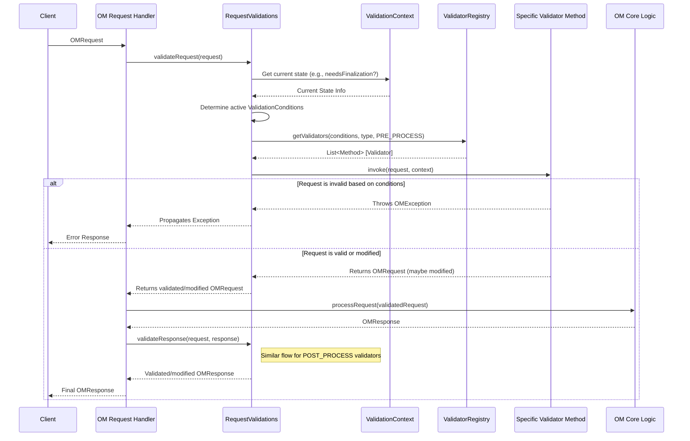

# Chapter 3: OM Request Validation Framework

In the previous chapter, [Chapter 2: Security (Authentication & Authorization)](02_security__authentication___authorization__.md), we saw how the Ozone Manager (OM) ensures only the right users can perform allowed actions. But sometimes, even if a user *has permission*, we might need to check other conditions before letting an operation proceed, especially during cluster upgrades or when dealing with clients using different software versions.

Imagine the cluster is undergoing a major software upgrade. New features might be added, but they shouldn't be used until the upgrade is fully complete across all nodes (a process called "finalization"). How do we prevent users (even authorized ones) from accidentally using a half-ready feature? Or how do we handle requests from older clients that don't understand the new features correctly?

This is where the **OM Request Validation Framework** comes in. It acts like a flexible checkpoint system for incoming requests.

## What's the Problem? Handling Conditional Features

Let's consider a specific scenario:

*   **Use Case:** Ozone introduces a super-efficient new way to store directory information (let's call it "SuperDir") in version 2.0.
*   **The Challenge:**
    1.  When a cluster upgrades from 1.0 to 2.0, this "SuperDir" feature isn't fully active until the administrator explicitly finalizes the upgrade. Trying to use it before finalization could cause errors or data corruption.
    2.  Clients still running version 1.0 don't even know about "SuperDir". If they interact with a bucket using it, we might need to adjust their requests or responses for compatibility.

We need a way to:

1.  **Check Cluster State:** Is the "SuperDir" feature ready and finalized?
2.  **Check Client Version:** Is the client new enough to understand "SuperDir"?
3.  **Act Accordingly:**
    *   Reject requests for "SuperDir" if the cluster isn't finalized.
    *   Potentially modify requests or responses for older clients interacting with "SuperDir" buckets (maybe hide the feature or translate it).

Doing this directly inside the main request processing logic for every single operation (create file, list directory, etc.) would make the code incredibly messy and hard to maintain.

**Analogy:** Think of temporary road signs and traffic controllers during road construction. Instead of rebuilding every intersection (main logic) to handle the temporary changes, you put up specific signs ("Detour Ahead", "Lane Closed", "New Traffic Pattern") or have controllers directing traffic based on the current construction phase (cluster state) and vehicle type (client version). The Validation Framework is like the system for managing these signs and controllers.

## The Solution: The Request Validation Framework

The OM Request Validation Framework provides a structured way to add these conditional checks and modifications *around* the main request handling logic. It allows developers to write small, focused pieces of code called **Validators** that run at specific points:

1.  **`PRE_PROCESS`:** Before the main logic of handling the request even starts. This is great for rejecting invalid requests early (like trying to use "SuperDir" before finalization).
2.  **`POST_PROCESS`:** After the main logic has finished and generated a response, but *before* the response is sent back to the client. This is useful for modifying the response for compatibility (like simplifying information for an older client).

These validators are triggered based on specific **`ValidationCondition`**s, such as:

*   `CLUSTER_NEEDS_FINALIZATION`: Is the cluster in an intermediate state after an upgrade?
*   `OLDER_CLIENT_REQUESTS`: Is the client sending the request using an older version of the Ozone protocol?

## Key Components

Let's look at the building blocks of this framework:

1.  **Validators:** These are the actual Java methods that contain the checking or modification logic. They are typically static methods.
    *   *Analogy:* The individual road signs ("Lane Closed") or the specific instructions a traffic controller follows.

2.  **`@RequestFeatureValidator` Annotation:** This special marker is placed above a validator method in the code. It tells the framework:
    *   Which request type this validator applies to (e.g., `CREATE_KEY`, `CREATE_BUCKET`).
    *   When it should run (`PRE_PROCESS` or `POST_PROCESS`).
    *   Under which conditions it should run (`CLUSTER_NEEDS_FINALIZATION`, `OLDER_CLIENT_REQUESTS`, or both).

    ```java
    // Example of a simplified validator annotation
    // File: Hypothetical location within Ozone code

    @RequestFeatureValidator(
        conditions = {ValidationCondition.CLUSTER_NEEDS_FINALIZATION}, // Run if cluster not finalized
        processingPhase = RequestProcessingPhase.PRE_PROCESS,       // Run BEFORE main logic
        requestType = Type.CreateBucket                         // Only for CreateBucket requests
    )
    public static OMRequest blockSuperDirDuringUpgrade(OMRequest request,
                                                      ValidationContext context)
                                                      throws OMException {
        // Check if the request tries to use the "SuperDir" feature
        if (request.getCreateBucketRequest().getBucketInfo().getBucketLayout()
              == BucketLayout.SUPER_DIR) { // Simplified check
             // If yes, and cluster needs finalization, reject the request
             throw new OMException("Cannot use SuperDir feature until upgrade" +
                                   " is finalized", ResultCodes.FEATURE_NOT_ENABLED);
        }
        // Otherwise, let the request proceed unchanged
        return request;
    }
    ```
    *This code snippet shows how a validator method (`blockSuperDirDuringUpgrade`) is marked with `@RequestFeatureValidator`. It specifies that this check should run *before* processing (`PRE_PROCESS`) any `CreateBucket` request, but *only* if the cluster needs finalization (`CLUSTER_NEEDS_FINALIZATION`). If the condition is met and the user tries to create a "SuperDir" bucket, it throws an error; otherwise, it returns the original request.*

3.  **`ValidationCondition` Enum:** Defines the possible conditions that can trigger validators.

    ```java
    // File: src/main/java/org/apache/hadoop/ozone/om/request/validation/ValidationCondition.java

    public enum ValidationCondition {
        // Run validators if the cluster hasn't been finalized after an upgrade.
        CLUSTER_NEEDS_FINALIZATION {
            @Override
            public boolean shouldApply(OMRequest req, ValidationContext ctx) {
                // Checks the upgrade status using the context
                return ctx.versionManager().needsFinalization();
            }
        },

        // Run validators if the client version in the request is older
        // than the server's current version.
        OLDER_CLIENT_REQUESTS {
            @Override
            public boolean shouldApply(OMRequest req, ValidationContext ctx) {
                return req.getVersion() < ClientVersion.CURRENT_VERSION;
            }
        };
        // ... abstract method definition ...
    }
    ```
    *This enum defines the specific situations (like `CLUSTER_NEEDS_FINALIZATION`) that can trigger validators. Each condition knows how to check if it's currently active using the provided request and `ValidationContext`.*

4.  **`RequestProcessingPhase` Enum:** Simple enum to define `PRE_PROCESS` and `POST_PROCESS`.

    ```java
    // File: src/main/java/org/apache/hadoop/ozone/om/request/validation/RequestProcessingPhase.java

    public enum RequestProcessingPhase {
      PRE_PROCESS, // Run before main request logic
      POST_PROCESS // Run after main request logic, before sending response
    }
    ```
    *This clearly defines the two possible times a validator can be executed relative to the core request processing.*

5.  **`ValidationContext` Interface:** Provides necessary information to the validator methods, like access to the cluster's upgrade status (`LayoutVersionManager`).

    ```java
    // File: src/main/java/org/apache/hadoop/ozone/om/request/validation/ValidationContext.java

    public interface ValidationContext {
        // Allows validator to check cluster upgrade status
        LayoutVersionManager versionManager();

        // Allows validator to check bucket layout (e.g., is it "SuperDir"?)
        BucketLayout getBucketLayout(String volumeName, String bucketName)
             throws IOException;

        // Helper method to create a context object
        static ValidationContext of(LayoutVersionManager lvm,
                                     OMMetadataManager omm) {
            // ... (implementation returning a concrete ValidationContext) ...
        }
    }
    ```
    *This interface defines what information is passed into the validator methods. Crucially, it includes the `LayoutVersionManager` which tells if the cluster `needsFinalization()`.*

6.  **`ValidatorRegistry`:** This class is responsible for finding all methods marked with `@RequestFeatureValidator` when the OM starts up. It uses a technique called "reflection" to scan the code. It organizes these validators efficiently so they can be quickly retrieved when needed.
    *   *Analogy:* The central office that collects information about all road closures and detours and organizes them by road name, condition (e.g., "During Rush Hour"), and type ("Road Closed" vs. "Detour").

7.  **`RequestValidations`:** This is the main entry point used by the OM request handling pipeline. It takes an incoming request, determines the current active `ValidationCondition`s (using the `ValidationContext`), asks the `ValidatorRegistry` for the appropriate `PRE_PROCESS` validators, runs them, and then does the same for `POST_PROCESS` validators after the main logic runs.
    *   *Analogy:* The traffic management system that looks at the current time and road conditions, consults the central registry for relevant rules, and then applies them by dispatching traffic controllers or activating electronic signs.

## How it Works: The Flow

Let's trace our "SuperDir" example where a client tries to create a "SuperDir" bucket while the cluster upgrade is not finalized:

1.  **Request Arrives:** An `OMRequest` for `CreateBucket` (specifying "SuperDir" layout) arrives at the OM.
2.  **Validation Starts:** The OM's request handling pipeline calls `RequestValidations.validateRequest(request)`.
3.  **Check Conditions:** `RequestValidations` uses the `ValidationContext` (which contains the `LayoutVersionManager`) to see which `ValidationCondition`s are active. It finds that `CLUSTER_NEEDS_FINALIZATION` is `true`.
4.  **Find Validators:** `RequestValidations` asks the `ValidatorRegistry`: "Give me all `PRE_PROCESS` validators for `CreateBucket` requests that apply when `CLUSTER_NEEDS_FINALIZATION` is true."
5.  **Registry Responds:** The `ValidatorRegistry` quickly finds the `blockSuperDirDuringUpgrade` method we defined earlier (based on its annotation).
6.  **Execute Validator:** `RequestValidations` runs the `blockSuperDirDuringUpgrade` method, passing it the request and the context.
7.  **Validator Logic:** The validator checks the request's bucket layout. It sees "SuperDir". Since `CLUSTER_NEEDS_FINALIZATION` is active, it throws the `OMException("Cannot use SuperDir feature...")`.
8.  **Request Rejected:** Because the validator threw an exception, the processing stops. The main logic for creating a bucket is *never reached*. An error response is generated based on the exception and sent back to the client.

**If the cluster *was* finalized:**

*   In Step 3, `CLUSTER_NEEDS_FINALIZATION` would be `false`.
*   In Step 4, `RequestValidations` would still ask the registry, but the condition wouldn't match the validator's annotation.
*   In Step 5, the registry would return an empty list of validators.
*   In Step 6/7, no validator runs.
*   The original request would proceed to the main bucket creation logic ([Chapter 4: OM Request Handling (Write Path)](04_om_request_handling__write_path__.md)).

## Internal Implementation: Finding and Running Validators

How does the framework manage this automatically?

1.  **Discovery (at OM Startup):**
    *   The `ValidatorRegistry` is created.
    *   It uses the `Reflections` library to scan the specified Java packages (like `org.apache.hadoop.ozone`).
    *   It looks for any `Method` annotated with `@RequestFeatureValidator`.

    ```java
    // File: src/main/java/org/apache/hadoop/ozone/om/request/validation/ValidatorRegistry.java

    // Constructor uses Reflections library to find annotated methods
    ValidatorRegistry(Collection<URL> searchUrls) {
        Reflections reflections = new Reflections(/*... configuration ...*/);

        // Get all methods marked with our annotation
        Set<Method> describedValidators =
            reflections.getMethodsAnnotatedWith(RequestFeatureValidator.class);
        // Store them efficiently
        initMaps(describedValidators);
    }

    // Stores validators in nested maps for fast lookup:
    // Condition -> RequestType -> Phase -> List<Method>
    void initMaps(Collection<Method> describedValidators) {
        for (Method m : describedValidators) {
            RequestFeatureValidator descriptor = /* get annotation info */;
            // ... logic to put 'm' into the nested 'validators' map ...
            // based on descriptor.conditions(), descriptor.requestType(),
            // and descriptor.processingPhase()
        }
    }
    ```
    *This setup phase scans the code once at startup and builds an organized map (`validators`) holding all the validator methods, indexed by the conditions, request types, and processing phase specified in their annotations.*

2.  **Execution (Per Request):**
    *   `RequestValidations.validateRequest` (for PRE) or `validateResponse` (for POST) is called.
    *   It determines the active `ValidationCondition`s for the current request and context.

    ```java
    // File: src/main/java/org/apache/hadoop/ozone/om/request/validation/RequestValidations.java

    // Determines which conditions are currently active
    private List<ValidationCondition> conditions(OMRequest request) {
        return Arrays.stream(ValidationCondition.values())
            // Ask each condition if it should apply right now
            .filter(c -> c.shouldApply(request, context))
            .collect(Collectors.toList());
    }
    ```
    *This helper method checks each possible `ValidationCondition` (like `CLUSTER_NEEDS_FINALIZATION`) against the current request and context to see which ones are relevant right now.*

    *   It asks the `ValidatorRegistry` for the list of methods matching the active conditions, the request type, and the phase (`PRE_PROCESS` or `POST_PROCESS`).

    ```java
    // File: src/main/java/org/apache/hadoop/ozone/om/request/validation/RequestValidations.java

    public OMRequest validateRequest(OMRequest request) throws Exception {
        // 1. Find active conditions
        List<ValidationCondition> activeConditions = conditions(request);
        // 2. Ask registry for PRE_PROCESS validators for these conditions
        //    and this request type.
        List<Method> validations = registry.validationsFor(
            activeConditions, request.getCmdType(), PRE_PROCESS);

        OMRequest currentRequest = request;
        // 3. Run each validator found
        for (Method m : validations) {
            // Use reflection to call the static validator method
            // Pass the current request and context
            currentRequest = (OMRequest) m.invoke(null, currentRequest, context);
        }
        // 4. Return the potentially modified request
        return currentRequest;
    }
    ```
    *This method orchestrates the pre-processing validation. It gets the active conditions, asks the registry for the right validator methods, and then runs each one using Java's reflection (`m.invoke`). If a validator modifies the request, the modified version is passed to the next validator. If a validator throws an exception, the loop stops and the exception propagates up.*

    *   It invokes each returned validator method using Java Reflection (`method.invoke(...)`), passing the request (and response for POST) and the `ValidationContext`.
    *   If a validator throws an exception, the process stops, and the request is rejected. Otherwise, the returned (potentially modified) request/response is used.

Here's a diagram showing the validation flow:



## Conclusion

The **OM Request Validation Framework** provides a clean and extensible way to handle conditional logic based on cluster state (like upgrade finalization) or client capabilities (version). By using **Validators** annotated with `@RequestFeatureValidator`, developers can inject checks or modifications at `PRE_PROCESS` or `POST_PROCESS` stages without cluttering the main request handling code. The `ValidatorRegistry` discovers these validators, and `RequestValidations` applies them based on active `ValidationCondition`s, ensuring features behave correctly during transitions like upgrades.

This framework acts as a crucial gatekeeper before we dive into the main processing of requests, particularly those that modify the system's state.

**Next:** [Chapter 4: OM Request Handling (Write Path)](04_om_request_handling__write_path_.md)

---

Generated by [AI Codebase Knowledge Builder](https://github.com/The-Pocket/Tutorial-Codebase-Knowledge)