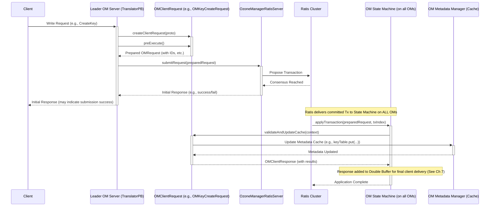

# Chapter 4: OM Request Handling (Write Path)

In [Chapter 3: OM Request Validation Framework](03_om_request_validation_framework_.md), we learned how the Ozone Manager (OM) checks incoming requests against special conditions, like cluster upgrade status, *before* processing them. Now, let's dive into what happens when a request passes those checks and needs to actually *change* something in the system – like creating a new file or bucket. This is the **Write Path**.

Imagine you want to save a new document (a "key" in Ozone terms) called `mydoc.txt` into your `mydata` bucket. You send a request to the OM saying, "Please create `mydoc.txt` in `/volume1/mydata`". How does the OM handle this request to make sure the file is created correctly and safely, especially since there might be multiple OMs working together?

That's the job of the **OM Request Handling (Write Path)**. It's like the air traffic control system for incoming requests that want to modify the cluster's state (the metadata). It takes the validated request, prepares it for "landing" (committing the change), ensures all OMs agree on it, and finally updates the official records (the metadata).

## What's the Goal? Safely Changing the System

When a request comes in to change something (like creating a key, deleting a bucket, setting a property), the OM needs to ensure several things:

1.  **Preparation:** Does the request need extra information generated before it can be processed? (e.g., a unique ID for the new file).
2.  **Consistency:** If there are multiple OMs (for high availability), how do we make sure they *all* agree on the change and apply it in the same order?
3.  **Durability:** How do we make sure the change is permanently recorded, even if an OM crashes?
4.  **Atomicity:** The change should either happen completely or not at all. We don't want a half-created file.

The Write Path orchestrates the process to achieve these goals.

## Key Steps in the Write Path

Think of the Write Path as a multi-stage process for handling modification requests:

1.  **Receive & Initial Validation:** The OM receives the request (e.g., via the `OzoneManagerProtocolServerSideTranslatorPB`). Basic checks and the [Chapter 3: OM Request Validation Framework](03_om_request_validation_framework_.md) run here.
2.  **Pre-Execution (`preExecute`):** Before proposing the change to the cluster, the request might need preparation. This happens in the `preExecute` method of the specific `OMClientRequest` handler (like `OMKeyCreateRequest`). This step can:
    *   Generate unique Object IDs.
    *   Allocate blocks (ask where the data should go, though the actual data write happens later between the client and DataNodes).
    *   Perform final checks that require accessing current metadata.
    *   Package all necessary information into the request object (`OMRequest`) that will be replicated.
3.  **Replication via Ratis:** This is the crucial step for consistency and durability. The prepared `OMRequest` is submitted to the Ratis consensus protocol. Ratis ensures that all OMs in the cluster agree on the order of requests and reliably log the request. We'll explore this in detail in [Chapter 6: Ratis State Machine & Replication](06_ratis_state_machine___replication_.md).
    *   **Analogy:** The ATC (OM) instructs the pilot (Ratis) to log the landing request and get confirmation from other towers (other OMs) before proceeding.
4.  **State Machine Application (`validateAndUpdateCache`):** Once Ratis achieves consensus, it delivers the agreed-upon request to the OM's State Machine on *each* OM node. The State Machine then calls the `validateAndUpdateCache` method of the corresponding `OMClientRequest` handler. This method:
    *   Performs the actual metadata update in the OM's in-memory cache (using the [OM Metadata Management](01_om_metadata_management_.md) layer).
    *   Updates relevant metrics.
    *   Generates the response to be sent back to the client eventually.
    *   **Important:** This method runs *after* Ratis consensus, ensuring the change is applied consistently across all OMs.
5.  **Response Handling:** After `validateAndUpdateCache` completes successfully, a response is prepared and eventually sent back to the client, confirming the operation succeeded. This is covered more in [Chapter 7: OM Client Response Handling](07_om_client_response_handling_.md).

## Example: Creating a Key (`mydoc.txt`)

Let's trace our "create key `mydoc.txt`" request through this simplified write path:

1.  **Client Request:** Client sends `CreateKeyRequest` for `/volume1/mydata/mydoc.txt` to the leader OM.
2.  **Receive & Validate:** `OzoneManagerProtocolServerSideTranslatorPB` receives the request. It passes initial checks and [Chapter 3: OM Request Validation Framework](03_om_request_validation_framework_.md) checks.
3.  **Pre-Execution (`OMKeyCreateRequest.preExecute`):**
    *   This method is called on the *leader* OM.
    *   It generates a unique Object ID for `mydoc.txt`.
    *   It might allocate the first block (get locations from SCM).
    *   It adds this generated info (Object ID, block details) to the `OMRequest` protobuf message.
    *   It performs permission checks using [Security (Authentication & Authorization)](02_security__authentication___authorization__.md).

    ```java
    // Simplified Concept: OMKeyCreateRequest#preExecute
    @Override
    public OMRequest preExecute(OzoneManager ozoneManager) throws IOException {
        // ... permission checks ...

        // Get Key arguments from original request
        KeyArgs keyArgs = getOmRequest().getCreateKeyRequest().getKeyArgs();

        // Generate a unique Object ID
        long objectID = ozoneManager.getObjectIdFromTxId(txLogIndex); // Simplified ID generation

        // Allocate the first block for the key (simplified)
        // Tells the client where to write the data later
        OpenKeySession session = allocateBlock(ozoneManager, keyArgs, objectID);

        // Update the internal OMRequest protobuf with generated info
        // This updated request will be sent to Ratis
        OMRequest updatedRequest = getOmRequest().toBuilder()
            .setCreateKeyRequest(
                CreateKeyRequest.newBuilder()
                    .setKeyArgs(keyArgs.getProtobufBuilder()
                        .setObjectID(objectID) // Add generated ID
                        // ... add block allocation info ...
                    )
            )
            // ... set user info, layout version etc. ...
            .build();

        return updatedRequest;
    }
    ```
    *This `preExecute` step prepares everything needed to actually create the key later. It generates IDs, figures out where data should go, and bundles this into an updated request.*

4.  **Submit to Ratis:** The leader OM (specifically `OzoneManagerRatisServer`) takes the `updatedRequest` from `preExecute` and submits it to the Ratis cluster.

    ```java
    // Simplified Concept: OzoneManagerProtocolServerSideTranslatorPB#processRequest
    private OMResponse internalProcessRequest(OMRequest request) throws ServiceException {
        // ... initial checks, read-only handling ...

        // Check leader status (unless already checked via S3 auth)
        OzoneManagerRatisUtils.checkLeaderStatus(ozoneManager);

        // Check retry cache (if client sent same request again)
        // ...

        // Convert protobuf request to internal request handler object
        OMClientRequest omClientRequest = createClientRequest(request, ozoneManager);

        // Run preExecute to prepare the request for Ratis
        final OMRequest requestToSubmit = preExecute(omClientRequest); // Calls the method above

        // Submit the prepared request to the Ratis Log for replication
        final OMResponse response = omRatisServer.submitRequest(requestToSubmit);

        // ... handle potential failure response ...
        return response;
    }
    ```
    *This code shows how the main request translator calls `preExecute` and then submits the result to the Ratis server (`omRatisServer`).*

5.  **Ratis Consensus:** Ratis logs the request and replicates it to follower OMs. Once a majority agrees, the request is considered "committed".
6.  **State Machine Application (`OMKeyCreateRequest.validateAndUpdateCache`):**
    *   Ratis delivers the committed `updatedRequest` to the `OzoneManagerStateMachine` on *all* OM nodes (leader and followers).
    *   The state machine calls `OMKeyCreateRequest.validateAndUpdateCache` on each OM.
    *   This method takes the information prepared in `preExecute` (like the Object ID and block details) and uses the [OM Metadata Management](01_om_metadata_management_.md) layer to:
        *   Add the entry for `mydoc.txt` to the `keyTable` (or `fileTable`).
        *   Update bucket quotas, etc.
    *   It creates an `OMClientResponse` containing information the client needs (like the allocated block tokens).

    ```java
    // Simplified Concept: OMKeyCreateRequest#validateAndUpdateCache
    @Override
    public OMClientResponse validateAndUpdateCache(OzoneManager ozoneManager,
                                          ExecutionContext context) {
        // ... get transaction index from context ...

        // Retrieve the prepared Key arguments (with ObjectID, block info)
        // from the request that came via Ratis.
        KeyArgs keyArgs = getOmRequest().getCreateKeyRequest().getKeyArgs();
        String volumeName = keyArgs.getVolumeName();
        String bucketName = keyArgs.getBucketName();
        String keyName = keyArgs.getKeyName();

        // Get metadata manager
        OMMetadataManager omMetadataManager = ozoneManager.getMetadataManager();

        // *** The actual metadata change happens here! ***
        try {
            // Add the key entry to the metadata database (keyTable/fileTable)
            omMetadataManager.getKeyTable(getBucketLayout())
                .put(omMetadataManager.getOzoneKey(volumeName, bucketName, keyName),
                     createOmKeyInfo(keyArgs /* contains ObjectID, blocks etc. */));

            // Update parent directory info (if applicable)
            // Update bucket usage/quota info

            // Create the response for the client
            OMClientResponse response = new OMKeyCreateResponse(
                /* OmKeyInfo, OpenKeySession details */, getOmResponse());

            // Add entry to the OM's Double Buffer for client response handling
            ozoneManager.getOmDoubleBuffer().add(response, context.getTermIndex());

            return response;

        } catch (IOException ex) {
            // Handle error, create error response
            return new OMKeyCreateResponse(null, createErrorOMResponse(ex));
        } finally {
            // Release locks if any were acquired (more in next chapter)
        }
    }
    ```
    *This `validateAndUpdateCache` method is where the metadata is actually modified in the OM's cache, using the information prepared earlier and delivered reliably by Ratis.*

7.  **Response:** The leader OM eventually sends the success response (generated in `validateAndUpdateCache` and managed via the double buffer) back to the client.

## Internal Flow Diagram

Here's a simplified sequence diagram showing the key interactions for a write request:



*This diagram shows the two main phases: 1) Leader prepares the request (`preExecute`) and submits it to Ratis. 2) Ratis gets consensus and delivers the request to the State Machine on all OMs, which then applies the change (`validateAndUpdateCache`).*

## Conclusion

The **OM Request Handling (Write Path)** is the core process for safely and consistently applying changes to the Ozone cluster's metadata. It involves preparing the request (`preExecute`), achieving consensus using Ratis, and finally updating the metadata cache (`validateAndUpdateCache`) on all OM nodes via the State Machine. This ensures that all write operations are durable and handled identically across the OM cluster.

This process often involves modifying shared resources (like bucket information or directory structures). How does OM prevent multiple requests from interfering with each other while these changes are happening? That's where locking comes in.

**Next:** [Chapter 5: OM Locking Strategy](05_om_locking_strategy_.md)

---

Generated by [AI Codebase Knowledge Builder](https://github.com/The-Pocket/Tutorial-Codebase-Knowledge)