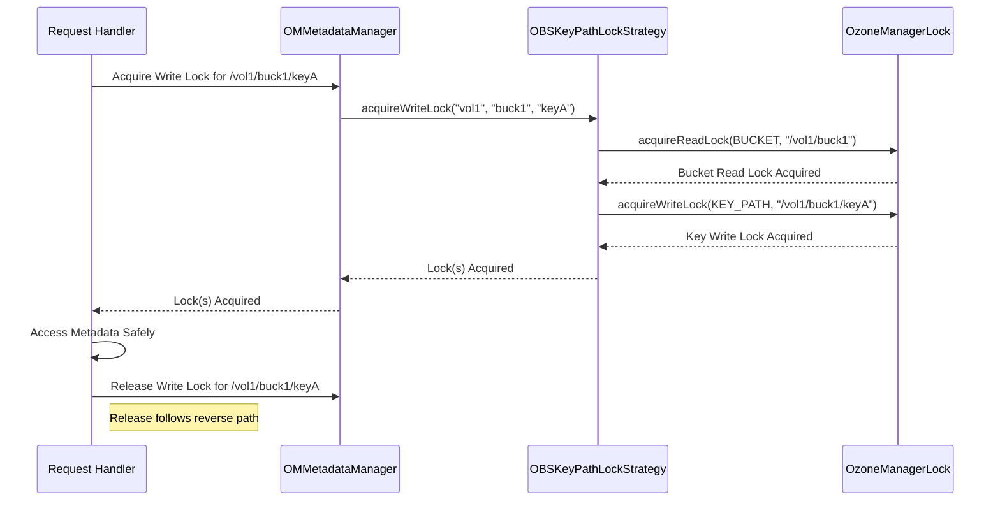

# Chapter 5: OM Locking Strategy

In [Chapter 4: OM Request Handling (Write Path)](04_om_request_handling__write_path__.md), we saw how the Ozone Manager (OM) processes requests that change the system's state, like creating a file. It prepares the request, uses Ratis for agreement, and updates the metadata.

But what happens if two different requests try to modify the *same* piece of metadata at the *exact same time*? Imagine two users trying to rename the same file (`data.txt`) simultaneously – one wants to rename it to `report.txt`, and the other wants to rename it to `archive.txt`. If both operations proceed without coordination, the final state could be unpredictable, inconsistent, or even corrupted!

To prevent this chaos, the OM needs a mechanism to ensure that only one operation modifies a specific piece of metadata at a time, while still allowing multiple operations to *read* non-conflicting information concurrently. This is where the **OM Locking Strategy** comes in.

## The Traffic Light Analogy: Controlling Access

Think of the OM's metadata (like volume info, bucket settings, key details) as a shared resource, like a single-lane road or a busy intersection. If multiple cars (requests) try to use it simultaneously without rules, you'll have collisions (data corruption).

The **OM Locking Strategy** acts like a traffic light system for accessing metadata:

1.  **Green Light (Read Lock):** If multiple cars just want to *look* at the intersection (read metadata), they can often do so simultaneously without causing problems. A "Read Lock" allows multiple requests to read the same resource concurrently.
2.  **Red Light (Write Lock):** If a car needs to *change* something at the intersection (modify metadata, like renaming a file or updating bucket properties), it needs exclusive access. A "Write Lock" ensures that only *one* request can modify the resource at a time. While one request holds the write lock (red light), all other requests wanting to read or write that specific resource must wait.

This system prevents conflicting operations from interfering with each other and keeps the metadata consistent.

## How Much to Lock? Granularity Matters

Now, imagine our shared resource isn't just one intersection, but a whole library (representing the OM's metadata). When someone needs to modify something, do we lock the *entire* library, or just the specific shelf or book they are working on? This is the concept of **Lock Granularity**.

OM uses different granularities depending on the situation:

1.  **Bucket Lock (`RegularBucketLockStrategy`):** This is like locking an entire floor of the library whenever someone wants to change *any* book on that floor. If you want to rename `key_A` in `bucket_X`, this strategy locks all of `bucket_X`. While this lock is held, *no other operation* (read or write) can happen on *any* key within `bucket_X`.
    *   **Pros:** Simpler to implement and manage.
    *   **Cons:** Can significantly reduce performance, as unrelated operations within the same bucket (like renaming `key_B` while `key_A` is being renamed) are blocked.

2.  **Key Path Lock (`OBSKeyPathLockStrategy`):** This is like locking only the specific shelf or even the specific book being modified. If you want to rename `key_A` in `bucket_X`, this strategy attempts to lock *only* the path related to `key_A`. Other operations on different keys (like `key_B`) within the same `bucket_X` can proceed concurrently.
    *   **Pros:** Allows much higher concurrency and performance within a bucket, as unrelated operations don't block each other.
    *   **Cons:** More complex to implement correctly. It often involves locking the specific key path for writing *and* taking a read lock on the parent bucket to ensure the bucket itself isn't deleted or drastically changed during the key operation.

## Choosing the Right Strategy: `OzoneLockProvider`

How does OM decide whether to lock the whole "floor" (bucket) or just the "shelf" (key path)? This decision is made by the `OzoneLockProvider`, based on two main factors:

1.  **Bucket Layout:** Buckets can have different internal structures ([Chapter 1: OM Metadata Management](01_om_metadata_management_.md)).
    *   `OBJECT_STORE` (OBS) layout: Designed like a flat key-value store. Key path locking is generally more suitable here.
    *   `LEGACY` or `FILE_SYSTEM_OPTIMIZED` (FSO) layouts: Have directory structures. The best locking strategy might depend on configuration.
2.  **Configuration:** Administrators can configure OM settings like `ozone.om.key.path.locking.enabled`.

The `OzoneLockProvider` looks at the bucket's layout and the OM configuration to determine which `OzoneLockStrategy` implementation (`RegularBucketLockStrategy` or `OBSKeyPathLockStrategy`) to use for operations within that bucket.

```java
// File: src/main/java/org/apache/hadoop/ozone/om/lock/OzoneLockProvider.java

public class OzoneLockProvider {

    private boolean keyPathLockEnabled; // Is key path locking enabled in config?
    // ... other config flags ...

    public OzoneLockProvider(boolean keyPathLockEnabled, /* ... */) {
        this.keyPathLockEnabled = keyPathLockEnabled;
        // ...
    }

    // Decides which strategy to use for a given bucket layout
    public OzoneLockStrategy createLockStrategy(BucketLayout bucketLayout) {

        // If key path locking is globally enabled...
        if (keyPathLockEnabled) {
            // ...and the bucket uses the OBJECT_STORE layout...
            if (bucketLayout == BucketLayout.OBJECT_STORE) {
                // ...then use the fine-grained key path locking strategy.
                return new OBSKeyPathLockStrategy();
            }
            // ... or handle specific legacy cases ...
        }

        // Otherwise (or for other layouts by default), use the simpler
        // strategy of locking the entire bucket.
        return new RegularBucketLockStrategy();
    }
}
```

*This code shows how `OzoneLockProvider` checks configuration (`keyPathLockEnabled`) and the bucket's layout (`bucketLayout`) to decide whether to return an `OBSKeyPathLockStrategy` (fine-grained) or a `RegularBucketLockStrategy` (coarse-grained).*

## How Locks Are Used in Request Handling

Before an OM request handler (like those discussed in [Chapter 4: OM Request Handling (Write Path)](04_om_request_handling__write_path__.md)) performs an operation that reads or modifies metadata, it needs to acquire the appropriate lock(s).

1.  **Determine Strategy:** The handler often knows the volume and bucket names. It might implicitly use the strategy associated with that bucket (determined by `OzoneLockProvider`).
2.  **Acquire Lock:** It calls methods like `acquireWriteLock` or `acquireReadLock` via the `OMMetadataManager`'s lock interface, specifying the resource (volume, bucket, key). The chosen strategy handles the actual locking.
3.  **Access Metadata:** Once the lock is acquired, the handler can safely read or write to the metadata cache ([Chapter 1: OM Metadata Management](01_om_metadata_management_.md)).
4.  **Release Lock:** After the metadata access is complete (or the request processing finishes), the handler *must* release the lock using `releaseWriteLock` or `releaseReadLock`, allowing other waiting requests to proceed.

This acquire-access-release pattern ensures that the critical section where metadata is accessed is protected. Locks are typically acquired *before* submitting the request to Ratis (on the leader OM) to ensure the state being submitted is consistent, and they are definitely used within the `validateAndUpdateCache` method (executed on all OMs after Ratis consensus) to protect the final metadata cache update.

Let's look at how a strategy might acquire locks:

**Example: Regular Bucket Lock Strategy (Locking the whole "floor")**

```java
// File: src/main/java/org/apache/hadoop/ozone/om/lock/RegularBucketLockStrategy.java

public class RegularBucketLockStrategy implements OzoneLockStrategy {

    @Override
    public OMLockDetails acquireWriteLock(OMMetadataManager omMetadataManager,
                                  String volumeName, String bucketName,
                                  String keyName) throws IOException {
        // Validate the bucket exists first
        OMFileRequest.validateBucket(omMetadataManager, volumeName, bucketName);

        // Acquire a WRITE lock on the BUCKET resource.
        // Note: keyName is ignored here, we lock the whole bucket.
        return omMetadataManager.getLock()
            .acquireWriteLock(OzoneManagerLock.Resource.BUCKET_LOCK,
                              volumeName, bucketName);
    }

    @Override
    public OMLockDetails releaseWriteLock(OMMetadataManager omMetadataManager,
                               String volumeName, String bucketName,
                               String keyName) {
        // Release the WRITE lock on the BUCKET resource.
        return omMetadataManager.getLock()
            .releaseWriteLock(OzoneManagerLock.Resource.BUCKET_LOCK,
                              volumeName, bucketName);
    }
    // ... similar methods for acquire/release ReadLock ...
}
```

*This strategy is simple: when asked for a write lock (even for a specific key), it locks the entire bucket using `acquireWriteLock` on `BUCKET_LOCK`. It ignores the `keyName`.*

**Example: OBS Key Path Lock Strategy (Locking the "shelf")**

```java
// File: src/main/java/org/apache/hadoop/ozone/om/lock/OBSKeyPathLockStrategy.java

public class OBSKeyPathLockStrategy implements OzoneLockStrategy {

    @Override
    public OMLockDetails acquireWriteLock(OMMetadataManager omMetadataManager,
                                  String volumeName, String bucketName,
                                  String keyName) throws IOException {
        // Validate the bucket exists first
        OMFileRequest.validateBucket(omMetadataManager, volumeName, bucketName);

        // 1. Acquire a READ lock on the BUCKET first.
        //    Prevents the bucket from being deleted while we operate on the key.
        OMLockDetails omLockDetails = omMetadataManager.getLock().acquireReadLock(
            OzoneManagerLock.Resource.BUCKET_LOCK, volumeName, bucketName);

        // 2. Acquire a WRITE lock on the specific KEY_PATH resource.
        omLockDetails.merge(omMetadataManager.getLock()
            .acquireWriteLock(OzoneManagerLock.Resource.KEY_PATH_LOCK,
                              volumeName, bucketName, keyName));

        // Return details about both locks acquired
        return omLockDetails;
    }

    @Override
    public OMLockDetails releaseWriteLock(OMMetadataManager omMetadataManager,
                               String volumeName, String bucketName,
                               String keyName) {
        // 1. Release the WRITE lock on the KEY_PATH.
        OMLockDetails omLockDetails = omMetadataManager.getLock()
            .releaseWriteLock(OzoneManagerLock.Resource.KEY_PATH_LOCK,
                              volumeName, bucketName, keyName);
        // 2. Release the READ lock on the BUCKET.
        omLockDetails.merge(omMetadataManager.getLock()
            .releaseReadLock(OzoneManagerLock.Resource.BUCKET_LOCK,
                             volumeName, bucketName));
        return omLockDetails;
    }
    // ... similar methods for acquire/release ReadLock ...
}
```

*This strategy is more complex. To get a write lock on a key path, it first takes a *read* lock on the parent bucket (ensuring the bucket stays consistent) and *then* takes a *write* lock specifically on the key path. It needs to manage and release both locks.*

## Internal Implementation: How Locking Works

Under the hood, the `OzoneManagerLock` class manages the actual locks. It likely uses standard Java concurrency utilities (like `ReentrantReadWriteLock`) mapped to specific resource names (e.g., `/volumeName/bucketName` for bucket locks, or `/volumeName/bucketName/keyName` for key path locks).

1.  **Request Needs Lock:** An OM request handler determines it needs, say, a write lock for `/vol1/buck1/keyA`.
2.  **Identify Strategy:** It uses the `OMMetadataManager` which knows (via `OzoneLockProvider`) that `buck1` uses `OBSKeyPathLockStrategy`.
3.  **Call Strategy:** The handler calls `metadataManager.getLock().acquireWriteLock("vol1", "buck1", "keyA")`, potentially indirectly via the strategy interface.
4.  **Strategy Executes:** The `OBSKeyPathLockStrategy.acquireWriteLock` method runs.
5.  **Acquire Bucket Read Lock:** It asks `OzoneManagerLock` for a *read* lock on resource `/vol1/buck1`. `OzoneManagerLock` grants it (assuming no conflicting write lock exists).
6.  **Acquire Key Write Lock:** It asks `OzoneManagerLock` for a *write* lock on resource `/vol1/buck1/keyA`. `OzoneManagerLock` grants it (assuming no other lock exists on this specific key path).
7.  **Lock Acquired:** The strategy returns success to the handler.
8.  **Critical Section:** The handler performs its metadata operations.
9.  **Release Locks:** The handler calls `releaseWriteLock`, which triggers the strategy to release both the key path write lock and the bucket read lock via `OzoneManagerLock`.

Here's a simplified diagram of acquiring a write lock using the key path strategy:



## Conclusion

The **OM Locking Strategy** is crucial for ensuring data consistency within a single Ozone Manager instance when multiple requests try to access or modify shared metadata concurrently. By using **Read Locks** and **Write Locks** with different **Granularities** (Bucket vs. Key Path), OM balances safety and performance. The `OzoneLockProvider` selects the appropriate strategy (`RegularBucketLockStrategy` or `OBSKeyPathLockStrategy`) based on bucket layout and configuration. Request handlers acquire locks before accessing metadata and release them afterwards, preventing race conditions and corruption.

While locking ensures consistency within one OM's memory, how do we ensure that changes agreed upon by the OM cluster are applied reliably and in the same order across *all* OM nodes, even if failures occur? That's the role of the replication layer we glimpsed in Chapter 4.

**Next:** [Chapter 6: Ratis State Machine & Replication](06_ratis_state_machine___replication_.md)

---

Generated by [AI Codebase Knowledge Builder](https://github.com/The-Pocket/Tutorial-Codebase-Knowledge)