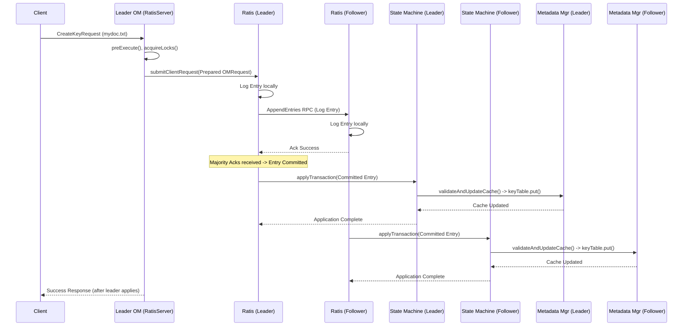

# Chapter 6: Ratis State Machine & Replication

In [Chapter 5: OM Locking Strategy](05_om_locking_strategy_.md), we learned how the Ozone Manager (OM) uses locks to prevent conflicts when multiple requests try to access the same metadata *within a single OM*. Locks ensure consistency inside one OM's memory.

But Ozone Manager is often deployed in a High Availability (HA) setup with multiple OM nodes working together. How do we guarantee that a change made on one OM (the leader) is safely and consistently applied to all other OMs (the followers)? What happens if the leader crashes right after telling the client "OK, file created!" but before the followers know about it?

This is where **Ratis State Machine & Replication** comes in. It's the mechanism that ensures all OM nodes agree on the changes and apply them in the exact same order, making the OM cluster fault-tolerant.

## The Problem: Keeping Multiple OMs In Sync

Imagine our digital library has multiple head librarians (OMs) for reliability. If one librarian gets sick (crashes), another can take over. But how do we ensure they all have the exact same, up-to-date catalog?

**Use Case:** Alice sends a request to create a file `mydoc.txt` in `/vol1/buck1`. This request goes to the current *leader* OM (say, OM1). OM1 needs to make sure:

1.  The instruction to create `mydoc.txt` is reliably saved.
2.  All other active librarians (OM2, OM3) receive the *exact same* instruction.
3.  All librarians record this instruction (and perform the action) in the *same order* relative to other requests (like someone else deleting `/vol1/buck1` at the same time).
4.  Only after a majority of librarians have securely noted the instruction can we confirm back to Alice that the file is created.

Without a robust system, the catalogs (OM metadata state) could easily diverge, leading to chaos!

**Analogy:** Think of a group of highly meticulous notary publics working in different offices. When a new official document (an OM write request) needs to be registered, they don't just stamp their local copy. They use a secure, coordinated process (Ratis) to ensure:
*   Every notary receives the exact same document text.
*   They all agree on the official timestamp (order) for this document relative to others.
*   A majority of notaries must confirm they have logged the document before it's considered officially registered.
*   Each notary's assistant (the State Machine) then takes the officially logged document and updates their local records (the OM state).

This ensures all offices have identical, officially recognized records.

## Key Concepts

This system relies on two core components working together:

1.  **Apache Ratis (The Consensus Protocol):** Ratis is a library that implements the Raft consensus algorithm. Its job is to get a group of servers (the OMs in our case) to agree on a sequence of operations, even if some servers fail or messages are delayed.
    *   **Role:** It acts like the chief notary coordinating the process. It takes proposed changes (OM write requests), assigns them an order, replicates them to the other OMs (followers), and collects votes. Once a majority agrees, the change is considered "committed".
    *   **Output:** A reliable, ordered log of committed operations (OMRequests).

2.  **OzoneManagerStateMachine (The State Applier):** This component lives *inside each* OM node. It receives the stream of committed log entries from Ratis. Its job is to take each committed operation and actually apply it to that OM's local metadata.
    *   **Role:** It's like the assistant in each notary office. It takes the committed log entry (the officially stamped instruction from Ratis) and performs the update on the local records (the OM's metadata cache, managed by [OM Metadata Management](01_om_metadata_management_.md)).
    *   **Input:** Committed log entries from Ratis.
    *   **Action:** Executes the `validateAndUpdateCache` method of the corresponding request handler ([Chapter 4: OM Request Handling (Write Path)](04_om_request_handling__write_path_.md)).

## How Ratis and the State Machine Solve the Use Case

Let's revisit Alice creating `mydoc.txt` in an HA cluster:

1.  **Request to Leader:** Alice's client sends the `CreateKeyRequest` to the current leader OM (OM1).
2.  **Leader Pre-Execution:** OM1 receives the request. As described in [Chapter 4: OM Request Handling (Write Path)](04_om_request_handling__write_path_.md), it runs `preExecute` (generates Object ID, allocates blocks, checks permissions) and acquires necessary locks ([Chapter 5: OM Locking Strategy](05_om_locking_strategy_.md)). This results in a prepared `OMRequest` protobuf message.
3.  **Submit to Ratis:** The leader OM's `OzoneManagerRatisServer` component takes this prepared `OMRequest` and submits it to its local Ratis instance.

    ```java
    // Simplified Concept: OzoneManagerRatisServer#submitRequest
    public OMResponse submitRequest(OMRequest omRequest) throws ServiceException {
        // 1. Create a RaftClientRequest containing the OMRequest message
        RaftClientRequest raftClientRequest = createRaftRequest(omRequest);

        // 2. Submit it to the Ratis server for consensus and replication
        RaftClientReply raftClientReply = submitRequestToRatis(raftClientRequest);

        // 3. Process the reply from Ratis (handles success/failure/NotLeader)
        return createOmResponse(omRequest, raftClientReply);
    }
    ```
    *This shows the leader OM packaging the request and sending it into the Ratis system.*

4.  **Ratis Consensus:**
    *   Ratis on OM1 assigns a log index to the request and writes it to its local persistent log.
    *   Ratis sends this log entry to the Ratis instances on the follower OMs (OM2, OM3).
    *   Followers write the entry to their logs and acknowledge back to the leader.
    *   Once OM1 receives acknowledgements from a majority of OMs (e.g., itself and OM2), the log entry is marked as "committed".

5.  **State Machine Application:**
    *   The Ratis instance on *each* OM (OM1, OM2, OM3) now delivers the *committed* log entry to its local `OzoneManagerStateMachine`.
    *   The `OzoneManagerStateMachine` receives the entry via its `applyTransaction` method.

    ```java
    // File: src/main/java/org/apache/hadoop/ozone/om/ratis/OzoneManagerStateMachine.java

    @Override
    public CompletableFuture<Message> applyTransaction(TransactionContext trx) {
        try {
            // 1. Get the OMRequest from the transaction context
            //    (already deserialized on leader, needs deserialization on followers)
            final OMRequest request = getOMRequestFromContext(trx.getStateMachineContext(), trx);
            final TermIndex termIndex = TermIndex.valueOf(trx.getLogEntry()); // Get log index

            LOG.debug("{}: applyTransaction {}", getId(), termIndex);

            // 2. Define the execution context (mainly the log index)
            ExecutionContext context = ExecutionContext.of(termIndex.getIndex(), termIndex);

            // 3. Use the handler to find the right OMClientRequest object
            //    and call its validateAndUpdateCache method.
            //    This runs the actual logic (e.g., OMKeyCreateRequest#validateAndUpdateCache)
            final OMClientResponse omClientResponse = handler.handleWriteRequest(
                request, context, ozoneManagerDoubleBuffer);

            // 4. Add the response (containing results and status) to the DoubleBuffer
            //    The double buffer batches writes to RocksDB and updates the last applied index.
            //    (Handled inside handler.handleWriteRequest -> response.addToDBBatch)

            // 5. Prepare the response message for Ratis
            return CompletableFuture.completedFuture(
                OMRatisHelper.convertResponseToMessage(omClientResponse.getOMResponse()));

        } catch (Exception e) {
            // Handle errors, potentially terminating OM on critical failure
            return completeExceptionally(e);
        }
    }
    ```
    *This `applyTransaction` method is the bridge between Ratis consensus and the OM's application logic. It takes the committed request and triggers the metadata update.*

6.  **Metadata Update:** Inside `applyTransaction`, the call to `handler.handleWriteRequest` eventually executes `OMKeyCreateRequest.validateAndUpdateCache`. This method, running on *each* OM, updates the in-memory metadata cache ([OM Metadata Management](01_om_metadata_management_.md)) by adding the entry for `mydoc.txt`. Since every OM processes the same committed log entries in the same Ratis-defined order, their metadata states remain consistent.
7.  **Response to Client:** The leader OM (OM1), having received confirmation from Ratis that the request was committed and applied locally, sends a success response back to Alice's client (details in [Chapter 7: OM Client Response Handling](07_om_client_response_handling_.md)).

Even if OM3 was temporarily down, the request would be committed once OM1 and OM2 logged it. When OM3 comes back up, Ratis ensures it catches up on the missed log entries and applies them via its State Machine, bringing its state back in sync.

## Internal Implementation: The Flow Through Ratis

Let's visualize the journey of the write request:



**Key Steps Under the Hood:**

1.  **Submission:** The leader OM packages the `OMRequest` into a `RaftClientRequest` and sends it to its local `RaftServer` instance (`OzoneManagerRatisServer`).
2.  **Raft Log:** The leader's Ratis `RaftServer` writes the request to its durable log file and assigns it a unique `TermIndex` (a combination of leader term and log index).
3.  **Replication:** The leader sends `AppendEntries` RPCs containing the log entry to all follower Ratis servers.
4.  **Follower Log:** Followers receive the RPC, validate it, write the entry to their own logs, and send an acknowledgement back.
5.  **Commit:** Once the leader receives acknowledgements from a majority of servers, it knows the entry is safely replicated and marks it as "committed". It updates its "commit index". Followers learn about the commit index in subsequent `AppendEntries` RPCs.
6.  **State Machine Delivery:** As Ratis advances its "last applied index" (the index up to which committed entries have been processed), it delivers newly committed entries sequentially to the registered `OzoneManagerStateMachine` via the `applyTransaction` method.
7.  **Application:** The `OzoneManagerStateMachine` deserializes the `OMRequest` from the log entry (if needed) and invokes the correct handler (e.g., `OMKeyCreateRequest`) to execute `validateAndUpdateCache`.
8.  **DB Persistence (Double Buffer):** The `validateAndUpdateCache` method typically adds its changes to a `OzoneManagerDoubleBuffer`. This buffer batches the metadata changes (along with the latest applied `TermIndex`) and writes them asynchronously to the underlying RocksDB store for persistence. This batching improves performance.

    ```java
    // File: src/main/java/org/apache/hadoop/ozone/om/ratis/OzoneManagerDoubleBuffer.java
    // Simplified concept: Adding an entry after validateAndUpdateCache completes

    public synchronized void add(OMClientResponse response, TermIndex termIndex) {
        // Add the response (which knows how to update the DB) and its term/index
        currentBuffer.add(new Entry(termIndex, response));
        // Notify the background flush thread that there's work to do
        notify();
    }

    // Simplified concept: Background thread flushing the buffer
    private void flushTransactions() {
        while (isRunning.get() && canFlush()) {
            // 1. Swap buffers (current becomes ready)
            swapCurrentAndReadyBuffer();

            // 2. Process the readyBuffer
            Queue<Entry> bufferToFlush = readyBuffer;
            TermIndex lastIndexInBatch = null;
            try (BatchOperation batch = omMetadataManager.getStore().initBatchOperation()) {
                // 3. Add all operations in the buffer to a single RocksDB batch
                for (Entry entry : bufferToFlush) {
                     entry.getResponse().checkAndUpdateDB(omMetadataManager, batch); // Add to batch
                     lastIndexInBatch = entry.getTermIndex();
                }
                // 4. Add the last applied transaction info to the batch
                omMetadataManager.getTransactionInfoTable().putWithBatch(
                     batch, TRANSACTION_INFO_KEY, TransactionInfo.valueOf(lastIndexInBatch));

                // 5. Commit the batch to RocksDB
                omMetadataManager.getStore().commitBatchOperation(batch);

            } catch (IOException ex) { /* ... handle error ... */ }

            // 6. Update the state machine's last applied index tracker
            if (lastIndexInBatch != null) {
                updateLastAppliedIndex.accept(lastIndexInBatch);
            }
            // ... cleanup, notify ...
        }
    }
    ```
    *The `OzoneManagerDoubleBuffer` plays a crucial role in efficiently persisting the changes applied by the State Machine and keeping track of the latest applied transaction index.*

9.  **Last Applied Index:** The `OzoneManagerStateMachine` keeps track of the `TermIndex` of the last transaction it successfully applied (after it's flushed by the double buffer). This index is critical for Ratis to know the state machine's progress and for taking snapshots.

## Conclusion

The combination of **Ratis** and the **OzoneManagerStateMachine** is the foundation of Ozone Manager's High Availability. Ratis provides the mechanism for OMs to reliably **agree** on the order of operations (write requests) and **replicate** them durably as a log. The State Machine on each OM then **applies** these committed log entries to the local metadata cache in the agreed-upon order. This ensures that even with failures, all running OMs maintain a consistent view of the filesystem's metadata.

Now that we understand how a write request is processed, replicated, and applied consistently across the OM cluster, how does the result get back to the original client?

**Next:** [Chapter 7: OM Client Response Handling](07_om_client_response_handling_.md)

---

Generated by [AI Codebase Knowledge Builder](https://github.com/The-Pocket/Tutorial-Codebase-Knowledge)