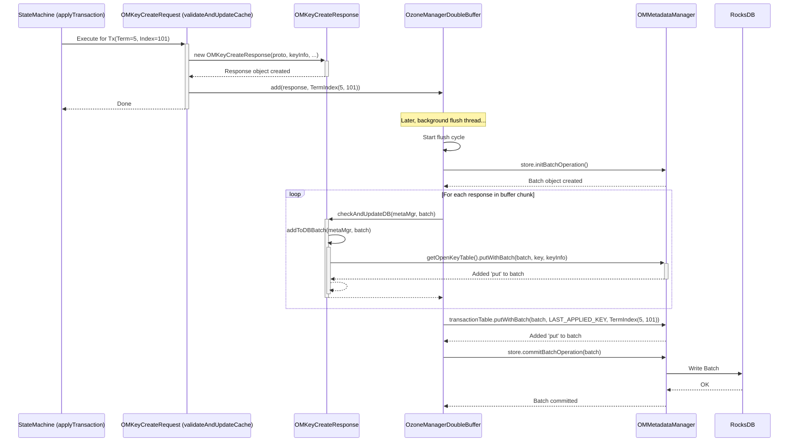

# Chapter 7: OM Client Response Handling

Welcome back! In [Chapter 6: Ratis State Machine & Replication](06_ratis_state_machine___replication_.md), we saw how the Ozone Manager (OM) uses Ratis to ensure all OM nodes agree on the order of operations (like creating a file) and how the State Machine applies these changes consistently to each OM's *in-memory* metadata cache.

But wait, there's one more crucial step! Just because the change is agreed upon and applied in memory doesn't mean it's permanently saved to disk (the RocksDB database). Also, the request handler created a response message (like "Success! File created with these details...") during the State Machine step. How does this response translate into a permanent database update?

That's the job of **OM Client Response Handling**. This part focuses on what happens *after* the State Machine decides on the outcome of a request. It ensures the necessary changes reflecting the operation's result are written durably to the OM's persistent database (RocksDB).

## The Problem: Finalizing the Change

Imagine our library analogy again. The head librarians (OMs) have used their secure communication system (Ratis) to agree that a new book entry (`mydoc.txt`) should be added to the catalog (metadata). The librarian's assistant (State Machine) has updated the temporary daily log sheet (in-memory cache) on their desk.

**Use Case:** Alice created `mydoc.txt`. Ratis committed the "Create Key" operation. The State Machine on each OM called `OMKeyCreateRequest.validateAndUpdateCache()`, which updated the in-memory view of the `keyTable` and generated a success `OMResponse` message.

**The Challenge:**

1.  **Persistence:** The change is only in memory! If the OM crashes now, the record of `mydoc.txt` might be lost. We need to write it to the main, permanent library catalog (RocksDB).
2.  **Linking Result and Action:** How do we connect the *result* decided by the State Machine (e.g., success, here's the new key info) with the specific database *actions* needed to make that result permanent?

**Analogy:** The librarian's assistant has the approved "Add Book" form (the `OMResponse`) and the updated daily log sheet (in-memory cache). They need a formal process to take this form and use it to officially update the library's main, permanent card catalog (RocksDB), ensuring the correct drawer (`keyTable`) and card details (`OmKeyInfo`) are used.

## The Solution: `OMClientResponse` Objects

The Ozone Manager uses a clever design pattern. When the request handler runs inside the State Machine (the `validateAndUpdateCache` method from Chapter 4 and 6), it doesn't just update the in-memory cache and create a response message. It bundles these together into a special object called an **`OMClientResponse`**.

**What is `OMClientResponse`?**

It's a Java object that holds two key things:

1.  **The Result:** The actual `OMResponse` protobuf message (containing success/failure status and any data for the client).
2.  **The Persistence Logic:** A method (`addToDBBatch`) that knows exactly how to write the necessary changes for *this specific operation* to the RocksDB database.

Think of `OMClientResponse` as the official "Update Form" that contains both the outcome details *and* instructions on how to file it correctly in the permanent records.

Different types of operations have different response objects:

*   `OMKeyCreateResponse`: Knows how to add the new key info to the `keyTable`.
*   `OMBucketCreateResponse`: Knows how to add the new bucket info to the `bucketTable`.
*   `OMVolumeCreateResponse`: Knows how to add the new volume info to the `volumeTable`.
*   ...and many more!

## Key Components and How They Work

1.  **`OMClientResponse` Abstract Class:** This defines the basic structure.

    ```java
    // File: src/main/java/org/apache/hadoop/ozone/om/response/OMClientResponse.java

    // Abstract class, the parent for all specific response handlers
    public abstract class OMClientResponse {

        // Holds the actual protobuf response message
        private final OMResponse omResponse;

        public OMClientResponse(OMResponse omResponse) {
            // ... constructor ...
            this.omResponse = omResponse;
        }

        // Returns the protobuf response message
        public OMResponse getOMResponse() {
            return omResponse;
        }

        /**
         * Check if omResponse status is OK. If yes, add to DB.
         * This method is called later when flushing to disk.
         */
        public void checkAndUpdateDB(OMMetadataManager omMetadataManager,
            BatchOperation batchOperation) throws IOException {
            // Only update DB if the operation was successful
            if (omResponse.getStatus() == Status.OK) {
                addToDBBatch(omMetadataManager, batchOperation);
            }
        }

        /**
         * The core method! Each specific response class implements this
         * to write its changes to the database batch.
         */
        protected abstract void addToDBBatch(OMMetadataManager omMetadataManager,
            BatchOperation batchOperation) throws IOException;

        // ... other helper methods ...
    }
    ```

    *   This abstract class ensures every response object holds the final `OMResponse` protobuf and defines the contract for `addToDBBatch`, which handles the database update logic.*

2.  **Concrete Implementations (e.g., `OMKeyCreateResponse`):** Each specific response type implements `addToDBBatch`.

    ```java
    // File: src/main/java/org/apache/hadoop/ozone/om/response/key/OMKeyCreateResponse.java

    // Specific response for Create Key operations
    // Uses @CleanupTableInfo to hint which tables are affected (for cache invalidation)
    @CleanupTableInfo(cleanupTables = {OPEN_KEY_TABLE, KEY_TABLE, BUCKET_TABLE})
    public class OMKeyCreateResponse extends OmKeyResponse { // Extends OMClientResponse indirectly

        private OmKeyInfo omKeyInfo; // Holds the details of the key being created
        private long openKeySessionID; // ID for the temporary "open key" entry
        // ... other fields like parent dir info, bucket info ...

        // Constructor called by OMKeyCreateRequest.validateAndUpdateCache
        public OMKeyCreateResponse(@Nonnull OMResponse omResponse, // The proto response
            @Nonnull OmKeyInfo omKeyInfo, // The key info to persist
            /*... other args ...*/) {
            super(omResponse, /* bucketLayout */);
            this.omKeyInfo = omKeyInfo;
            // ... set other fields ...
        }

        // ** The logic to persist the key creation **
        @Override
        public void addToDBBatch(OMMetadataManager omMetadataManager,
            BatchOperation batchOperation) throws IOException {

            // 1. Add parent directory entries if they were created (FSO layout)
            // ... (code to add parentKeyInfos to keyTable) ...

            // 2. Update bucket usage/quota info in bucketTable
            // ... (code to update omBucketInfo in bucketTable) ...

            // 3. Add the key entry to the "openKeyTable". It will be moved to
            //    the main keyTable when the client commits the key write later.
            //    (Simplified: sometimes it might go directly to keyTable)
            String openKey = omMetadataManager.getOpenKey(omKeyInfo.getVolumeName(),
                 /*...,*/ openKeySessionID);
            omMetadataManager.getOpenKeyTable(getBucketLayout())
                .putWithBatch(batchOperation, openKey, omKeyInfo); // Add to RocksDB batch
        }
    }
    ```

    *   This concrete class `OMKeyCreateResponse` is created when a key is successfully processed by the State Machine. Its `addToDBBatch` method contains the precise instructions to add the necessary entries (like the open key record) into a RocksDB batch operation.*

3.  **The `OzoneManagerDoubleBuffer`:** As mentioned in [Chapter 6: Ratis State Machine & Replication](06_ratis_state_machine___replication_.md), the State Machine doesn't write directly to RocksDB. It adds the generated `OMClientResponse` object to a double buffer. A background thread then processes this buffer:
    *   It takes a batch of `OMClientResponse` objects.
    *   It creates a single RocksDB `BatchOperation`.
    *   For each `OMClientResponse` in the batch, it calls `response.checkAndUpdateDB(omMetadataManager, batchOperation)`.
    *   If the response status is `OK`, `checkAndUpdateDB` calls the specific `addToDBBatch` method (like the one in `OMKeyCreateResponse`), which adds the required database puts/deletes to the `batchOperation`.
    *   After processing all responses in the batch, the Double Buffer commits the entire `batchOperation` to RocksDB in one go.
    *   It also writes the `TermIndex` of the last transaction in the batch to a special place in RocksDB, marking the persistent state's progress.

## The Flow: From State Machine to RocksDB

Let's trace Alice's `CreateKeyRequest` focusing on the response handling part:

1.  **Ratis Commits:** Ratis commits the `CreateKeyRequest` transaction (Log Entry #101, Term 5).
2.  **State Machine Applies:** `OzoneManagerStateMachine.applyTransaction` receives the committed entry. It calls `OMKeyCreateRequest.validateAndUpdateCache`.
3.  **Response Object Created:** `validateAndUpdateCache` updates the in-memory cache and creates an `OMKeyCreateResponse` object containing the success `OMResponse` protobuf and the `OmKeyInfo` for `mydoc.txt`.
4.  **Added to Double Buffer:** The `OMKeyCreateResponse` object is added to the `OzoneManagerDoubleBuffer` along with its transaction coordinates (`TermIndex` = Term 5, Index 101).
5.  **Background Flush:** Later, the Double Buffer's background thread wakes up. It prepares to flush the buffer containing Alice's response (and maybe others).
6.  **Batch Creation:** It creates a new RocksDB `BatchOperation`.
7.  **`addToDBBatch` Called:** The thread calls `checkAndUpdateDB` on Alice's `OMKeyCreateResponse`. Since the status is OK, this calls `OMKeyCreateResponse.addToDBBatch`.
8.  **Database Operations Queued:** `addToDBBatch` interacts with the `OMMetadataManager` ([Chapter 1: OM Metadata Management](01_om_metadata_management_.md)) to add the necessary `put` operations (e.g., adding the entry to `openKeyTable`) *to the batch*. The data isn't written yet, just queued in the batch.
9.  **Batch Commit:** After processing all responses in its current chunk, the Double Buffer thread commits the entire `batchOperation` to RocksDB. Now, the creation of `mydoc.txt` (or at least its initial open key entry) is durable on disk!
10. **Update Applied Index:** The Double Buffer also updates the persistent "last applied transaction index" in RocksDB to 101 (Term 5).

**Diagram:**



This flow ensures that the database state only reflects operations that were successfully processed by the state machine, and it does so efficiently by batching the RocksDB writes. The `OMClientResponse` object acts as the critical link, carrying both the result and the persistence logic from the state machine to the database.

## Conclusion

**OM Client Response Handling**, embodied by the `OMClientResponse` objects and managed by the `OzoneManagerDoubleBuffer`, is the crucial final step in processing a write request. After the State Machine determines the outcome and updates the in-memory cache ([Chapter 6: Ratis State Machine & Replication](06_ratis_state_machine___replication_.md)), the corresponding `OMClientResponse` object is created. This object encapsulates the result *and* the specific logic (`addToDBBatch`) needed to permanently record the change in RocksDB ([Chapter 1: OM Metadata Management](01_om_metadata_management_.md)). The Double Buffer ensures these database updates happen reliably and efficiently in the background.

This persistent RocksDB database, containing all the vital metadata, can grow very large over time. How does Ozone manage the size of this database and create backups or points-in-time for recovery? That's the topic of our next chapter.

**Next:** [Chapter 8: OM Snapshots](08_om_snapshots_.md)

---

Generated by [AI Codebase Knowledge Builder](https://github.com/The-Pocket/Tutorial-Codebase-Knowledge)