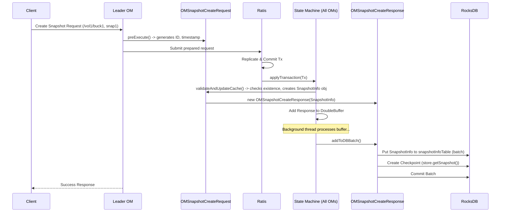
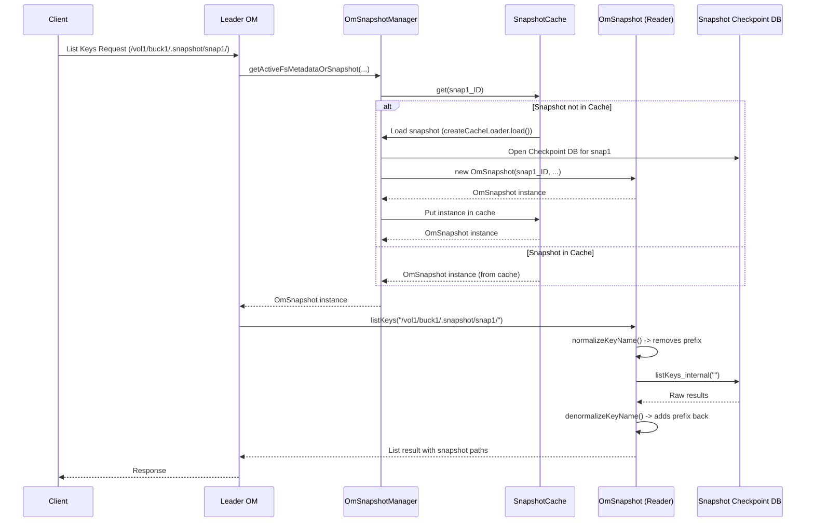

# Chapter 8: OM Snapshots

In [Chapter 7: OM Client Response Handling](07_om_client_response_handling_.md), we saw how the Ozone Manager (OM) reliably writes changes (like creating a file) to its persistent database (RocksDB). This database holds the *current* state of all your volumes, buckets, and keys.

But what if you need to see how things looked *yesterday*? Or what if you accidentally deleted an important directory and need to recover it? Simply having the current state isn't enough for these situations. We need a way to preserve and access past states of our metadata.

This is where **OM Snapshots** come in. They provide a mechanism to capture a point-in-time, read-only view of your Ozone metadata.

## What is an OM Snapshot? The Filesystem Photograph

Imagine you're organizing a huge digital photo album (your Ozone bucket). You're constantly adding, deleting, and renaming photos (keys). An **OM Snapshot** is like taking an instant photograph of your entire album's organization (the metadata – which photos exist, what their names are, which albums they belong to) at a specific moment.

Key characteristics of an OM Snapshot:

1.  **Point-in-Time:** It reflects the exact state of the volume/bucket metadata at the moment the snapshot was taken.
2.  **Read-Only:** You can look at the snapshot (list files, get file info as they were), but you cannot change it. You can't add or delete files within the snapshot itself.
3.  **Metadata Copy:** It's primarily a copy of the *metadata* (the catalog), not the actual data blocks themselves. The data blocks are shared between the live filesystem and snapshots until the live file is modified or deleted.
4.  **Efficient:** Creating a snapshot is typically fast because it leverages the underlying database's (RocksDB) checkpointing features, avoiding a full data copy.

**Analogy:** Think of taking a photo of your library's card catalog at noon on Monday. You can look at that photo later to see exactly which books were on which shelves *at that specific time*. You can't use the photo to check out a book, and adding new books to the library won't change your photograph.

## Why Use Snapshots?

Snapshots are incredibly useful for several reasons:

*   **Data Recovery:** If you accidentally delete files or directories, you can browse a recent snapshot to see what existed and potentially restore the data.
*   **Rollback:** If a bad application deployment corrupts data, you might revert the affected files to the state captured in a snapshot.
*   **Backup:** Snapshots can serve as a consistent point-in-time source for backing up your metadata (and potentially data) to another location.
*   **Historical Analysis:** You might need to analyze data or usage patterns as they existed in the past.
*   **Testing:** You can test applications or upgrades against a static, read-only copy of your production metadata without affecting the live system.

## How Snapshots Work: A Peek Under the Hood

When you request the OM to create a snapshot of a specific bucket (e.g., `/vol1/buck1`), here's a simplified view of what happens:

1.  **Request Received:** The OM receives a "Create Snapshot" request, usually specifying the volume, bucket, and a name for the snapshot (e.g., `snap20231026`).
2.  **Metadata Checkpoint:** The OM tells its underlying RocksDB database (which stores all the metadata) to create a **checkpoint**. A checkpoint is essentially a consistent, frozen copy of the database files at that moment, usually created efficiently using hard links.
3.  **Record Snapshot Info:** The OM creates a record containing metadata *about* the snapshot itself – its name, the volume/bucket it belongs to, its unique ID, the timestamp, and the location of the database checkpoint directory. This record is stored in a special table within the OM's *live* database (often called `snapshotInfoTable`).
4.  **Confirmation:** The OM confirms to the user that the snapshot has been created.

This process is typically very fast because it doesn't involve copying large amounts of data.

## Creating a Snapshot: The Request Flow

Let's look at the specific components involved in creating a snapshot:

1.  **Client Request:** A user issues a command like `ozone sh snapshot create /vol1/buck1 snap20231026`.
2.  **`OMSnapshotCreateRequest`:** The OM receives this command and internally represents it using an `OMSnapshotCreateRequest` object. This object holds the volume, bucket, and desired snapshot name.
3.  **Pre-Execution (`preExecute`):** Before submitting to the Ratis replication log ([Chapter 6: Ratis State Machine & Replication](06_ratis_state_machine___replication_.md)), the `preExecute` method validates the snapshot name, checks permissions (usually only bucket owners or admins can create snapshots), resolves bucket links, and generates a unique UUID and creation timestamp for the snapshot.

    ```java
    // Simplified Concept: OMSnapshotCreateRequest#preExecute
    @Override
    @DisallowedUntilLayoutVersion(FILESYSTEM_SNAPSHOT) // Feature check
    @RequireSnapshotFeatureState(true) // Feature check
    public OMRequest preExecute(OzoneManager ozoneManager) throws IOException {
        final OMRequest omRequest = super.preExecute(ozoneManager);
        // Verify snapshot name format
        OmUtils.validateSnapshotName(snapshotName);

        // Resolve bucket link if needed
        ResolvedBucket bucket = ozoneManager.resolveBucketLink(Pair.of(volumeName, bucketName), this);
        this.volumeName = bucket.realVolume();
        this.bucketName = bucket.realBucket();

        // Check permissions (owner or admin)
        // ... permission check logic ...

        // Generate unique ID and timestamp for the snapshot
        CreateSnapshotRequest.Builder createSnapshotRequest = omRequest
             .getCreateSnapshotRequest().toBuilder()
             .setSnapshotId(toProtobuf(UUID.randomUUID())) // Generate UUID
             .setVolumeName(volumeName) // Use resolved names
             .setBucketName(this.bucketName)
             .setCreationTime(Time.now()); // Record time

        return omRequest.toBuilder()
               .setCreateSnapshotRequest(createSnapshotRequest.build()).build();
    }
    ```
    *   This `preExecute` method prepares the request by adding essential, unique information like the snapshot's UUID and creation time before it gets replicated.*

4.  **Ratis Replication:** The prepared request is replicated via Ratis to ensure all OMs agree to create this snapshot.
5.  **State Machine Application (`validateAndUpdateCache`):** Once committed by Ratis, the request reaches the `validateAndUpdateCache` method on all OMs. This method:
    *   Acquires locks (read lock on the bucket, write lock on the snapshot name) to prevent conflicts ([Chapter 5: OM Locking Strategy](05_om_locking_strategy_.md)).
    *   Checks if a snapshot with the same name already exists.
    *   Creates the `SnapshotInfo` object containing all details (name, ID, timestamp, path, etc.).
    *   Gets the current transaction sequence number from the database, which marks the exact point-in-time.
    *   Estimates the size of the snapshot (based on bucket size).
    *   **Crucially:** Adds the `SnapshotInfo` record to the OM's cache and prepares it for writing to the `snapshotInfoTable` in RocksDB. This happens via the `OMSnapshotCreateResponse`.

    ```java
    // Simplified Concept: OMSnapshotCreateRequest#validateAndUpdateCache
    @Override
    public OMClientResponse validateAndUpdateCache(OzoneManager ozoneManager, ...) {
        // ... acquire locks ...
        OMMetadataManager omMetadataManager = ozoneManager.getMetadataManager();
        String key = snapshotInfo.getTableKey();
        try {
            // Check if snapshot already exists
            if (omMetadataManager.getSnapshotInfoTable().isExist(key)) {
                throw new OMException("Snapshot already exists", FILE_ALREADY_EXISTS);
            }

            // Get the exact DB sequence number for this point-in-time
            final long dbLatestSequenceNumber =
                ((RDBStore) omMetadataManager.getStore()).getDb()
                    .getLatestSequenceNumber();
            snapshotInfo.setDbTxSequenceNumber(dbLatestSequenceNumber);
            snapshotInfo.setLastTransactionInfo(...); // Record Ratis index

            // Estimate size
            OmBucketInfo omBucketInfo = getBucketInfo(...);
            snapshotInfo.setReferencedSize(estimateBucketDataSize(omBucketInfo));

            // Add to snapshot chain (in-memory tracking) & cache
            // This implicitly prepares the response object
            addSnapshotInfoToSnapshotChainAndCache(omMetadataManager, ...);

            // Prepare success response
            omResponse.setCreateSnapshotResponse(...);
            omClientResponse = new OMSnapshotCreateResponse(omResponse.build(), snapshotInfo);

        } catch (IOException | InvalidPathException ex) {
            // Handle errors, create error response
            omClientResponse = new OMSnapshotCreateResponse(createErrorOMResponse(omResponse, ex));
        } finally {
            // Release locks
        }
        return omClientResponse;
    }
    ```
    *   This method performs the final checks, gathers the necessary information for the `SnapshotInfo` record, and prepares the `OMSnapshotCreateResponse` which will handle the database update and checkpoint creation.*

6.  **Response Handling (`OMSnapshotCreateResponse.addToDBBatch`):** The `OMSnapshotCreateResponse` object, generated in the previous step, now takes over. Its `addToDBBatch` method (called by the Double Buffer mechanism described in [Chapter 7: OM Client Response Handling](07_om_client_response_handling_.md)) performs the critical actions:
    *   Writes the `SnapshotInfo` record to the `snapshotInfoTable` in RocksDB.
    *   **Calls `OmSnapshotManager.createOmSnapshotCheckpoint()` which triggers the actual RocksDB checkpoint creation.**
    *   Performs some cleanup of related tables (like the `snapshotRenamedTable`).

    ```java
    // File: src/main/java/org/apache/hadoop/ozone/om/response/snapshot/OMSnapshotCreateResponse.java

    @Override
    public void addToDBBatch(OMMetadataManager omMetadataManager,
        BatchOperation batchOperation) throws IOException {

        // 1. Add the SnapshotInfo record to the database batch
        String key = snapshotInfo.getTableKey();
        omMetadataManager.getSnapshotInfoTable().putWithBatch(batchOperation,
            key, snapshotInfo);

        // 2. Trigger the RocksDB checkpoint creation for the snapshot
        //    This also cleans up related delete tables for the snapshot scope.
        OmSnapshotManager.createOmSnapshotCheckpoint(omMetadataManager,
            snapshotInfo, batchOperation);

        // 3. Clean up other temporary tables related to snapshots
        // ... cleanup logic for snapshotRenamedTable ...
    }
    ```

    ```java
    // File: src/main/java/org/apache/hadoop/ozone/om/OmSnapshotManager.java
    // Simplified Concept: Creating the checkpoint

    public static DBCheckpoint createOmSnapshotCheckpoint(
        OMMetadataManager omMetadataManager, SnapshotInfo snapshotInfo, ...)
        throws IOException {
        RDBStore store = (RDBStore) omMetadataManager.getStore();

        // Generate path for the checkpoint directory
        Path snapshotDirPath = Paths.get(store.getSnapshotsParentDir(),
            /* ... checkpoint directory name from snapshotInfo ... */);

        if (Files.exists(snapshotDirPath)) {
           // Checkpoint might already exist (e.g., retry)
           return new RocksDBCheckpoint(snapshotDirPath);
        } else {
           // ** Ask RocksDB to create the checkpoint **
           DBCheckpoint dbCheckpoint = store.getSnapshot(snapshotInfo.getCheckpointDirName());
           LOG.info("Created checkpoint : {} for snapshot {}",
               dbCheckpoint.getCheckpointLocation(), snapshotInfo.getName());

           // Clean up delete tables in the *live* DB for the snapshotted bucket
           deleteKeysFromDelKeyTableInSnapshotScope(...);
           deleteKeysFromDelDirTableInSnapshotScope(...);

           return dbCheckpoint;
        }
    }
    ```
    *   The `OMSnapshotCreateResponse` ensures the snapshot metadata is saved, and critically, triggers the underlying database checkpoint using `store.getSnapshot()`, making the point-in-time copy persistent.*

## Accessing Snapshot Data: Reading the Past

Once a snapshot is created, how do you access it?

1.  **Special Path:** Ozone often exposes snapshots via a special, hidden directory named `.snapshot` within the bucket. For example, to list files in `snap20231026` of `/vol1/buck1`, you might use a command like `ozone sh key list /vol1/buck1/.snapshot/snap20231026/`.
2.  **`OmSnapshot` Class:** Internally, when the OM receives a request targeting a snapshot path, it uses the `OmSnapshot` class. This class acts as a specialized metadata reader that points to the snapshot's specific RocksDB checkpoint directory instead of the live database.

    ```java
    // File: src/main/java/org/apache/hadoop/ozone/om/OmSnapshot.java
    // Simplified Concept: Constructor

    public OmSnapshot(KeyManager keyManager, /* ... */, String snapshotName, ...) {
        // Get snapshot info, find its checkpoint directory
        SnapshotInfo snapshotInfo = /* ... get SnapshotInfo ... */;
        String checkpointDir = snapshotInfo.getCheckpointDirName();

        // Create a *new* OMMetadataManager pointing to the snapshot's DB dir
        OMMetadataManager snapshotMetadataManager = new OmMetadataManagerImpl(
             /* config */, checkpointDir, /* readOnly */ true, /* ... */);

        // Create KeyManager etc. that use this snapshot metadata manager
        KeyManager snapshotKeyManager = new KeyManagerImpl(..., snapshotMetadataManager, ...);
        PrefixManager snapshotPrefixManager = new PrefixManagerImpl(..., snapshotMetadataManager, ...);

        // Internal reader uses these snapshot-specific managers
        this.omMetadataReader = new OmMetadataReader(snapshotKeyManager, snapshotPrefixManager, ...);
        // Store snapshot details
        this.snapshotName = snapshotName;
        // ... other fields ...
    }
    ```
    *   The `OmSnapshot` class essentially creates a dedicated reader environment connected to the specific RocksDB checkpoint directory associated with that snapshot.*

3.  **Path Normalization/Denormalization:** The `OmSnapshot` class handles the special `.snapshot/snapName` path component.
    *   **Normalization:** When a request like `list /vol1/buck1/.snapshot/snap20231026/data/` comes in, `OmSnapshot` removes the `.snapshot/snap20231026` part before looking up `data/` in the snapshot's database tables.
    *   **Denormalization:** When returning results (like file paths), it adds the `.snapshot/snap20231026` prefix back so the client sees the correct full path within the snapshot.

    ```java
    // File: src/main/java/org/apache/hadoop/ozone/om/OmSnapshot.java
    // Simplified Concept: Normalization/Denormalization

    // Example: Looking up a key within the snapshot
    @Override
    public OmKeyInfo lookupKey(OmKeyArgs args) throws IOException {
        // Remove snapshot prefix from requested key name before internal lookup
        OmKeyArgs normalizedArgs = normalizeOmKeyArgs(args);
        // Perform lookup using the snapshot's metadata reader
        OmKeyInfo result = omMetadataReader.lookupKey(normalizedArgs);
        // Add snapshot prefix back to the key name in the result
        return denormalizeOmKeyInfo(result);
    }

    // Removes ".snapshot/snapName/" prefix
    private String normalizeKeyName(String keyname) {
        if (keyname == null) return null;
        String[] keyParts = keyname.split("/");
        if (OmSnapshotManager.isSnapshotKey(keyParts)) { // Checks for ".snapshot"
            // Join parts after ".snapshot/snapName/"
            return String.join("/", Arrays.copyOfRange(keyParts, 2, keyParts.length));
        }
        return keyname;
    }

    // Adds ".snapshot/snapName/" prefix
    private String denormalizeKeyName(String keyname) {
        if (keyname == null) return null;
        return OmSnapshotManager.getSnapshotPrefix(snapshotName) + keyname;
    }
    ```
    *   This normalization ensures that lookups within the snapshot's database use the original keys, while denormalization presents the correct snapshot-relative paths to the user.*

## Managing Snapshots

Besides creation and reading, OM needs to manage the lifecycle of snapshots:

*   **`OmSnapshotManager`:** This is the central class responsible for coordinating snapshot operations. It holds the cache of active `OmSnapshot` instances (`SnapshotCache`) and interacts with other components.
*   **`SnapshotInfoTable`:** Stores the persistent metadata about each snapshot.
*   **`SnapshotChainManager`:** Maintains an in-memory linked list of snapshots for each bucket and globally. This is crucial for features like Snapshot Diffs (comparing two snapshots) and for efficiently finding the previous/next snapshot.

    ```java
    // Simplified Concept: SnapshotChainManager#addSnapshot
    public synchronized void addSnapshot(SnapshotInfo snapshotInfo) throws IOException {
        // Find the previous snapshot in the global chain
        UUID prevGlobalID = snapshotInfo.getGlobalPreviousSnapshotId();
        // Find the previous snapshot in the bucket's chain (path chain)
        UUID prevPathID = snapshotInfo.getPathPreviousSnapshotId();

        // Link the new snapshot globally
        globalSnapshotChain.put(snapshotInfo.getSnapshotId(), new SnapshotChainInfo(...));
        if (prevGlobalID != null) {
            globalSnapshotChain.get(prevGlobalID).setNextSnapshotId(snapshotInfo.getSnapshotId());
        }
        latestGlobalSnapshotId = snapshotInfo.getSnapshotId(); // Update latest

        // Link the new snapshot within its bucket's path
        if (!snapshotChainByPath.containsKey(snapshotInfo.getSnapshotPath())) {
            snapshotChainByPath.put(snapshotInfo.getSnapshotPath(), new LinkedHashMap<>());
        }
        snapshotChainByPath.get(snapshotInfo.getSnapshotPath()).put(snapshotInfo.getSnapshotId(), new SnapshotChainInfo(...));
        if (prevPathID != null) {
             snapshotChainByPath.get(snapshotInfo.getSnapshotPath()).get(prevPathID).setNextSnapshotId(snapshotInfo.getSnapshotId());
        }
        latestSnapshotIdByPath.put(snapshotInfo.getSnapshotPath(), snapshotInfo.getSnapshotId()); // Update latest for path

        // Store mapping from ID to table key
        snapshotIdToTableKey.put(snapshotInfo.getSnapshotId(), snapshotInfo.getTableKey());
    }
    ```
    *   The `SnapshotChainManager` keeps track of the history, linking each new snapshot to the previous one both globally and within its specific bucket.*

*   **Snapshot Deletion:** Users can delete snapshots they no longer need. This involves removing the `SnapshotInfo` record and eventually cleaning up the underlying RocksDB checkpoint directory (often done by a background service).
*   **Snapshot Listing:** Users can list the available snapshots for a given bucket.

## Internal Implementation Summary

**Snapshot Creation:**



**Snapshot Read:**



## Conclusion

**OM Snapshots** provide a powerful way to capture and access point-in-time, read-only views of Ozone's metadata. They are created efficiently using RocksDB checkpoints and are stored persistently. Snapshots enable critical use cases like data recovery, backups, and historical analysis. The `OmSnapshotManager`, `OmSnapshot`, `SnapshotInfoTable`, and `SnapshotChainManager` are key components involved in their creation, access, and management.

While snapshots capture the state, Ozone also has background tasks running within the OM to perform maintenance, cleanup, and other essential housekeeping. What are these tasks and how do they work?

**Next:** [Chapter 9: OM Background Services](09_om_background_services_.md)

---

Generated by [AI Codebase Knowledge Builder](https://github.com/The-Pocket/Tutorial-Codebase-Knowledge)