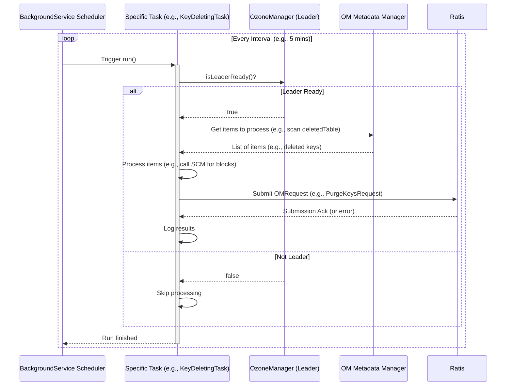

# Chapter 9: OM Background Services

In [Chapter 8: OM Snapshots](08_om_snapshots_.md), we learned how the Ozone Manager (OM) can capture point-in-time images of the metadata for recovery and analysis. While snapshots help preserve state, the OM also needs to perform regular housekeeping tasks to keep everything tidy and running efficiently.

Imagine owning a large, busy building (like the Ozone cluster). You need more than just security guards (like [Chapter 2: Security](02_security__authentication___authorization__.md)) and record keepers ([Chapter 1: OM Metadata Management](01_om_metadata_management_.md)). You also need a dedicated maintenance and janitorial crew that works quietly in the background, fixing things, taking out the trash, and making sure everything stays organized.

That's exactly what **OM Background Services** provide for the Ozone Manager. They are a collection of automated, periodic tasks designed to perform essential maintenance, cleanup, and synchronization duties behind the scenes.

## What's the Problem? Ongoing Maintenance

An active storage system like Ozone is constantly changing:

*   Users delete files and directories. These aren't instantly wiped but are marked for deletion. How do we eventually reclaim that space?
*   Users might start large file uploads (Multipart Uploads) but never finish them. How do we clean up these abandoned, incomplete uploads?
*   Users delete snapshots ([Chapter 8: OM Snapshots](08_om_snapshots_.md)) they no longer need. How is the underlying data eventually cleaned up?
*   If Ozone integrates with external systems like Apache Ranger for security, how do we ensure their configurations stay synchronized over time, even if one system restarts?

Handling these tasks directly during user request processing would slow things down and make the main logic overly complex. We need dedicated processes to handle this ongoing upkeep.

## The Solution: Background Services

The Ozone Manager runs several background services, each dedicated to a specific maintenance task. Think of them as different specialists on the maintenance crew:

*   **The "Trash Collector" (`KeyDeletingService`, `DirectoryDeletingService`):** Finds keys and directories that users have marked for deletion and ensures their data blocks are eventually deleted by the Storage Container Manager (SCM) and their metadata entries are removed from the OM database.
*   **The "Abandoned Project Cleaner" (`MultipartUploadCleanupService`):** Finds old, incomplete multipart uploads that haven't been touched in a while and initiates their cleanup.
*   **The "Snapshot Cleaner" (`SnapshotDeletingService`):** Manages the cleanup process for snapshots that have been marked for deletion, ensuring their unique data can be reclaimed.
*   **The "External Synchronizer" (`OMRangerBGSyncService`):** Periodically checks and synchronizes OM's multi-tenancy or security state with an external Apache Ranger service, ensuring consistency between the two systems.
*   **The "Lease Checker" (`OpenKeyCleanupService`):** Looks for keys that were opened for writing but never closed properly (potentially due to client crashes) and cleans them up after a lease period expires.

These services run periodically (e.g., every few minutes or hours, depending on configuration) and typically only on the **leader** OM node in a High Availability setup to prevent redundant work and potential conflicts.

## How They Work: The `BackgroundService` Framework

Ozone uses a common framework for these services, built around the `BackgroundService` class.

1.  **`BackgroundService`:** This is the base class. It handles the scheduling logic. It uses a Java `ScheduledExecutorService` to run its tasks at a configured interval (e.g., every 5 minutes).
2.  **`BackgroundTask`:** Each specific service (like `KeyDeletingService`) provides one or more `BackgroundTask` implementations. The `call()` method of the `BackgroundTask` contains the actual logic for that service's job (e.g., scan for deleted keys, find expired uploads).
3.  **Leader Check:** Before running the main logic, the task usually checks if the current OM is the leader using `ozoneManager.isLeaderReady()`. If not, it typically does nothing.

```java
// Simplified structure of a background service task

// Base class handles scheduling
public abstract class BackgroundService {
    // ... scheduling logic using ScheduledExecutorService ...

    // Method subclasses override to provide their specific tasks
    public abstract BackgroundTaskQueue getTasks();
}

// Interface for a specific task's logic
public interface BackgroundTask {
    BackgroundTaskResult call() throws Exception;
    int getPriority(); // Determines order if multiple tasks exist
}

// Example: A specific cleanup task implementation
public class MyCleanupService extends BackgroundService {
    private OzoneManager ozoneManager;
    // ... other fields ...

    public MyCleanupService(long interval, /*...,*/ OzoneManager om) {
        super("MyCleanupService", interval, /*...*/);
        this.ozoneManager = om;
    }

    @Override
    public BackgroundTaskQueue getTasks() {
        BackgroundTaskQueue queue = new BackgroundTaskQueue();
        queue.add(new MyCleanupTask()); // Add the actual task logic
        return queue;
    }

    private class MyCleanupTask implements BackgroundTask {
        @Override
        public int getPriority() { return 0; }

        @Override
        public BackgroundTaskResult call() throws Exception {
            // 1. Check if we should run (e.g., are we the leader?)
            if (!ozoneManager.isLeaderReady()) {
                return BackgroundTaskResult.EmptyTaskResult.newResult(); // Do nothing
            }

            // 2. Perform the actual work
            LOG.info("Running MyCleanupTask...");
            // ... find items to clean up ...
            // ... maybe interact with MetadataManager or SCM ...
            // ... maybe submit a Ratis request for persistent changes ...
            LOG.info("MyCleanupTask finished.");

            // 3. Return result (often empty for cleanup tasks)
            return BackgroundTaskResult.EmptyTaskResult.newResult();
        }
    }
}
```

*   This shows the basic pattern: a `BackgroundService` subclass provides a `BackgroundTask` whose `call()` method performs the periodic work, usually after checking if the OM is the leader.*

Let's look at a couple of examples in more detail.

## Example 1: `KeyDeletingService` - Taking Out the Trash

When a user deletes a key, OM doesn't immediately erase it. It moves the key's metadata to a special `deletedTable` ([Chapter 1: OM Metadata Management](01_om_metadata_management_.md)). The `KeyDeletingService` is responsible for the actual cleanup.

**How it works:**

1.  **Scan `deletedTable`:** Periodically, the `KeyDeletingService` task wakes up on the leader OM. It scans the `deletedTable` to find keys ready for deletion.
2.  **Batch Keys:** It gathers a batch of these keys (up to a configured limit, like 1000 keys).
3.  **Identify Blocks:** For each key, it identifies the data blocks stored on the DataNodes.
4.  **Request Block Deletion from SCM:** It sends a list of these blocks to the Storage Container Manager (SCM), asking SCM to delete them. SCM doesn't delete them instantly but marks them in its own log for eventual reclamation.
5.  **Receive SCM Confirmation:** SCM confirms which blocks it has successfully marked for deletion.
6.  **Submit Purge Request to Ratis:** The `KeyDeletingService` then creates a `PurgeKeysRequest` containing the keys whose blocks were confirmed for deletion by SCM. This request is submitted to the Ratis consensus log ([Chapter 6: Ratis State Machine & Replication](06_ratis_state_machine___replication_.md)).
7.  **Apply Purge Request:** Once the `PurgeKeysRequest` is committed via Ratis, the State Machine executes it on all OMs. This execution removes the key entries permanently from the `deletedTable`.

```java
// File: src/main/java/org/apache/hadoop/ozone/om/service/KeyDeletingService.java
// Simplified logic within KeyDeletingTask.call()

public BackgroundTaskResult call() {
    if (shouldRun()) { // Check if leader OM
        LOG.debug("Running KeyDeletingService...");
        try {
            // 1. Get a batch of keys pending deletion from KeyManager
            PendingKeysDeletion pendingKeys = manager.getPendingDeletionKeys(keyLimitPerTask);
            List<BlockGroup> keyBlocksList = pendingKeys.getKeyBlocksList();

            if (keyBlocksList != null && !keyBlocksList.isEmpty()) {
                // 2. Ask SCM to delete blocks and remove keys from DB via Ratis
                //    processKeyDeletes() handles SCM call & Ratis submission
                int delCount = processKeyDeletes(keyBlocksList, manager,
                    pendingKeys.getKeysToModify(), null, /* snap ID */);
                deletedKeyCount.addAndGet(delCount);
                LOG.info("Submitted {} keys for purging.", delCount);
            }

            // 3. Potentially do deep clean on snapshots if needed/configured
            // ... (snapshot deep clean logic) ...

        } catch (IOException e) {
            LOG.error("Error during key deletion", e);
        }
    }
    return BackgroundTaskResult.EmptyTaskResult.newResult();
}

// File: src/main/java/org/apache/hadoop/ozone/om/service/AbstractKeyDeletingService.java
// Simplified logic within processKeyDeletes()

protected int processKeyDeletes(List<BlockGroup> keyBlocksList, ...) {
    // ... (logging) ...

    // 1. Call SCM to delete the actual data blocks associated with the keys
    //    (SCM marks them for deletion)
    List<DeleteBlockGroupResult> blockDeletionResults = scmClient.deleteKeyBlocks(keyBlocksList);

    if (blockDeletionResults != null) {
        // 2. If SCM acknowledged, submit a PurgeKeys request via Ratis
        //    to remove the key metadata from OM's deletedTable permanently.
        //    submitPurgeKeysRequest() builds and submits the OMRequest.
        int delCount = submitPurgeKeysRequest(blockDeletionResults, /*...*/);
        return delCount;
    }
    return 0;
}
```

*   The `KeyDeletingTask` gets pending keys, calls `processKeyDeletes`, which first tells SCM to handle the data blocks and then submits a `PurgeKeysRequest` through Ratis to update the OM metadata.*

## Example 2: `MultipartUploadCleanupService` - Cleaning Abandoned Uploads

Multipart Upload (MPU) allows uploading large files in parts. If a client starts an MPU but never finishes it (by completing or aborting), the partial data and metadata linger.

**How it works:**

1.  **Scan MPU Info Table:** The `MultipartUploadCleanupService` task wakes up on the leader OM. It scans the `multipartInfoTable` which tracks ongoing MPUs.
2.  **Identify Expired MPUs:** It looks for MPU entries whose creation timestamp is older than a configured threshold (e.g., 2 days). This indicates they might be abandoned.
3.  **Batch Expired MPUs:** It gathers a list of these expired MPUs.
4.  **Submit Abort Request to Ratis:** It creates an `AbortExpiredMultiPartUploads` request containing the details of the expired MPUs and submits it via Ratis ([Chapter 6: Ratis State Machine & Replication](06_ratis_state_machine___replication_.md)).
5.  **Apply Abort Request:** When the request is committed and applied by the State Machine, the corresponding MPU entries are removed from the `multipartInfoTable`, and their associated (uncommitted) data blocks are implicitly marked for deletion (eventually handled by SCM).

```java
// File: src/main/java/org/apache/hadoop/ozone/om/service/MultipartUploadCleanupService.java
// Simplified logic within MultipartUploadCleanupTask.call()

public BackgroundTaskResult call() throws Exception {
    if (!shouldRun()) { // Check if leader OM
        return BackgroundTaskResult.EmptyTaskResult.newResult();
    }

    runCount.incrementAndGet();
    List<ExpiredMultipartUploadsBucket> expiredMultipartUploads = null;
    try {
        // 1. Get expired MPUs from KeyManager based on expireThreshold
        expiredMultipartUploads = keyManager.getExpiredMultipartUploads(
            expireThreshold, mpuPartsLimitPerTask);
    } catch (IOException e) {
        LOG.error("Unable to get expired MPU info", e);
        return BackgroundTaskResult.EmptyTaskResult.newResult();
    }

    if (expiredMultipartUploads != null && !expiredMultipartUploads.isEmpty()) {
        // 2. Create Ratis request to abort these MPUs
        OMRequest omRequest = createRequest(expiredMultipartUploads);

        // 3. Submit the request via Ratis
        submitRequest(omRequest);

        int numExpired = /* count entries */;
        LOG.info("Submitted {} expired MPUs for cleanup.", numExpired);
        submittedMpuInfoCount.addAndGet(numExpired);
    }
    return BackgroundTaskResult.EmptyTaskResult.newResult();
}

// Helper method to create the Ratis request
private OMRequest createRequest(List<ExpiredMultipartUploadsBucket> expired) {
    MultipartUploadsExpiredAbortRequest abortRequest =
        MultipartUploadsExpiredAbortRequest.newBuilder()
            .addAllExpiredMultipartUploadsPerBucket(expired)
            .build();

    return OMRequest.newBuilder()
        .setCmdType(Type.AbortExpiredMultiPartUploads)
        .setMultipartUploadsExpiredAbortRequest(abortRequest)
        .setClientId(clientId.toString()) // Use service's client ID
        .build();
}
```

*   This task finds expired MPUs and submits a single Ratis request (`AbortExpiredMultiPartUploads`) to clean them up.*

## Coordination and Configuration

*   **Leader Election:** As mentioned, these services generally only perform their actions on the current leader OM to prevent duplication and conflicts.
*   **Ratis for State Changes:** When a background service needs to make a persistent change to the OM's state (like removing a key from the `deletedTable`), it does so by submitting a request through the Ratis replication system ([Chapter 6: Ratis State Machine & Replication](06_ratis_state_machine___replication_.md)). This ensures the change is consistently applied across all OMs.
*   **Configuration:** The behavior of these services (how often they run, how many items they process per run, expiry thresholds, etc.) is controlled by settings in the Ozone configuration files (e.g., `ozone-site.xml`). Keys often start with `ozone.om.*` (e.g., `ozone.om.key.deleting.limit.per.task`, `ozone.om.mpu.expire.threshold`).

## Flow Diagram (Conceptual)



*   This diagram shows the periodic nature: the scheduler triggers the task, the task checks leadership, interacts with metadata or other components, and potentially submits a state-changing request via Ratis.*

## Conclusion

OM Background Services are the unsung heroes working behind the scenes in the Ozone Manager. They handle essential cleanup, maintenance, and synchronization tasks periodically and automatically. Services like `KeyDeletingService`, `MultipartUploadCleanupService`, and `OMRangerBGSyncService` ensure that deleted data is reclaimed, abandoned operations are cleaned up, and the system remains consistent and efficient over time, all without interrupting normal user operations. They leverage the core `BackgroundService` framework for scheduling and typically run only on the leader OM, using Ratis to ensure any state changes are replicated safely.

---

Generated by [AI Codebase Knowledge Builder](https://github.com/The-Pocket/Tutorial-Codebase-Knowledge)