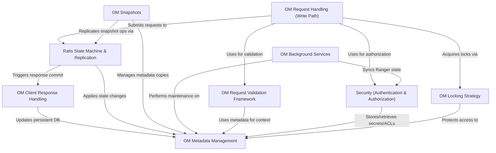

# Tutorial: ozone-manager

Ozone Manager (`ozone-manager`) is the central component responsible for managing the *metadata* of the Ozone distributed object store.
It handles client requests (like creating volumes, buckets, or keys), ensures data consistency and high availability through **replication** using the Ratis protocol, manages **security** (authentication and authorization), and takes care of background tasks like cleanup and creating *snapshots*.

**Source Repository:** [None](None)

## Chapters

1. [OM Metadata Management
](01_om_metadata_management_.md)
2. [Security (Authentication & Authorization)
](02_security__authentication___authorization__.md)
3. [OM Request Validation Framework
](03_om_request_validation_framework_.md)
4. [OM Request Handling (Write Path)
](04_om_request_handling__write_path__.md)
5. [OM Locking Strategy
](05_om_locking_strategy_.md)
6. [Ratis State Machine & Replication
](06_ratis_state_machine___replication_.md)
7. [OM Client Response Handling
](07_om_client_response_handling_.md)
8. [OM Snapshots
](08_om_snapshots_.md)
9. [OM Background Services
](09_om_background_services_.md)

---

Generated by [AI Codebase Knowledge Builder](https://github.com/The-Pocket/Tutorial-Codebase-Knowledge)