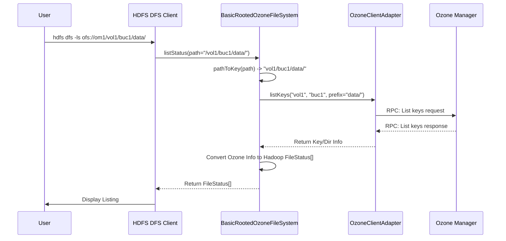

# Chapter 1: Ozone FileSystem Implementations

Welcome to the `ozonefs-common` tutorial! This module contains the essential code that allows applications familiar with the standard Hadoop FileSystem API to seamlessly interact with Apache Ozone's object storage.

Imagine you have an application, like a data processing job using Apache Spark or Apache MapReduce. These applications are typically written to read and write data using paths like `hdfs://namenode/user/data/input.csv`. How can we make these same applications work with Ozone without rewriting them? That's the core problem solved by the components in this chapter.

## The Bridge: Hadoop FileSystem API

Most big data tools in the Hadoop ecosystem (Spark, Hive, MapReduce, Flink, etc.) don't interact directly with the underlying storage hardware. Instead, they talk to storage through a standard interface defined by Hadoop's `FileSystem` class. This is like a universal language for distributed storage operations (`create`, `open`, `list`, `delete`, etc.).

Ozone, being an object store, has its own way of organizing data:
*   **Volumes:** Similar to top-level directories or user accounts.
*   **Buckets:** Containers within volumes, holding your data.
*   **Keys:** The actual data objects (files) within buckets.

This is different from HDFS's structure. So, how do we translate commands spoken in the "Hadoop FileSystem language" into actions Ozone understands?

## Meet the Translators: `BasicOzoneFileSystem` and `BasicRootedOzoneFileSystem`

This is where `BasicOzoneFileSystem` and `BasicRootedOzoneFileSystem` come in. Think of them as highly specialized translators or "drivers":

*   They **implement** the standard Hadoop `FileSystem` interface.
*   They **translate** standard filesystem commands (like `ls`, `cp`, `mkdir`, `rm`) into Ozone-specific operations (like creating, deleting, or listing *keys* within *buckets*).

Your application talks to these classes using the familiar Hadoop API, and these classes handle the communication with the underlying Ozone cluster.

There are two main "flavors" of these translators, distinguished by the URI scheme they use:

1.  **`BasicOzoneFileSystem` (Scheme: `o3fs://`)**
    *   **URI Format:** `o3fs://<bucket>.<volume>.<om-host-or-service-id>/path/to/key`
    *   **Analogy:** Imagine you open a file explorer, and it *starts* you directly inside a specific folder (the bucket). All paths you use are relative to that bucket.
    *   **Use Case:** When you want your application to work primarily within one specific Ozone bucket.

2.  **`BasicRootedOzoneFileSystem` (Scheme: `ofs://`)**
    *   **URI Format:** `ofs://<om-host-or-service-id>/volume/bucket/path/to/key`
    *   **Analogy:** This is like opening your file explorer at the root (`/` or `C:\`). You can see all your main drives (volumes) and navigate down into folders (buckets and keys).
    *   **Use Case:** When you need a view that resembles a traditional filesystem hierarchy, starting from the root and allowing access across multiple volumes and buckets.

## Using the Ozone FileSystems

The beauty of this approach is its transparency. You typically just need to tell your Hadoop application which filesystem to use.

**Example: Using Hadoop's `hdfs dfs` command**

Instead of `hdfs dfs -ls hdfs://namenode/data`, you would use:

*   **With `ofs` (Rooted):**
    ```bash
    # List volumes at the root
    hdfs dfs -ls ofs://om-service-id/

    # List contents inside a specific bucket
    hdfs dfs -ls ofs://om-service-id/myvolume/mybucket/some/dir/
    ```
    *(What happens? `BasicRootedOzoneFileSystem` translates this to list keys prefixed with `some/dir/` within `mybucket` in `myvolume`)*

*   **With `o3fs` (Bucket-specific):**
    ```bash
    # List contents inside the specified bucket
    hdfs dfs -ls o3fs://mybucket.myvolume.om-service-id/some/dir/
    ```
    *(What happens? `BasicOzoneFileSystem` knows it's already "inside" `mybucket.myvolume` and translates this to list keys prefixed with `some/dir/` within that bucket)*

Similarly, tools like Spark or Hive can read/write data just by providing the correct `ofs://` or `o3fs://` path.

## How it Works Internally (High-Level)

Let's trace a simple `ls` command using the rooted filesystem (`ofs`):

1.  **User Command:** `hdfs dfs -ls ofs://om1/volume1/bucket1/data/`
2.  **Hadoop Client:** The Hadoop client sees the `ofs://` scheme and loads `BasicRootedOzoneFileSystem`.
3.  **`BasicRootedOzoneFileSystem` (`listStatus` method):**
    *   Receives the `Path` object representing `/volume1/bucket1/data/`.
    *   Calls an internal helper (`pathToKey`) to convert this path into an Ozone key prefix: `volume1/bucket1/data/`. (Note: The `ofs` implementation internally handles the volume/bucket part separately from the key path).
    *   Needs to talk to Ozone to get the list of keys. It uses another component for this: the [Ozone Client Adapter](02_ozone_client_adapter_.md).
4.  **[Ozone Client Adapter](02_ozone_client_adapter_.md):** Takes the request (list keys in `volume1`/`bucket1` starting with `data/`) and communicates with the Ozone Manager (OM) server.
5.  **Ozone Manager (OM):** Finds the relevant keys/directories in its metadata.
6.  **Response Flow:** The OM sends the list back to the Adapter, which passes it to `BasicRootedOzoneFileSystem`.
7.  **`BasicRootedOzoneFileSystem`:** Converts the raw list of Ozone keys/directories back into the standard Hadoop `FileStatus` objects that the `hdfs dfs -ls` command expects.
8.  **User Output:** The `ls` command displays the familiar file/directory listing.

Here's a simplified view:



## Diving into the Code

Let's look at simplified snippets from the actual code.

**1. Initialization (`BasicRootedOzoneFileSystem.java`)**

When the filesystem is first created for an `ofs://` URI, the `initialize` method parses the URI to figure out where the Ozone Manager (OM) is.

```java
// File: src/main/java/org/apache/hadoop/fs/ozone/BasicRootedOzoneFileSystem.java

public class BasicRootedOzoneFileSystem extends FileSystem {
  // ... fields for adapter, uri, workingDir etc. ...
  private OzoneClientAdapter adapter;
  private URI uri;

  @Override
  public void initialize(URI name, Configuration conf) throws IOException {
    super.initialize(name, conf);
    // ... set config options like listing page size ...

    // Example: name = ofs://om-host.example.com:9878/
    String authority = name.getAuthority(); // "om-host.example.com:9878"

    // Code to parse authority into omHostOrServiceId and omPort
    String omHostOrServiceId = "..."; // Extracted host/service ID
    int omPort = -1; // Extracted port (if any)

    // Store the base URI
    this.uri = new URIBuilder().setScheme(OZONE_OFS_URI_SCHEME)
        .setHost(authority).build();

    // *** CRITICAL STEP ***
    // Create the adapter instance responsible for actual Ozone communication
    // It needs the OM address and configuration.
    this.adapter = createAdapter(getConfSource(), omHostOrServiceId, omPort);

    // ... setup working directory, user info ...
  }

  // Helper method to create the adapter (more in Chapter 2)
  protected OzoneClientAdapter createAdapter(ConfigurationSource conf,
      String omHost, int omPort) throws IOException {
    // Creates the specific adapter for rooted filesystem
    return new BasicRootedOzoneClientAdapterImpl(omHost, omPort, conf);
  }
  // ... other methods like listStatus, open, create ...
}
```
This shows how the filesystem connects itself to the correct Ozone cluster based on the URI provided. The key part is creating the `adapter`, which we'll explore in [Chapter 2: Ozone Client Adapter](02_ozone_client_adapter_.md).

**2. Path to Key Translation (`BasicOzoneFileSystem.java`)**

Both filesystem implementations need to convert Hadoop `Path` objects into Ozone key strings.

```java
// File: src/main/java/org/apache/hadoop/fs/ozone/BasicOzoneFileSystem.java

public class BasicOzoneFileSystem extends FileSystem {
  // ... fields ...
  private Path workingDir;

  /**
   * Turn a path (relative or otherwise) into an Ozone key.
   * For o3fs, the volume/bucket are part of the URI authority,
   * so the key is just the path part.
   */
  public String pathToKey(Path path) {
    Objects.requireNonNull(path, "Path can not be null!");
    if (!path.isAbsolute()) {
      // Handle relative paths based on the working directory
      path = new Path(workingDir, path);
    }
    // Example: path = /user/data/file.txt
    String key = path.toUri().getPath(); // "/user/data/file.txt"

    // Ozone keys don't start with '/', remove it.
    // (Unless it's the root path "/" itself, which becomes empty string "")
    if (key.startsWith("/")) {
        key = key.substring(1); // "user/data/file.txt"
    }
    LOG.trace("path for key:{} is:{}", key, path);
    return key;
  }
  // ... other methods ...
}
```
This simple method handles converting the path part of a URI (like `/dir/file.txt`) into the corresponding Ozone key string (`dir/file.txt`). `BasicRootedOzoneFileSystem` has a similar method but also handles extracting volume/bucket names from the path itself.

**3. Using the Adapter (`BasicRootedOzoneFileSystem.java`)**

Here's a glimpse of how `getFileStatus` (used by commands like `ls` or just checking existence) uses the adapter:

```java
// File: src/main/java/org/apache/hadoop/fs/ozone/BasicRootedOzoneFileSystem.java

public class BasicRootedOzoneFileSystem extends FileSystem {
  // ... fields ...
  private OzoneClientAdapter adapter; // The bridge to Ozone

  @Override
  public FileStatus getFileStatus(Path f) throws IOException {
    // Convert Hadoop Path to Ozone Key representation
    // (This is a bit more complex in Rooted FS as it handles vol/bucket in path)
    Path qualifiedPath = f.makeQualified(uri, workingDir);
    String key = pathToKey(qualifiedPath); // Extracts the key part

    // Get the FileStatusAdapter (a richer internal representation)
    // from the adapter, which talks to Ozone.
    FileStatusAdapter fileStatusAdapter = null;
    try {
      // *** DELEGATION ***
      // Ask the adapter to get the status from Ozone
      fileStatusAdapter =
          adapter.getFileStatus(key, uri, qualifiedPath, getUsername());
    } catch (IOException e) {
       // Handle errors like KEY_NOT_FOUND -> FileNotFoundException
       // ... error handling ...
       throw new FileNotFoundException("File not found: " + f);
    }

    // Convert the adapter's result into a standard Hadoop FileStatus
    return convertFileStatus(fileStatusAdapter); // (Helper method)
  }

  // Helper to convert internal representation to Hadoop's FileStatus
  FileStatus convertFileStatus(FileStatusAdapter fileStatusAdapter) {
      // Creates FileStatus or LocatedFileStatus using info from adapter
      // ... implementation ...
  }
  // ... other methods ...
}
```
This clearly shows the pattern:
1.  Translate the Hadoop `Path` to an Ozone concept (like a key string).
2.  Delegate the actual operation to the `adapter`.
3.  Translate the result back into the format Hadoop expects (like `FileStatus`).

## Conclusion

The `BasicOzoneFileSystem` and `BasicRootedOzoneFileSystem` classes are crucial bridges. They implement the standard Hadoop `FileSystem` API, allowing existing Hadoop-compatible applications to interact with Ozone object storage without modification. They act as translators, converting familiar filesystem operations into Ozone's native volume, bucket, and key operations. The choice between `o3fs://` (bucket-focused) and `ofs://` (root-focused) depends on whether you need a bucket-specific view or a more traditional, hierarchical filesystem perspective.

Internally, these classes rely heavily on another component to handle the actual communication with the Ozone cluster. In the next chapter, we'll explore this vital piece: the [Chapter 2: Ozone Client Adapter](02_ozone_client_adapter_.md).

---

Generated by [AI Codebase Knowledge Builder](https://github.com/The-Pocket/Tutorial-Codebase-Knowledge)