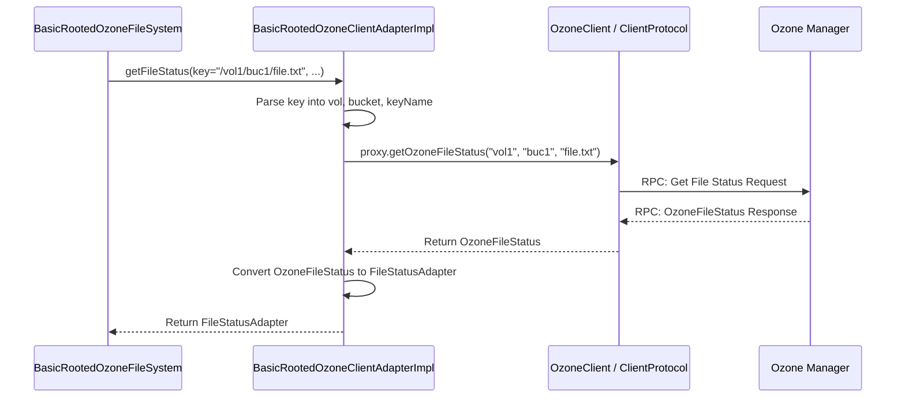

# Chapter 2: Ozone Client Adapter

In [Chapter 1: Ozone FileSystem Implementations](01_ozone_filesystem_implementations_.md), we saw how classes like `BasicOzoneFileSystem` act as translators between the familiar Hadoop FileSystem API and Ozone's way of doing things. We briefly mentioned that these translators don't talk *directly* to the core Ozone system but use a helper. That helper is the focus of this chapter: the **Ozone Client Adapter**.

## The Problem: Avoiding Tangled Wires

Imagine our `BasicOzoneFileSystem` needs to perform an operation like listing files. It needs to talk to the underlying Ozone cluster using Ozone's specific client library (classes like `OzoneClient`, `ObjectStore`, `OzoneBucket`).

If we wrote the code to directly use these Ozone client library classes inside `BasicOzoneFileSystem`, it would work, but it would create a few problems:

1.  **Tight Coupling:** The `BasicOzoneFileSystem` would become deeply intertwined with the *exact* way the Ozone client library works *right now*. If the Ozone client library changes in the future, we'd have to make major changes inside `BasicOzoneFileSystem`.
2.  **Code Clutter:** The `BasicOzoneFileSystem`'s main job is translating Hadoop commands. Mixing in lots of low-level Ozone communication details would make the code harder to read and understand.
3.  **Less Flexibility:** What if we wanted different ways to talk to Ozone? Maybe one way for regular use, and another way that also counts how many operations we perform (for statistics)? Or perhaps a version for a future, slightly different Ozone client library? Tightly coupling them makes this difficult.

## The Solution: The Adapter as a Middleman

To solve these problems, `ozonefs-common` uses the **Ozone Client Adapter** pattern.

Think of the `OzoneClientAdapter` as a dedicated **translator** or **middleman**.

*   The `FileSystem` (like `BasicRootedOzoneFileSystem`) gives the Adapter high-level instructions in a simplified language (e.g., "get me the status of this path `/volume1/bucket1/data/file.txt`").
*   The `Adapter` takes these instructions and translates them into the specific, low-level commands needed by the core Ozone client library (e.g., "use the `OzoneClient`'s `ObjectStore` to get the `OzoneBucket` for `volume1`/`bucket1`, then call `getOzoneFileStatus` on the client proxy for the key `data/file.txt`").

This middle layer is defined by the `OzoneClientAdapter` interface.

```java
// File: src/main/java/org/apache/hadoop/fs/ozone/OzoneClientAdapter.java
// (Simplified Interface)

package org.apache.hadoop.fs.ozone;

import java.io.IOException;
import java.io.InputStream;
import java.net.URI;
// ... other imports ...

public interface OzoneClientAdapter {

  // Get info about a file/directory
  FileStatusAdapter getFileStatus(String key, URI uri,
      Path qualifiedPath, String userName) throws IOException;

  // Read a file
  InputStream readFile(String key) throws IOException;

  // Create a file (returns an output stream to write to)
  OzoneFSOutputStream createFile(String key, short replication,
      boolean overWrite, boolean recursive) throws IOException;

  // Create a directory
  boolean createDirectory(String keyName) throws IOException;

  // Delete a file/directory
  boolean deleteObject(String keyName, boolean recursive) throws IOException;

  // List files/directories in a path
  List<FileStatusAdapter> listStatus(String keyName, boolean recursive,
      String startKey, long numEntries, URI uri,
      Path workingDir, String username, boolean lite) throws IOException;

  // Rename a file/directory (for ofs://)
  void rename(String pathStr, String newPath) throws IOException;

  // Rename a key (for o3fs://)
  void renameKey(String key, String newKeyName) throws IOException;

  // Close the connection to Ozone
  void close() throws IOException;

  // ... other methods for snapshots, checksums, etc. ...
}
```

This interface defines the "simplified language" that the `FileSystem` implementations use to talk to the adapter. Notice how it doesn't mention `OzoneClient` or `OzoneBucket` directly in most method signatures.

## Different Adapters for Different Needs

Because the interaction is defined by an *interface*, we can have different *implementations* of that interface. `ozonefs-common` provides a few:

1.  **`BasicOzoneClientAdapterImpl`:** Handles communication for `o3fs://` URIs (bucket-specific). It knows how to talk to a specific volume and bucket defined when it's created.
2.  **`BasicRootedOzoneClientAdapterImpl`:** Handles communication for `ofs://` URIs (rooted). It knows how to parse volume and bucket names from the path itself.
3.  **`OzoneClientAdapterImpl` / `RootedOzoneClientAdapterImpl`:** These extend the "Basic" versions and add functionality for collecting statistics (more on this in [Chapter 6: Statistics Collection](06_statistics_collection_.md)).

This flexibility is a key benefit! The `FileSystem` code doesn't need to change, but we can swap out the adapter implementation if needed.

## How the FileSystem Uses the Adapter

Let's revisit the `getFileStatus` example from Chapter 1, but focus on how the `BasicRootedOzoneFileSystem` uses the adapter:

```java
// File: src/main/java/org/apache/hadoop/fs/ozone/BasicRootedOzoneFileSystem.java
// (Simplified - focusing on adapter interaction)

public class BasicRootedOzoneFileSystem extends FileSystem {
  // ... fields ...
  private OzoneClientAdapter adapter; // The adapter instance!

  @Override
  public void initialize(URI name, Configuration conf) throws IOException {
    super.initialize(name, conf);
    // ... parse URI, get OM host/port ...
    String omHostOrServiceId = "...";
    int omPort = -1;

    // *** Create the appropriate adapter instance ***
    this.adapter = createAdapter(getConfSource(), omHostOrServiceId, omPort);
    // ... other setup ...
  }

  // Helper method to create the adapter
  protected OzoneClientAdapter createAdapter(ConfigurationSource conf,
      String omHost, int omPort) throws IOException {
    // Creates the adapter for the rooted filesystem.
    // If statistics are enabled, it might create RootedOzoneClientAdapterImpl instead.
    return new BasicRootedOzoneClientAdapterImpl(omHost, omPort, conf);
  }

  @Override
  public FileStatus getFileStatus(Path f) throws IOException {
    // 1. Translate Hadoop Path to Ozone representation (volume, bucket, key)
    Path qualifiedPath = f.makeQualified(uri, workingDir);
    String key = pathToKey(qualifiedPath); // Extracts key part
    // (Rooted FS adapter handles volume/bucket internally based on key)

    FileStatusAdapter fileStatusAdapter = null;
    try {
      // *** 2. DELEGATE to the Adapter ***
      // The FileSystem tells the Adapter what it wants (getFileStatus for 'key')
      // It doesn't care *how* the adapter does it.
      fileStatusAdapter =
          adapter.getFileStatus(key, uri, qualifiedPath, getUsername());

    } catch (IOException e) {
       // ... error handling ...
       throw new FileNotFoundException("File not found: " + f);
    }

    // 3. Convert the adapter's result back to Hadoop's FileStatus
    return convertFileStatus(fileStatusAdapter);
  }
  // ... other methods like create, delete, listStatus all follow this pattern ...
}
```

The pattern is clear:
1.  The `FileSystem` prepares the request (translates paths).
2.  It calls the corresponding method on its `adapter` instance.
3.  It takes the result from the `adapter` and converts it back into the format Hadoop expects.

The `FileSystem` doesn't know or care *how* the adapter talks to Ozone, only that it fulfills the request defined by the `OzoneClientAdapter` interface.

## Inside the Adapter: The Translation Process

So, what happens inside the adapter when the `FileSystem` calls one of its methods, like `getFileStatus`?

1.  **Receive Request:** The adapter method (e.g., `BasicRootedOzoneClientAdapterImpl.getFileStatus`) receives the simplified request (like the key path).
2.  **Prepare for Ozone Client:** It uses its internal knowledge (like the OM address it was configured with) and the request details to prepare arguments for the *actual* Ozone client library. For `getFileStatus` in the rooted adapter, it needs to know the volume, bucket, and key. It parses these from the input `key` string.
3.  **Use Ozone Client Library:** It interacts with the core Ozone client library components:
    *   It holds an instance of `OzoneClient`.
    *   It gets the `ObjectStore` from the `OzoneClient`.
    *   It uses the `ObjectStore`'s client proxy (`ClientProtocol`) to send the request (like `getOzoneFileStatus`) to the Ozone Manager (OM).
4.  **Receive Ozone Response:** The Ozone Manager processes the request and sends back detailed information (like an `OzoneFileStatus` object).
5.  **Translate Response:** The adapter receives this detailed response and converts it into the simpler `FileStatusAdapter` format that the `FileSystem` expects.
6.  **Return Result:** The adapter returns the `FileStatusAdapter` to the `FileSystem`.

Here's a simplified diagram showing the flow for `getFileStatus` using the rooted adapter:



Let's look at a simplified code snippet from the adapter implementation:

```java
// File: src/main/java/org/apache/hadoop/fs/ozone/BasicRootedOzoneClientAdapterImpl.java
// (Simplified)

public class BasicRootedOzoneClientAdapterImpl implements OzoneClientAdapter {

  static final Logger LOG = LoggerFactory.getLogger(BasicRootedOzoneClientAdapterImpl.class);

  private OzoneClient ozoneClient; // Holds the actual Ozone client library instance
  private ObjectStore objectStore;
  private ClientProtocol proxy;   // The interface for talking to the OM
  private OzoneConfiguration config;
  // ... other fields ...

  // Constructor: Initializes the connection to Ozone
  public BasicRootedOzoneClientAdapterImpl(String omHost, int omPort,
      ConfigurationSource hadoopConf) throws IOException {
    // ... (Code to create OzoneConfiguration) ...
    try {
      // *** Gets the actual OzoneClient instance ***
      // This uses the Ozone client library factory methods
      this.ozoneClient = OzoneClientFactory.getRpcClient(omHost, omPort, conf);
      this.objectStore = ozoneClient.getObjectStore();
      this.proxy = objectStore.getClientProxy(); // Gets the communication proxy
      this.config = conf;
      // ... (Error handling and other setup) ...
    } finally {
      // ...
    }
  }

  @Override
  public FileStatusAdapter getFileStatus(String path, URI uri,
      Path qualifiedPath, String userName) throws IOException {
    incrementCounter(Statistic.OBJECTS_QUERY, 1); // Optional: for statistics adapter

    // 1. Parse the input path (specific to Rooted adapter)
    OFSPath ofsPath = new OFSPath(path, config);
    String volumeName = ofsPath.getVolumeName();
    String bucketName = ofsPath.getBucketName();
    String key = ofsPath.getKeyName(); // The actual key within the bucket

    // Handle special cases like root ("/") or volume paths
    if (ofsPath.isRoot()) { return getFileStatusAdapterForRoot(uri); }
    // ... other checks ...

    try {
      // *** 2. Use the Ozone Client Proxy ***
      // Talk to the Ozone Manager via the client proxy
      OzoneFileStatus status = proxy.getOzoneFileStatus(volumeName, bucketName, key);

      // *** 3. Translate the Response ***
      // Convert the detailed OzoneFileStatus into our simpler FileStatusAdapter
      return toFileStatusAdapter(status, userName, uri, qualifiedPath, ofsPath.getNonKeyPath());

    } catch (OMException e) {
      // Handle specific Ozone errors (like file not found)
      if (e.getResult() == OMException.ResultCodes.FILE_NOT_FOUND) {
        throw new FileNotFoundException(key + ": No such file or directory!");
      }
      // ... other error handling ...
      throw e;
    }
  }

  // Helper method to convert Ozone's status to the adapter's status format
  private FileStatusAdapter toFileStatusAdapter(OzoneFileStatus status,
      String owner, URI defaultUri, Path workingDir, String ofsPathPrefix) {
    // ... extracts info from status (size, mod time, isDir, etc.) ...
    // ... builds and returns a new FileStatusAdapter object ...
    return new FileStatusAdapter(/* extracted details */);
  }

  // ... other adapter methods (createFile, deleteObject, listStatus etc.) ...
  // ... all follow a similar pattern: parse request, use proxy, translate response ...

  @Override
  public void close() throws IOException {
    // Important: Close the underlying OzoneClient when done
    ozoneClient.close();
  }
}
```

This shows how the adapter implementation bridges the gap. It receives the simple request from the `FileSystem`, performs the necessary low-level communication using the `OzoneClient`'s `proxy`, and translates the result back.

## Conclusion

The `OzoneClientAdapter` is a vital piece of the `ozonefs-common` architecture. It acts as a clean intermediary layer, decoupling the Hadoop `FileSystem` implementations from the complexities of the underlying Ozone client library.

Think of it as the engine of the car:
*   The driver (the Application) uses the steering wheel and pedals (Hadoop `FileSystem` API).
*   The steering wheel connects to the `FileSystem` implementation (`BasicRootedOzoneFileSystem`).
*   The `FileSystem` tells the engine (`OzoneClientAdapter`) what to do ("go faster", "get status").
*   The engine (`OzoneClientAdapter`) handles the complex internal mechanics (talking to `OzoneClient`, `proxy`, etc.) to make the car move (interact with the Ozone cluster).

This separation keeps the `FileSystem` code cleaner, makes the system more robust against changes in the Ozone client library, and allows for different adapter implementations (like those for [Chapter 6: Statistics Collection](06_statistics_collection_.md)).

In the next chapter, we'll look closer at the `FileStatusAdapter` object that the adapter returns, and how it relates to Hadoop's standard `FileStatus`.

Next: [Chapter 3: FileStatus Representation](03_filestatus_representation_.md)

---

Generated by [AI Codebase Knowledge Builder](https://github.com/The-Pocket/Tutorial-Codebase-Knowledge)