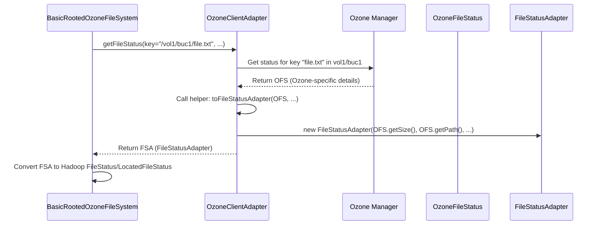

# Chapter 3: FileStatus Representation

In [Chapter 2: Ozone Client Adapter](02_ozone_client_adapter_.md), we learned how the `FileSystem` implementations delegate the actual communication with Ozone to the `OzoneClientAdapter`. We saw that the adapter returns information about files and directories. But how exactly is this information packaged? And how does it align with what Hadoop applications expect? Let's dive in!

## The Problem: Speaking Different Languages (Again!)

Imagine you ask your friend in France about a famous landmark. They might describe it using meters, mention its construction date, and tell you the architect's name. Now, you need to relay this information to your other friend in the US. You'll probably need to convert meters to feet, maybe format the date differently, and perhaps add details like the city and state.

We face a similar situation here:

*   **Ozone's "Language":** Ozone stores objects (keys) in buckets. When the `OzoneClientAdapter` asks the Ozone Manager (OM) for details about a key (like `my-file.txt`), the OM replies with information specific to Ozone's internal structure. This might include its size, modification time, replication details, and whether it's technically a "directory" marker. It returns this in an object like `OzoneFileStatus`.
*   **Hadoop's "Language":** Hadoop applications, like the `hdfs dfs -ls` command or a Spark job, expect file and directory information in a very specific format – the `FileStatus` class (or its more detailed cousin, `LocatedFileStatus`). This class has fields for path, length, modification time, owner, group, permissions, block size, and replication factor. For files, `LocatedFileStatus` also includes *block locations* (where the data physically resides in the cluster).

The information isn't exactly the same, and the structure is different. We need a way to translate Ozone's response into something that can be easily used to build the `FileStatus` Hadoop understands.

## The Solution: Intermediate Blueprints

`ozonefs-common` uses two helper classes to bridge this gap:

1.  **`FileStatusAdapter`**: Think of this as a detailed, intermediate **blueprint**. When the `OzoneClientAdapter` gets the raw information (`OzoneFileStatus`) back from Ozone, it carefully copies all the necessary details into a `FileStatusAdapter` object. This adapter object holds everything needed (path, size, modification time, replication, block locations, etc.) in a standardized way, ready to be used by the `FileSystem` implementation. It acts as a temporary container, holding the translated information before the final `FileStatus` is constructed.

2.  **`BasicKeyInfo`**: This is like a **sticky note** with only the bare minimum information. When the `OzoneClientAdapter` needs to list many keys (like for an `ls` command), it often doesn't need *all* the details immediately. It just needs the name, size, and maybe modification time for each key. `BasicKeyInfo` provides a super lightweight way to hold just these essentials. It's designed to be simple and have no dependencies on other complex Ozone classes, making it efficient for internal use during iteration.

## How They Are Used: The `ls` Example Revisited

Let's trace the `hdfs dfs -ls ofs://om1/vol1/buc1/data/` command again, focusing on where these classes fit:

1.  **User Command:** `hdfs dfs -ls ofs://om1/vol1/buc1/data/`
2.  **Hadoop Client:** Loads `BasicRootedOzoneFileSystem`.
3.  **`BasicRootedOzoneFileSystem` (`listStatus` method):**
    *   Asks the [Ozone Client Adapter](02_ozone_client_adapter_.md) to list the contents of the `data/` directory.
4.  **`OzoneClientAdapter` (`listStatus` method):**
    *   Talks to the Ozone Manager (OM).
    *   The OM sends back a list of `OzoneFileStatus` objects (Ozone's format).
    *   For *each* `OzoneFileStatus` received, the adapter creates a **`FileStatusAdapter`** object, copying the relevant information (size, mod time, isDirectory, block locations, etc.).
    *   The adapter returns a `List<FileStatusAdapter>` back to the `FileSystem`.
5.  **`BasicRootedOzoneFileSystem`:**
    *   Receives the list of `FileStatusAdapter` objects.
    *   For *each* `FileStatusAdapter`, it uses the information stored within it to construct a standard Hadoop `FileStatus` object.
6.  **Hadoop Client:** Displays the listing based on the `FileStatus` objects.

*Self-Correction during listing (using `BasicKeyInfo`):* Sometimes, for efficiency, the adapter might first get a list of very basic info (`BasicKeyInfo` objects) and only fetch the full details (to create `FileStatusAdapter`) for the items actually needed in the current batch. `BasicKeyInfo` is mainly used internally within the adapter's iteration logic.

## A Peek Inside the Blueprints

**`FileStatusAdapter` (Simplified Structure):**

This class primarily acts as a container for data.

```java
// File: src/main/java/org/apache/hadoop/fs/ozone/FileStatusAdapter.java

package org.apache.hadoop.fs.ozone;

// Imports for Path, BlockLocation...
import org.apache.hadoop.fs.BlockLocation;
import org.apache.hadoop.fs.Path;
// ...

public final class FileStatusAdapter {

  private final long length;          // File size in bytes
  private final long diskConsumed;    // Space consumed on disk (might differ for EC)
  private final Path path;            // The full Hadoop Path (e.g., ofs://om1/vol1/...)
  private final boolean isdir;        // True if it's a directory
  private final short blockReplication; // Replication factor
  private final long blocksize;       // Default block size for the file
  private final long modificationTime; // Last modification timestamp
  private final long accessTime;      // Last access timestamp
  private final short permission;     // File permissions (e.g., 777, 644)
  private final String owner;         // File owner username
  private final String group;         // File group name
  private final Path symlink;         // Path if it's a symlink (usually null)
  private final List<BlockLocation> blockLocations; // Where the data blocks are located
  private final boolean isEncrypted;  // Is Transparent Encryption enabled?
  private final boolean isErasureCoded; // Is Erasure Coding used?

  // Constructor to initialize all fields
  public FileStatusAdapter(long length, long diskConsumed, Path path, /*...other params...*/) {
    this.length = length;
    this.diskConsumed = diskConsumed;
    this.path = path;
    // ... initialize all other fields ...
  }

  // Getter methods for each field (e.g., getPath(), getLength(), isDir()...)
  public Path getPath() { return path; }
  public long getLength() { return length; }
  // ... other getters ...
}
```

This shows `FileStatusAdapter` simply holds the data needed to construct a Hadoop `FileStatus`.

**`BasicKeyInfo` (Simplified Structure):**

This is much simpler, designed for quick internal use.

```java
// File: src/main/java/org/apache/hadoop/fs/ozone/BasicKeyInfo.java

package org.apache.hadoop.fs.ozone;

public class BasicKeyInfo {

  private String name;             // The key name (e.g., "dir/file.txt")
  private long modificationTime;   // Last modification timestamp
  private long dataSize;           // Size in bytes

  // Constructor
  public BasicKeyInfo(String name, long modificationTime, long size) {
    this.name = name;
    this.modificationTime = modificationTime;
    this.dataSize = size;
  }

  // Simple getters
  public String getName() { return name; }
  public long getModificationTime() { return modificationTime; }
  public long getDataSize() { return dataSize; }
}
```

Notice how minimal `BasicKeyInfo` is – just the essentials.

## Internal Implementation: The Translation Step

How does the `OzoneClientAdapter` actually create the `FileStatusAdapter`? It has helper methods that take the Ozone-specific `OzoneFileStatus` object and map its fields to the `FileStatusAdapter`.

**Flow Diagram (`FileStatusAdapter` Creation):**



**Code Dive (Adapter's Translation Helper):**

Here's a simplified look at the helper method inside `BasicRootedOzoneClientAdapterImpl` that performs the translation:

```java
// File: src/main/java/org/apache/hadoop/fs/ozone/BasicRootedOzoneClientAdapterImpl.java
// (Inside the adapter class)

// Helper method to convert Ozone's status to the adapter's status format
private FileStatusAdapter toFileStatusAdapter(OzoneFileStatus status,
    String owner, URI defaultUri, Path workingDir, String ofsPathPrefix) {

  // Get the detailed key info from Ozone's status object
  OmKeyInfo keyInfo = status.getKeyInfo();

  // Extract replication factor
  short replication = (short) keyInfo.getReplicationConfig()
      .getRequiredNodes();

  // Construct the full Hadoop Path
  // Example: ofsPathPrefix = /vol1/buc1, keyInfo.getKeyName() = dir/file.txt
  // Result Path = ofs://om1/vol1/buc1/dir/file.txt
  Path fullPath = new Path(ofsPathPrefix + OZONE_URI_DELIMITER + keyInfo.getKeyName())
            .makeQualified(defaultUri, workingDir); // Make it absolute

  // Extract block locations (if available)
  BlockLocation[] locations = getBlockLocations(status); // Another helper method

  // Check encryption and erasure coding status
  boolean isEncrypted = OzoneClientUtils.isKeyEncrypted(keyInfo);
  boolean isErasureCoded = OzoneClientUtils.isKeyErasureCode(keyInfo);

  // Create and return the FileStatusAdapter, populating its fields
  return new FileStatusAdapter(
      keyInfo.getDataSize(),          // length
      keyInfo.getReplicatedSize(),    // diskConsumed
      fullPath,                       // path
      status.isDirectory(),           // isdir
      replication,                    // blockReplication
      status.getBlockSize(),          // blocksize
      keyInfo.getModificationTime(),  // modificationTime
      keyInfo.getModificationTime(),  // accessTime (using mod time for now)
      status.isDirectory() ? (short) 00777 : (short) 00666, // permission (default)
      StringUtils.defaultIfEmpty(keyInfo.getOwnerName(), owner), // owner
      owner,                          // group (using owner for now)
      null,                           // symlink (null for now)
      locations,                      // blockLocations
      isEncrypted,                    // isEncrypted
      isErasureCoded                  // isErasureCoded
  );
}

// Helper method to get Block Locations (simplified)
private BlockLocation[] getBlockLocations(OzoneFileStatus fileStatus) {
  if (fileStatus == null || !fileStatus.isFile()) {
    return new BlockLocation[0]; // Empty array for directories or null status
  }
  // ... Logic to extract block locations from fileStatus.getKeyInfo() ...
  // ... involves looking at OmKeyLocationInfoGroup and pipelines ...
  // ... Returns an array of Hadoop BlockLocation objects ...
  return blockLocationsArray; // Placeholder
}
```
This shows the core translation logic: extracting data from Ozone's `OzoneFileStatus` and using it to populate the fields of the `FileStatusAdapter`.

**Code Dive (Adapter using `BasicKeyInfo` for Listing):**

When listing keys, the adapter often uses an internal `Iterator` that yields `BasicKeyInfo` objects initially.

```java
// File: src/main/java/org/apache/hadoop/fs/ozone/BasicRootedOzoneClientAdapterImpl.java
// (or BasicOzoneClientAdapterImpl.java)

// Adapter to convert OzoneKey to a safe and simple Key implementation.
// This is often used inside the listKeys() method of the adapter.
public static class IteratorAdapter implements Iterator<BasicKeyInfo> {

  private Iterator<? extends OzoneKey> original; // Iterator from Ozone client lib

  public IteratorAdapter(Iterator<? extends OzoneKey> listKeys) {
    this.original = listKeys;
  }

  @Override
  public boolean hasNext() {
    return original.hasNext();
  }

  @Override
  public BasicKeyInfo next() {
    OzoneKey next = original.next(); // Get the next key from Ozone client
    if (next == null) {
      return null;
    } else {
      // Create the lightweight BasicKeyInfo object
      return new BasicKeyInfo(
          next.getName(),                 // Just the name
          next.getModificationTime().toEpochMilli(), // Mod time
          next.getDataSize()              // Size
      );
    }
  }
}

// Example usage within the adapter's listKeys method:
@Override
public Iterator<BasicKeyInfo> listKeys(String pathStr) throws IOException {
  // ... get volume/bucket ...
  OzoneBucket bucket = getBucket(...);
  // bucket.listKeys() returns Iterator<? extends OzoneKey>
  return new IteratorAdapter(bucket.listKeys(pathKeyPrefix)); // Wrap it
}
```
This demonstrates how `BasicKeyInfo` is used as a lightweight intermediate step during listing operations within the adapter.

## Conclusion

Hadoop applications expect file and directory metadata in the standard `FileStatus` format, while Ozone provides information in its own way (`OzoneFileStatus`). The `ozonefs-common` library uses intermediate representations to bridge this gap:

*   **`FileStatusAdapter`**: A detailed blueprint holding all necessary information translated from Ozone's format, ready to be converted into a Hadoop `FileStatus`.
*   **`BasicKeyInfo`**: A minimal, lightweight object holding only essential key details (name, size, mod time), used internally for efficient iteration during listing operations.

These adapters ensure that the `FileSystem` implementations can correctly translate information received from the `OzoneClientAdapter` into the standard format that Hadoop applications expect, making the interaction seamless.

Now that we understand how file metadata is represented, how do we actually read and write file *data*? That's the topic of our next chapter.

Next: [Chapter 4: Ozone Streams (Input/Output)](04_ozone_streams__input_output__.md)

---

Generated by [AI Codebase Knowledge Builder](https://github.com/The-Pocket/Tutorial-Codebase-Knowledge)