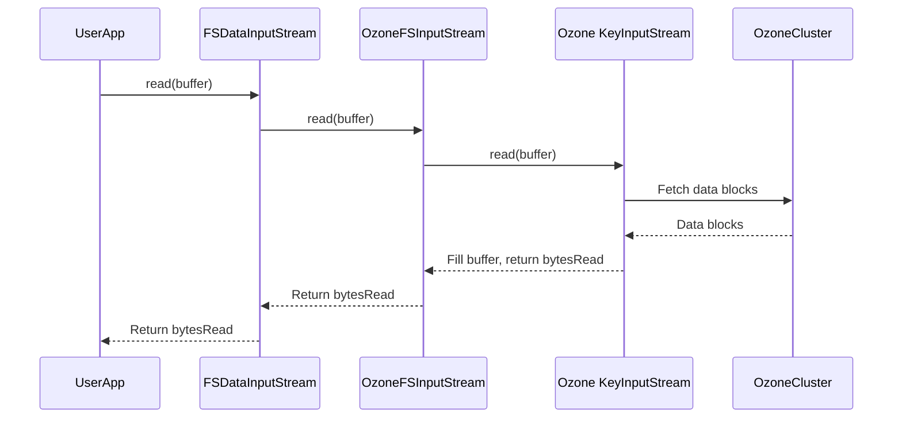

# Chapter 4: Ozone Streams (Input/Output)

Welcome to Chapter 4! In [Chapter 3: FileStatus Representation](03_filestatus_representation_.md), we saw how `ozonefs-common` represents information *about* files and directories (like their size and modification time) using `FileStatusAdapter`. Now, let's explore how we actually *read* and *write* the data *inside* those files.

## The Goal: Reading and Writing Data the Hadoop Way

Imagine you have a simple application that needs to write some text to a file in Ozone and then read it back. Using the standard Hadoop FileSystem API, you'd expect to do something like this:

```java
// Get the filesystem instance for Ozone (using 'ofs' scheme)
FileSystem fs = FileSystem.get(new URI("ofs://om1/"), config);
Path myFile = new Path("ofs://om1/myvolume/mybucket/hello.txt");

// Write data
try (FSDataOutputStream outputStream = fs.create(myFile)) {
  outputStream.writeUTF("Hello from Ozone!");
}

// Read data
try (FSDataInputStream inputStream = fs.open(myFile)) {
  String message = inputStream.readUTF();
  System.out.println(message); // Should print "Hello from Ozone!"
}
```

This looks like standard Hadoop code. But how does it work with Ozone behind the scenes? Hadoop applications expect to get an `FSDataInputStream` when they call `fs.open()` and an `FSDataOutputStream` from `fs.create()`. These stream types offer features like seeking to a specific position (`seek()`) or ensuring data is durably written (`hsync()`).

Ozone's underlying client library provides its own ways to read and write data, typically using streams like `KeyInputStream` and `KeyOutputStream`. These might have slightly different features or behaviors compared to what Hadoop expects.

So, the problem is: How do we bridge the gap between the standard Hadoop `FSDataInputStream`/`FSDataOutputStream` interfaces and Ozone's native data streams?

## The Solution: Stream Adapters

This is where the stream classes in `ozonefs-common` come into play:

*   **`OzoneFSInputStream`**: This class takes an underlying input stream from the Ozone client library (like `KeyInputStream`) and makes it behave like a standard Hadoop `FSDataInputStream`. It implements methods like `read()`, `seek()`, `getPos()`, and even reading directly into `ByteBuffer`s if the underlying stream supports it.
*   **`OzoneFSOutputStream`**: Similarly, this class takes an underlying output stream from the Ozone client library (like `KeyOutputStream` or `KeyDataStreamOutput`) and makes it behave like a standard Hadoop `FSDataOutputStream`. It implements methods like `write()`, `flush()`, `hsync()`, and `close()`.
*   **`OzoneFSDataStreamOutput`**: This is a specialized version of an output stream that specifically works with Ozone's `ByteBufferStreamOutput`. Using `ByteBuffer`s can sometimes offer performance advantages by reducing data copying.

**Analogy: Universal Travel Adapters**

Think of Ozone's native streams (`KeyInputStream`, `KeyOutputStream`) as power plugs from different countries (like the UK or Australia). Your application, however, expects a standard US power outlet (the Hadoop `FSDataInputStream`/`FSDataOutputStream` interface).

`OzoneFSInputStream` and `OzoneFSOutputStream` act like universal travel adapters. They plug into Ozone's "wall socket" (the native stream) on one side and provide the standard US "outlet" (the Hadoop stream interface) on the other side. Your application can then plug into this adapter without worrying about the details of the foreign socket.

These adapter streams handle the translation:
*   When your app calls `read()`, `OzoneFSInputStream` calls the appropriate method on the underlying Ozone stream.
*   When your app calls `seek()`, `OzoneFSInputStream` tells the underlying Ozone stream to move to the correct position.
*   When your app calls `hsync()`, `OzoneFSOutputStream` ensures the data is properly flushed and persisted by the underlying Ozone stream.

## How It Works in Practice

You typically don't create `OzoneFSInputStream` or `OzoneFSOutputStream` directly in your application code. The [Ozone FileSystem Implementations](01_ozone_filesystem_implementations_.md) (like `BasicRootedOzoneFileSystem`) handle this for you:

1.  **Opening a File (Read):**
    *   Your app calls `fileSystem.open(path)`.
    *   The `FileSystem` asks the [Ozone Client Adapter](02_ozone_client_adapter_.md) to get the *native* input stream for that path/key.
    *   The `Adapter` interacts with Ozone and gets back something like a `KeyInputStream`.
    *   The `FileSystem` takes this native `KeyInputStream` and wraps it inside a `new OzoneFSInputStream(keyInputStream, statistics)`.
    *   The `FileSystem` then returns this `OzoneFSInputStream` to your app, disguised as a standard `FSDataInputStream`.

2.  **Creating a File (Write):**
    *   Your app calls `fileSystem.create(path)`.
    *   The `FileSystem` asks the `Adapter` to get the *native* output stream for that path/key.
    *   The `Adapter` interacts with Ozone and gets back something like a `KeyOutputStream` or `KeyDataStreamOutput`.
    *   The `FileSystem` wraps this native stream inside a `new OzoneFSOutputStream(keyOutputStream)` or `new OzoneFSDataStreamOutput(keyDataStreamOutput)`.
    *   The `FileSystem` then wraps *that* in a standard `FSDataOutputStream` and returns it to your app.

From your application's point of view, you just interact with the standard Hadoop streams, and the `OzoneFS*Stream` classes handle the translation seamlessly.

## Under the Hood: A Read Operation

Let's trace what happens internally when you call `read()` on an input stream obtained from `fs.open()`:

1.  **User Code:** `int bytesRead = inputStream.read(myBuffer);`
    *   `inputStream` is actually an `FSDataInputStream` wrapping an `OzoneFSInputStream`.
2.  **Hadoop Layer:** The call eventually reaches `OzoneFSInputStream.read(myBuffer)`.
3.  **`OzoneFSInputStream`:**
    *   It holds a reference to the *native* Ozone stream (e.g., `KeyInputStream`) that was provided when it was created.
    *   It calls the `read(myBuffer)` method on this underlying native Ozone stream.
4.  **Ozone Client Library (Native Stream):**
    *   The native stream fetches the requested data block(s) from the Ozone cluster (DataNodes).
    *   It fills `myBuffer` with the data.
    *   It returns the number of bytes read to `OzoneFSInputStream`.
5.  **`OzoneFSInputStream`:**
    *   It might update read statistics if enabled.
    *   It returns the number of bytes read back up the chain.
6.  **User Code:** The `bytesRead` variable gets the result.

Here's a simplified sequence diagram for reading:



Writing data follows a similar pattern, with `OzoneFSOutputStream` delegating `write()` calls to the underlying native Ozone output stream.

## Code Snippets

Let's look at simplified versions of these stream classes.

**`OzoneFSInputStream` (Input Adapter)**

```java
// File: src/main/java/org/apache/hadoop/fs/ozone/OzoneFSInputStream.java
// (Simplified)

package org.apache.hadoop.fs.ozone;

import java.io.IOException;
import java.io.InputStream;
import org.apache.hadoop.fs.FSInputStream;
import org.apache.hadoop.fs.FileSystem.Statistics;
import org.apache.hadoop.fs.Seekable;

public class OzoneFSInputStream extends FSInputStream {

  // The actual stream provided by the Ozone client library
  private final InputStream inputStream;
  private final Statistics statistics; // For tracking bytes read

  // Constructor: Takes the native Ozone stream
  public OzoneFSInputStream(InputStream inputStream, Statistics statistics) {
    this.inputStream = inputStream;
    this.statistics = statistics;
  }

  // Example: Implementing the standard read() method
  @Override
  public int read() throws IOException {
    // *** DELEGATION ***
    // Just call read() on the wrapped native stream
    int byteRead = inputStream.read();
    if (statistics != null && byteRead >= 0) {
      statistics.incrementBytesRead(1); // Update stats
    }
    return byteRead;
  }

  // Example: Implementing seek()
  @Override
  public void seek(long pos) throws IOException {
    // *** DELEGATION ***
    // Cast the native stream to Seekable and call its seek()
    ((Seekable) inputStream).seek(pos);
  }

  // Example: Implementing getPos()
  @Override
  public long getPos() throws IOException {
    // *** DELEGATION ***
    // Cast to Seekable and call its getPos()
    return ((Seekable) inputStream).getPos();
  }

  @Override
  public synchronized void close() throws IOException {
    // *** DELEGATION ***
    // Close the wrapped native stream
    inputStream.close();
  }

  // ... other methods like read(byte[]), skip(), available() ...
  // ... also methods for ByteBuffer reads if supported ...
}
```
This shows how `OzoneFSInputStream` acts as a wrapper, implementing Hadoop's `FSInputStream` methods by simply calling the corresponding methods on the underlying native Ozone `InputStream`.

**`OzoneFSOutputStream` (Output Adapter)**

```java
// File: src/main/java/org/apache/hadoop/fs/ozone/OzoneFSOutputStream.java
// (Simplified)

package org.apache.hadoop.fs.ozone;

import java.io.IOException;
import java.io.OutputStream;
import org.apache.hadoop.fs.Syncable; // Interface for hflush/hsync
import org.apache.hadoop.ozone.client.io.OzoneOutputStream; // Specific Ozone type

public class OzoneFSOutputStream extends OutputStream implements Syncable {

  // The actual output stream from the Ozone client library
  private final OzoneOutputStream outputStream;

  // Constructor: Takes the native Ozone stream
  public OzoneFSOutputStream(OzoneOutputStream outputStream) {
    this.outputStream = outputStream;
  }

  // Example: Implementing the standard write(int) method
  @Override
  public void write(int b) throws IOException {
    // *** DELEGATION ***
    outputStream.write(b);
  }

  // Example: Implementing write(byte[], off, len)
  @Override
  public void write(byte[] b, int off, int len) throws IOException {
    // *** DELEGATION ***
    outputStream.write(b, off, len);
  }

  // Example: Implementing hsync() for durability
  @Override
  public void hsync() throws IOException {
    // *** DELEGATION ***
    outputStream.hsync(); // Tell Ozone to sync data
  }

  @Override
  public synchronized void flush() throws IOException {
    // *** DELEGATION ***
    outputStream.flush();
  }

  @Override
  public synchronized void close() throws IOException {
    // *** DELEGATION ***
    // Close the wrapped native stream
    outputStream.close();
  }

  // ... (hflush typically calls hsync) ...
}
```
Similar to the input stream, `OzoneFSOutputStream` wraps the native `OzoneOutputStream` and translates standard Hadoop output operations (like `write` and `hsync`) into calls on the Ozone stream.

**`OzoneFSDataStreamOutput` (ByteBuffer Output Adapter)**

This class is specifically designed to wrap Ozone's `ByteBufferStreamOutput`, which allows writing data directly from `ByteBuffer`s without intermediate copying, potentially improving performance.

```java
// File: src/main/java/org/apache/hadoop/fs/ozone/OzoneFSDataStreamOutput.java
// (Simplified)

package org.apache.hadoop.fs.ozone;

import java.io.IOException;
import java.nio.ByteBuffer;
// Ozone's interface for ByteBuffer-based output
import org.apache.hadoop.hdds.scm.storage.ByteBufferStreamOutput;
// Base class that might already implement some OutputStream methods
import org.apache.hadoop.ozone.client.io.ByteBufferOutputStream;

// Extends ByteBufferOutputStream which provides a base for BB handling
public class OzoneFSDataStreamOutput extends ByteBufferOutputStream {

  // The wrapped native Ozone ByteBuffer stream
  private final ByteBufferStreamOutput byteBufferStreamOutput;

  // Constructor: Takes the native Ozone ByteBuffer stream
  public OzoneFSDataStreamOutput(
      ByteBufferStreamOutput byteBufferStreamOutput) {
    this.byteBufferStreamOutput = byteBufferStreamOutput;
  }

  // Example: Implementing write using ByteBuffer
  @Override
  public void write(ByteBuffer b, int off, int len) throws IOException {
    // *** DELEGATION ***
    // Directly pass the ByteBuffer write call to the wrapped stream
    byteBufferStreamOutput.write(b, off, len);
  }

  @Override
  public void flush() throws IOException {
    byteBufferStreamOutput.flush();
  }

  @Override
  public void close() throws IOException {
    byteBufferStreamOutput.close();
  }

  // hsync/hflush are often delegated too
  @Override
  public void hsync() throws IOException {
    byteBufferStreamOutput.hsync();
  }

  // ... other methods ...
}
```
This shows how `OzoneFSDataStreamOutput` focuses on delegating `ByteBuffer` write operations to the underlying Ozone stream specialized for that purpose.

*(Note: You might also see `CapableOzoneFSInputStream` and `CapableOzoneFSOutputStream`. These are variants used with newer Hadoop versions (Hadoop 3+) that add support for `StreamCapabilities`, allowing applications to check if features like `hsync` or `ByteBuffer` reads are available.)*

## Conclusion

The `OzoneFSInputStream`, `OzoneFSOutputStream`, and `OzoneFSDataStreamOutput` classes are the workhorses for moving data between your application and the Ozone cluster. They act as essential adapters, wrapping Ozone's native data streams and presenting them as standard Hadoop `FSDataInputStream` and `FSDataOutputStream` interfaces.

This clever wrapping ensures that applications written using the familiar Hadoop FileSystem API can read and write data to Ozone without needing to know the specifics of Ozone's internal streaming mechanisms. These streams handle the delegation of reads, writes, seeks, flushes, and syncs, providing a seamless experience.

So far, we've seen how the FileSystem connects ([Chapter 1](01_ozone_filesystem_implementations_.md)), how it uses an adapter ([Chapter 2](02_ozone_client_adapter_.md)), how file info is represented ([Chapter 3](03_filestatus_representation_.md)), and how data streams work (this chapter). Next, we'll look at some helpful utility functions used within `ozonefs-common`.

Next: [Chapter 5: Ozone Client Utilities](05_ozone_client_utilities_.md)

---

Generated by [AI Codebase Knowledge Builder](https://github.com/The-Pocket/Tutorial-Codebase-Knowledge)