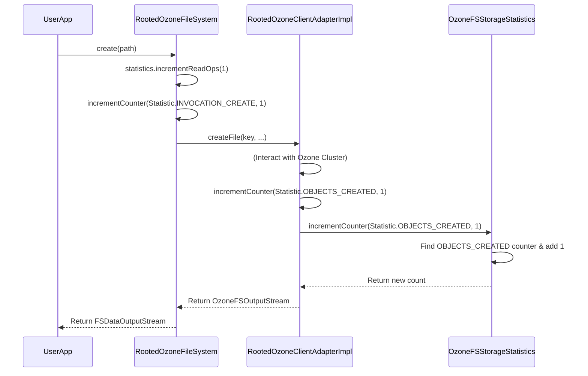

# Chapter 6: Statistics Collection

Welcome to Chapter 6! In [Chapter 5: Ozone Client Utilities](05_ozone_client_utilities_.md), we looked at the helpful toolkit `OzoneClientUtils` provides for common tasks. We've covered how to interact with OzoneFS, read/write data, and use utilities. But how do we know *how much* we're using the filesystem? How many files are being created or read? That's where statistics collection comes in.

## The Problem: Flying Blind

Imagine driving a car without a dashboard. You wouldn't know your speed, fuel level, or engine temperature. Similarly, when running applications on OzoneFS, it's incredibly useful to know how the filesystem is being used.

**Use Case:** A cluster administrator wants to monitor the load on their Ozone cluster coming from filesystem operations. They need to know:
*   How many files are being created per hour?
*   How many read operations are happening compared to write operations?
*   Are there many `rename` or `delete` operations?

Without this information, it's hard to understand usage patterns, troubleshoot performance issues, or plan for future capacity needs.

## The Solution: The Filesystem Dashboard

`ozonefs-common` provides a built-in mechanism for tracking these operations, much like a car's dashboard. The key components are:

1.  **`OzoneFSStorageStatistics`**: This class acts as the main **dashboard**. It holds counters for various operations. It's a specialized version of Hadoop's standard `StorageStatistics` class, tailored for OzoneFS.
2.  **`Statistic` Enum**: This defines the specific **gauges** or **metrics** available on the dashboard. Each value in this enum represents a particular operation or filesystem event that can be counted (e.g., `OBJECTS_CREATED`, `INVOCATION_OPEN`, `INVOCATION_DELETE`).
3.  **Adapter Implementations (`OzoneClientAdapterImpl`, `RootedOzoneClientAdapterImpl`)**: These are the **sensors** connected to the engine. As we learned in [Chapter 2: Ozone Client Adapter](02_ozone_client_adapter_.md), the `FileSystem` delegates operations to an adapter. The specific adapter implementations that support statistics (`OzoneClientAdapterImpl` and `RootedOzoneClientAdapterImpl`, which extend the "Basic" versions) are responsible for telling the `OzoneFSStorageStatistics` dashboard to increment the correct counter each time an operation occurs.

**Analogy: Fitness Tracker**

Think of `OzoneFSStorageStatistics` as your fitness tracker app.
*   The `Statistic` enum defines the types of activities it can track (steps taken, calories burned, distance run).
*   The adapter implementations are like the sensors in your watch (pedometer, heart rate monitor) that detect when you take a step or your heart beats.
*   Each time you take a step, the pedometer sensor tells the app, "Increment the step count!"

## How It Works: Incrementing Counters

The process is straightforward:

1.  When an Ozone `FileSystem` instance is created (often the full `OzoneFileSystem` or `RootedOzoneFileSystem`, not just the "Basic" versions), an `OzoneFSStorageStatistics` object is usually created alongside it.
2.  This statistics object is passed to the appropriate adapter implementation (e.g., `RootedOzoneClientAdapterImpl`) when the adapter is initialized.
3.  Whenever the adapter performs an operation (like `createFile`, `readFile`, `deleteObject`, `renameKey`), it calls its internal `incrementCounter` method *after* the operation (or sometimes before, depending on the logic).
4.  The `incrementCounter` method inside the adapter uses the `OzoneFSStorageStatistics` object it holds to increment the specific counter corresponding to the operation performed (using the `Statistic` enum).

**Example:**

Let's say your application calls `fileSystem.open(myPath)`.

1.  The call goes to `RootedOzoneFileSystem.open()`.
2.  `RootedOzoneFileSystem.open()` calls `adapter.readFile(key)` on its `RootedOzoneClientAdapterImpl` instance.
3.  Inside `adapter.readFile(key)`, the adapter communicates with Ozone to get the input stream.
4.  *Before returning*, the `RootedOzoneClientAdapterImpl` might also call `incrementCounter(Statistic.OBJECTS_READ, 1)`. (Note: `open` itself might increment `Statistic.INVOCATION_OPEN` in the FileSystem layer, while the actual read might increment `OBJECTS_READ` in the adapter layer).
5.  The `incrementCounter` method in the adapter finds the `AtomicLong` counter for `OBJECTS_READ` within the `OzoneFSStorageStatistics` object and increments it.

## Accessing the Statistics

While `ozonefs-common` defines *how* statistics are collected, *accessing* them usually happens through standard Hadoop mechanisms:

*   **Metrics Systems:** Hadoop filesystems typically expose their `StorageStatistics` via JMX (Java Management Extensions) or the Hadoop Metrics2 framework. Monitoring tools can then scrape these metrics.
*   **Programmatically:** You can sometimes access the `statistics` field directly from the `FileSystem` object, although this is less common for general monitoring.

This chapter focuses on the *collection* mechanism within `ozonefs-common`.

## Internal Implementation Walkthrough

Let's trace how a counter gets updated when a file is created using the rooted filesystem.

1.  **User Code:** `fs.create(new Path("ofs://om1/vol1/buck1/newfile.txt"))`
2.  **`RootedOzoneFileSystem`:** The `create` method is called. It might increment `Statistic.INVOCATION_CREATE` on its own `statistics` object.
3.  **`RootedOzoneFileSystem`:** It calls `adapter.createFile(...)` on its `RootedOzoneClientAdapterImpl` instance.
4.  **`RootedOzoneClientAdapterImpl`:** The `createFile` method performs the necessary steps to talk to Ozone and initiate file creation.
5.  **`RootedOzoneClientAdapterImpl`:** *After* successfully setting up the file creation, it likely calls `incrementCounter(Statistic.OBJECTS_CREATED, 1)`.
6.  **`RootedOzoneClientAdapterImpl.incrementCounter()`:** This method takes the `Statistic.OBJECTS_CREATED` enum value and the count (1).
7.  **`OzoneFSStorageStatistics.incrementCounter()`:** The adapter calls the `incrementCounter` method on the `OzoneFSStorageStatistics` instance it holds.
8.  **`OzoneFSStorageStatistics`:** It looks up the `AtomicLong` counter associated with `Statistic.OBJECTS_CREATED` in its internal map and atomically increments its value by 1.
9.  **Return Flow:** The operation completes, and the output stream is returned to the user. The counter has been updated.

**Simplified Sequence Diagram:**



## Code Dive

Let's look at the key pieces of code involved.

**1. `Statistic` Enum:** Defines the metrics.

```java
// File: src/main/java/org/apache/hadoop/fs/ozone/Statistic.java
// (Simplified view)

package org.apache.hadoop.fs.ozone;

// Enum defining trackable statistics
public enum Statistic {
  OBJECTS_CREATED("objects_created", "Total number of objects created..."),
  OBJECTS_DELETED("objects_deleted", "Total number of objects deleted..."),
  OBJECTS_READ("objects_read", "Total number of objects read..."),
  // ... other object-level stats ...

  // Hadoop CommonStatisticNames for operation counts
  INVOCATION_CREATE(CommonStatisticNames.OP_CREATE, "Calls of create()"),
  INVOCATION_DELETE(CommonStatisticNames.OP_DELETE, "Calls of delete()"),
  INVOCATION_OPEN(CommonStatisticNames.OP_OPEN, "Calls of open()"),
  INVOCATION_RENAME(CommonStatisticNames.OP_RENAME, "Calls of rename()"),
  INVOCATION_LIST_STATUS(CommonStatisticNames.OP_LIST_STATUS, "Calls listStatus()");
  // ... many other invocation counts ...

  private final String symbol; // e.g., "objects_created"
  private final String description;

  Statistic(String symbol, String description) { /* ... constructor ... */ }

  public String getSymbol() { return symbol; }
  // ... other methods like fromSymbol(), getDescription() ...
}
```
*Explanation:* This enum clearly lists all the operations tracked, linking some to standard Hadoop statistic names.

**2. `OzoneFSStorageStatistics` Class:** Holds the counters.

```java
// File: src/main/java/org/apache/hadoop/fs/ozone/OzoneFSStorageStatistics.java
// (Simplified view)

package org.apache.hadoop.fs.ozone;

import java.util.EnumMap;
import java.util.Map;
import java.util.concurrent.atomic.AtomicLong;
import org.apache.hadoop.fs.StorageStatistics;

// Extends Hadoop's base class for storage statistics
public class OzoneFSStorageStatistics extends StorageStatistics {

  // A map holding the actual counters (using thread-safe AtomicLong)
  private final Map<Statistic, AtomicLong> opsCount =
      new EnumMap<>(Statistic.class);

  public OzoneFSStorageStatistics() {
    super("OzoneFSStorageStatistics"); // Name for the statistics source
    // Initialize all counters to zero
    for (Statistic opType : Statistic.values()) {
      opsCount.put(opType, new AtomicLong(0));
    }
  }

  /**
   * Increment a specific counter. Called by the Adapter.
   * @param op operation (from Statistic enum)
   * @param count increment value (usually 1)
   * @return the new value
   */
  public long incrementCounter(Statistic op, long count) {
    // Find the counter for the given Statistic and add 'count' to it
    long updated = opsCount.get(op).addAndGet(count);
    // Optional: Log the update for debugging
    // LOG.debug("{} += {}  ->  {}", op, count, updated);
    return updated;
  }

  // Methods required by StorageStatistics to expose the values
  @Override
  public Long getLong(String key) { // key is the symbol like "objects_created"
    final Statistic type = Statistic.fromSymbol(key);
    return type == null ? null : opsCount.get(type).get();
  }

  // ... other methods like getScheme(), getLongStatistics(), iterator(), reset() ...
}
```
*Explanation:* This class holds a map where keys are `Statistic` enum values and values are `AtomicLong` counters. The `incrementCounter` method is the core mechanism used by the adapter to update the counts.

**3. Adapter Implementation (`RootedOzoneClientAdapterImpl`):** Calls `incrementCounter`.

```java
// File: src/main/java/org/apache/hadoop/fs/ozone/RootedOzoneClientAdapterImpl.java
// (Simplified view - This class extends BasicRootedOzoneClientAdapterImpl)

package org.apache.hadoop.fs.ozone;

import java.io.IOException;
// ... other imports

// This adapter *specifically* handles statistics
public class RootedOzoneClientAdapterImpl
    extends BasicRootedOzoneClientAdapterImpl { // Extends the basic version

  // Holds the reference to the statistics dashboard
  private OzoneFSStorageStatistics storageStatistics;

  // Constructor receives the statistics object
  public RootedOzoneClientAdapterImpl(
      OzoneConfiguration conf, OzoneFSStorageStatistics storageStatistics)
      throws IOException {
    super(conf); // Initialize the basic adapter part
    this.storageStatistics = storageStatistics; // Store the stats object
  }

  // Constructor used when OM host/port are explicit
  public RootedOzoneClientAdapterImpl(String omHost, int omPort,
      ConfigurationSource hadoopConf,
      OzoneFSStorageStatistics storageStatistics)
      throws IOException {
    super(omHost, omPort, hadoopConf); // Initialize basic part
    this.storageStatistics = storageStatistics; // Store the stats object
  }

  // *** THE KEY METHOD ***
  // Overrides the basic adapter's (potentially empty) incrementCounter method
  @Override
  protected void incrementCounter(Statistic statistic, long count) {
    // If statistics are enabled (object is not null)
    if (storageStatistics != null) {
      // Delegate the increment call to the statistics object
      storageStatistics.incrementCounter(statistic, count);
    }
  }

  // Example: Inside an operation like getFileStatus
  @Override
  public FileStatusAdapter getFileStatus(String path, URI uri,
      Path qualifiedPath, String userName) throws IOException {

    // *** Tell the dashboard we queried an object ***
    incrementCounter(Statistic.OBJECTS_QUERY, 1);

    // ... rest of the getFileStatus logic using super.getFileStatus or proxy calls ...
    FileStatusAdapter result = super.getFileStatus(path, uri, qualifiedPath, userName);
    return result;
  }

  // Example: Inside deleteObjects (simplified)
  public boolean deleteObjects(OzoneBucket bucket, List<String> keyPathList) {
     boolean success = /* ... actual delete logic ... */;
     if (success) {
         // *** Tell the dashboard how many objects were deleted ***
         incrementCounter(Statistic.OBJECTS_DELETED, keyPathList.size());
     }
     return success;
  }
}
```
*Explanation:* This adapter specifically takes an `OzoneFSStorageStatistics` object in its constructor. Its `incrementCounter` method calls the corresponding method on the statistics object. Crucially, various operational methods within this adapter (like `getFileStatus`, `deleteObjects`, `createFile` etc. - not all shown) call `this.incrementCounter` to record that the operation occurred. A similar `OzoneClientAdapterImpl` exists for the non-rooted (`o3fs://`) filesystem.

**4. Filesystem Initialization (Conceptual):** How the adapter gets the stats object.

While the `BasicOzoneFileSystem` and `BasicRootedOzoneFileSystem` shown in previous chapters create the *basic* adapters, the full `OzoneFileSystem` or `RootedOzoneFileSystem` (which users typically interact with via `FileSystem.get()`) would likely override the `createAdapter` method to instantiate the statistics-aware adapters (`OzoneClientAdapterImpl` or `RootedOzoneClientAdapterImpl`) and pass them the filesystem's `statistics` object.

```java
// Conceptual - In a class like RootedOzoneFileSystem (extending Basic...)

public class RootedOzoneFileSystem extends BasicRootedOzoneFileSystem {
  // ... other fields ...

  @Override
  public void initialize(URI name, Configuration conf) throws IOException {
    // *** Statistics object is often initialized by the parent FileSystem class ***
    // this.statistics = new OzoneFSStorageStatistics(); // (or similar)
    super.initialize(name, conf); // Calls BasicRootedOzoneFileSystem's initialize
                                  // which calls createAdapter
  }

  // *** Override adapter creation to use the statistics-enabled version ***
  @Override
  protected OzoneClientAdapter createAdapter(ConfigurationSource conf,
      String omHost, int omPort) throws IOException {
    // Instead of Basic..., create RootedOzoneClientAdapterImpl
    // Pass the 'statistics' object (initialized by FileSystem base class)
    return new RootedOzoneClientAdapterImpl(omHost, omPort, conf,
                                            this.statistics); // Pass stats here!
  }

  // ... other methods ...
}
```
*Explanation:* This shows the likely pattern: the main filesystem class ensures the statistics-enabled adapter is created and that it receives the `OzoneFSStorageStatistics` instance (often managed by the base Hadoop `FileSystem` class itself).

## Conclusion

The statistics collection mechanism in `ozonefs-common` provides a valuable "dashboard" for monitoring filesystem activity.

*   `OzoneFSStorageStatistics` holds the counters.
*   The `Statistic` enum defines *what* is counted.
*   The statistics-enabled adapter implementations (`OzoneClientAdapterImpl`, `RootedOzoneClientAdapterImpl`) act as sensors, incrementing the appropriate counters via the `incrementCounter` method whenever operations occur.

This allows administrators and users to gain insights into how OzoneFS is being used, aiding in performance tuning, debugging, and capacity planning.

We've now covered most core components. What happens if a client writing a file crashes? How does Ozone handle incomplete files? Our final chapter explores this.

Next: [Chapter 7: Lease Recovery Handling](07_lease_recovery_handling_.md)

---

Generated by [AI Codebase Knowledge Builder](https://github.com/The-Pocket/Tutorial-Codebase-Knowledge)