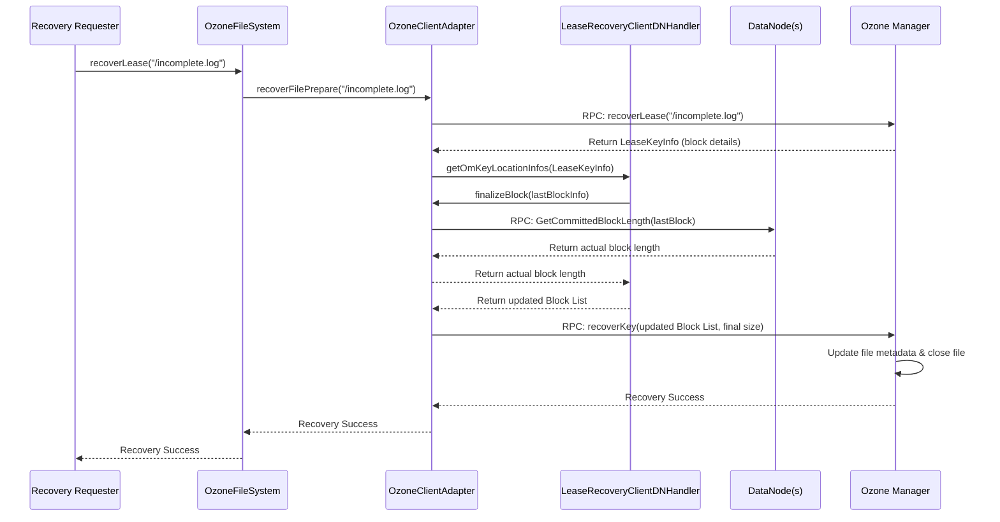

# Chapter 7: Lease Recovery Handling

In the previous chapter, [Chapter 6: Statistics Collection](06_statistics_collection_.md), we saw how `ozonefs-common` keeps track of filesystem operations. Now, let's tackle a different kind of problem: what happens when things go wrong, specifically when a client writing a file suddenly crashes or loses its connection?

## The Problem: The Half-Written Story

Imagine you're writing a very important document, saving it automatically every few seconds to a shared drive. Suddenly, your computer crashes! What happens to the document on the shared drive?

*   It might be incomplete, missing the last few sentences you typed.
*   Worse, the saving process might have been interrupted in the middle, leaving the file in a corrupted state.
*   The shared drive might still think *you* are actively editing the file, potentially locking it so nobody else can open or clean it up.

This is exactly the kind of problem **Lease Recovery** solves in Ozone. When a client application writes data to OzoneFS, it holds a temporary "permission slip" called a **lease**. This lease tells the Ozone cluster, "I'm currently writing to this file, please don't let others interfere." The client has to periodically renew this lease, like checking in to say "I'm still here!".

If the client crashes or disconnects, it stops renewing the lease. After a timeout period, the Ozone Manager (OM) notices the lease hasn't been renewed and realizes the client is gone. The file is left in an "open" state, potentially incomplete and locked.

## The Solution: Cleaning Up After the Crash

Lease Recovery is Ozone's automatic cleanup crew. When the OM detects an expired lease on a file, it knows the file needs recovery. The goal is to:

1.  **Figure out the *actual* amount of data** that was successfully written to the storage (DataNodes) before the crash. The last piece of data (the last "block") might be incomplete.
2.  **Update the file's official record** (metadata in the OM) with the correct, final size.
3.  **Close the file properly**, removing the lock so others can access the consistent, recovered version.

This ensures that even if clients crash, files don't remain locked indefinitely or in a state where their size is wrong.

## Key Components for Recovery

Within `ozonefs-common` and its interactions, a few key pieces handle this:

1.  **`LeaseRecoverable` Interface:** Think of this as the official rulebook defining *what* a filesystem needs to do to support lease recovery. It has methods like `recoverLease()` (start the recovery process) and `isFileClosed()` (check if a file is already closed or needs recovery). Because `ozonefs-common` needs to work with different Hadoop versions, this interface is actually copied directly from Hadoop source code into `ozonefs-common` for compatibility.

2.  **`LeaseRecoveryClientDNHandler` Class:** This is a specialized helper focused on one crucial part of recovery: talking to the DataNodes (DNs). When a file needs recovery, the last block written might be incomplete. This handler contains the logic to contact the DNs storing that last block and ask them, "How much data did you *really* get for this block before the client died?" It helps determine the true, committed length of that final block.

3.  **[Ozone Client Adapter](02_ozone_client_adapter_.md):** As we saw before, the adapter is the central communicator. During lease recovery, it orchestrates the process:
    *   It receives the recovery request (e.g., from the `FileSystem` layer).
    *   It talks to the OM to get information about the file and its blocks (`recoverFilePrepare`).
    *   It uses the `LeaseRecoveryClientDNHandler` to figure out the final block lengths by querying the DNs (`finalizeBlock`).
    *   It reports the final, consistent file information back to the OM so the file can be officially closed (`recoverFile`).

## How Lease Recovery Works (Step-by-Step)

Let's trace the recovery of a file named `incomplete.log` after its writer crashed:

1.  **Crash:** Client App writing `incomplete.log` crashes.
2.  **Lease Expires:** Client stops renewing its lease. OM notices the lease has expired.
3.  **Recovery Trigger:** Another client (or maybe a background process) tries to access `incomplete.log`, or explicitly calls `FileSystem.recoverLease(path)`.
4.  **FileSystem Call:** The `FileSystem` implementation (e.g., `BasicRootedOzoneFileSystem`) receives the `recoverLease` call.
5.  **Adapter Takes Over:** The `FileSystem` delegates the task to its [Ozone Client Adapter](02_ozone_client_adapter_.md).
6.  **Adapter -> OM (Prepare):** The Adapter calls `recoverFilePrepare` on the OM, passing the file path. The OM sends back information about the file, including the list of blocks written *before* the crash (`keyInfo`) and the list of blocks potentially written *during* the crash (`openKeyInfo`).
7.  **Adapter uses Handler:** The Adapter passes this information to the `LeaseRecoveryClientDNHandler`.
8.  **Handler -> DNs (Finalize):** The `LeaseRecoveryClientDNHandler` looks at the last block(s) mentioned in the `openKeyInfo`. For each potentially incomplete block, it calls the `Adapter.finalizeBlock` method. This method contacts the specific DNs storing that block and asks them for the actual committed length.
9.  **DNs Respond:** The DNs check their storage and respond with the final size of the block they have.
10. **Handler Determines Final State:** The `LeaseRecoveryClientDNHandler` gathers the confirmed lengths and updates the block list to reflect the *actual* data written.
11. **Adapter -> OM (Commit):** The Adapter takes the corrected block list (with accurate final block lengths) and calls `recoverFile` on the OM.
12. **OM Updates Metadata:** The OM updates the file's official size and block list in its metadata and marks the file as closed.
13. **Recovery Complete:** The file `incomplete.log` is now consistent and available for other clients to read. The lock is released.

**Simplified Sequence Diagram:**



## Code Dive

Let's look at the key interfaces and classes involved.

**1. `LeaseRecoverable` Interface**

This interface defines the contract. It's simple, specifying the core recovery actions.

```java
// File: src/main/java/org/apache/hadoop/fs/LeaseRecoverable.java
// (Copied from Hadoop for compatibility)

package org.apache.hadoop.fs;

import java.io.IOException;

/**
 * Interface indicating a FileSystem supports lease recovery.
 */
public interface LeaseRecoverable {

  /**
   * Start the lease recovery of a file.
   * @param file path to the file.
   * @return true if the file is already closed (no recovery needed).
   * @throws IOException on errors during recovery.
   */
  boolean recoverLease(Path file) throws IOException;

  /**
   * Check if a file is closed.
   * @param file path to the file.
   * @return true if the file is closed.
   * @throws IOException on I/O errors.
   */
  boolean isFileClosed(Path file) throws IOException;
}
```
*Explanation:* Any filesystem implementing this promises it can handle `recoverLease` and `isFileClosed` calls. Ozone's FileSystem implementations do this.

**2. `LeaseRecoveryClientDNHandler`**

This helper focuses on getting the correct block lengths from DataNodes.

```java
// File: src/main/java/org/apache/hadoop/fs/ozone/LeaseRecoveryClientDNHandler.java
// (Simplified logic)

package org.apache.hadoop.fs.ozone;

// ... imports ...

public final class LeaseRecoveryClientDNHandler {

  // ... (constructor is private, only static methods) ...

  /**
   * Updates block location info based on actual lengths from DNs.
   * @param leaseKeyInfo Info from OM (includes blocks before & during crash)
   * @param adapter The client adapter used to talk to DNs/OM
   * @param forceRecovery Option to force recovery even if finalize fails
   * @return The updated list of blocks with correct final lengths.
   */
  @Nonnull
  public static List<OmKeyLocationInfo> getOmKeyLocationInfos(
      LeaseKeyInfo leaseKeyInfo,
      OzoneClientAdapter adapter,
      boolean forceRecovery) throws IOException {

    // Get block lists from before crash (keyLocations) and during crash (openKeyLocations)
    List<OmKeyLocationInfo> keyLocations =
        leaseKeyInfo.getKeyInfo().getLatestVersionLocations().getLocationList();
    List<OmKeyLocationInfo> openKeyLocations =
        leaseKeyInfo.getOpenKeyInfo().getLatestVersionLocations().getLocationList();

    OmKeyLocationInfo lastOpenBlock = /* ... get last block from openKeyLocations ... */;
    OmKeyLocationInfo lastCommittedBlock = /* ... get last block from keyLocations ... */;

    // Logic to determine which block(s) need length finalized
    // Simplified Example: Assume last open block needs finalization
    if (lastOpenBlock != null) {
        try {
            // *** Use Adapter to contact DNs ***
            long actualLength = adapter.finalizeBlock(lastOpenBlock);
            lastOpenBlock.setLength(actualLength); // Update the length

            // Logic to add/update this block in the final list (keyLocations)
            // ... (e.g., if openKeyLocations had more blocks than keyLocations) ...

        } catch (Throwable e) {
            LOG.warn("Failed to finalize block {}", lastOpenBlock.getBlockID(), e);
            if (!forceRecovery) {
                throw e; // Fail recovery if not forced
            }
            // If forced, log and continue with potentially estimated length
        }
    }

    // Similar logic might exist for the last *committed* block if its
    // length in open info differs from committed info.

    return keyLocations; // Return the corrected list
  }
}
```
*Explanation:* This handler takes the block information from the OM (`leaseKeyInfo`), uses the `adapter` to call `finalizeBlock` (which contacts DNs to get the real length), updates the block information, and returns the corrected list.

**3. `OzoneClientAdapter` (Recovery Methods)**

The adapter orchestrates the calls to OM and uses the handler.

```java
// File: src/main/java/org/apache/hadoop/fs/ozone/OzoneClientAdapter.java
// (Interface definition - relevant methods)

public interface OzoneClientAdapter {

  /** Ask OM for initial info to start recovery */
  LeaseKeyInfo recoverFilePrepare(String pathStr, boolean force) throws IOException;

  /** Tell OM the final file state after DNs confirmed lengths */
  void recoverFile(OmKeyArgs keyArgs) throws IOException;

  /** Contact DNs to get the final committed length of a block */
  long finalizeBlock(OmKeyLocationInfo block) throws IOException;

  // ... other methods ...
}

// --- Implementation Snippets (e.g., in BasicOzoneClientAdapterImpl.java) ---

// File: src/main/java/org/apache/hadoop/fs/ozone/BasicOzoneClientAdapterImpl.java
// (Simplified Implementation Methods)

public class BasicOzoneClientAdapterImpl implements OzoneClientAdapter {

  private OzoneClient ozoneClient; // To talk to OM/DNs
  // ... other fields (proxy, config etc.) ...

  @Override
  public LeaseKeyInfo recoverFilePrepare(final String pathStr, boolean force)
      throws IOException {
    // ... Parse pathStr (for o3fs) or use volume/bucket from path (for ofs) ...
    String volumeName = /* ... */;
    String bucketName = /* ... */;
    String keyName = /* ... */;

    // *** Talk to OM ***
    ClientProtocol clientProtocol = ozoneClient.getProxy();
    return clientProtocol.recoverLease(volumeName, bucketName, keyName, force);
  }

  @Override
  public void recoverFile(OmKeyArgs keyArgs) throws IOException {
    // keyArgs contains the updated block list and final size

    // *** Talk to OM ***
    ClientProtocol clientProtocol = ozoneClient.getProxy();
    // Commit the recovery information to OM
    clientProtocol.recoverKey(keyArgs, 0L /* clientID - legacy */);
  }

  @Override
  public long finalizeBlock(OmKeyLocationInfo block) throws IOException {
    RpcClient rpcClient = (RpcClient) ozoneClient.getProxy();
    XceiverClientFactory xceiverClientFactory = rpcClient.getXceiverClientManager();
    Pipeline pipeline = block.getPipeline();
    XceiverClientSpi client = null; // Client to talk to a DN pipeline

    try {
      // If pipeline seems open, try a specific finalize command (less common)
      if (pipeline.isOpen()) {
          // ... code to call ContainerProtocolCalls.finalizeBlock ...
          // return lengthFromFinalizeResponse;
      }

      // *** Most common: Ask DN for committed block length ***
      client = xceiverClientFactory.acquireClientForReadData(pipeline);
      ContainerProtos.GetCommittedBlockLengthResponseProto response =
          ContainerProtocolCalls.getCommittedBlockLength(client,
                block.getBlockID(), block.getToken());
      return response.getBlockLength();

    } catch (IOException e) {
        LOG.warn("Failed during finalize/getCommittedBlockLength", e);
        throw e; // Rethrow exception
    } finally {
        if (client != null) {
            xceiverClientFactory.releaseClient(client, false); // Release DN client
        }
    }
  }
  // ... other adapter methods ...
}
```
*Explanation:* The adapter implements the recovery methods. `recoverFilePrepare` and `recoverFile` talk directly to the OM using the `ClientProtocol` proxy. `finalizeBlock` is more complex; it uses the `XceiverClientFactory` to get a direct connection to the DataNodes in the block's pipeline and sends a command (`GetCommittedBlockLength`) to ask for the actual size.

## Conclusion

Lease recovery is a critical safety net in OzoneFS, ensuring file consistency even when client applications crash during writes. It relies on the concept of leases expiring when clients disappear.

The process involves coordination between:
*   The **Ozone Manager (OM)**: Detects expired leases and manages file metadata.
*   The **[Ozone Client Adapter](02_ozone_client_adapter_.md)**: Orchestrates the recovery steps.
*   The **`LeaseRecoveryClientDNHandler`**: Helps determine the actual final block lengths by interacting with DataNodes via the adapter.
*   The **DataNodes (DNs)**: Report the committed size of potentially incomplete blocks.

The `LeaseRecoverable` interface provides the standard contract, ensuring that filesystems like OzoneFS can participate in this recovery process, ultimately preventing locked files and data inconsistencies.

This chapter concludes our exploration of the core components within `ozonefs-common`. We've covered the filesystem implementations, the client adapter, data representation, streams, utilities, statistics, and finally, failure handling with lease recovery.

---

Generated by [AI Codebase Knowledge Builder](https://github.com/The-Pocket/Tutorial-Codebase-Knowledge)