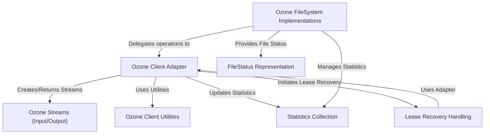

# Tutorial: ozonefs-common

This project provides a way for *Hadoop applications* to interact with **Ozone object storage** using the familiar Hadoop *FileSystem API*.
It acts as a bridge, translating standard file system commands (like listing directories, reading/writing files) into Ozone's native key-based operations within volumes and buckets.
This allows users to leverage Ozone's scalable storage while maintaining compatibility with existing Hadoop tools and workflows.

**Source Repository:** [None](None)

## Chapters

1. [Ozone FileSystem Implementations
](01_ozone_filesystem_implementations_.md)
2. [Ozone Client Adapter
](02_ozone_client_adapter_.md)
3. [FileStatus Representation
](03_filestatus_representation_.md)
4. [Ozone Streams (Input/Output)
](04_ozone_streams__input_output__.md)
5. [Ozone Client Utilities
](05_ozone_client_utilities_.md)
6. [Statistics Collection
](06_statistics_collection_.md)
7. [Lease Recovery Handling
](07_lease_recovery_handling_.md)

---

Generated by [AI Codebase Knowledge Builder](https://github.com/The-Pocket/Tutorial-Codebase-Knowledge)