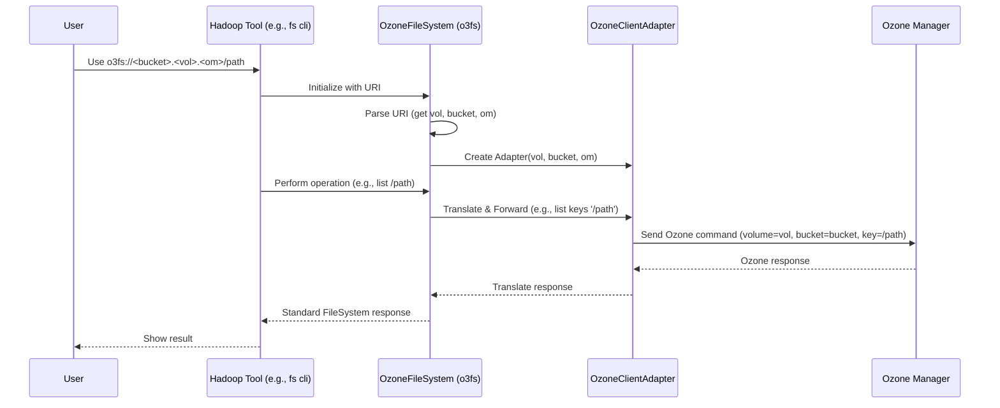

# Chapter 1: OzoneFileSystem (o3fs)

Welcome to the world of OzoneFS! This is the first step in learning how to use Apache Ozone as a filesystem with your favorite big data tools like Spark, Hive, Flink, or even just the standard Hadoop command line.

## The Problem: Talking to Ozone Like a Filesystem

Imagine you have a massive digital warehouse called Ozone where you store all sorts of data – maybe log files from your website, scientific data, or backups. Now, you want to use standard tools (like the `hadoop fs` command or Apache Spark) to manage and process this data.

These tools usually expect to talk to a *filesystem*, like the familiar folders and files on your computer or the Hadoop Distributed File System (HDFS). They know how to create files, read them, list directories, etc., using standard commands.

How can we make Ozone, this object storage warehouse, understand these standard filesystem commands? We need a translator!

## The Solution: OzoneFileSystem (o3fs)

`OzoneFileSystem`, which uses the `o3fs://` prefix (or "scheme"), acts as this translator. It's an adapter that lets Hadoop tools interact with Ozone *as if* it were a traditional filesystem.

Think of Ozone like a huge physical warehouse. To find anything, you need specific directions:
1.  Go to the correct **Volume** (a large section of the warehouse).
2.  Go to the correct **Bucket** within that volume (a specific aisle in that section).
3.  Then you can access your specific **Key** (the item/file on the shelf).

`OzoneFileSystem` (`o3fs`) works exactly like this. When you use it, you **must** tell it which volume and bucket you want to work inside *right in the address*.

The address (URI) looks like this:

`o3fs://<bucket>.<volume>.<om-host>:<om-port>/path/to/your/key`

Let's break it down:

*   `o3fs://`: This tells Hadoop "Use the OzoneFileSystem translator!"
*   `<bucket>`: The name of the specific aisle (bucket) you want to access.
*   `<volume>`: The name of the warehouse section (volume) the bucket is in.
*   `<om-host>:<om-port>`: The network address of the Ozone Manager (the warehouse manager or coordinator). The port is often optional if the default is used.
*   `/path/to/your/key`: The specific location of your file (key) within that bucket, using familiar slash `/` separators like a normal filesystem path.

**Key Idea:** With `o3fs`, all your operations (like reading, writing, listing) happen *within the single volume and bucket* specified in the address. You're essentially opening a door directly into that specific bucket.

## Using `o3fs` - A Practical Example

Let's say you have a file named `logs.txt` on your local machine, and you want to copy it into your Ozone warehouse, specifically into `volume=reports` and `bucket=daily_logs`. Your Ozone Manager is running at `om.example.com`.

You can use the standard `hadoop fs` command:

```bash
hadoop fs -put /path/to/your/local/logs.txt o3fs://daily_logs.reports.om.example.com/processed/logs_today.txt
```

**What happens here?**

1.  The `hadoop fs` command sees the `o3fs://` scheme.
2.  It loads the `OzoneFileSystem` code.
3.  `OzoneFileSystem` parses the address:
    *   Bucket: `daily_logs`
    *   Volume: `reports`
    *   OM Host: `om.example.com`
    *   Target Path inside the bucket: `/processed/logs_today.txt`
4.  It connects to the Ozone Manager `om.example.com`.
5.  It performs the "put" operation, telling Ozone to store the data from `/path/to/your/local/logs.txt` as a key named `/processed/logs_today.txt` inside the `daily_logs` bucket within the `reports` volume.

Similarly, to list files inside the `/processed/` directory within that same bucket:

```bash
hadoop fs -ls o3fs://daily_logs.reports.om.example.com/processed/
```

This command will list all keys (files and directories) directly under `/processed/` within the `daily_logs` bucket of the `reports` volume.

## Under the Hood: How `o3fs` Works

Let's peek behind the curtain. When you use an `o3fs` path, what's happening internally?

1.  **Initialization:** When Hadoop needs to access an `o3fs` path, it creates an instance of the `OzoneFileSystem` class. During this setup, the code extracts the volume, bucket, and Ozone Manager details directly from the URI you provided.
2.  **Client Adapter:** `OzoneFileSystem` creates a helper object (called `OzoneClientAdapter`). This adapter is specifically configured to talk to the Ozone Manager *about the specific volume and bucket* identified in the URI. Think of it as a dedicated phone line to the manager of that specific aisle (`bucket`) in that section (`volume`).
3.  **Path Translation:** When you ask to perform an operation (like `ls`, `put`, `mkdir`) on a path (e.g., `/processed/logs_today.txt`), `OzoneFileSystem` takes that path and understands it relative to the bucket specified in the URI. It uses the `OzoneClientAdapter` to send the corresponding request to the Ozone Manager (e.g., "list keys starting with `/processed/` in volume `reports`, bucket `daily_logs`").
4.  **Execution:** The Ozone Manager performs the requested action (listing keys, creating a key, reading a key's data) within the correct volume and bucket context.
5.  **Response:** The result comes back through the `OzoneClientAdapter` to `OzoneFileSystem`, which then presents it in the standard Hadoop FileSystem format that tools expect.

Here's a simplified view of the interaction:



Looking at the code, the initialization happens when `OzoneFileSystem` is created. It uses a method like `createAdapter` to set up the connection helper:

```java
// Simplified from src/main/java/org/apache/hadoop/fs/ozone/OzoneFileSystem.java

public class OzoneFileSystem extends BasicOzoneFileSystem {
    // ... other fields ...

    @Override
    protected OzoneClientAdapter createAdapter(ConfigurationSource conf,
          String bucketStr, String volumeStr, String omHost, int omPort)
          throws IOException {
        // This method gets the volume and bucket names parsed from the URI
        // and uses them to create a specific client adapter.
        return new OzoneClientAdapterImpl(omHost, omPort, conf, volumeStr,
            bucketStr, storageStatistics); // storageStatistics is for tracking usage
    }

    // ... other methods for read, write, list etc. use this adapter ...
}
```

This code snippet shows how the volume (`volumeStr`) and bucket (`bucketStr`) extracted from the `o3fs` URI are passed to create the `OzoneClientAdapterImpl`. Every subsequent operation (like reading, writing, listing) performed by this `OzoneFileSystem` instance will implicitly use this adapter, ensuring all actions target the correct volume and bucket in Ozone.

## Conclusion

You've now learned about `OzoneFileSystem` (`o3fs`)! It's the primary way to make Ozone look and feel like a standard Hadoop filesystem. The key takeaway is that `o3fs` paths **always** include the specific volume and bucket you want to work within, locking your operations to that context. This is powerful for many applications where you know exactly which bucket you need to access.

But what if you want a view that feels more like a single, unified filesystem where volumes and buckets appear as top-level directories, without needing to put them in the main address? For that, Ozone provides another way to interact.

Let's explore that in the next chapter: [Chapter 2: RootedOzoneFileSystem (ofs)](02_rootedozonefilesystem__ofs__.md).

---

Generated by [AI Codebase Knowledge Builder](https://github.com/The-Pocket/Tutorial-Codebase-Knowledge)