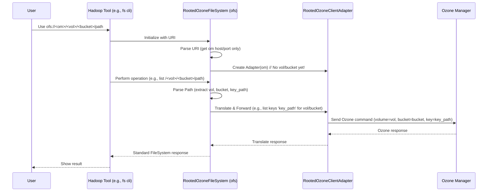

# Chapter 2: RootedOzoneFileSystem (ofs)

In [Chapter 1: OzoneFileSystem (o3fs)](01_ozonefilesystem__o3fs__.md), we learned how `o3fs` lets us talk to a specific volume and bucket within Ozone, like using a dedicated side entrance to a particular aisle in a warehouse. But what if you want to stand at the main entrance and see *all* the sections (volumes) and aisles (buckets) at once, like a traditional filesystem?

## The Problem: Seeing the Whole Warehouse

Imagine you just arrived at the Ozone data warehouse. You don't know exactly which section (volume) or aisle (bucket) you need yet. You want to explore! With `o3fs`, you *must* know the volume and bucket name to even start looking (`o3fs://<bucket>.<volume>...`). This isn't very convenient for browsing or for tools that expect to see everything starting from a single root directory ('/').

How can we get a view of Ozone that looks like a standard filesystem, where volumes and buckets are just directories under the main root?

## The Solution: RootedOzoneFileSystem (ofs)

`RootedOzoneFileSystem`, which uses the `ofs://` prefix (or "scheme"), provides this unified view! Think of it as using the main entrance to the warehouse. When you step inside using `ofs`, you are standing in the main hall (the root '/'). From there, you can see all the major sections (volumes) as if they were directories. You can then walk into a section (volume directory) and see all the aisles (buckets) within it, also as directories.

The address (URI) for `ofs` looks different:

`ofs://<om-host>:<om-port>/<volume>/<bucket>/path/to/your/key`

Let's break it down:

*   `ofs://`: This tells Hadoop "Use the RootedOzoneFileSystem translator!"
*   `<om-host>:<om-port>`: The network address of the Ozone Manager (the main warehouse manager). This is the *only* authority information needed.
*   `/`: This represents the root of the *entire* Ozone cluster view.
*   `<volume>`: The name of a volume, appearing as a directory directly under the root.
*   `<bucket>`: The name of a bucket *inside* that volume, appearing as a directory under the volume.
*   `/path/to/your/key`: The specific location of your file (key) within that bucket.

**Key Idea:** With `ofs`, the volume and bucket are part of the *path* itself, not part of the initial address authority like in `o3fs`. This allows you to navigate the entire cluster structure starting from the root (`/`).

## Using `ofs` - Practical Examples

Let's revisit our warehouse. Suppose it has two volumes: `reports` and `userdata`. The `reports` volume has a bucket `daily_logs`, and `userdata` has a bucket `jane_files`. Your Ozone Manager is at `om.example.com`.

**1. Listing all Volumes:**

To see all the top-level "directories" (which are actually your Ozone volumes) from the main entrance:

```bash
hadoop fs -ls ofs://om.example.com/
```

**Expected Output (Conceptual):**

```
Found 2 items
drwxrwxrwx   - ozone ozone          0 2023-10-27 10:00 ofs://om.example.com/reports
drwxrwxrwx   - ozone ozone          0 2023-10-27 10:01 ofs://om.example.com/userdata
```

This shows the `reports` and `userdata` volumes as directories directly under the root (`/`).

**2. Listing Buckets within a Volume:**

Now, let's look inside the `reports` volume to see its buckets:

```bash
hadoop fs -ls ofs://om.example.com/reports/
```

**Expected Output (Conceptual):**

```
Found 1 item
drwxrwxrwx   - ozone ozone          0 2023-10-27 10:05 ofs://om.example.com/reports/daily_logs
```

It shows the `daily_logs` bucket as a subdirectory within `/reports`.

**3. Accessing a File (Key):**

Let's copy our `logs.txt` file into the `daily_logs` bucket within the `reports` volume using the `ofs` path:

```bash
hadoop fs -put /path/to/your/local/logs.txt ofs://om.example.com/reports/daily_logs/processed/logs_today.txt
```

**What happens here?**

1.  The `hadoop fs` command sees the `ofs://` scheme.
2.  It loads the `RootedOzoneFileSystem` code.
3.  `RootedOzoneFileSystem` parses the address:
    *   OM Host: `om.example.com`
    *   Full Path: `/reports/daily_logs/processed/logs_today.txt`
4.  It connects to the Ozone Manager `om.example.com`.
5.  When performing the "put" operation, it analyzes the *path* `/reports/daily_logs/processed/logs_today.txt`:
    *   It identifies `reports` as the Volume.
    *   It identifies `daily_logs` as the Bucket within that Volume.
    *   It identifies `/processed/logs_today.txt` as the Key name within that Bucket.
6.  It sends the command to Ozone to store the data with the correct volume, bucket, and key name.

Compare this `put` command to the `o3fs` version from Chapter 1:

*   `o3fs`: `o3fs://daily_logs.reports.om.example.com/processed/logs_today.txt`
*   `ofs`: `ofs://om.example.com/reports/daily_logs/processed/logs_today.txt`

See how `ofs` moves the volume (`reports`) and bucket (`daily_logs`) from the "address" part into the "path" part?

## Under the Hood: How `ofs` Works

The magic of `ofs` lies in how it interprets the path you provide.

1.  **Initialization:** When Hadoop accesses an `ofs` path, it creates an instance of `RootedOzoneFileSystem`. It extracts only the Ozone Manager address (`om-host:om-port`) from the URI.
2.  **Client Adapter:** It creates a *different* kind of helper object (let's call it `RootedOzoneClientAdapter`). Unlike the `o3fs` adapter, this one *doesn't* know the volume and bucket upfront. It's connected to the OM but ready to work with *any* volume or bucket.
3.  **Path Parsing:** This is the crucial step! When you perform an operation (like `ls`, `put`) on an `ofs` path (e.g., `/reports/daily_logs/processed/`), the `RootedOzoneFileSystem` code looks at the first two parts of the path:
    *   The first part (`reports`) is assumed to be the **Volume**.
    *   The second part (`daily_logs`) is assumed to be the **Bucket**.
    *   The rest of the path (`/processed/`) is the **Key** or path within the bucket.
4.  **Execution:** Using the `RootedOzoneClientAdapter`, it sends the request to the Ozone Manager, specifying the volume and bucket it just figured out from the path (e.g., "list keys starting with `/processed/` in volume `reports`, bucket `daily_logs`").
5.  **Response:** The result comes back and is presented in the standard Hadoop FileSystem format.

Here’s a simplified view:



Looking at the code, the adapter creation is different. Compare this simplified snippet from `RootedOzoneFileSystem` with the one for `OzoneFileSystem` in Chapter 1.

```java
// Simplified from src/main/java/org/apache/hadoop/fs/ozone/RootedOzoneFileSystem.java

public class RootedOzoneFileSystem extends BasicRootedOzoneFileSystem {
    // ... other fields ...

    @Override
    protected OzoneClientAdapter createAdapter(ConfigurationSource conf,
          String omHost, int omPort) throws IOException {
        // Notice: This method only needs the OM host and port.
        // It doesn't take volumeStr or bucketStr during initialization.
        return new RootedOzoneClientAdapterImpl(omHost, omPort, conf,
            storageStatistics); // storageStatistics is for tracking usage
    }

    // ... other methods like pathToKey figure out the volume/bucket ...

    /**
     * Ozone normally stores data in volume/bucket/key path.
     * This function converts the input path to the Ozone key path string.
     * For ofs path like ofs://om/vol1/bucket1/key1, the key path is /vol1/bucket1/key1.
     *
     * Note that this method is called inside other FS operations,
     * where the volume and bucket are extracted from the path.
     */
    @Override
    public String pathToKey(Path path) {
        // Simplified logic: Assumes path format is /volume/bucket/key...
        // The actual implementation is more robust.
        LOG.trace("Converting path {} to Ozone key", path);
        // ... (validation and path manipulation happens here) ...
        // Example: Path("/vol1/buck1/dir/file") becomes key "dir/file"
        // while "vol1" and "buck1" are extracted separately.
        // The adapter then uses these extracted vol/bucket for the OM call.
        String key = path.toUri().getPath(); // Gets the full path part
        // ... logic to extract volume and bucket happens before OM call ...
        return key; // The full path is often used internally before splitting
    }
}
```

This shows that the `RootedOzoneFileSystem`'s adapter is created without a pre-defined volume and bucket. The responsibility of figuring out the volume and bucket shifts to the methods that handle specific file operations (like `listStatus`, `getFileStatus`, `create`, `open`), which parse the provided `Path` object (e.g., `/reports/daily_logs/key`).

## Conclusion

You've now learned about `RootedOzoneFileSystem` (`ofs`)! It provides a unified, root-based view of your Ozone cluster, making volumes and buckets appear as standard directories. This is often more intuitive for users familiar with traditional filesystems and useful for browsing or tools that expect a single root.

The key difference from `o3fs` is how the path is structured: `ofs://<om>/<volume>/<bucket>/<key>` versus `o3fs://<bucket>.<volume>.<om>/<key>`. Remember, `ofs` figures out the volume and bucket *from the path you provide*.

So far, we've seen two ways (`o3fs` and `ofs`) for standard Hadoop tools to talk to Ozone using the `FileSystem` interface. But Hadoop also has another, sometimes preferred, way to interact with filesystems called `AbstractFileSystem`. How does Ozone support that?

Let's find out in the next chapter: [Chapter 3: AbstractFileSystem Delegation (OzFs / RootedOzFs)](03_abstractfilesystem_delegation__ozfs___rootedozfs__.md).

---

Generated by [AI Codebase Knowledge Builder](https://github.com/The-Pocket/Tutorial-Codebase-Knowledge)