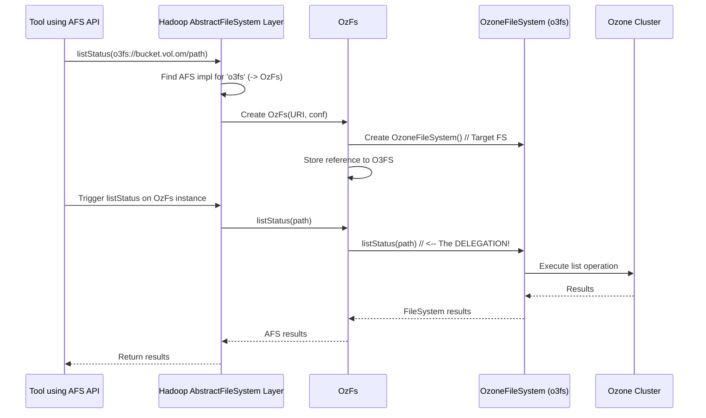

# Chapter 3: AbstractFileSystem Delegation (OzFs / RootedOzFs)

In the previous two chapters, we explored how [OzoneFileSystem (o3fs)](01_ozonefilesystem__o3fs__.md) and [RootedOzoneFileSystem (ofs)](02_rootedozonefilesystem__ofs__.md) let modern Hadoop tools talk to Ozone using the standard `FileSystem` API. This is the most common way to interact with filesystems in the Hadoop world.

However, Hadoop has been around for a while, and like any long-lived software, it has different ways things were done in the past. One of these is an older standard for interacting with filesystems called `AbstractFileSystem` (AFS).

## The Problem: Speaking an Older Language

Imagine you have a very useful, but slightly older, Hadoop tool or application. This tool was built before the modern `FileSystem` API became the primary standard, and it insists on speaking the `AbstractFileSystem` language.

If `OzoneFileSystem` (`o3fs`) and `RootedOzoneFileSystem` (`ofs`) only speak the modern `FileSystem` language, how can this older tool communicate with Ozone? We need a translator specifically for this older `AbstractFileSystem` language!

## The Solution: OzFs and RootedOzFs - The Interpreters

This is where `OzFs` and `RootedOzFs` come in. Think of them as skilled interpreters:

*   `OzFs`: Listens for requests in the `AbstractFileSystem` language that are meant for `o3fs` paths. It translates these requests into the modern `FileSystem` language and passes them directly to an `OzoneFileSystem` instance.
*   `RootedOzFs`: Listens for requests in the `AbstractFileSystem` language that are meant for `ofs` paths. It translates these requests into the modern `FileSystem` language and passes them directly to a `RootedOzoneFileSystem` instance.

They implement the required `AbstractFileSystem` interface, but they don't contain much logic themselves. Their main job is **delegation** – simply forwarding the request to the appropriate modern filesystem implementation (`OzoneFileSystem` or `RootedOzoneFileSystem`) which already knows how to talk to Ozone.

**Key Idea:** `OzFs` and `RootedOzFs` are compatibility layers. They allow tools using the older `AbstractFileSystem` API to work seamlessly with Ozone via the existing `o3fs` and `ofs` filesystem implementations.

## How It Works (Usually Behind the Scenes)

You typically don't interact with `OzFs` or `RootedOzFs` directly by writing code against them. Instead, Hadoop's configuration usually handles this automatically.

Here's the common scenario:

1.  You use a tool that happens to rely on the `AbstractFileSystem` API (maybe through Hadoop's `FileContext` object).
2.  You provide a standard Ozone path, like `o3fs://daily_logs.reports.om.example.com/data` or `ofs://om.example.com/reports/daily_logs/data`.
3.  Hadoop looks at the scheme (`o3fs` or `ofs`).
4.  Based on its configuration, Hadoop knows that for the `AbstractFileSystem` API, `o3fs` paths should be handled by `OzFs`, and `ofs` paths should be handled by `RootedOzFs`.
5.  Hadoop automatically creates an instance of `OzFs` (for `o3fs`) or `RootedOzFs` (for `ofs`).
6.  When your tool makes a call (like "create file" or "list directory") using the `AbstractFileSystem` API, the call goes to the `OzFs` or `RootedOzFs` instance.
7.  `OzFs`/`RootedOzFs` immediately **delegates** (forwards) that call to the underlying `OzoneFileSystem` or `RootedOzoneFileSystem` instance it created internally.
8.  The `OzoneFileSystem` or `RootedOzoneFileSystem` handles the request as described in Chapter 1 and Chapter 2, talking to the Ozone Manager.
9.  The result comes back through the chain to your tool.

**Example Configuration (Conceptual):**

Somewhere in Hadoop's `core-site.xml` configuration file, there might be entries like this telling Hadoop which class to use for the `AbstractFileSystem` implementation for specific schemes:

```xml
<property>
  <name>fs.AbstractFileSystem.o3fs.impl</name>
  <value>org.apache.hadoop.fs.ozone.OzFs</value>
  <description>The AbstractFileSystem implementation for o3fs paths.</description>
</property>

<property>
  <name>fs.AbstractFileSystem.ofs.impl</name>
  <value>org.apache.hadoop.fs.ozone.RootedOzFs</value>
  <description>The AbstractFileSystem implementation for ofs paths.</description>
</property>
```

You usually don't need to set this up yourself, as the Ozone Hadoop libraries often configure this automatically.

## Under the Hood: Simple Delegation

The internal workings are quite straightforward. These classes inherit from a helpful Hadoop class called `DelegateToFileSystem`, which makes this delegation easy.

Let's visualize the flow when a tool using the AFS API tries to list a directory using an `o3fs` path:



The process for `RootedOzFs` and `ofs` paths is exactly the same, just substitute `RootedOzFs` for `OzFs` and `RootedOzoneFileSystem` for `OzoneFileSystem`.

Now let's peek at the code. It's surprisingly simple because it leans heavily on the `DelegateToFileSystem` base class.

**Code Snippet: OzFs (Simplified)**

This is the core of `OzFs`, which handles `o3fs` paths for the `AbstractFileSystem` API.

```java
// From: src/main/java/org/apache/hadoop/fs/ozone/OzFs.java

package org.apache.hadoop.fs.ozone;

// ... other imports ...
import org.apache.hadoop.fs.DelegateToFileSystem;
import org.apache.hadoop.ozone.OzoneConsts;

// OzFs extends DelegateToFileSystem, making delegation easy.
public class OzFs extends DelegateToFileSystem {

  // The constructor is the key part.
  public OzFs(URI theUri, Configuration conf)
      throws IOException, URISyntaxException {
    // 1. Call the superclass constructor (DelegateToFileSystem)
    // 2. Pass the URI and configuration.
    // 3. !!! Create a NEW instance of OzoneFileSystem !!!
    // 4. Tell the superclass which scheme this handles (o3fs)
    // 5. 'false' means the target FS doesn't need explicit closing? (Check Hadoop docs)
    super(theUri, new OzoneFileSystem(), conf,
        OzoneConsts.OZONE_URI_SCHEME, false); // OZONE_URI_SCHEME is "o3fs"
  }

  // Optional: Cleanup when OzFs is garbage collected
  @Override
  protected void finalize() throws Throwable {
    fsImpl.close(); // fsImpl is the OzoneFileSystem created above
    super.finalize();
  }
}
```

**Explanation:**

*   `extends DelegateToFileSystem`: This base class does most of the heavy lifting for forwarding method calls.
*   `super(theUri, new OzoneFileSystem(), ...)`: This is the magic line in the constructor. It tells the `DelegateToFileSystem` base class: "Whenever an `AbstractFileSystem` method is called on me (`OzFs`), please forward that call to this `OzoneFileSystem` instance that I just created (`new OzoneFileSystem()`)."

**Code Snippet: RootedOzFs (Simplified)**

The code for `RootedOzFs` (which handles `ofs` paths) is almost identical, just swapping the target filesystem:

```java
// From: src/main/java/org/apache/hadoop/fs/ozone/RootedOzFs.java

package org.apache.hadoop.fs.ozone;

// ... other imports ...
import org.apache.hadoop.fs.DelegateToFileSystem;
import org.apache.hadoop.ozone.OzoneConsts;

public class RootedOzFs extends DelegateToFileSystem {

  public RootedOzFs(URI theUri, Configuration conf)
      throws IOException, URISyntaxException {
    // The only difference is here: it creates a RootedOzoneFileSystem
    super(theUri, new RootedOzoneFileSystem(), conf,
        OzoneConsts.OZONE_OFS_URI_SCHEME, false); // OZONE_OFS_URI_SCHEME is "ofs"
  }

  // Optional: Cleanup
  @Override
  protected void finalize() throws Throwable {
    fsImpl.close(); // fsImpl is the RootedOzoneFileSystem here
    super.finalize();
  }
}
```

**Explanation:**

*   Just like `OzFs`, it extends `DelegateToFileSystem`.
*   The crucial difference is `new RootedOzoneFileSystem()`. It tells the delegate: "Forward all calls to this `RootedOzoneFileSystem` instance."

That's really all there is to them! They are simple, essential adapters ensuring that older tools requiring the `AbstractFileSystem` API can still work perfectly with Ozone's modern `o3fs` and `ofs` filesystem interfaces.

## Conclusion

You've now learned about `OzFs` and `RootedOzFs`, the adapter classes that bridge the gap between the older `AbstractFileSystem` API and Ozone's modern `FileSystem` implementations ([OzoneFileSystem (o3fs)](01_ozonefilesystem__o3fs__.md) and [RootedOzoneFileSystem (ofs)](02_rootedozonefilesystem__ofs__.md)). They work mostly behind the scenes, acting like interpreters that delegate requests, ensuring broader compatibility for Ozone within the Hadoop ecosystem.

Now that we understand the different ways to access Ozone as a filesystem, let's dive into a specific feature that helps keep things running smoothly, especially when clients might unexpectedly disconnect: Lease Recovery.

Let's explore that in the next chapter: [Chapter 4: Lease Recovery](04_lease_recovery_.md).

---

Generated by [AI Codebase Knowledge Builder](https://github.com/The-Pocket/Tutorial-Codebase-Knowledge)