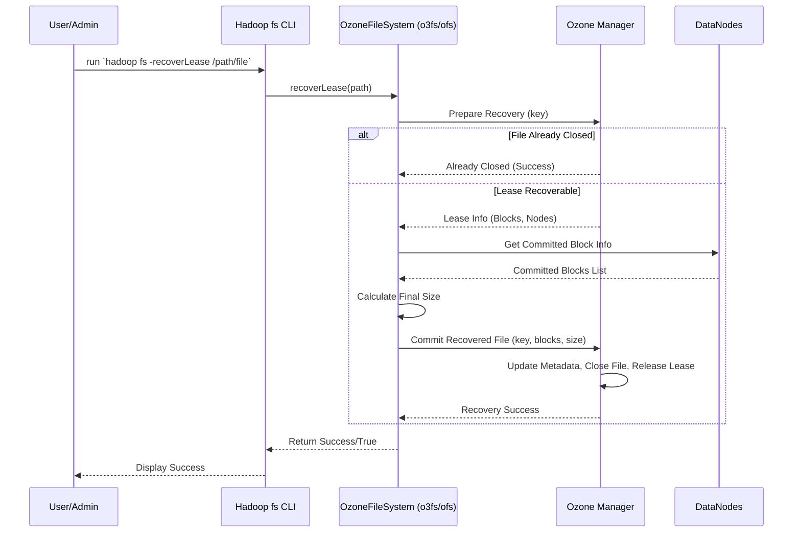

# Chapter 4: Lease Recovery

In the previous chapters, we explored how [OzoneFileSystem (o3fs)](01_ozonefilesystem__o3fs__.md), [RootedOzoneFileSystem (ofs)](02_rootedozonefilesystem__ofs__.md), and the [AbstractFileSystem Delegation (OzFs / RootedOzFs)](03_abstractfilesystem_delegation__ozfs___rootedozfs__.md) layers allow us to interact with Ozone like a familiar filesystem. Now, let's dive into a crucial safety feature that works behind the scenes: **Lease Recovery**.

## The Problem: What if a Writer Crashes?

Imagine you're writing a very large, important file to Ozone using a tool like Spark or Flink. To prevent others from interfering while you're writing, your application (the "client") asks Ozone for exclusive permission to modify the file. This permission is called a **lease**. Think of it like borrowing the *only* pen available to write in a specific notebook.

But what happens if your application suddenly crashes or loses network connection while it's still holding the lease (the pen)?

1.  **The File is Unfinished:** The write was interrupted, so the file contains only partial data.
2.  **The File is Locked:** Because the client crashed holding the lease, Ozone still thinks the file is being written to. No other application can write to it, or sometimes even read the incomplete data reliably. The notebook is stuck because the pen was never returned!

This could lead to data corruption, incomplete files, and resources being locked indefinitely. How do we safely clean up this mess?

## The Solution: Lease Recovery - The Helpful Janitor

Lease Recovery is Ozone's automatic safety mechanism to handle crashed writers. It acts like a helpful janitor for your data storage:

1.  **Detects Abandoned Work:** The system periodically checks for leases that haven't been "renewed" (the client checking in) for a certain amount of time. An expired lease usually means the client holding it has crashed or disappeared.
2.  **Assesses the Situation:** When an expired lease is found on a file, the Lease Recovery process kicks in. It needs to figure out how much data was *actually* successfully written and saved to the DataNodes before the crash.
3.  **Recovers What's Usable:** It communicates with the DataNodes (the storage workers) to gather all the confirmed, completed blocks (pieces) of the file.
4.  **Finalizes the File:** Based on the recovered blocks, it calculates the final, consistent length of the file. It then tells the Ozone Manager (the central coordinator) to "close" the file with this recovered data.
5.  **Releases the Lock:** Finally, it releases the lease, making the file (now finalized, though possibly shorter than intended) available for others to read or modify.

**Key Idea:** Lease Recovery ensures that even if a client crashes mid-write, the file is eventually finalized into a consistent state using the data that *was* successfully saved, and the lock (lease) is released. It prevents files from being stuck in an unusable, permanently locked state.

## How it Works (Mostly Automatic)

The best part about Lease Recovery is that it's designed to be largely **automatic**. You usually don't need to do anything!

*   **Lease Timeout:** Leases have a time limit. Clients normally renew their lease periodically while writing. If a client crashes, it stops renewing. After the timeout period, Ozone considers the lease expired and potentially recoverable.
*   **Automatic Trigger (Often):** In many scenarios, if another client tries to access or modify a file whose lease has expired, the system might automatically initiate the recovery process.
*   **Manual Trigger (If Needed):** If you suspect a file is locked due to a crashed client and the automatic recovery hasn't happened yet (or you want to force it), you *can* manually trigger the process.

## Using `recoverLease` - Manually Calling the Janitor

If you need to manually start the recovery process for a specific file, you can use the `hadoop fs -recoverLease` command. This is like specifically telling the janitor, "Please go check on this specific file *right now* and clean it up if necessary."

Let's say you know a job writing to `/data/important_logs.txt` crashed, and you want to make sure the file is usable.

```bash
hadoop fs -recoverLease ofs://om.example.com/data/important_logs.txt
```

Or using an `o3fs` path:

```bash
hadoop fs -recoverLease o3fs://mybucket.myvolume.om.example.com/data/important_logs.txt
```

**What happens when you run this command?**

1.  The Hadoop client connects to Ozone via the specified filesystem (`ofs` or `o3fs`).
2.  It tells the Ozone Manager: "I want to recover the lease for this file path."
3.  The Ozone Manager checks the lease status for the file:
    *   If the file is already closed (no active lease), it reports success (nothing to recover).
    *   If the lease is active but *not* expired (a client is still properly writing), it will usually fail (you can't recover a lease that's actively being used).
    *   If the lease *is* expired (or if recovery is forced), it initiates the recovery process described earlier (talking to DataNodes, finalizing the file, releasing the lease).
4.  If the recovery process completes successfully, the command usually finishes silently or prints a success message (`true`). If it fails (e.g., the lease was still valid), it throws an error.

**Output:**

*   **Success:** The command might just exit cleanly, or potentially output `true`. The file is now closed and the lease is released.
*   **Failure:** An error message indicating why recovery failed (e.g., file already closed, lease still held by an active client, internal error).

## Under the Hood: The Recovery Steps

Let's peek behind the curtain at what happens internally during lease recovery.

**Conceptual Steps:**

1.  **Initiation:** A client (or admin) calls the `recoverLease(path)` function on the Ozone filesystem (`OzoneFileSystem` or `RootedOzoneFileSystem`).
2.  **OM Prepare:** The filesystem asks the Ozone Manager (OM) to prepare for recovery on the specified file (key). The OM checks if the lease exists and if it's eligible for recovery (e.g., expired or recovery is forced). If the file is already closed, it tells the filesystem, and recovery succeeds immediately. If recovery can proceed, the OM provides information about the lease and the file's structure so far.
3.  **DN Communication:** The filesystem client code (specifically, a helper class like `LeaseRecoveryClientDNHandler`) uses the information from the OM to contact the DataNodes (DNs) that store the blocks (pieces) of the file. It asks the DNs, "Which blocks for this file have you *fully received and committed*?"
4.  **Gather Block Info:** The DNs report back the committed blocks they hold and their lengths.
5.  **Calculate Final State:** The client code gathers all the confirmed block information and calculates the total length of the file based only on the blocks that were successfully written before the crash.
6.  **OM Commit:** The filesystem client sends a final "commit recovery" request to the OM, providing the list of recovered blocks and the calculated final file size.
7.  **Finalization:** The OM updates the file's metadata to mark it as closed, sets its final size, records the list of valid blocks, and officially releases the lease.
8.  **Success:** The OM reports success back to the filesystem client, which reports success to the original caller.

**Sequence Diagram:**



**Code Glimpse:**

Both `OzoneFileSystem` (for `o3fs`) and `RootedOzoneFileSystem` (for `ofs`) implement the `LeaseRecoverable` interface, which requires them to have a `recoverLease` method. Let's look at a simplified version of what happens inside that method (referencing the code from Chapter 3's context).

```java
// Simplified structure from OzoneFileSystem.java and RootedOzoneFileSystem.java

// Both filesystems implement this interface method
@Override
public boolean recoverLease(Path f) throws IOException {
    statistics.incrementWriteOps(1); // Track the operation
    LOG.trace("recoverLease() path:{}", f);

    // 1. Prepare path and key name
    Path qualifiedPath = makeQualified(f); // Ensure path is complete
    String key = pathToKey(qualifiedPath); // Convert path to Ozone key string

    LeaseKeyInfo leaseKeyInfo;
    try {
        // 2. Ask OM to prepare recovery (check lease status)
        //    'forceRecovery' is a flag, usually false, set via system property
        leaseKeyInfo = getAdapter().recoverFilePrepare(key, forceRecovery);
    } catch (OMException e) {
        if (e.getResult() == OMException.ResultCodes.KEY_ALREADY_CLOSED) {
            // If OM says file is already closed, recovery is successful.
            return true;
        }
        throw e; // Other errors mean recovery failed.
    }

    // 3. Get committed block info from DataNodes
    //    This helper uses leaseKeyInfo to talk to the right DNs.
    List<OmKeyLocationInfo> keyLocationInfoList =
        LeaseRecoveryClientDNHandler.getOmKeyLocationInfos(
            leaseKeyInfo, getAdapter(), forceRecovery);

    // 4. Calculate final size from recovered blocks
    long keyLength = keyLocationInfoList.stream()
            .mapToLong(OmKeyLocationInfo::getLength).sum();

    // 5. Build arguments for the final commit call to OM
    OmKeyArgs keyArgs = new OmKeyArgs.Builder()
        .setVolumeName(leaseKeyInfo.getKeyInfo().getVolumeName())
        .setBucketName(leaseKeyInfo.getKeyInfo().getBucketName())
        .setKeyName(leaseKeyInfo.getKeyInfo().getKeyName())
        // ... other info like replication ...
        .setDataSize(keyLength) // The final recovered size
        .setLocationInfoList(keyLocationInfoList) // The list of good blocks
        .build();

    // 6. Tell OM to finalize the file with the recovered info
    getAdapter().recoverFile(keyArgs);

    // 7. Report success
    return true;
}
```

**Explanation:**

1.  **Setup:** The code gets the full path and the corresponding Ozone key name.
2.  **Prepare:** It calls `getAdapter().recoverFilePrepare(...)`. This is the first check with the Ozone Manager (OM). If the file is already closed, it returns `true` immediately. Otherwise, the OM returns information needed for the next steps.
3.  **DN Query:** The `LeaseRecoveryClientDNHandler` (a helper class, not shown in detail) takes the info from the OM and queries the relevant DataNodes to find out exactly which blocks were successfully saved.
4.  **Calculate Size:** It sums up the sizes of the confirmed blocks to get the final size of the recovered file.
5.  **Build Commit Args:** It prepares the arguments needed to tell the OM how to finalize the file (which blocks to include, final size, etc.).
6.  **Commit:** It calls `getAdapter().recoverFile(...)` to send the final instructions to the OM. The OM updates its records, officially closing the file and releasing the lease.
7.  **Success:** The method returns `true`.

This process ensures that the file is left in a consistent state based on whatever data was successfully persisted before the client failure.

## Conclusion

You've now learned about Lease Recovery, Ozone's vital safety net for handling client crashes during file writes. It automatically (or manually, if needed via `recoverLease`) cleans up incomplete files by figuring out what data was saved, finalizing the file, and releasing the lock (lease). This prevents data loss and ensures files don't remain locked indefinitely.

Understanding leases and recovery helps appreciate the robustness built into Ozone. Next, we'll look at a specific configuration option that changes how file creation behaves to more closely match traditional POSIX filesystem expectations, particularly regarding overwriting existing files.

Let's explore this in the next chapter: [Chapter 5: POSIX Create Behavior Modification](05_posix_create_behavior_modification_.md).

---

Generated by [AI Codebase Knowledge Builder](https://github.com/The-Pocket/Tutorial-Codebase-Knowledge)