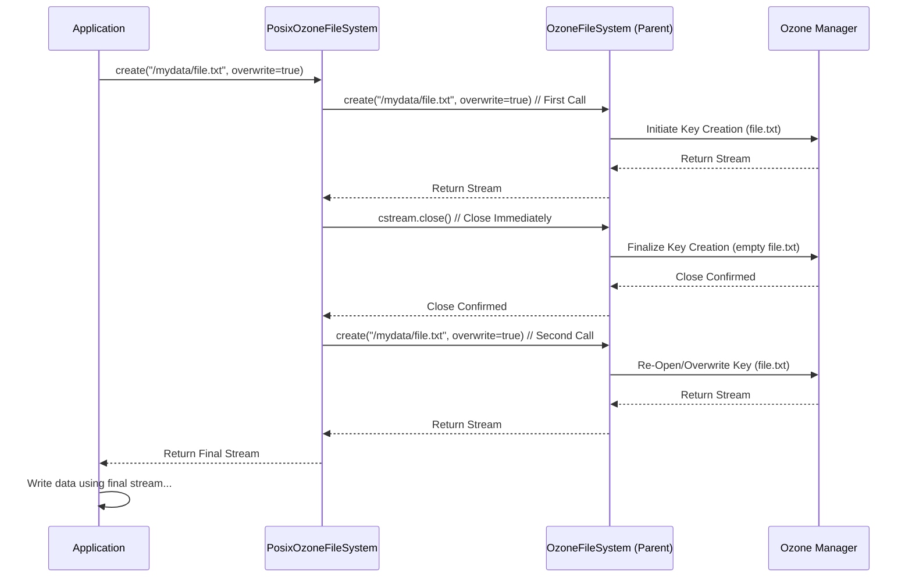

# Chapter 5: POSIX Create Behavior Modification

Welcome back! In [Chapter 4: Lease Recovery](04_lease_recovery_.md), we learned how Ozone handles crashes during file writes using Lease Recovery to keep files consistent and unlocked. Now, let's explore a subtle but sometimes important detail: how Ozone can adjust its file creation process to behave more like traditional filesystems.

## The Problem: Traditional Expectations vs. Distributed Systems

Imagine you're using an older application, or one originally designed for a standard Linux filesystem (which often follows rules called "POSIX"). These applications sometimes have very specific expectations about *exactly* when a file appears and when its initial properties (like ownership or permissions) are set after you ask to create it.

In many distributed filesystems, like Ozone or HDFS, creating a file is often optimized. When you call `create`, the system might reserve the name, but the file entry might not be fully "visible" or have all its final metadata set until you start writing data or explicitly `close` the file. This is usually fine, but for some specific applications expecting strict POSIX behavior, this delay can cause confusion or errors. They might try to check the file's existence or properties immediately after the `create` call starts and get unexpected results.

How can we make Ozone's file creation mimic this traditional POSIX behavior more closely?

## The Solution: Create, Close, Create Again!

Ozone offers two special filesystem classes that modify the `create` operation:

*   `PosixOzoneFileSystem`: An alternative to [OzoneFileSystem (o3fs)](01_ozonefilesystem__o3fs__.md).
*   `PosixRootedOzoneFileSystem`: An alternative to [RootedOzoneFileSystem (ofs)](02_rootedozonefilesystem__ofs__.md).

These classes change the `create` process slightly. Instead of just creating the file and returning a stream for writing, they follow a three-step sequence:

1.  **Create:** They first call the *standard* create method (from their parent class, `OzoneFileSystem` or `RootedOzoneFileSystem`). This begins the file creation process in Ozone.
2.  **Close:** They *immediately* close the output stream they just received. This forces the initial file creation to complete in Ozone. The file now exists, is empty, and its basic metadata (like name, initial permissions) is recorded.
3.  **Create Again:** They call the standard `create` method *again* for the same file path, usually with the `overwrite` flag set. Because the file now exists (from step 1 & 2), this effectively re-opens the file, ready for the application to write the actual data.

**Analogy: Reserving a Library Book Online**

Think of it like reserving a library book online:

1.  **Initial `create`:** You click "Reserve" online. The system *starts* the process, maybe marking the book as requested in its database. (Like `super.create()`).
2.  **Immediate `close`:** The website confirms "Reservation Placed!". The system finalizes the reservation; the book is now officially held for you, even though you haven't picked it up yet. (Like `cstream.close()`).
3.  **Second `create`:** You go to the library desk and say "I'm here for my reservation." They retrieve the reserved book and hand it to you, ready for you to read. (Like the second `super.create()`).

This sequence ensures that the file entry is fully created and visible in Ozone *before* the application receives the final output stream to write data.

## How to Use These Classes

You typically don't interact with `PosixOzoneFileSystem` or `PosixRootedOzoneFileSystem` directly in your code. Instead, you configure your Hadoop environment (usually in the `core-site.xml` file) to use these classes as the *default implementation* for the `o3fs` or `ofs` schemes, respectively, if you need this specific behavior.

**Conceptual Configuration (`core-site.xml`):**

```xml
<!-- To use Posix behavior for o3fs paths -->
<property>
  <name>fs.o3fs.impl</name>
  <value>org.apache.hadoop.fs.ozone.PosixOzoneFileSystem</value>
  <description>Use POSIX create behavior for o3fs.</description>
</property>

<!-- To use Posix behavior for ofs paths -->
<property>
  <name>fs.ofs.impl</name>
  <value>org.apache.hadoop.fs.ozone.PosixRootedOzoneFileSystem</value>
  <description>Use POSIX create behavior for ofs.</description>
</property>
```

By changing these configuration properties, any application using the standard Hadoop `FileSystem` API with `o3fs://` or `ofs://` paths will automatically use the POSIX-compliant versions with the modified `create` behavior.

## Under the Hood: The Create Sequence

Let's walk through what happens step-by-step when an application calls the `create` method on, for example, `PosixOzoneFileSystem`:

1.  **Application Call:** Your application calls `filesystem.create(path, ..., overwrite=true, ...)` using an instance of `PosixOzoneFileSystem`.
2.  **First `super.create()`:** The `PosixOzoneFileSystem`'s overridden `create` method immediately calls the `create` method of its parent class (`OzoneFileSystem`). This sends a request to the Ozone Manager (OM) to start creating the file/key. An output stream (`cstream`) connected to this initial operation is returned.
3.  **`cstream.close()`:** The `PosixOzoneFileSystem` code then *immediately* calls `cstream.close()`. This signals to Ozone that the initial file creation should be finalized. The OM writes the file's metadata, making the empty file visible and releasing any temporary locks associated with the initial creation.
4.  **Second `super.create()`:** The `PosixOzoneFileSystem` code then calls its parent's `create` method *again*, using the *exact same arguments* (including the path and `overwrite=true`).
5.  **OM Re-Opens:** The `OzoneFileSystem` sends another request to the OM. Since the file now exists and `overwrite` is true, the OM effectively re-opens the existing file (potentially truncating it to zero length if it wasn't already empty) and prepares it for writing.
6.  **Return Stream:** A new output stream connected to this second create/open operation is returned by the second `super.create()` call.
7.  **Application Writes:** This final output stream is returned to the application, which can now write its data as usual.

**Sequence Diagram:**

This diagram shows the flow for creating a file `/mydata/file.txt` using `PosixOzoneFileSystem`.



This extra create/close/create cycle ensures the file entry is stable and visible before the application starts writing the main content.

## Under the Hood: Code Snippets

The implementation is quite straightforward. These classes simply override the `create` method from their parent classes.

**`PosixOzoneFileSystem.java` (Simplified):**

```java
// From: src/main/java/org/apache/hadoop/fs/ozone/PosixOzoneFileSystem.java

// Inherits from the standard OzoneFileSystem
public class PosixOzoneFileSystem extends OzoneFileSystem {

  // This method overrides the standard create behavior
  @Override
  public FSDataOutputStream create(Path f, FsPermission permission,
                                   boolean overwrite, int bufferSize,
                                   short replication, long blockSize,
                                   Progressable progress) throws IOException {

    // 1. Call the standard create method from OzoneFileSystem (parent)
    FSDataOutputStream cstream = super.create(f, permission, overwrite,
        bufferSize, replication, blockSize, progress);

    // 2. Immediately close the stream from the first create call
    //    This forces the file entry to be finalized in Ozone.
    cstream.close();

    // 3. Call the standard create method AGAIN with the same arguments.
    //    This re-opens the file for the application to write data.
    return super.create(f, permission, overwrite, bufferSize,
        replication, blockSize, progress);
  }
}
```

**`PosixRootedOzoneFileSystem.java` (Simplified):**

The code is identical, except it inherits from `RootedOzoneFileSystem`:

```java
// From: src/main/java/org/apache/hadoop/fs/ozone/PosixRootedOzoneFileSystem.java

// Inherits from the standard RootedOzoneFileSystem
public class PosixRootedOzoneFileSystem extends RootedOzoneFileSystem {

  // Overrides the standard create behavior
  @Override
  public FSDataOutputStream create(Path f, FsPermission permission,
      boolean overwrite, int bufferSize, short replication, long blockSize,
      Progressable progress) throws IOException {

    // 1. Call the standard create method from RootedOzoneFileSystem (parent)
    FSDataOutputStream cstream = super.create(f, permission, overwrite,
        bufferSize, replication, blockSize, progress);

    // 2. Immediately close the stream.
    cstream.close();

    // 3. Call the standard create method AGAIN.
    return super.create(f, permission, overwrite, bufferSize,
        replication, blockSize, progress);
  }
}
```

**Explanation:**

*   **`extends ...`**: Each class inherits all the functionality of its parent ([OzoneFileSystem (o3fs)](01_ozonefilesystem__o3fs__.md) or [RootedOzoneFileSystem (ofs)](02_rootedozonefilesystem__ofs__.md)).
*   **`@Override create(...)`**: They provide their own version of the `create` method.
*   **`super.create(...)`**: This calls the `create` method of the parent class. It's called twice.
*   **`cstream.close()`**: This is the key step that forces the finalization of the initial file creation *before* the application gets the stream to write data.

## Conclusion

You've now learned about `PosixOzoneFileSystem` and `PosixRootedOzoneFileSystem`! These are specialized versions of the main Ozone filesystem interfaces ([OzoneFileSystem (o3fs)](01_ozonefilesystem__o3fs__.md) and [RootedOzoneFileSystem (ofs)](02_rootedozonefilesystem__ofs__.md)) that modify the `create` operation to more closely mimic traditional POSIX behavior. By performing a `create`, `close`, and then `create` again sequence, they ensure a file entry is fully established before the application begins writing, satisfying the expectations of certain applications. You typically enable them via configuration if needed.

This concludes our initial journey through the core concepts of using Ozone as a filesystem via `ozonefs`! We've covered the basic access methods (`o3fs`, `ofs`), compatibility layers (`OzFs`, `RootedOzFs`), safety features (`Lease Recovery`), and specific behavior modifications (`POSIX Create`). With this foundation, you should be well-equipped to start using Ozone with your Hadoop-ecosystem tools.

---

Generated by [AI Codebase Knowledge Builder](https://github.com/The-Pocket/Tutorial-Codebase-Knowledge)