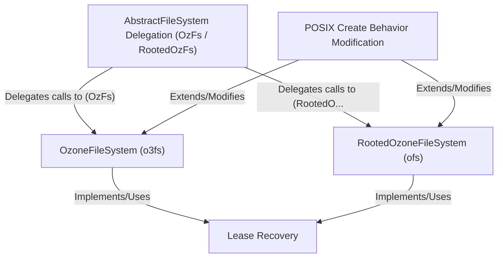

# Tutorial: ozonefs

`ozonefs` lets you use the *Apache Ozone* object store like a regular Hadoop filesystem.
It provides two main ways to access data: `o3fs`, which requires specifying a *volume and bucket*, and `ofs`, which presents volumes and buckets like top-level directories under root `/`.
The project includes adapters (**AbstractFileSystem Delegation**) for compatibility with older Hadoop tools.
It features **Lease Recovery** to protect against data loss if a client crashes while writing a file.
It also offers optional modifications for *POSIX-like* file creation behavior.

**Source Repository:** [None](None)

## Chapters

1. [OzoneFileSystem (o3fs)
](01_ozonefilesystem__o3fs__.md)
2. [RootedOzoneFileSystem (ofs)
](02_rootedozonefilesystem__ofs__.md)
3. [AbstractFileSystem Delegation (OzFs / RootedOzFs)
](03_abstractfilesystem_delegation__ozfs___rootedozfs__.md)
4. [Lease Recovery
](04_lease_recovery_.md)
5. [POSIX Create Behavior Modification
](05_posix_create_behavior_modification_.md)

---

Generated by [AI Codebase Knowledge Builder](https://github.com/The-Pocket/Tutorial-Codebase-Knowledge)