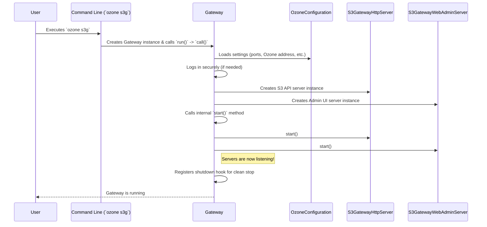

# Chapter 1: S3 Gateway Server

Welcome to the `s3gateway` tutorial! We're excited to guide you through the different parts of this project. Let's start with the very beginning: the main engine that runs the whole show.

## What's the Big Idea?

Imagine you have a cool application, maybe a photo backup tool or a data analysis program, that's designed to talk to Amazon S3 (Simple Storage Service). S3 is a popular way to store files online.

Now, what if you want to use Apache Ozone, a powerful storage system, as the backend for your application, but you *don't* want to rewrite your application to speak Ozone's native language? That's where the `s3gateway` comes in!

The `s3gateway` acts like a translator. It speaks the S3 language to your application and translates those requests into actions that Ozone understands.

The **S3 Gateway Server** is the core component that *starts* and *runs* this translation service. Think of it like the engine of a car. It doesn't handle the steering (request details) or the radio (specific data formats) directly, but it's responsible for getting everything powered up and keeping the car running smoothly.

## Starting the Engine: The `Gateway` Class

The main piece of code that kicks everything off is the `Gateway` class. When you want to run the S3 Gateway, you're essentially running this class.

Let's look at the very start:

```java
// File: src/main/java/org/apache/hadoop/ozone/s3/Gateway.java

package org.apache.hadoop.ozone.s3;

// ... lots of import statements ...
import picocli.CommandLine.Command;
import java.util.concurrent.Callable;

/**
 * This class is used to start/stop S3 compatible rest server.
 */
@Command(name = "ozone s3g", /* ... other annotations ... */)
public class Gateway extends GenericCli implements Callable<Void> {

  private static final Logger LOG = LoggerFactory.getLogger(Gateway.class);

  private S3GatewayHttpServer httpServer; // Server for S3 API calls
  private BaseHttpServer contentServer;   // Server for Web Admin UI
  // ... other fields like metrics ...

  public static void main(String[] args) throws Exception {
    // ... some initial setup ...
    new Gateway().run(args); // Create a Gateway object and run it!
  }

  @Override
  public Void call() throws Exception {
    // This is where the main setup happens!
    // 1. Load configuration
    // 2. Handle security login (if needed)
    // 3. Create the HTTP servers
    // 4. Start the servers
    // 5. Set up a way to stop cleanly (Shutdown Hook)
    // ... implementation details below ...
    return null;
  }

  // ... methods for start(), stop(), loginS3GUser() ...
}
```

*   **`public static void main(String[] args)`:** This is the standard entry point for any Java application. When you run the command `ozone s3g` from your terminal, this `main` method is the first thing that gets executed.
*   **`new Gateway().run(args);`:** Inside `main`, it creates an instance of the `Gateway` class and tells it to `run`. This uses a command-line parsing library (picocli) to handle arguments, but eventually, it calls the `call()` method.
*   **`public Void call() throws Exception`:** This is the heart of the startup process. It orchestrates all the steps needed to get the gateway ready.

## The Startup Sequence: Step-by-Step

When the `call()` method runs, it does several important things in order:

1.  **Load Configuration:** It needs to know things like which network port to listen on, where Ozone is located, and security settings. It loads these from configuration files. We'll dive deeper into this in [Chapter 7: Configuration Management](07_configuration_management_.md).
2.  **Security Login (Optional):** If the Ozone cluster is secured (e.g., using Kerberos), the gateway needs to log in, just like a user would, to prove its identity before it can interact with Ozone.
3.  **Create HTTP Servers:** The gateway actually starts *two* web servers:
    *   `S3GatewayHttpServer`: This server listens for incoming S3 API requests from your applications (like `PUT object`, `GET object`, `LIST buckets`). This is the main "translator" part.
    *   `S3GatewayWebAdminServer`: This server provides a simple web page (Admin UI) and potentially other administrative endpoints. It runs on a separate network port.
4.  **Start Servers:** Once the servers are created and configured, the `start()` method is called to actually turn them on and make them listen for connections.
5.  **Register Shutdown Hook:** It sets up a mechanism to ensure that if you stop the gateway (e.g., by pressing Ctrl+C in the terminal), the servers shut down gracefully, finishing any ongoing tasks and releasing resources.

Let's visualize this startup flow:



## Diving Deeper: Creating and Starting Servers

Let's peek inside the `call()` and `start()` methods in `Gateway.java`:

```java
// File: src/main/java/org/apache/hadoop/ozone/s3/Gateway.java

// Inside the call() method...
@Override
public Void call() throws Exception {
  OzoneConfiguration ozoneConfiguration = getOzoneConf(); // Load config
  OzoneConfigurationHolder.setConfiguration(ozoneConfiguration); // Make config accessible
  // ... Tracing setup ...
  UserGroupInformation.setConfiguration(OzoneConfigurationHolder.configuration());
  loginS3GUser(OzoneConfigurationHolder.configuration()); // Handle security
  // ... other setup ...

  // *** Create the Servers ***
  httpServer = new S3GatewayHttpServer(OzoneConfigurationHolder.configuration(), "s3gateway");
  contentServer = new S3GatewayWebAdminServer(OzoneConfigurationHolder.configuration(), "s3g-web");

  // ... metrics setup ...

  start(); // Call the start method

  // Setup clean shutdown
  ShutdownHookManager.get().addShutdownHook(() -> {
      try {
          stop();
      } catch (Exception e) {
          // log error
      }
  }, DEFAULT_SHUTDOWN_HOOK_PRIORITY);
  return null;
}

public void start() throws IOException {
  // ... logging ...
  LOG.info("Starting Ozone S3 gateway");
  // ... metrics ...

  // *** Start the Servers ***
  httpServer.start();    // Start listening for S3 API calls
  contentServer.start(); // Start listening for Admin UI requests
}

public void stop() throws Exception {
  LOG.info("Stopping Ozone S3 gateway");
  httpServer.stop();    // Stop the S3 API server
  contentServer.stop(); // Stop the Admin UI server
  // ... stop other components like metrics ...
}
```

*   `new S3GatewayHttpServer(...)`: This line creates the server responsible for handling the actual S3 protocol requests. It gets the configuration so it knows which port to use, security settings, etc.
*   `new S3GatewayWebAdminServer(...)`: This creates the second server for the web interface.
*   `httpServer.start()` and `contentServer.start()`: These lines actually fire up the engines, making the servers begin listening for incoming network connections on their configured ports.
*   `stop()`: This method does the reverse, shutting down the servers cleanly when the gateway process is terminated.

The `S3GatewayHttpServer` and `S3GatewayWebAdminServer` classes themselves are built upon a common base (`BaseHttpServer`) which handles the lower-level details of running a web server (like managing connections and threads). They are configured with specific settings relevant to the S3 gateway (like API addresses and authentication types).

For example, `S3GatewayHttpServer.java` mainly defines *which* configuration keys to use for its settings:

```java
// File: src/main/java/org/apache/hadoop/ozone/s3/S3GatewayHttpServer.java

public class S3GatewayHttpServer extends BaseHttpServer {

  // ... constructor ...

  @Override
  protected String getHttpAddressKey() {
    // Tells the base server which config key defines the HTTP address
    return S3GatewayConfigKeys.OZONE_S3G_HTTP_ADDRESS_KEY;
  }

  @Override
  protected String getHttpBindPortDefault() {
    // Tells the base server the default port if not configured
    return S3GatewayConfigKeys.OZONE_S3G_HTTP_BIND_PORT_DEFAULT;
  }

  // ... methods for HTTPS, Host binding, Auth config etc...

}
```

## What Happens Next?

Once the S3 Gateway Server is up and running (`httpServer.start()` has finished), it just sits there, listening.

What happens when an S3 client (your application) sends a request (like "create a bucket" or "upload a file") to the gateway's address and port?

That's where the next parts of the puzzle come in! The incoming request will first go through a series of checks and preparations called [Request Filters](02_request_filters_.md), and then it will be directed to the specific code that handles that particular S3 operation, known as [Request Endpoints](04_request_endpoints_.md).

## Conclusion

You've now learned about the **S3 Gateway Server**, the main entry point (`Gateway.java`) responsible for starting and managing the entire S3 gateway process.

*   It acts like the **engine** of the `s3gateway`.
*   It's started via the `main` method, typically using the `ozone s3g` command.
*   Its core `call()` method loads configuration, handles security, and creates two HTTP servers: one for S3 API calls (`S3GatewayHttpServer`) and one for a web admin UI (`S3GatewayWebAdminServer`).
*   The `start()` method fires up these servers, making them ready to accept connections.
*   It ensures a clean shutdown process.

The S3 Gateway Server sets the stage. In the next chapter, we'll look at the first step in processing an incoming request: [Chapter 2: Request Filters](02_request_filters_.md).

---

Generated by [AI Codebase Knowledge Builder](https://github.com/The-Pocket/Tutorial-Codebase-Knowledge)