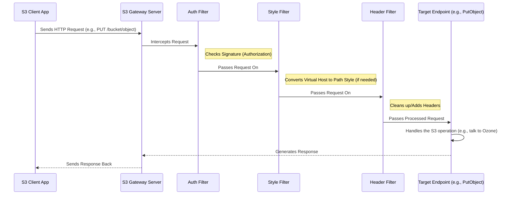

# Chapter 2: Request Filters

In [Chapter 1: S3 Gateway Server](01_s3_gateway_server_.md), we saw how the main `Gateway` class starts up the engine that listens for S3 requests. But what happens *immediately* after a request arrives from an S3 client (like your application)? Does it go straight to the code that handles uploading a file or listing buckets? Not quite!

Before the main work begins, the request needs to go through some important preparation and checks, like passing through security and processing at an airport before you board your flight. This is where **Request Filters** come in.

## What's the Big Idea? Airport Checkpoints for Requests

Imagine an incoming HTTP request (like "Please upload `photo.jpg` to the `vacation` bucket") arriving at the S3 Gateway. Before the gateway can actually perform the upload to Ozone, it needs to:

1.  **Check Credentials:** Is this request properly signed? Does the user have permission? (Like Passport Control)
2.  **Understand the Request Format:** Is the request using "virtual host style" (`vacation.s3.yourdomain.com`) or "path style" (`s3.yourdomain.com/vacation`)? The gateway might need to convert it internally. (Like making sure your travel documents match the destination's requirements)
3.  **Tidy Up Headers:** Some S3 clients send slightly different or even missing information in the request headers. The gateway might need to add or adjust these for consistency. (Like adding a standard luggage tag)
4.  **Note Down Details:** It's useful to know where the request came from (client's IP address) and to start logging/tracing its journey through the system. (Like noting your origin and starting a tracking record for your journey)

**Request Filters** are special pieces of code designed to handle exactly these kinds of tasks. They act as interceptors, examining and potentially modifying the incoming request *before* it reaches the final destination – the code that performs the specific S3 operation (which we'll call [Request Endpoints](04_request_endpoints_.md)).

## The Filter Chain: A Series of Checkpoints

Requests don't just go through one filter; they typically pass through a series of filters, forming a **chain**. Each filter performs its specific task and then passes the request along to the next filter in the chain.



This diagram shows a simplified flow. The request arrives, goes through several filters (Authorization, Style Conversion, Header Cleanup), and *then* reaches the actual endpoint code that handles the specific S3 command.

## Key Types of Filters in `s3gateway`

Let's look at some important filters used in `s3gateway`:

1.  **`AuthorizationFilter`:** ([`AuthorizationFilter.java`](./AuthorizationFilter.java))
    *   **Job:** Checks the `Authorization` header in the request.
    *   **Analogy:** Passport Control / Ticket Check.
    *   **Details:** This filter parses the signature information sent by the client. It extracts the AWS Access Key ID and prepares the details needed to verify if the request signature is valid. We'll learn much more about this in [Chapter 3: S3 Signature Processing](03_s3_signature_processing_.md). It ensures that only requests with valid-looking credentials proceed.

    ```java
    // File: src/main/java/org/apache/hadoop/ozone/s3/AuthorizationFilter.java

    @Provider // Tells the system this is a filter
    @PreMatching // Run before matching to an endpoint
    @Priority(AuthorizationFilter.PRIORITY) // Sets the order (runs early)
    public class AuthorizationFilter implements ContainerRequestFilter {
      // ... other fields ...

      @Inject // Gets the SignatureProcessor automatically
      private SignatureProcessor signatureProcessor;

      @Inject // Gets a place to store signature details
      private SignatureInfo signatureInfo;

      @Override
      public void filter(ContainerRequestContext context) throws IOException {
        try {
          // Step 1: Parse the signature from the request headers
          signatureInfo.initialize(signatureProcessor.parseSignature());

          // Step 2: Prepare the "string-to-sign" (more in Chapter 3)
          // ... prepare string to sign based on V4 signature ...

          // Step 3: Check if the Access Key ID looks valid
          String awsAccessId = signatureInfo.getAwsAccessId();
          if (awsAccessId == null || awsAccessId.equals("")) {
            LOG.debug("Malformed s3 header. awsAccessID missing.");
            throw ACCESS_DENIED; // Reject the request
          }
          // If we get here, the basic structure looks okay.
          // Actual signature *validation* happens later.
        } catch (OS3Exception ex) {
          // Handle S3 specific errors
          throw wrapOS3Exception(ex);
        } catch (Exception e) {
          // Handle other unexpected errors
          throw wrapOS3Exception(INTERNAL_ERROR);
        }
      }
      // ... helper methods ...
    }
    ```
    *   **Explanation:** This filter uses the `SignatureProcessor` to decode the `Authorization` header. It stores the results (like Access Key ID, signature version) in `SignatureInfo` and performs a basic check to ensure the Access Key ID is present. If not, it stops the request immediately.

2.  **`VirtualHostStyleFilter`:** ([`VirtualHostStyleFilter.java`](./VirtualHostStyleFilter.java))
    *   **Job:** Converts S3 "virtual host style" requests into "path style" requests.
    *   **Analogy:** Standardizing addresses before processing mail.
    *   **Details:** S3 requests can specify the bucket in two ways:
        *   **Virtual Host Style:** `http://my-bucket.s3.yourdomain.com/my-object.txt` (Bucket name is part of the hostname)
        *   **Path Style:** `http://s3.yourdomain.com/my-bucket/my-object.txt` (Bucket name is the first part of the path)
        The S3 Gateway internally prefers the path style. This filter detects virtual host style requests based on the `Host` header and configured domain names (e.g., `s3.yourdomain.com`), extracts the bucket name, and rewrites the request URI to the path style format.

    ```java
    // File: src/main/java/org/apache/hadoop/ozone/s3/VirtualHostStyleFilter.java

    @Provider
    @PreMatching
    @Priority(VirtualHostStyleFilter.PRIORITY) // Run after Auth filter
    public class VirtualHostStyleFilter implements ContainerRequestFilter {
        // ... fields for config and domain names ...

        @Override
        public void filter(ContainerRequestContext requestContext) throws IOException {
            // ... load configured domain names (e.g., "s3.mycompany.com") ...
            if (domains.length == 0) return; // Nothing to do if no domains configured

            String host = requestContext.getHeaderString(HttpHeaders.HOST); // e.g., "my-bucket.s3.mycompany.com"
            String domain = getDomainName(host); // Find matching domain, e.g., "s3.mycompany.com"

            if (domain == null) { /* handle error */ }

            // Is it virtual host style? (Host is longer than the base domain)
            if (host.length() > domain.length()) {
                // Extract bucket name: "my-bucket." -> "my-bucket"
                String bucketName = host.substring(0, host.length() - domain.length());
                bucketName = bucketName.substring(0, bucketName.length() - 1); // Remove trailing '.'

                // Rebuild the URI to be path-style
                URI baseURI = requestContext.getUriInfo().getBaseUri(); // e.g., http://s3.mycompany.com/
                String currentPath = requestContext.getUriInfo().getPath(); // e.g., /my-object.txt
                String newPath = bucketName; // e.g., my-bucket

                // Create new URI: http://s3.mycompany.com/my-bucket/my-object.txt
                UriBuilder builder = UriBuilder.fromUri(baseURI).path(newPath);
                if (currentPath != null) builder.path(currentPath);
                // ... add query params ...
                URI newUri = builder.build();

                // Tell the request context to use the new URI
                requestContext.setRequestUri(baseURI, newUri);
                LOG.debug("Rewrote virtual host request to: {}", newUri);
            }
        }
        // ... helper methods like getDomainName ...
    }
    ```
    *   **Explanation:** This filter checks if the `Host` header indicates a virtual host style request. If it does, it extracts the bucket name and uses `UriBuilder` to construct a new path-style URI. Finally, `requestContext.setRequestUri()` modifies the request *before* it goes further down the chain or to an endpoint.

3.  **`HeaderPreprocessor`:** ([`HeaderPreprocessor.java`](./HeaderPreprocessor.java))
    *   **Job:** Adjusts or adds `Content-Type` headers for compatibility with certain S3 client behaviors.
    *   **Analogy:** Adding a missing label or correcting a typo on a package.
    *   **Details:** Sometimes S3 clients don't send the correct `Content-Type` header for specific operations (like multipart uploads or delete requests). This filter checks for query parameters (like `?uploads` or `?delete`) that indicate these special operations and sets the appropriate `Content-Type` header so the request gets routed to the correct endpoint code.

    ```java
    // File: src/main/java/org/apache/hadoop/ozone/s3/HeaderPreprocessor.java

    @Provider
    @PreMatching
    @Priority(HeaderPreprocessor.PRIORITY) // Run after VirtualHostStyleFilter
    public class HeaderPreprocessor implements ContainerRequestFilter {
        // ... constants ...

        @Override
        public void filter(ContainerRequestContext requestContext) throws IOException {
            MultivaluedMap<String, String> queryParams =
                requestContext.getUriInfo().getQueryParameters();
            MultivaluedMap<String, String> headers = requestContext.getHeaders();

            // If query param "?delete" exists...
            if (queryParams.containsKey("delete")) {
                // Force Content-Type to XML, as expected by the delete endpoint
                headers.putSingle(CONTENT_TYPE, MediaType.APPLICATION_XML);
            }
            // If query param "?uploadId" exists (part of multipart upload)...
            else if (queryParams.containsKey("uploadId")) {
                // Force Content-Type to XML, as expected by multipart endpoints
                headers.putSingle(CONTENT_TYPE, MediaType.APPLICATION_XML);
            }
            // If query param "?uploads" exists (initiate multipart upload)...
            else if (queryParams.containsKey("uploads")) {
                // Mark it specially - the body is empty, not XML or octet-stream
                headers.putSingle(CONTENT_TYPE, MULTIPART_UPLOAD_MARKER);
            }
        }
    }
    ```
    *   **Explanation:** This filter looks at the query parameters in the URL. Based on parameters like `delete`, `uploadId`, or `uploads`, it modifies the `Content-Type` header within the request (`requestContext.getHeaders()`) to ensure the framework routes the request correctly later on.

4.  **Other Filters:**
    *   `TracingFilter`: Starts and stops recording trace information (like a log of the request's journey) for performance monitoring.
    *   `ClientIpFilter`: Tries to determine the original client's IP address, even if the gateway is behind a proxy or load balancer, and adds it as a header.
    *   `EmptyContentTypeFilter`: Handles requests from clients that might send an empty `Content-Type` header, preventing errors.

## How Filters are Activated

You might wonder how the S3 Gateway knows to run these filters. It uses a standard Java framework for building web services (JAX-RS).

*   The `@Provider` annotation on a filter class tells the framework, "Hey, this class is a component that might intercept requests or responses."
*   Implementing `ContainerRequestFilter` means the `filter()` method in that class should be called for incoming requests.
*   The `@Priority` annotation helps control the order in which filters run. Lower numbers run earlier.
*   `@PreMatching` means the filter runs *before* the framework tries to match the request path to a specific endpoint method. This is crucial for filters like `VirtualHostStyleFilter` that modify the path itself.

The `S3GatewayHttpServer` (from Chapter 1) is configured to automatically scan for and register these `@Provider` classes when it starts up.

## Beyond Requests: Response Filters

Just as filters can process incoming requests, they can also process outgoing responses *after* the endpoint has done its work but *before* the response is sent back to the client. These implement `ContainerResponseFilter`.

*   **`CommonHeadersContainerResponseFilter`:** Adds standard headers like `Server: Ozone` and unique request IDs (`x-amz-request-id`, `x-amz-id-2`) to every response.
*   **`TracingFilter` (again):** This filter also implements `ContainerResponseFilter` to *finish* the tracing span it started when the request came in, recording the total time taken.

## Conclusion

Request Filters are essential components in the `s3gateway`. They act like checkpoints and processors for incoming HTTP requests:

*   They **intercept** requests before they reach the main S3 operation handlers ([Request Endpoints](04_request_endpoints_.md)).
*   They perform crucial tasks like **authentication checks**, **request format standardization** (virtual host vs. path style), **header adjustments**, and setting up **tracing**.
*   They work as a **chain**, passing the request from one filter to the next.
*   Key examples include `AuthorizationFilter`, `VirtualHostStyleFilter`, and `HeaderPreprocessor`.
*   They ensure requests are valid, understandable, and properly formatted before the core S3 logic is executed.
*   Response filters perform similar tasks for outgoing responses.

Now that we understand how requests are initially checked and prepared by filters, especially the `AuthorizationFilter`, we need to dive deeper into how S3 request signatures are actually calculated and verified. That's the focus of our next chapter.

Next up: [Chapter 3: S3 Signature Processing](03_s3_signature_processing_.md)

---

Generated by [AI Codebase Knowledge Builder](https://github.com/The-Pocket/Tutorial-Codebase-Knowledge)