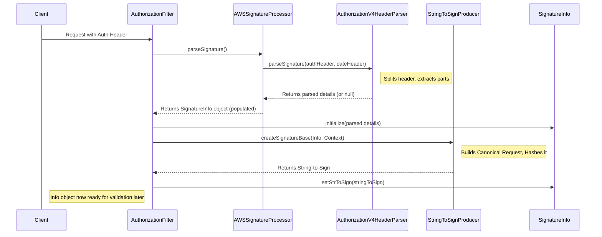

# Chapter 3: S3 Signature Processing

In [Chapter 2: Request Filters](02_request_filters_.md), we saw how filters like `AuthorizationFilter` act as the first checkpoint for incoming requests. The `AuthorizationFilter`'s main job is to look at the credentials sent with the request. But how does it make sense of those credentials? And how does the gateway *really* know if the request is authentic?

Welcome to the world of **S3 Signature Processing**! This chapter explains how the `s3gateway` handles the complex but crucial task of understanding and preparing S3 request signatures for validation.

## What's the Big Idea? Verifying the Sender's Identity

Imagine you receive an important, official document in the mail. How do you know it's really from the sender and hasn't been faked or altered? You might look for an official seal or a signature you recognize.

Amazon S3 works similarly. To prevent unauthorized access and ensure data integrity, S3 requires most requests to be "signed". This isn't a handwritten signature, but a cryptographic one generated using a secret key known only to the user and AWS (or in our case, Ozone).

The **S3 Signature Processing** components in `s3gateway` are like a notary public. Their job is to:

1.  **Examine the Credentials:** Look at the "signature" and other details provided in the request (usually in the `Authorization` header).
2.  **Understand the Document:** Reconstruct the important parts of the request (like the method, path, headers) in a very precise, standardized format.
3.  **Prepare for Verification:** Extract all the necessary pieces so that later, the gateway can check if the provided signature matches what it *should* be for that specific request and user.

Our main use case here is: **How does the `s3gateway` parse the authorization information sent by an S3 client to prepare for verifying the request's authenticity?**

## Key Concepts: Deconstructing the Signature

S3 request signing, especially the modern **Signature Version 4 (SigV4)**, involves several key ideas:

1.  **The Signature:** A cryptographic hash (like a complex fingerprint) generated using a secret key and details about the request. It proves the sender knew the secret key and that the request details haven't been tampered with since signing.
2.  **Access Key ID:** Like a username. It identifies *who* is making the request. It's sent publicly.
3.  **Secret Access Key:** Like a password. **It is never sent in the request.** Instead, it's used *by the client* to generate the signature. The gateway (knowing the secret key associated with the Access Key ID) can regenerate the signature itself to verify it.
4.  **Canonical Request:** This is the request's core information (HTTP method, path, query parameters, headers, and a hash of the request body) formatted according to very strict rules (lowercase headers, sorted query parameters, specific encoding). Think of it as getting the document into a perfectly standardized format before signing.
5.  **String-to-Sign:** A string containing metadata (the signing algorithm used, the request timestamp, the *credential scope* - date/region/service), and a hash of the *Canonical Request*. This is the specific piece of text that gets signed. Analogy: The exact summary statement the notary signs.
6.  **Signing Key:** A temporary, derived key created from the user's Secret Access Key, the date, the AWS region, and the service (s3). This key is used with a hashing algorithm (HMAC-SHA256) to sign the "String-to-Sign". Analogy: The notary's unique seal used on a specific day for a specific type of document.

**The Goal of Parsing:** The signature processing code needs to extract the Access Key ID, the provided Signature, the timestamp, credential scope, signed headers list, and *construct* the Canonical Request and String-to-Sign based on the incoming request details. This information is then used later to perform the actual verification.

## How `s3gateway` Parses Signatures

Let's follow the journey of an incoming request's `Authorization` header:

1.  **Arrival:** An S3 client sends a request, for example, to upload `photo.jpg`. It includes an `Authorization` header containing the SigV4 signature details.
    ```http
    PUT /my-bucket/photo.jpg HTTP/1.1
    Host: s3.example.com
    x-amz-date: 20230110T120000Z
    x-amz-content-sha256: e3b0c44298fc1c149afbf4c8996fb92427ae41e4649b934ca495991b7852b855
    Authorization: AWS4-HMAC-SHA256 Credential=ACCESSKEYID/20230110/us-east-1/s3/aws4_request, SignedHeaders=host;x-amz-content-sha256;x-amz-date, Signature=abcdef1234567890...
    Content-Length: 0

    ```
2.  **Filtering:** The request hits the `AuthorizationFilter` we saw in [Chapter 2: Request Filters](02_request_filters_.md).
3.  **Parsing Begins:** The `AuthorizationFilter` calls the `SignatureProcessor` (specifically, the `AWSSignatureProcessor` implementation) to make sense of the `Authorization` header (or query parameters, if the signature is sent that way).

    ```java
    // Inside AuthorizationFilter.java filter() method
    @Inject
    private SignatureProcessor signatureProcessor; // Gets the main parser
    @Inject
    private SignatureInfo signatureInfo; // A place to store the parsed details

    // ... inside the filter method ...
    // Ask the processor to parse the signature from the request context
    signatureInfo.initialize(signatureProcessor.parseSignature());
    // signatureInfo now holds AccessKeyID, Signature, Scope, etc.
    ```
    *   **Explanation:** The filter uses dependency injection (`@Inject`) to get instances of the `SignatureProcessor` and `SignatureInfo`. It calls `parseSignature()` to do the heavy lifting.

4.  **Trying Different Formats:** The `AWSSignatureProcessor` knows that signatures can come in different formats (SigV4 in header, SigV4 in query parameters, or the older SigV2). It tries parsers for each format until one succeeds.

    ```java
    // Inside AWSSignatureProcessor.java parseSignature() method
    public SignatureInfo parseSignature() throws OS3Exception {
        // Get headers and query parameters from the request context
        String authHeader = headers.get("Authorization");
        Map<String, String> queryParams = ... ;
        String dateHeader = headers.get(StringToSignProducer.X_AMAZ_DATE);

        List<SignatureParser> parsers = new ArrayList<>();
        // Try parsing V4 Header format first
        parsers.add(new AuthorizationV4HeaderParser(authHeader, dateHeader));
        // Then try V4 Query Parameter format
        parsers.add(new AuthorizationV4QueryParser(queryParams));
        // Then try the older V2 Header format
        parsers.add(new AuthorizationV2HeaderParser(authHeader));

        SignatureInfo parsedInfo = null;
        for (SignatureParser parser : parsers) {
            parsedInfo = parser.parseSignature(); // Try parsing
            if (parsedInfo != null) {
                break; // Found a match!
            }
        }
        // ... handle case where no parser matched ...
        return parsedInfo; // Return the details found
    }
    ```
    *   **Explanation:** This code creates specific parser objects (`AuthorizationV4HeaderParser`, etc.) and tries each one using the request's headers and query parameters. The first one that successfully parses the signature "wins".

5.  **Extracting V4 Details:** If the `AuthorizationV4HeaderParser` succeeds, it breaks down the `Authorization` header string.

    ```java
    // Simplified snippet from AuthorizationV4HeaderParser.java
    public SignatureInfo parseSignature() throws MalformedResourceException {
        if (authHeader == null || !authHeader.startsWith("AWS4")) {
            return null; // Not a V4 header
        }
        // Example Auth Header:
        // AWS4-HMAC-SHA256 Credential=ACCESSKEYID/20230110/us-east-1/s3/aws4_request, SignedHeaders=host;x-amz-content-sha256;x-amz-date, Signature=abcdef...

        // 1. Split the header into parts based on ", "
        String[] parts = authHeader.substring(...).split(", *");

        // 2. Parse the Credential part (ACCESSKEYID/Date/Region/Service/...)
        Credential credential = parseCredentials(parts[0]); // Extracts ACCESSKEYID, Date, Region, etc.

        // 3. Parse the SignedHeaders part (list of headers included in signature)
        String signedHeaders = parseSignedHeaders(parts[1]); // Extracts "host;x-amz-content-sha256;x-amz-date"

        // 4. Parse the Signature part (the actual signature hex string)
        String signature = parseSignature(parts[2]); // Extracts "abcdef..."

        // 5. Store everything in a SignatureInfo object
        return new SignatureInfo.Builder(Version.V4)
            .setAwsAccessId(credential.getAccessKeyID())
            .setCredentialScope(credential.createScope()) // e.g., "20230110/us-east-1/s3/aws4_request"
            .setSignedHeaders(signedHeaders)
            .setSignature(signature)
            .setDateTime(dateHeader) // from x-amz-date
            // ... other details ...
            .build();
    }
    ```
    *   **Explanation:** This parser carefully dissects the `Authorization` header string, pulling out the Access Key ID, the credential scope (date, region, service), the list of headers that were signed, and the signature itself. It uses helper methods like `parseCredentials` to handle subsections.

6.  **Preparing the String-to-Sign:** The `AuthorizationFilter` also needs the "String-to-Sign". It calls `StringToSignProducer` to create this based on the parsed info and the request context.

    ```java
    // Inside AuthorizationFilter.java filter() method, after parsing:
    if (signatureInfo.getVersion() == Version.V4) {
      // Create the string that *should* have been signed by the client
      signatureInfo.setStrToSign(
          StringToSignProducer.createSignatureBase(signatureInfo, context));
    }
    ```

    ```java
    // Simplified snippet from StringToSignProducer.java
    public static String createSignatureBase(...) throws Exception {
        // StringToSign format:
        // Algorithm + \n + RequestDateTime + \n + CredentialScope + \n + HashedCanonicalRequest

        // 1. Build the Canonical Request (standardized request details)
        String canonicalRequest = buildCanonicalRequest(
            scheme, method, uri, signatureInfo.getSignedHeaders(), headers, queryParams, ...);

        // 2. Hash the Canonical Request using SHA-256
        String hashedCanonicalRequest = hash(canonicalRequest);

        // 3. Assemble the String-to-Sign
        StringBuilder strToSign = new StringBuilder();
        strToSign.append(signatureInfo.getAlgorithm()).append("\n"); // e.g., AWS4-HMAC-SHA256
        strToSign.append(signatureInfo.getDateTime()).append("\n"); // e.g., 20230110T120000Z
        strToSign.append(signatureInfo.getCredentialScope()).append("\n"); // e.g., 20230110/us-east-1/s3/aws4_request
        strToSign.append(hashedCanonicalRequest);

        return strToSign.toString();
    }
    ```
    *   **Explanation:** The `StringToSignProducer` first builds the `canonicalRequest` by meticulously formatting the HTTP method, path, query params, headers (sorted and lowercase), and the payload hash. Then, it hashes this canonical request. Finally, it combines the algorithm, timestamp, scope, and the canonical request hash into the final "String-to-Sign".

7.  **Storing the Details:** All the extracted and generated information (Access Key ID, signature, scope, String-to-Sign, etc.) is stored in the `SignatureInfo` object. This object is "request-scoped", meaning it's available throughout the processing of this single request.

    ```java
    // Structure of SignatureInfo.java (simplified)
    @RequestScoped // Lives for one HTTP request
    public class SignatureInfo {
        private Version version;       // V4 or V2
        private String date;          // YYYYMMDD from credential scope
        private String dateTime;      // Full timestamp from x-amz-date
        private String awsAccessId;   // User identifier
        private String signature;       // Signature provided by client
        private String signedHeaders;   // List of headers client signed
        private String credentialScope; // Date/Region/Service/aws4_request
        private String algorithm;       // e.g., AWS4-HMAC-SHA256
        private String stringToSign;    // The string reconstructed by the gateway
        // ... other fields and methods ...
    }
    ```
    *   **Explanation:** This class acts as a container to hold all the crucial pieces of information parsed from the request's authorization details and generated during the canonicalization process.

## Visualizing the Parsing Flow



This diagram shows the *parsing* phase. The `AuthorizationFilter` orchestrates the process, using the `AWSSignatureProcessor` and its sub-parsers to decode the header, and the `StringToSignProducer` to reconstruct the `String-to-Sign`. Everything gets stored in the `SignatureInfo` object.

## What Happens Next? The Actual Verification

This chapter focused on *parsing* the signature information and *preparing* the String-to-Sign. We haven't actually *verified* the signature yet.

The actual verification step happens later in the request processing flow. It involves:

1.  Retrieving the *actual* Secret Access Key for the given `awsAccessId` (this usually involves interacting with Ozone's metadata, touched upon in [Chapter 5: Ozone Client Integration](05_ozone_client_integration_.md)).
2.  Using the retrieved Secret Key, the date, region, and service (from `credentialScope`) to calculate the correct *Signing Key*.
3.  Using this Signing Key and the `stringToSign` (which we just prepared) to calculate the *expected* signature.
4.  Comparing the expected signature with the `signature` provided by the client (stored in `SignatureInfo`). If they match, the request is authentic!

## Conclusion

You've now learned about the critical role of **S3 Signature Processing** in the `s3gateway`.

*   It's essential for verifying the **authenticity** and **integrity** of incoming S3 requests.
*   It involves parsing the `Authorization` header (or query parameters) to extract details like Access Key ID, the client's signature, timestamp, region, and signed headers.
*   Key components like `AWSSignatureProcessor`, `AuthorizationV4HeaderParser`, and `AuthorizationV2HeaderParser` handle the parsing of different signature versions and formats.
*   `StringToSignProducer` is crucial for reconstructing the request in a standardized format (Canonical Request) and creating the `String-to-Sign`.
*   The parsed details and the generated `String-to-Sign` are stored in the `SignatureInfo` object, ready for the actual signature validation step later.

Think of this stage as the notary carefully examining the provided credentials and preparing the document summary (String-to-Sign) before they apply their official seal (perform the verification).

Now that we know how requests are filtered and their signatures are parsed, where do these verified and prepared requests actually go to perform S3 actions like creating buckets or uploading objects? That's the job of the Request Endpoints.

Next up: [Chapter 4: Request Endpoints](04_request_endpoints_.md)

---

Generated by [AI Codebase Knowledge Builder](https://github.com/The-Pocket/Tutorial-Codebase-Knowledge)