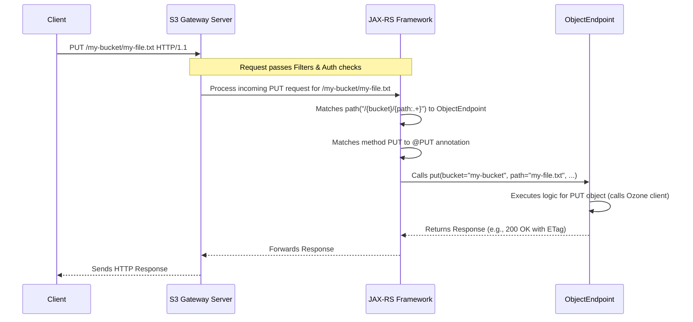

# Chapter 4: Request Endpoints

In the previous chapters, we saw how the [S3 Gateway Server](01_s3_gateway_server_.md) starts up, how incoming requests are processed by [Request Filters](02_request_filters_.md), and how [S3 Signature Processing](03_s3_signature_processing_.md) prepares the security information. Now, the request is checked, prepared, and ready to be acted upon. But *which* piece of code actually handles the specific S3 operation, like uploading a file or creating a bucket?

That's where **Request Endpoints** come in.

## What's the Big Idea? The Action Departments

Imagine the S3 Gateway is like a large company receiving customer requests. After the reception desk (filters) checks the request form and ID (signature), the request needs to go to the right department to get the job done.

*   Want to create a new customer account (S3 Bucket)? Go to the "Account Management" department.
*   Want to store a document (S3 Object) in your existing account? Go to the "Filing" department.
*   Want to see a list of all your accounts? Go to the "Directory Service".

**Request Endpoints** in the `s3gateway` code are exactly like these specialized departments. Each endpoint class is designed to handle S3 operations related to a specific *type* of resource:

1.  **Root Endpoint (`RootEndpoint.java`):** Handles requests for the service itself (like listing all buckets owned by the user). Corresponds to the `/` path.
2.  **Bucket Endpoint (`BucketEndpoint.java`):** Handles requests related to a *specific* bucket (like creating a bucket, deleting a bucket, listing objects *within* a bucket). Corresponds to the `/{bucketName}` path.
3.  **Object Endpoint (`ObjectEndpoint.java`):** Handles requests related to a *specific* object within a bucket (like uploading an object, downloading an object, deleting an object). Corresponds to the `/{bucketName}/{objectPath}` path.

These endpoint classes contain the actual logic that translates an S3 request (e.g., "PUT object") into actions performed on the underlying Apache Ozone storage system (which we'll cover in [Chapter 5: Ozone Client Integration](05_ozone_client_integration_.md)).

**Use Case:** When a validated S3 request like `PUT /my-bucket/my-important-file.txt HTTP/1.1` arrives, how does the gateway know which Java code should handle the file upload? The answer lies in the Request Endpoints and how they are mapped.

## How Requests Find the Right Endpoint

The gateway uses a standard Java framework for web services (JAX-RS, often using an implementation called Jersey) to connect incoming HTTP requests to the correct endpoint code. This works based on two main things:

1.  **Path (`@Path` annotation):** Each endpoint class has a `@Path` annotation that defines the URL pattern it handles.
    *   `@Path("/")` for `RootEndpoint`
    *   `@Path("/{bucket}")` for `BucketEndpoint`
    *   `@Path("/{bucket}/{path:.+}")` for `ObjectEndpoint` (The `:.+` means the path part can contain slashes).
2.  **HTTP Method (`@GET`, `@PUT`, `@POST`, `@DELETE`, `@HEAD` annotations):** Inside each endpoint class, specific Java methods are annotated with the HTTP method they handle for that path.

Let's see this in action with our `PUT /my-bucket/my-important-file.txt` example:

1.  **Request Arrives:** The request comes into the gateway.
2.  **Filtering & Auth:** It passes through the filters and signature checks ([Chapter 2](02_request_filters_.md), [Chapter 3](03_s3_signature_processing_.md)).
3.  **Routing (JAX-RS Magic):** The framework looks at the path `/my-bucket/my-important-file.txt`.
    *   It matches the pattern `/{bucket}/{path:.+}` defined on the `ObjectEndpoint` class.
    *   It sees the request uses the `PUT` HTTP method.
    *   It looks inside `ObjectEndpoint.java` for a method annotated with `@PUT`.
4.  **Execution:** The framework calls the `put()` method within `ObjectEndpoint.java`, automatically extracting the values for `bucket` ("my-bucket") and `path` ("my-important-file.txt") from the URL and passing them as arguments to the method.

## Example: The Object Endpoint's `put` Method

Let's look at a simplified version of the `ObjectEndpoint.java` code to see how this mapping works:

```java
// File: src/main/java/org/apache/hadoop/ozone/s3/endpoint/ObjectEndpoint.java

// This class handles URLs matching /<bucketname>/<objectpath>
@Path("/{bucket}/{path:.+}")
public class ObjectEndpoint extends EndpointBase { // Inherits helper methods

    // ... other methods for GET, DELETE, HEAD, POST ...

    // This method handles PUT requests for the path defined above
    @PUT
    public Response put(
        // Extracts "bucket" value from the URL path
        @PathParam("bucket") String bucketName,
        // Extracts "path" value from the URL path
        @PathParam("path") String keyPath,
        // Gets the Content-Length header
        @HeaderParam("Content-Length") long length,
        // Gets the request body as an input stream
        final InputStream body) throws IOException, OS3Exception {

        long startNanos = Time.monotonicNowNanos();
        // ... logging and metrics setup ...

        try {
            // ** Core Logic Happens Here **
            // 1. Get the Ozone volume and bucket objects
            OzoneVolume volume = getVolume(); // Helper from EndpointBase
            OzoneBucket bucket = volume.getBucket(bucketName);

            // 2. Determine replication settings (from headers or defaults)
            ReplicationConfig replicationConfig = getReplicationConfig(bucket, ...);

            // 3. Get custom metadata and tags from request headers
            Map<String, String> customMetadata = getCustomMetadataFromHeaders(...);
            Map<String, String> tags = getTaggingFromHeaders(...);

            // 4. **Interact with Ozone:** Create the key (object) in Ozone
            //    (More on this in Chapter 5)
            OzoneOutputStream output = getClientProtocol().createKey(
                volume.getName(), bucketName, keyPath, length,
                replicationConfig, customMetadata, tags);

            // 5. Copy data from the request body (InputStream) to Ozone
            long putLength = IOUtils.copy(body, output);
            output.close(); // Finalizes the write to Ozone

            // 6. Calculate ETag (like a checksum)
            String eTag = calculateETag(body); // Simplified concept

            // 7. Prepare the success response (More in Chapter 6)
            return Response.ok()
                .header("ETag", wrapInQuotes(eTag))
                .status(HttpStatus.SC_OK)
                .build();

        } catch (OMException ex) {
            // Handle Ozone-specific errors (e.g., BucketNotFound)
            // Convert OMException to S3 Error Response (More in Chapter 6)
            // ... error handling logic ...
            throw convertToS3Exception(ex);
        } catch (Exception ex) {
            // Handle other errors
            // ... error handling logic ...
            throw ex;
        } finally {
            // Log success or failure
            // ... audit logging ...
        }
    }

    // ... other helper methods ...
}
```

*   **`@Path("/{bucket}/{path:.+}")`:** Tells the framework this class handles paths like `/bucketName/objectName` or `/bucketName/folder/objectName`.
*   **`@PUT`:** Marks the `put` method to handle HTTP PUT requests for this path.
*   **`@PathParam("bucket") String bucketName`:** Automatically extracts the part of the URL corresponding to `{bucket}` and puts it into the `bucketName` variable.
*   **`@PathParam("path") String keyPath`:** Does the same for the `{path:.+}` part.
*   **`@HeaderParam(...)`, `InputStream body`:** Other parameters are injected from request headers or the request body itself.
*   **Core Logic:** Inside the method, it uses the extracted information (`bucketName`, `keyPath`, `length`, `body`) to interact with Ozone via the Ozone client (`getClientProtocol().createKey(...)`). We'll explore this interaction in [Chapter 5: Ozone Client Integration](05_ozone_client_integration_.md).
*   **Response:** Finally, it builds and returns a standard JAX-RS `Response` object, which the framework sends back to the S3 client. We'll look at responses in detail in [Chapter 6: S3 Data Types & Responses](06_s3_data_types___responses_.md).

## Under the Hood: Routing Mechanism

How does the framework actually perform this matching?

1.  **Request Arrival:** The web server (Jetty, part of `S3GatewayHttpServer`) receives the raw HTTP request.
2.  **JAX-RS Framework:** It passes the request details (method, path, headers, body) to the JAX-RS framework (Jersey).
3.  **Endpoint Scanning:** When the gateway starts, the JAX-RS framework scans the code for classes annotated with `@Path`. It builds an internal map of URL patterns and the classes/methods that handle them.
4.  **Matching:** For our `PUT /my-bucket/my-important-file.txt` request:
    *   Jersey looks up the path `/my-bucket/my-important-file.txt` in its map.
    *   It finds the best match is the pattern `/{bucket}/{path:.+}` associated with `ObjectEndpoint.java`.
    *   It checks the HTTP method `PUT`.
    *   It finds the method inside `ObjectEndpoint` annotated with `@PUT` (which is the `put` method).
5.  **Parameter Injection:** Jersey extracts the values for `{bucket}` ("my-bucket") and `{path}` ("my-important-file.txt") from the URL. It also looks at the `put` method's parameters (`@HeaderParam`, `InputStream`) and gathers the corresponding data from the request.
6.  **Method Invocation:** Jersey calls the `ObjectEndpoint.put()` method, passing in the extracted and injected values.
7.  **Response Handling:** The `put` method executes, potentially talking to Ozone, and returns a `Response` object. Jersey takes this `Response` object and translates it back into an HTTP response to send to the client.

Here's a simplified view of the routing:



## Other Endpoint Examples

*   **`RootEndpoint.java` (`@Path("/")`)**:
    *   Handles `GET /`: Lists all buckets the user can access. Its `get()` method (annotated with `@GET`) calls `listS3Buckets()` and formats the output.
*   **`BucketEndpoint.java` (`@Path("/{bucket}")`)**:
    *   Handles `GET /{bucketName}?list-type=2`: Lists objects within the specified bucket. Its `get()` method (`@GET`) checks query parameters (`?list-type=2`), calls `bucket.listKeys()`, and formats the response according to the S3 ListObjectsV2 API.
    *   Handles `DELETE /{bucketName}`: Deletes the specified bucket. Its `delete()` method (`@DELETE`) calls `deleteS3Bucket()`.
    *   Handles `PUT /{bucketName}`: Creates a new bucket. Its `put()` method (`@PUT`) calls `createS3Bucket()`.

All these endpoints typically extend `EndpointBase.java`, which provides common helper methods like getting the Ozone client, accessing authentication information from `SignatureInfo`, and logging audit messages.

## Conclusion

Request Endpoints are the core components that implement the actual S3 API logic in the `s3gateway`.

*   They act like **specialized departments**, each handling requests for a specific resource type (Service Root, Bucket, or Object).
*   They use **JAX-RS annotations** (`@Path`, `@GET`, `@PUT`, etc.) to map incoming HTTP requests to the correct Java method.
*   They **extract information** from the URL path (`@PathParam`), query parameters (`@QueryParam`), headers (`@HeaderParam`), and the request body (`InputStream`).
*   Inside the endpoint methods, the core logic **translates the S3 operation** into calls to the underlying Ozone storage system.
*   They are responsible for **constructing and returning** the appropriate S3 response or error.

Now that we know *where* the S3 logic lives, the next step is to understand *how* these endpoints actually interact with the Ozone cluster to perform actions like creating buckets, writing data, and reading data.

Next up: [Chapter 5: Ozone Client Integration](05_ozone_client_integration_.md)

---

Generated by [AI Codebase Knowledge Builder](https://github.com/The-Pocket/Tutorial-Codebase-Knowledge)