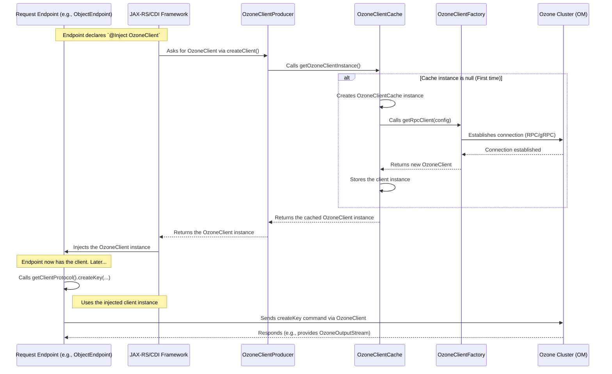

# Chapter 5: Ozone Client Integration

In [Chapter 4: Request Endpoints](04_request_endpoints_.md), we saw how specific code sections, called endpoints, handle S3 operations like uploading files (`PUT Object`) or creating buckets (`PUT Bucket`). But how do these endpoints actually *perform* these actions on the underlying storage system, Apache Ozone? They don't speak Ozone's native language directly!

This chapter introduces the crucial link between the S3 Gateway and the Ozone cluster: **Ozone Client Integration**.

## What's the Big Idea? The Translator to Ozone

Imagine the S3 Gateway is a manager (handling S3 requests) who needs to communicate with a specialized worker (the Ozone storage system). The manager speaks "S3 language," while the worker understands only "Ozone language." They need a translator and a reliable communication line.

The **Ozone Client Integration** components provide exactly this:

1.  **The Translator:** They provide an object called `OzoneClient`. This client knows how to take instructions (like "create a file named `photo.jpg` in bucket `vacation`") and translate them into commands Ozone understands.
2.  **The Communication Line:** They manage the actual network connection to the Ozone cluster, making sure it's efficient and ready to use.

Think of the `OzoneClient` as the official communication tool that endpoints *must* use to talk to Ozone. It hides the complexities of Ozone's internal protocols.

**Use Case:** How does the `ObjectEndpoint` from the previous chapter actually store the uploaded file data into the Ozone cluster after receiving a `PUT /my-bucket/my-file.txt` request? It uses the `OzoneClient`.

## Getting the Ozone Client: The `OzoneClientProducer`

When an endpoint needs to talk to Ozone, how does it get hold of this `OzoneClient` tool? It doesn't create a new one every time. Instead, it uses a helper called `OzoneClientProducer`.

The S3 Gateway uses a feature called Dependency Injection. This means components can simply declare what they need, and the framework provides it automatically. Endpoints declare they need an `OzoneClient`, often through a base class like `EndpointBase`.

```java
// File: src/main/java/org/apache/hadoop/ozone/s3/endpoint/EndpointBase.java

public abstract class EndpointBase implements Auditor {

    @Inject // Ask the framework to provide an OzoneClient instance
    private OzoneClient client;

    // ... other methods ...

    public OzoneClient getClient() {
        return client;
    }

    // Helper to get the part of the client used for key/bucket operations
    protected ClientProtocol getClientProtocol() {
        return getClient().getObjectStore().getClientProxy();
    }

    // ...
}
```

*   **`@Inject private OzoneClient client;`**: This line tells the framework, "Please give me an instance of `OzoneClient` and put it in this `client` variable."

But where does the framework *get* this instance? It asks the `OzoneClientProducer`:

```java
// File: src/main/java/org/apache/hadoop/ozone/s3/OzoneClientProducer.java

@RequestScoped // A new producer might be created for each request, but... (see caching)
public class OzoneClientProducer {

    private OzoneClient client; // It holds the client instance

    @Inject // Get the main gateway configuration
    private OzoneConfiguration ozoneConfiguration;

    // This method is called by the framework when someone @Injects OzoneClient
    @Produces
    public synchronized OzoneClient createClient() throws IOException {
        // Ask the Cache for a client instance (More on this below!)
        client = OzoneClientCache.getOzoneClientInstance(ozoneConfiguration);
        return client;
    }

    // ... other methods like destroy() ...
}
```

*   **`@Produces`**: This annotation tells the framework, "If someone asks for an `OzoneClient` (using `@Inject`), call this `createClient` method to get one."
*   **`OzoneClientCache.getOzoneClientInstance(...)`**: Notice that `createClient` doesn't actually create a *new* client every time. It asks another helper, the `OzoneClientCache`, to get an instance. This is for efficiency.

## Efficient Connections: The `OzoneClientCache`

Creating a connection to the Ozone cluster (which involves network setup, authentication, etc.) can be slow. If every single request created a brand new connection, the gateway would be very inefficient.

To solve this, the `s3gateway` uses a cache: `OzoneClientCache`.

```java
// File: src/main/java/org/apache/hadoop/ozone/s3/OzoneClientCache.java

@ApplicationScoped // Only ONE instance of this cache exists for the whole application
public final class OzoneClientCache {
    private static final Logger LOG =
        LoggerFactory.getLogger(OzoneClientCache.class);

    // The single, shared OzoneClient instance
    private static OzoneClientCache instance;
    private OzoneClient client;

    // Private constructor - only called once when the gateway starts
    private OzoneClientCache(OzoneConfiguration ozoneConfiguration)
        throws IOException {
        // ... load configuration ...
        String omServiceID = ...; // Find Ozone Manager address/service ID

        try {
            // *** Creates the ACTUAL OzoneClient using OzoneClientFactory ***
            // This is the slow part that only happens ONCE.
            if (omServiceID == null) {
                client = OzoneClientFactory.getRpcClient(ozoneConfiguration);
            } else {
                // Handles HA (High Availability) Ozone clusters
                client = OzoneClientFactory.getRpcClient(omServiceID,
                    ozoneConfiguration);
            }
            LOG.info("OzoneClient instance created successfully.");
        } catch (IOException e) {
            LOG.error("FATAL: Cannot create OzoneClient!", e);
            throw e; // Stop the gateway if connection fails
        }
    }

    // Called by OzoneClientProducer to get the client
    public static synchronized OzoneClient getOzoneClientInstance(
        OzoneConfiguration ozoneConfiguration) throws IOException {
        if (instance == null) {
            // First time only: Create the cache and the underlying client
            instance = new OzoneClientCache(ozoneConfiguration);
        }
        // Return the single, shared client instance
        return instance.client;
    }

    // ... methods to close the client when gateway stops ...
}
```

*   **`@ApplicationScoped`**: Ensures only one `OzoneClientCache` exists for the entire running gateway.
*   **`private OzoneClientCache(...)`**: The constructor is where the *actual* `OzoneClient` is created using `OzoneClientFactory`. This happens only once when the cache is first needed (usually when the gateway starts).
*   **`OzoneClientFactory.getRpcClient(...)`**: This is the standard way in Ozone to get a client instance that communicates with the Ozone Manager (the brain of Ozone).
*   **`getOzoneClientInstance(...)`**: This method is called by the `OzoneClientProducer`. It checks if the cache (and the client inside it) has been created. If not, it creates it. Then, it *always* returns the *same* `OzoneClient` instance.

**Analogy:** The `OzoneClientCache` is like having a single, dedicated phone line to the Ozone worker, established once. The `OzoneClientProducer` is like the receptionist who knows how to pick up *that specific phone line* whenever a manager (endpoint) needs to talk to the worker.

## Talking to Ozone: Using the Client

Now that an endpoint has obtained the `OzoneClient` (via `@Inject`, which uses the producer and the cache), how does it use it?

Let's revisit the `ObjectEndpoint`'s `put` method:

```java
// File: src/main/java/org/apache/hadoop/ozone/s3/endpoint/ObjectEndpoint.java

@Path("/{bucket}/{path:.+}")
public class ObjectEndpoint extends EndpointBase { // Inherits getClientProtocol()

    @PUT
    public Response put(
        @PathParam("bucket") String bucketName,
        @PathParam("path") String keyPath,
        @HeaderParam("Content-Length") long length,
        final InputStream body) throws IOException, OS3Exception {

        // ... setup ...

        try {
            // 1. Get the client's "protocol" interface (inherited from EndpointBase)
            ClientProtocol clientProtocol = getClientProtocol();

            // 2. Use the client to create the key (file) in Ozone
            OzoneOutputStream output = clientProtocol.createKey(
                bucketName, // Use bucket name from URL
                keyPath,    // Use key path from URL
                length,     // Use length from header
                replicationConfig, // How many copies to store
                customMetadata,    // Metadata from headers
                tags);             // Tags from headers

            // 3. Copy data from the request body into the Ozone stream
            long bytesCopied = IOUtils.copy(body, output);
            output.close(); // IMPORTANT: Finalizes the write to Ozone

            // ... build success response ...

        } catch (OMException ex) {
            // Handle Ozone errors (e.g., BucketNotFound)
            // ... translate to S3 errors ...
        }
        // ... other catches and finally block ...
    }
    // ... other methods ...
}
```

1.  **`getClientProtocol()`**: This helper method (usually in `EndpointBase`) gets the injected `OzoneClient` and retrieves a specific part of it (`ClientProtocol`) that's designed for interacting with Ozone Manager operations like creating keys, buckets, etc.
2.  **`clientProtocol.createKey(...)`**: This is the key step! The endpoint calls the `createKey` method on the Ozone client interface. It passes the bucket name, key name, size, replication details, and metadata. This call translates the S3 PUT request into an Ozone command to create the object. Ozone returns an `OzoneOutputStream`.
3.  **`IOUtils.copy(body, output)`**: The data from the incoming S3 request (`body`) is streamed directly into the `OzoneOutputStream`. The `OzoneClient` handles sending this data efficiently to the Ozone DataNodes (where data is actually stored).
4.  **`output.close()`**: Closing the stream tells Ozone the write is complete.

Other common client operations used by endpoints include:

*   `client.getObjectStore().getS3Bucket(bucketName)`: Get information about an S3 bucket (used in `BucketEndpoint`).
*   `client.getObjectStore().createS3Bucket(bucketName)`: Create a new S3 bucket (used in `BucketEndpoint`).
*   `client.getObjectStore().deleteS3Bucket(bucketName)`: Delete an S3 bucket (used in `BucketEndpoint`).
*   `bucket.listKeys(...)`: List keys (objects) within a bucket (used in `BucketEndpoint`).
*   `bucket.getKey(keyPath)`: Get information about a key (object) (used in `ObjectEndpoint` for GET/HEAD).
*   `bucket.deleteKey(keyPath)`: Delete a key (object) (used in `ObjectEndpoint`).
*   `bucket.newKeyReader(...)`: Get an `OzoneInputStream` to read data from Ozone (used in `ObjectEndpoint` for GET).

## Under the Hood: The Connection Flow

Let's visualize how an endpoint gets and uses the client:



This shows that the complex connection setup via `OzoneClientFactory` only happens once, thanks to the `OzoneClientCache`. Subsequent requests reuse the existing client provided efficiently by the `OzoneClientProducer`.

## Conclusion

The **Ozone Client Integration** is the bridge enabling the S3 Gateway to communicate with the Ozone storage backend.

*   It provides the **`OzoneClient`**, an object that translates S3-like actions into Ozone commands.
*   The **`OzoneClientProducer`** is responsible for providing `OzoneClient` instances to endpoints when requested via `@Inject`.
*   The **`OzoneClientCache`** ensures efficiency by creating only *one* shared `OzoneClient` instance (using `OzoneClientFactory`) when the gateway starts and reusing it for all subsequent requests.
*   Endpoints use methods on the obtained `OzoneClient` (like `createKey`, `getS3Bucket`, `getKey`, `listKeys`) to perform the actual storage operations on the Ozone cluster.

Now that we understand how endpoints talk to Ozone, how do they package the results (or errors) received from Ozone back into the specific formats expected by S3 clients? That's the topic of our next chapter.

Next up: [Chapter 6: S3 Data Types & Responses](06_s3_data_types___responses_.md)

---

Generated by [AI Codebase Knowledge Builder](https://github.com/The-Pocket/Tutorial-Codebase-Knowledge)