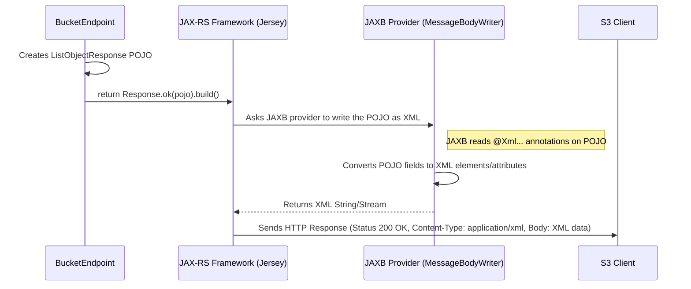

# Chapter 6: S3 Data Types & Responses

In [Chapter 5: Ozone Client Integration](05_ozone_client_integration_.md), we saw how the `s3gateway` uses the `OzoneClient` to interact with the Ozone storage cluster, performing actions like listing buckets or retrieving objects. But once the gateway gets the necessary information from Ozone, how does it package that information up to send back to the S3 client application? The client expects the response in a very specific format, usually XML, defined by the Amazon S3 specification.

This is where **S3 Data Types & Responses** come into play.

## What's the Big Idea? Standardized Forms for S3 Data

Imagine you're filling out an official form, like a passport application. You can't just write your information randomly; you have to put specific details in specific boxes. The form ensures your information is structured correctly so the passport office can understand it easily.

S3 Data Types are like these standardized forms, but for data exchanged between an S3 client and the S3 Gateway. They are essentially blueprints for structuring information.

*   **Plain Old Java Objects (POJOs):** In the `s3gateway` code, these blueprints are represented as simple Java classes. Each class holds related pieces of data. For example, there's a class to hold information about a bucket (`BucketMetadata`), another for an object (`KeyMetadata`), and another for structuring the response when listing objects (`ListObjectResponse`).
*   **XML Formatting (JAXB):** Since S3 primarily uses XML for its responses, these Java classes have special annotations (markers) that tell a tool called JAXB (Java Architecture for XML Binding) how to automatically convert the data in the Java object into the correct XML format, and vice-versa.
*   **Ensuring Compatibility:** Using these predefined data types ensures that the XML response sent by the `s3gateway` looks exactly like the response an S3 client expects, following the official S3 specification.

**Use Case:** When a user asks to list the objects in their bucket (e.g., sends a `GET /my-bucket` request), the gateway needs to retrieve the object list from Ozone and send it back as an S3-compliant XML document. How does it create this specific XML? It uses the predefined S3 data type classes.

## Meet the Data Structures: POJOs with XML Annotations

Let's look at some common data type classes used in `s3gateway`. These classes often live in the `org.apache.hadoop.ozone.s3.commontypes` or `org.apache.hadoop.ozone.s3.endpoint` packages.

**1. Bucket Information (`BucketMetadata.java`)**

When you list all your buckets, each bucket's details are structured using this class.

```java
// File: src/main/java/org/apache/hadoop/ozone/s3/commontypes/BucketMetadata.java

package org.apache.hadoop.ozone.s3.commontypes;

import java.time.Instant;
// Imports for JAXB annotations
import javax.xml.bind.annotation.XmlAccessType;
import javax.xml.bind.annotation.XmlAccessorType;
import javax.xml.bind.annotation.XmlElement;
import javax.xml.bind.annotation.adapters.XmlJavaTypeAdapter;

/**
 * Metadata object represents one bucket. Used in ListAllMyBuckets response.
 */
@XmlAccessorType(XmlAccessType.FIELD) // Tells JAXB to look at fields
public class BucketMetadata {

  // Maps the 'name' field to the <Name> XML element
  @XmlElement(name = "Name")
  private String name;

  // Maps the 'creationDate' field to <CreationDate> XML element
  // Uses a special adapter to format the date correctly
  @XmlJavaTypeAdapter(IsoDateAdapter.class)
  @XmlElement(name = "CreationDate")
  private Instant creationDate;

  // Getters and Setters omitted for brevity...
}
```

*   **`@XmlAccessorType(XmlAccessType.FIELD)`:** Tells JAXB to automatically consider the class fields (`name`, `creationDate`) when converting to/from XML.
*   **`@XmlElement(name = "Name")`:** Specifies that the `name` Java field should correspond to an XML element named `<Name>`. Similarly for `<CreationDate>`.
*   **`@XmlJavaTypeAdapter(IsoDateAdapter.class)`:** Dates need special formatting in XML (ISO 8601). This tells JAXB to use a helper class (`IsoDateAdapter`) to convert the Java `Instant` object to the correct string format.

**2. Object Information (`KeyMetadata.java`)**

When you list objects *within* a bucket, each object's details use this structure.

```java
// File: src/main/java/org/apache/hadoop/ozone/s3/commontypes/KeyMetadata.java

package org.apache.hadoop.ozone.s3.commontypes;
// ... imports ...

/**
 * Metadata object represents one key (object) in the object store.
 */
@XmlAccessorType(XmlAccessType.FIELD)
public class KeyMetadata {

  // Maps to <Key> element, uses adapter for potential URL encoding
  @XmlJavaTypeAdapter(ObjectKeyNameAdapter.class)
  @XmlElement(name = "Key")
  private EncodingTypeObject key; // Object Name (can handle encoding type)

  // Maps to <LastModified> element
  @XmlJavaTypeAdapter(IsoDateAdapter.class)
  @XmlElement(name = "LastModified")
  private Instant lastModified;

  // Maps to <ETag> element (entity tag, like a checksum)
  @XmlElement(name = OzoneConsts.ETAG) // ETAG is "ETag"
  private String eTag;

  // Maps to <Size> element
  @XmlElement(name = "Size")
  private long size;

  // Other fields like Owner, StorageClass omitted...
  // Getters and Setters omitted...
}
```

*   This class defines the standard fields S3 expects for each object: its name (`Key`), modification time (`LastModified`), `ETag`, and `Size`.
*   Again, `@XmlElement` maps Java fields to XML element names.

**3. The Response Envelope (`ListObjectResponse.java`)**

This class acts as the main "envelope" or container for the response when listing objects in a bucket. It holds metadata about the listing itself (like the bucket name, prefixes) and a *list* of `KeyMetadata` objects.

```java
// File: src/main/java/org/apache/hadoop/ozone/s3/endpoint/ListObjectResponse.java

package org.apache.hadoop.ozone.s3.endpoint;
// ... imports ...
import org.apache.hadoop.ozone.s3.commontypes.KeyMetadata; // Uses KeyMetadata
import org.apache.hadoop.ozone.s3.commontypes.CommonPrefix; // For directories

/**
 * Response envelope for listing objects in a bucket.
 */
@XmlAccessorType(XmlAccessType.FIELD)
// Defines the root XML element: <ListBucketResult> with a namespace
@XmlRootElement(name = "ListBucketResult", namespace = "http://s3.amazonaws.com/doc/2006-03-01/")
public class ListObjectResponse {

  @XmlElement(name = "Name") // The bucket name
  private String name;

  @XmlElement(name = "Prefix") // Filter prefix used in request
  private EncodingTypeObject prefix;

  @XmlElement(name = "MaxKeys") // Max keys requested
  private int maxKeys;

  @XmlElement(name = "IsTruncated") // Is the listing incomplete?
  private boolean isTruncated;

  // Holds the actual list of objects found
  @XmlElement(name = "Contents")
  private List<KeyMetadata> contents = new ArrayList<>();

  // Holds common prefixes (simulated folders)
  @XmlElement(name = "CommonPrefixes")
  private List<CommonPrefix> commonPrefixes = new ArrayList<>();

  // Other fields like Marker, NextMarker, Delimiter omitted...
  // Getters and Setters omitted...

  public void addKey(KeyMetadata keyMetadata) {
    contents.add(keyMetadata);
  }
  // ... other methods ...
}
```

*   **`@XmlRootElement(...)`:** This is crucial. It defines the top-level XML element (`<ListBucketResult>`) and its namespace, which is required by the S3 specification.
*   **`@XmlElement(name = "Contents")`:** This maps the `contents` list in Java to one or more `<Contents>` elements in XML. JAXB knows how to handle lists automatically, wrapping each `KeyMetadata` object within a `<Contents>` tag.

**4. Error Responses (`OS3Exception.java`)**

Even errors need to be sent back in a specific S3 XML format. The `OS3Exception` class is designed for this.

```java
// File: src/main/java/org/apache/hadoop/ozone/s3/exception/OS3Exception.java

package org.apache.hadoop.ozone.s3.exception;
// ... imports ...

/**
 * Represents S3 error responses.
 */
@XmlRootElement(name = "Error") // Root element is <Error>
@XmlAccessorType(XmlAccessType.NONE) // We explicitly map fields below
public class OS3Exception extends Exception {

  @XmlElement(name = "Code") // e.g., NoSuchBucket, AccessDenied
  private String code;

  @XmlElement(name = "Message") // Human-readable error message
  private String errorMessage;

  @XmlElement(name = "Resource") // Resource the error relates to (e.g., bucket name)
  private String resource;

  @XmlElement(name = "RequestId") // Unique ID for the request
  private String requestId;

  @XmlTransient // This field is NOT included in the XML
  private int httpCode; // The HTTP status code (e.g., 404, 403)

  // Constructor, Getters, Setters omitted...

  public String toXml() {
    // Helper method to generate the XML string from this object
    // Uses Jackson XML mapper internally (similar to JAXB)
    // ... implementation details ...
  }
}
```

*   **`@XmlRootElement(name = "Error")`:** Defines the `<Error>` root tag for error responses.
*   **`@XmlElement(...)`:** Maps fields like `code`, `errorMessage`, `resource`, and `requestId` to their corresponding XML tags (`<Code>`, `<Message>`, etc.).
*   **`@XmlTransient`:** Marks the `httpCode` field so it's *not* included in the generated XML body (it's used for the HTTP status code instead).

## How Endpoints Create Responses

Let's revisit the idea of listing objects from [Chapter 4: Request Endpoints](04_request_endpoints_.md). How does the `BucketEndpoint` use these data types?

```java
// Simplified example inside BucketEndpoint.java get() method (handling List Objects)

public Response get(@PathParam("bucket") String bucketName, /* other params */) {

    // 1. Use OzoneClient (from Chapter 5) to get object list from Ozone
    List<OzoneKey> ozoneKeys = getClientProtocol().listKeys(bucketName, ...);

    // 2. Create the main response "envelope" object
    ListObjectResponse responsePojo = new ListObjectResponse();
    responsePojo.setName(bucketName);
    // ... set other fields like Prefix, MaxKeys, IsTruncated ...

    // 3. Loop through results from Ozone and populate the response POJO
    for (OzoneKey ozoneKey : ozoneKeys) {
        // Create a POJO for this specific object's metadata
        KeyMetadata keyPojo = new KeyMetadata();
        keyPojo.setKey(new EncodingTypeObject(ozoneKey.getName())); // Set object name
        keyPojo.setLastModified(ozoneKey.getModificationTime());
        keyPojo.setSize(ozoneKey.getDataSize());
        keyPojo.setETag(ozoneKey.getMetadata().get(OzoneConsts.ETAG)); // Get ETag if exists

        // Add this object's POJO to the main response list
        responsePojo.addKey(keyPojo);
    }

    // 4. Return the populated POJO
    // JAX-RS + JAXB handles converting this POJO to XML automatically!
    return Response.ok(responsePojo).build();
}
```

1.  **Get Data:** The endpoint uses the `OzoneClient` to fetch the list of objects (`OzoneKey` objects) from Ozone.
2.  **Create Envelope:** It creates an instance of the main response class (`ListObjectResponse`).
3.  **Populate POJOs:** It iterates through the Ozone results. For each Ozone object, it creates a corresponding `KeyMetadata` POJO, copying the relevant data (name, size, modified time, ETag) into the POJO's fields. It then adds this `KeyMetadata` POJO to the list inside the main `ListObjectResponse` POJO.
4.  **Return POJO:** The endpoint simply returns the fully populated `ListObjectResponse` object within a JAX-RS `Response`.

The magic happens next! The JAX-RS framework (used by `s3gateway`) sees that the `Response` contains an object annotated with JAXB annotations (`@XmlRootElement`, etc.). It automatically invokes JAXB to convert this Java object (`responsePojo`) into an XML string, sets the `Content-Type` header to `application/xml`, and sends it back to the S3 client.

## Under the Hood: Automatic XML Conversion (Serialization)

How does returning a Java object magically result in XML being sent?



1.  **Endpoint Returns POJO:** The endpoint method finishes and returns a JAX-RS `Response` containing the data POJO (e.g., `ListObjectResponse`).
2.  **JAX-RS Intercepts:** The JAX-RS framework intercepts this response.
3.  **Finds Writer:** It checks the type of the object in the response body (`ListObjectResponse`). It looks for a registered "MessageBodyWriter" that knows how to handle this type and the requested media type (usually `application/xml`). It finds the built-in JAXB provider.
4.  **JAXB Serializes:** The JAX-RS framework passes the POJO to the JAXB MessageBodyWriter. JAXB uses the `@Xml...` annotations on the POJO and its fields to generate the corresponding XML structure.
5.  **Response Sent:** The JAX-RS framework takes the generated XML, puts it in the HTTP response body, sets the correct `Content-Type` header, and sends the complete HTTP response back to the S3 client.

A similar process happens in reverse for incoming requests that have XML bodies (like `CompleteMultipartUpload`). A "MessageBodyReader" (like `MessageUnmarshaller.java`) uses JAXB to parse the incoming XML and create the corresponding Java POJO (e.g., `CompleteMultipartUploadRequest`) which is then passed as an argument to the endpoint method.

## Conclusion

S3 Data Types & Responses are the blueprints for structuring data exchanged between S3 clients and the `s3gateway`.

*   They are implemented as **POJOs** (Plain Old Java Objects) in the code.
*   They use **JAXB annotations** (`@XmlRootElement`, `@XmlElement`, etc.) to define how the Java objects map to the S3-standard **XML format**.
*   Examples include `ListBucketResponse`, `ListObjectResponse`, `KeyMetadata`, and `OS3Exception` for errors.
*   Endpoints create and populate instances of these POJOs with data retrieved from Ozone.
*   The JAX-RS framework automatically uses JAXB to **serialize** these POJOs into XML for responses and **deserialize** incoming XML requests into POJOs.
*   This ensures the `s3gateway` communicates with clients using the precise data formats required by the S3 specification.

We've now covered the main components involved in processing an S3 request, from the server starting up to sending the final response. But how does the gateway know things like which port to listen on or where the Ozone cluster is located? That's handled by configuration.

Next up: [Chapter 7: Configuration Management](07_configuration_management_.md)

---

Generated by [AI Codebase Knowledge Builder](https://github.com/The-Pocket/Tutorial-Codebase-Knowledge)