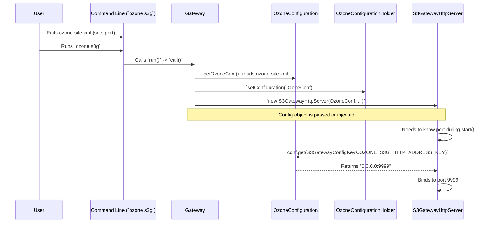

# Chapter 7: Configuration Management

In [Chapter 6: S3 Data Types & Responses](06_s3_data_types___responses_.md), we learned how the S3 Gateway formats data correctly to talk to S3 clients. But how does the gateway itself know fundamental things like which network port to listen on, where the Ozone cluster is located, or if security is enabled? These aren't hard-coded; they are flexible settings.

This chapter explores **Configuration Management**, the system responsible for handling all these settings for the S3 Gateway.

## What's the Big Idea? The Settings Menu

Imagine your phone or computer has a "Settings" menu. You can go there to change the Wi-Fi password, adjust screen brightness, or turn features on or off. This menu controls how your device behaves.

**Configuration Management** in the `s3gateway` is like this Settings menu. It provides a way to:

1.  **Define Settings:** Specify important parameters like network addresses, security details, performance tuning values (like buffer sizes), and feature flags.
2.  **Load Settings:** Read these settings from files when the gateway starts up.
3.  **Access Settings:** Make these settings easily available to all the different parts of the gateway that need them (like the server needing the port number, or the client integration needing the Ozone address).

**Use Case:** How does the S3 Gateway know which network port to listen on for incoming S3 requests? For example, how do we tell it to use port 9878? This is managed through configuration.

## Key Concepts

Let's break down how configuration works in the `s3gateway`.

**1. What is Configuration?**

Configuration refers to parameters that control the application's behavior but are set *outside* the main code. This makes the application flexible. Instead of recompiling the code to change the port number, you just change a setting in a configuration file.

Examples of things controlled by configuration in `s3gateway`:

*   HTTP/HTTPS port numbers for the S3 API server and the Admin UI server.
*   Address of the Ozone Manager (the brain of the Ozone cluster).
*   Security settings (like Kerberos principal and keytab file location).
*   Buffer sizes for data transfer.
*   Toggles to enable/disable certain features or behaviors.

**2. OzoneConfiguration: The Settings Holder**

The `s3gateway` uses the standard configuration system from Apache Ozone (and Apache Hadoop), which revolves around the `OzoneConfiguration` class.

Think of an `OzoneConfiguration` object as a container (like a map or dictionary) that holds all the key-value pairs representing the settings after they've been loaded.

```java
// This isn't actual s3gateway code, just conceptually how it works:
OzoneConfiguration conf = new OzoneConfiguration();

// It can load settings from files (like ozone-site.xml)
// conf.addResource("ozone-site.xml"); // This happens automatically usually

// You can then ask it for setting values:
int port = conf.getInt("ozone.s3g.http.bind-port", 9878); // Get port, default 9878
String ozoneManagerAddress = conf.get("ozone.om.address"); // Get OM address
boolean securityEnabled = conf.getBoolean("hdds.security.enabled", false);
```

This object holds the "live" settings used by the running gateway.

**3. Configuration Files: Where Settings Live**

Where do the settings come from? They are typically defined in XML files. The most common one for Ozone (and thus `s3gateway`) is `ozone-site.xml`.

This file contains properties like this:

```xml
<!-- Example content in ozone-site.xml -->
<configuration>

  <property>
    <name>ozone.s3g.http.bind-port</name>
    <value>9878</value>
    <description>The network port S3 Gateway listens on for HTTP requests.</description>
  </property>

  <property>
    <name>ozone.om.service.ids</name>
    <value>ozonecluster</value>
    <description>Logical name for the Ozone Manager service.</description>
  </property>

  <!-- other S3 Gateway and Ozone settings -->

</configuration>
```

When `OzoneConfiguration` is created, it automatically looks for files like `ozone-default.xml` (containing built-in defaults) and `ozone-site.xml` (for user overrides) in standard locations (the classpath) and loads the settings from them. Settings in `ozone-site.xml` override the defaults.

**4. Configuration Keys: Naming the Settings**

How do we refer to a specific setting like the HTTP port? We use a unique **configuration key**, which is just a string name, like `ozone.s3g.http.bind-port`.

To avoid typos and keep things organized, these keys are often defined as constants in Java classes. `s3gateway` uses `S3GatewayConfigKeys.java`:

```java
// File: src/main/java/org/apache/hadoop/ozone/s3/S3GatewayConfigKeys.java

public final class S3GatewayConfigKeys {

  // Key for the S3 Gateway HTTP port
  public static final String OZONE_S3G_HTTP_ADDRESS_KEY =
      "ozone.s3g.http-address";
  // Default value if the key isn't set
  public static final int OZONE_S3G_HTTP_BIND_PORT_DEFAULT = 9878;

  // Key for enabling/disabling FSO directory creation feature
  public static final String OZONE_S3G_FSO_DIRECTORY_CREATION_ENABLED =
      "ozone.s3g.fso.directory.creation";
  public static final boolean OZONE_S3G_FSO_DIRECTORY_CREATION_ENABLED_DEFAULT =
      true;

  // Key for Kerberos principal (used in secure clusters)
  public static final String OZONE_S3G_KERBEROS_PRINCIPAL_KEY =
      "ozone.s3g.kerberos.principal";

  // ... many other keys ...
}
```

Using these constants (e.g., `S3GatewayConfigKeys.OZONE_S3G_HTTP_ADDRESS_KEY`) in the code instead of typing the string directly helps prevent errors.

**5. Loading Configuration at Startup**

When the `s3gateway` starts, the first thing the `Gateway` class does is load the configuration.

```java
// File: src/main/java/org/apache/hadoop/ozone/s3/Gateway.java

public class Gateway extends GenericCli implements Callable<Void> {
    // ... other fields ...

    @Override
    public Void call() throws Exception {
        // ** Step 1: Load configuration **
        // getOzoneConf() reads files like ozone-site.xml into an object
        OzoneConfiguration ozoneConfiguration = getOzoneConf();

        // ** Step 2: Make it globally accessible (see below) **
        OzoneConfigurationHolder.setConfiguration(ozoneConfiguration);

        // ... rest of the startup sequence (login, create servers, etc.) ...
        // Components created later (like S3GatewayHttpServer) will need this config
        httpServer = new S3GatewayHttpServer(ozoneConfiguration, "s3gateway");
        // ... start servers ...

        return null;
    }
    // ...
}
```

The `getOzoneConf()` method (part of `GenericCli`) handles the loading process, resulting in an `OzoneConfiguration` object filled with settings from the XML files.

**6. Accessing Configuration: Getting the Settings**

Once loaded, how do other parts of the gateway, like the [Request Filters](02_request_filters_.md) or the [Ozone Client Integration](05_ozone_client_integration_.md), get access to these settings? There are two main ways:

*   **Static Holder (`OzoneConfigurationHolder`):** This is a simple class that holds a single, static copy of the `OzoneConfiguration` object loaded at startup. Any part of the code can then ask this holder for the configuration.

    ```java
    // File: src/main/java/org/apache/hadoop/ozone/s3/OzoneConfigurationHolder.java

    public final class OzoneConfigurationHolder {

        // The single, shared configuration object
        private static OzoneConfiguration configuration;

        // Called by Gateway.java at startup
        public static void setConfiguration(OzoneConfiguration conf) {
            if (configuration == null) { // Avoid overriding if already set
                OzoneConfigurationHolder.configuration = conf;
            }
        }

        // ** Method used by components to get the config **
        // The @Produces annotation makes it available for Dependency Injection
        @Produces
        public static OzoneConfiguration configuration() {
            return configuration;
        }
        // ... reset method for testing ...
    }
    ```
    Any code can call `OzoneConfigurationHolder.configuration()` to get the settings.

*   **Dependency Injection (`@Inject`):** This is a more modern approach. Components declare that they *need* an `OzoneConfiguration`, and the framework automatically provides it (often by calling the `@Produces` method in `OzoneConfigurationHolder`).

    ```java
    // Example inside OzoneClientProducer.java (from Chapter 5)
    @RequestScoped
    public class OzoneClientProducer {

        @Inject // Ask the framework for the configuration
        private OzoneConfiguration ozoneConfiguration; // Framework provides it!

        @Produces
        public OzoneClient createClient() throws IOException {
            // Uses the injected ozoneConfiguration to create the client
            client = OzoneClientCache.getOzoneClientInstance(ozoneConfiguration);
            return client;
        }
        // ...
    }
    ```
    Here, `OzoneClientProducer` doesn't need to know about `OzoneConfigurationHolder`. It just says `@Inject` and the framework wires it up automatically.

## Solving the Use Case: Setting the HTTP Port

Let's trace how setting the HTTP port in the config file affects the running gateway:

1.  **User Edits File:** You edit `ozone-site.xml` and set:
    ```xml
    <property>
      <name>ozone.s3g.http-address</name>
      <!-- We want port 9999 instead of the default 9878 -->
      <value>0.0.0.0:9999</value>
    </property>
    ```
2.  **Gateway Starts:** You run `ozone s3g`.
3.  **Config Loaded:** The `Gateway.call()` method runs `getOzoneConf()`, which loads `ozone-site.xml`. The resulting `OzoneConfiguration` object now contains the key `ozone.s3g.http-address` with the value `0.0.0.0:9999`.
4.  **Holder Set:** `Gateway.call()` calls `OzoneConfigurationHolder.setConfiguration()` with this loaded configuration object.
5.  **Server Created:** The `Gateway` creates the `S3GatewayHttpServer`: `new S3GatewayHttpServer(ozoneConfiguration, "s3gateway")`. The configuration is passed to the server's constructor.
6.  **Server Uses Config:** Inside `S3GatewayHttpServer` (or its base class `BaseHttpServer`), when it needs to know which address/port to bind to, it looks up the configuration key:

    ```java
    // Inside BaseHttpServer.java (simplified concept)
    public void start() {
        OzoneConfiguration conf = getConfiguration(); // Get the config object
        String httpAddrKey = getHttpAddressKey(); // Returns "ozone.s3g.http-address"
        String host = conf.get(httpAddrKey); // Gets "0.0.0.0:9999" from config

        // ... code to parse host and port, then start the web server on 0.0.0.0:9999 ...
        server.bind(host, port);
        server.start();
    }

    // Inside S3GatewayHttpServer.java
    @Override
    protected String getHttpAddressKey() {
      // Tells the base server which config key to use
      return S3GatewayConfigKeys.OZONE_S3G_HTTP_ADDRESS_KEY;
    }
    ```
7.  **Server Listens:** The HTTP server starts listening on port 9999 as specified in the configuration file.

## Internal Implementation: Loading and Providing

Let's visualize the flow of configuration:



This shows how the configuration flows from the file, is loaded into an object, stored in a holder (and made available for injection), and finally used by a component like the HTTP server to control its behavior.

## Conclusion

Configuration Management is the backbone that allows the `s3gateway` to be flexible and adaptable to different environments and requirements.

*   It relies on the standard **`OzoneConfiguration`** system, loading settings from XML files like **`ozone-site.xml`**.
*   Settings are identified by unique string **keys**, defined as constants in classes like `S3GatewayConfigKeys`.
*   The configuration is loaded once at startup by the `Gateway` class.
*   It's made accessible to other components either through the static **`OzoneConfigurationHolder`** or via **Dependency Injection (`@Inject`)**.
*   This allows administrators to easily change ports, addresses, security settings, and tune behavior without modifying the code.

This chapter concludes our tour of the core internal components of the `s3gateway` project. You've seen how the server starts, how requests are filtered and authenticated, how specific endpoints handle S3 actions, how the gateway talks to Ozone, how responses are formatted, and finally, how the whole system is configured. With this foundation, you should be better equipped to understand the code and potentially contribute to the project!

---

Generated by [AI Codebase Knowledge Builder](https://github.com/The-Pocket/Tutorial-Codebase-Knowledge)