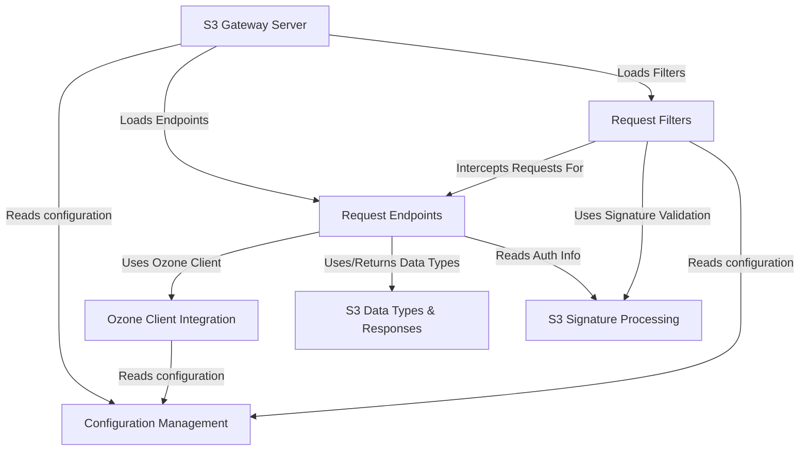

# Tutorial: s3gateway

The **S3 Gateway** project acts as a *translation layer*, allowing applications that speak the Amazon S3 protocol to store and retrieve data from an underlying **Apache Ozone** distributed storage cluster.
It runs as a web server, intercepts S3 requests, performs necessary checks like *authentication* (using S3 signatures), and then uses an Ozone client to perform the actual data operations (like creating buckets or reading/writing objects) on the Ozone cluster. It handles converting Ozone's responses back into the S3 format.

**Source Repository:** [None](None)

## Chapters

1. [S3 Gateway Server
](01_s3_gateway_server_.md)
2. [Request Filters
](02_request_filters_.md)
3. [S3 Signature Processing
](03_s3_signature_processing_.md)
4. [Request Endpoints
](04_request_endpoints_.md)
5. [Ozone Client Integration
](05_ozone_client_integration_.md)
6. [S3 Data Types & Responses
](06_s3_data_types___responses_.md)
7. [Configuration Management
](07_configuration_management_.md)

---

Generated by [AI Codebase Knowledge Builder](https://github.com/The-Pocket/Tutorial-Codebase-Knowledge)