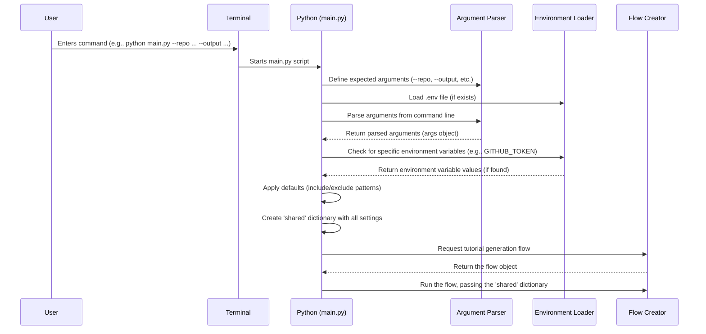

# Chapter 1: Entry Point & Configuration

Welcome to the `Tutorial-Codebase-Knowledge` project! Think of this project as a clever machine that automatically reads computer code and writes a tutorial explaining how it works. But how do you tell this machine *which* code to read, *where* to save the tutorial, or maybe even *which language* to write it in? That's where our first topic comes in: the **Entry Point & Configuration**.

Imagine you're about to bake a cake. You need a recipe (the instructions) and ingredients (flour, sugar, etc.). The **Entry Point** is like the main kitchen counter where you gather everything you need and decide *which* cake recipe you're using today. The **Configuration** is like specifying the exact ingredients and oven settings – do you want chocolate chips? What temperature should the oven be?

In our project, the entry point is the starting gate, the very first piece of code that runs when you use the tool. It's responsible for:

1.  **Listening to You:** Understanding the instructions you provide via the command line (your computer's text-based interface).
2.  **Gathering Supplies:** Loading necessary settings, like special keys (API keys) if needed to access online code repositories.
3.  **Setting the Stage:** Preparing a central place to store all the information needed throughout the tutorial generation process.

Let's see how this works!

## Your Instructions: Command-Line Arguments

When you want to use this tool, you'll typically open a terminal (like Command Prompt on Windows, or Terminal on Mac/Linux) and type a command. This command will include the name of the script to run (`main.py`) and specific instructions called **arguments** or **flags**.

**Use Case:** Let's say you want to generate a tutorial for a project stored on GitHub, specifically the popular `requests` library in Python. You want the tutorial saved in a folder named `requests_tutorial`, and you want the tutorial written in English.

You might type something like this:

```bash
python main.py --repo https://github.com/psf/requests --output requests_tutorial --language english
```

Let's break down this command:

*   `python main.py`: Tells the computer to run our main script using Python.
*   `--repo https://github.com/psf/requests`: This is an argument telling the tool *where* the code lives (a GitHub repository URL).
*   `--output requests_tutorial`: This argument specifies *where* to save the generated tutorial files (in a directory called `requests_tutorial`).
*   `--language english`: This argument sets the desired language for the tutorial.

The entry point code (`main.py`) is designed to understand these `--repo`, `--output`, and `--language` flags.

## Behind the Counter: `main.py`

The file `main.py` acts as our main kitchen counter. Let's look at simplified pieces of it.

**1. Setting up the Argument Parser:**

The code uses a standard Python tool called `argparse` to define which arguments it expects.

```python
# File: main.py (simplified)
import argparse

# Create an object to handle arguments
parser = argparse.ArgumentParser(description="Generate a tutorial...")

# Tell it about the --repo argument
parser.add_argument("--repo", help="URL of the public GitHub repository.")
# Tell it about the --dir argument (for local code)
parser.add_argument("--dir", help="Path to local directory.")
# Tell it about the --output argument (with a default value!)
parser.add_argument("-o", "--output", default="output", help="Base directory for output")
# Tell it about the --language argument
parser.add_argument("--language", default="english", help="Language for the tutorial")

# ... (other arguments defined similarly) ...
```

This code sets up the rules. It says, "I understand flags like `--repo`, `--dir`, `--output`, and `--language`. If the user doesn't provide `--output`, assume they want to use a folder named `output`."

**2. Reading Your Instructions:**

After defining the rules, the code reads the actual arguments you provided on the command line.

```python
# File: main.py (continued)

# Read the arguments provided by the user
args = parser.parse_args()

# Now 'args.repo' will hold the URL if provided,
# 'args.output' will hold the output path, etc.
```

If you ran the command from our use case, `args.repo` would now contain `"https://github.com/psf/requests"`, `args.output` would be `"requests_tutorial"`, and `args.language` would be `"english"`.

**3. Handling Sensitive Information (like API Keys):**

Sometimes, the tool might need secret keys (like a GitHub token) to access private code or avoid hitting usage limits. It's bad practice to type secrets directly into the command line. Instead, we often use environment variables (settings stored securely in your operating system) or special files (like `.env`).

```python
# File: main.py (simplified)
import dotenv
import os

# Load settings from a .env file (if it exists)
dotenv.load_dotenv()

# ... (argument parsing happens here) ...

# Get GitHub token if using a repo
github_token = None
if args.repo:
    # Try the --token flag first, then check environment variable
    github_token = args.token or os.environ.get('GITHUB_TOKEN')
    if not github_token:
        print("Warning: No GitHub token provided...")
```

This snippet first tries to load settings from a hidden `.env` file in your project directory. Then, when dealing with GitHub repositories, it checks if you provided a token using `--token`. If not, it checks if there's an environment variable named `GITHUB_TOKEN`.

**4. Setting Default Filters:**

Our tool needs to know which files are likely code and which ones to ignore (like tests or build files). We define default lists for this.

```python
# File: main.py (simplified)

# Default file types to INCLUDE
DEFAULT_INCLUDE_PATTERNS = {
    "*.py", "*.js", "*.java", "*.md", # Python, Javascript, Java, Markdown
    # ... many other common code file extensions ...
}

# Default file/directory patterns to EXCLUDE
DEFAULT_EXCLUDE_PATTERNS = {
    "*test*", "tests/*", "docs/*", # Test files, documentation
    ".git/*", "node_modules/*",    # Git data, dependency folders
    # ... other common things to ignore ...
}
```

These act as sensible starting points. You can override them using `--include` and `--exclude` arguments if you need finer control.

**5. Preparing the "Shared Backpack":**

All these settings (repository URL, output path, language, filters, etc.) need to be passed along to the next steps of the tutorial generation process. Instead of passing each item individually, we put them all into a single Python dictionary, often called `shared`. Think of it like packing a backpack with everything needed for the journey.

```python
# File: main.py (continued)

# Initialize the shared dictionary with inputs
shared = {
    "repo_url": args.repo,
    "local_dir": args.dir,
    "project_name": args.name, # Can be None
    "github_token": github_token,
    "output_dir": args.output,
    "language": args.language,

    # Use user-provided patterns OR the defaults
    "include_patterns": set(args.include) if args.include else DEFAULT_INCLUDE_PATTERNS,
    "exclude_patterns": set(args.exclude) if args.exclude else DEFAULT_EXCLUDE_PATTERNS,
    "max_file_size": args.max_size, # Max size for a single file

    # Placeholders for results from later steps
    "files": [],
    "chapters": [],
    # ... other placeholders ...
}
```

This `shared` dictionary now holds all the configuration. It also includes empty lists (`files`, `chapters`) that will be filled in by later parts of the process.

## What Happens When You Run `main.py`?

Let's visualize the sequence of events when you execute your command:



Essentially:
1.  You type the command.
2.  `main.py` starts.
3.  It figures out what arguments you gave it (`argparse`).
4.  It checks for secret keys (`dotenv`, `os.environ`).
5.  It applies default settings if you didn't specify everything.
6.  It packs everything neatly into the `shared` dictionary.
7.  Finally, it kicks off the main process, handing over the `shared` backpack.

**6. Starting the Real Work:**

The last step in `main.py` is to import and start the actual tutorial generation machinery, which we'll explore in the next chapter.

```python
# File: main.py (final part)
# Import the function that creates the flow
from flow import create_tutorial_flow

# ... (all the argument parsing and shared dict creation) ...

print(f"Starting tutorial generation for: {args.repo or args.dir} in {args.language.capitalize()} language")

# Create the flow instance
tutorial_flow = create_tutorial_flow()

# Run the flow, passing the shared dictionary
tutorial_flow.run(shared)

# This line makes sure main() runs only when script is executed directly
if __name__ == "__main__":
    main()
```

This code imports a function `create_tutorial_flow` (which sets up the sequence of steps for generation), calls it to get the main `tutorial_flow` object, and then runs it using the `shared` dictionary we prepared. The `if __name__ == "__main__":` part is a standard Python convention ensuring the `main()` function runs when you execute `python main.py`.

## Conclusion

You've just learned about the crucial first step: the **Entry Point & Configuration**. This is how *you*, the user, interact with the tutorial generation tool. You provide instructions using command-line arguments, and the `main.py` script acts as the control panel, parsing your requests, loading necessary settings (like API keys and default filters), and packing everything into a `shared` dictionary. This prepared dictionary is then handed off to the core process that actually builds the tutorial.

Now that we understand how the process starts and gets its instructions, let's dive into what happens next.

Ready to see the overall plan for generating the tutorial? Let's move on to [Chapter 2: Tutorial Generation Flow](02_tutorial_generation_flow_.md).

---

Generated by [AI Codebase Knowledge Builder](https://github.com/The-Pocket/Tutorial-Codebase-Knowledge)