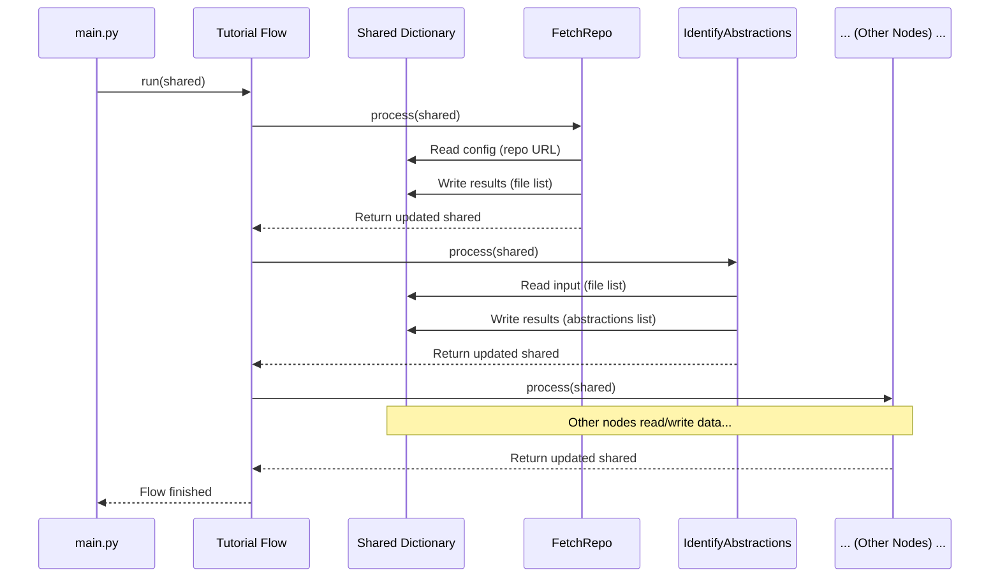

# Chapter 2: Tutorial Generation Flow

In the [previous chapter](01_entry_point___configuration_.md), we saw how the tool starts up using `main.py`, reads your instructions (like which code to analyze and where to save the output), and packs everything into a handy `shared` dictionary, like a backpack for a journey. But what *is* that journey? How does the tool actually take the code and turn it into a tutorial?

That's where the **Tutorial Generation Flow** comes in!

Imagine you're not just baking one cake, but running a small bakery. You wouldn't just mix everything randomly. You'd have an assembly line:
1.  Mix the batter.
2.  Pour into pans.
3.  Bake in the oven.
4.  Cool the cakes.
5.  Add frosting and decorations.

Each step relies on the previous one being completed. Our tutorial generation tool works the same way. It needs a specific sequence of steps to transform raw code into a helpful tutorial.

## The Assembly Line for Tutorials

The **Tutorial Generation Flow** defines this exact sequence. Think of it as the blueprint for our tutorial factory's assembly line. Each "station" on this line is a specific task, which we call a **Processing Node**. We'll learn more about the individual nodes in detail in [Chapter 5: Processing Nodes](05_processing_nodes_.md), but for now, just know that each one does a specific job, like:

*   Getting the code.
*   Figuring out the main ideas in the code.
*   Understanding how different code parts relate.
*   Deciding the best order for tutorial chapters.
*   Writing the actual chapter content.
*   Putting all the chapters together into the final tutorial files.

The **Flow** connects these nodes in the right order. It ensures that the output from one node becomes the input for the next, just like passing the cake down the assembly line. The `shared` dictionary we learned about in Chapter 1 is like the conveyor belt, carrying the information (the code files, analysis results, chapter drafts) between the nodes.

## Defining the Sequence: `flow.py`

How do we tell the tool the correct order? We define it in a file called `flow.py`. Let's look at a simplified version of how this file sets up the assembly line:

```python
# File: flow.py (simplified)
from pocketflow import Flow
# Import the different 'stations' (Nodes)
from nodes import (
    FetchRepo, IdentifyAbstractions, AnalyzeRelationships,
    OrderChapters, WriteChapters, CombineTutorial
)

def create_tutorial_flow():
    """Sets up the sequence of steps for making the tutorial."""

    # 1. Create an instance of each station (Node)
    fetch_repo = FetchRepo() # Station 1: Get the code
    identify_abstractions = IdentifyAbstractions() # Station 2: Find main ideas
    analyze_relationships = AnalyzeRelationships() # Station 3: See connections
    order_chapters = OrderChapters() # Station 4: Plan chapter order
    write_chapters = WriteChapters() # Station 5: Write the chapters
    combine_tutorial = CombineTutorial() # Station 6: Put it all together

    # 2. Define the order using '>>' (means "passes data to")
    fetch_repo >> identify_abstractions
    identify_abstractions >> analyze_relationships
    analyze_relationships >> order_chapters
    order_chapters >> write_chapters
    write_chapters >> combine_tutorial

    # 3. Create the final Flow object, starting with the first station
    tutorial_flow = Flow(start=fetch_repo)

    return tutorial_flow
```

Let's break this down:

1.  **Import Nodes:** First, we import the different `Processing Nodes` (our assembly line stations) from the `nodes.py` file. Each class like `FetchRepo` or `WriteChapters` represents a specific task.
2.  **Create Instances:** We create one instance (like building one of each station) for every step we need.
3.  **Connect Nodes:** This is the crucial part! The `>>` symbol connects the nodes. `fetch_repo >> identify_abstractions` means: "After the `FetchRepo` node finishes its job, pass the results (carried in the `shared` dictionary) to the `IdentifyAbstractions` node." We chain them together in the desired order.
4.  **Create Flow:** Finally, we create the `Flow` object itself, telling it which node is the starting point (`start=fetch_repo`).

This `create_tutorial_flow` function is called by `main.py` (as we saw in Chapter 1) to get the complete, configured assembly line ready to go.

## What Happens When the Flow Runs?

Remember the last line in `main.py`? It looked something like this:

```python
# From main.py
tutorial_flow = create_tutorial_flow() # Get the assembly line blueprint
tutorial_flow.run(shared) # Start the assembly line, passing the initial backpack
```

When `tutorial_flow.run(shared)` is executed, the `Flow` object takes control. It acts like the factory manager, ensuring work happens in the correct sequence:

1.  **Start:** The `Flow` looks at the starting node (`FetchRepo`).
2.  **Process:** It calls the `process` method of the `FetchRepo` node, handing it the `shared` dictionary. The `FetchRepo` node does its work (e.g., downloads code from GitHub) and updates the `shared` dictionary (e.g., adds the list of downloaded files).
3.  **Pass Along:** The `Flow` sees that `FetchRepo` is connected to `IdentifyAbstractions` (`>>`).
4.  **Next Step:** It calls the `process` method of `IdentifyAbstractions`, passing the *updated* `shared` dictionary. This node analyzes the files and adds its findings (e.g., list of main concepts) back into the `shared` dictionary.
5.  **Repeat:** The `Flow` continues this process, following the `>>` connections, calling each node's `process` method in order (`AnalyzeRelationships`, `OrderChapters`, `WriteChapters`, `CombineTutorial`), with each node potentially reading from and writing to the `shared` dictionary.
6.  **Finish:** Once the last node (`CombineTutorial`) finishes, the flow is complete, and the final tutorial files should be written to your output directory.

Let's visualize this data flow:



This diagram shows how the `Tutorial Flow` orchestrates the process, calling each node sequentially and passing the `Shared Dictionary` along, allowing data to accumulate and be transformed at each step.

## Conclusion

The **Tutorial Generation Flow** is like the master plan or recipe for creating our tutorial. It doesn't do the work itself, but it defines the exact sequence of steps (the [Processing Nodes](05_processing_nodes_.md)) that need to happen. Using the `flow.py` file and the `>>` operator, we create an "assembly line" that ensures data flows correctly from getting the initial code to writing the final tutorial files. The `shared` dictionary acts as the conveyor belt, carrying information between the steps.

Now that we understand the overall sequence, let's look at the very first step on our assembly line: getting the code itself!

Ready to fetch some code? Let's move on to [Chapter 3: Codebase Fetching & Filtering](03_codebase_fetching___filtering_.md).

---

Generated by [AI Codebase Knowledge Builder](https://github.com/The-Pocket/Tutorial-Codebase-Knowledge)