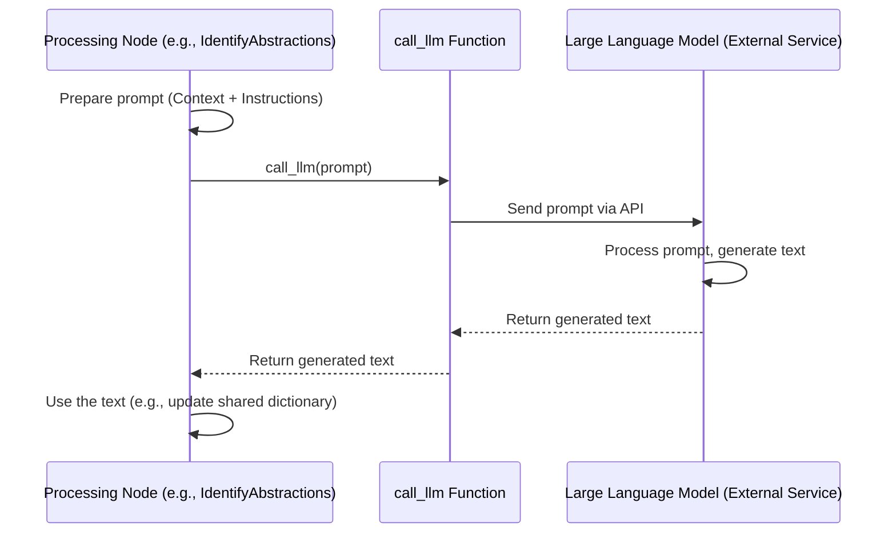

# Chapter 4: LLM-Powered Content Generation

In [Chapter 3: Codebase Fetching & Filtering](03_codebase_fetching___filtering_.md), we saw how our tool acts like a librarian, carefully gathering the most relevant code files for the tutorial. We now have the raw ingredients – the source code. But how do we turn that technical code into easy-to-understand explanations and chapters? Manually writing explanations for large codebases is time-consuming and requires expertise.

**The Challenge:** How can we automatically generate high-quality, human-like text that explains complex code concepts in a simple way?

**Our Solution:** We enlist the help of a powerful new technology: **Large Language Models (LLMs)**.

## What is LLM-Powered Content Generation?

Imagine you have a super-smart assistant who is also an expert technical writer. You can show this assistant pieces of code, give them specific instructions ("Explain this code's purpose", "Identify the main ideas", "Write a chapter about this concept"), and they will write clear, helpful text for you.

That's essentially what **LLM-Powered Content Generation** does in our project!

*   **LLM:** Stands for Large Language Model. Think of it as a very advanced AI trained on vast amounts of text and code. It's excellent at understanding language, recognizing patterns, summarizing information, and generating new text that sounds natural. Examples you might have heard of include models like GPT-3, GPT-4, Claude, or Gemini.
*   **Content Generation:** The LLM doesn't just understand; it *writes*. We use it to generate the actual text content of our tutorial – the explanations, the analyses, the chapter drafts.

In our project, several steps in the [Tutorial Generation Flow](02_tutorial_generation_flow_.md) rely on an LLM to do the heavy lifting of understanding the code and writing about it.

## How Does It Work? The `call_llm` Helper

Our project doesn't have its own LLM built-in. Instead, it communicates with an external LLM service (like one provided by OpenAI, Anthropic, or Google). To make this communication easy and consistent, we use a special helper function called `call_llm`.

Think of `call_llm` as our dedicated phone line to the expert assistant (the LLM).

When one of our Processing Nodes (like `IdentifyAbstractions` or `WriteChapters`, which we'll explore in [Chapter 5: Processing Nodes](05_processing_nodes_.md)) needs the LLM's help, it follows these steps:

1.  **Prepare the Message (The Prompt):** The Node carefully crafts a detailed message, called a **prompt**. This prompt contains:
    *   **Context:** Relevant code snippets, file paths, or information gathered in previous steps.
    *   **Instructions:** Clear directions telling the LLM exactly what kind of text to generate (e.g., "Identify the top 5 core concepts", "Write a chapter introduction", "Explain this code snippet simply").
    *   **Formatting Rules:** Sometimes, we ask the LLM to format its response in a specific way (like YAML or Markdown) so our program can easily understand it.

2.  **Make the Call:** The Node passes this carefully crafted prompt to the `call_llm` function.

3.  **Behind the Scenes (`call_llm`):** The `call_llm` function takes the prompt, handles the technical details of sending it to the LLM service (using API keys, managing network requests), and waits for the response.

4.  **Receive the Answer:** The LLM processes the prompt, generates the requested text, and sends it back. `call_llm` receives this text.

5.  **Return the Result:** `call_llm` gives the generated text back to the Node that called it.

6.  **Use the Result:** The Node takes the LLM's response (e.g., a list of concepts, a chapter draft) and uses it for its task, often saving it back into the `shared` dictionary.

Let's visualize this interaction:



## Example: Asking the LLM to Identify Abstractions

Let's look at a simplified example. Imagine the `IdentifyAbstractions` Node (which we'll meet properly in [Chapter 5](05_processing_nodes_.md)) needs to figure out the main ideas in the code we fetched.

1.  **Prepare Prompt:** It gathers the code content (from `shared["files"]`) and creates a prompt like this (simplified):

    ```text
    # Simplified Prompt for IdentifyAbstractions

    Here is the code from the project:
    --- File Index 0: main.py ---
    # ... content of main.py ...

    --- File Index 1: utils/helpers.py ---
    # ... content of helpers.py ...

    --- (more files) ---

    Analyze this codebase. Identify the top 5 core abstractions (main ideas or components).
    For each abstraction, provide:
    1. A short `name`.
    2. A simple `description`.
    3. The relevant `file_indices`.

    Format the output as a YAML list.
    ```

2.  **Make the Call:** The Node calls `call_llm` with this prompt.

    ```python
    # File: nodes.py (Conceptual code inside IdentifyAbstractions.exec)

    # Assume 'prompt' variable holds the text above
    llm_response_text = call_llm(prompt)

    # llm_response_text might now contain something like:
    # """
    # ```yaml
    # - name: Configuration Loading
    #   description: Handles reading settings from files and environment.
    #   file_indices: [0]
    # - name: Utility Functions
    #   description: Provides common helper functions used across the project.
    #   file_indices: [1]
    # # ... more abstractions ...
    # ```
    # """
    ```

3.  **Use the Result:** The Node parses this YAML response to get the list of abstractions and saves it to `shared["abstractions"]`.

This mechanism is used repeatedly:
*   To identify core concepts (`IdentifyAbstractions`).
*   To figure out how concepts relate (`AnalyzeRelationships`).
*   To decide the best chapter order (`OrderChapters`).
*   To write the detailed content of each chapter (`WriteChapters`).

## Why is this Important?

Using LLMs for content generation gives our project superpowers:

*   **Automation:** It can automatically generate tutorials for complex codebases, saving huge amounts of human effort.
*   **Code Understanding:** LLMs are surprisingly good at understanding the *intent* and *structure* of code, not just the syntax.
*   **Natural Language:** They produce explanations that are (usually) clear, concise, and easy for beginners to understand.
*   **Flexibility:** By changing the prompts, we can ask the LLM to generate different kinds of content or focus on different aspects of the code. (We even use this for [Multi-Language Support](06_multi_language_support_.md)!)

## Conclusion

**LLM-Powered Content Generation** is the engine that drives the actual writing process in our `Tutorial-Codebase-Knowledge` project. By sending carefully crafted prompts (containing code context and instructions) to a Large Language Model via the `call_llm` helper function, we can automatically generate explanations, analyses, and chapter text. It's like having an AI technical writer on demand, enabling us to turn raw code into helpful tutorials efficiently.

Now that we understand *how* the content gets written using the LLM, let's look more closely at the different "stations" or Nodes on our assembly line that use this power to perform specific tasks like identifying concepts, analyzing relationships, and writing chapters.

Ready to meet the Processing Nodes? Let's move on to [Chapter 5: Processing Nodes](05_processing_nodes_.md).

---

Generated by [AI Codebase Knowledge Builder](https://github.com/The-Pocket/Tutorial-Codebase-Knowledge)