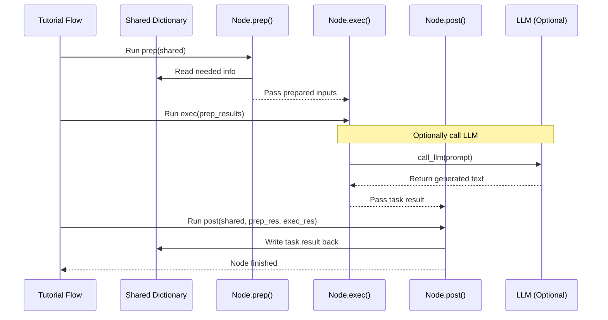

# Chapter 5: Processing Nodes

In [Chapter 4: LLM-Powered Content Generation](04_llm_powered_content_generation_.md), we saw how we use a powerful AI assistant (the LLM) to understand code and write explanations. But who tells the assistant *what* to write? Who prepares the code for it? And who takes the AI's output and puts it in the right place?

Think back to our [Tutorial Generation Flow](02_tutorial_generation_flow_.md) – the assembly line for creating our tutorial. The assembly line itself just defines the order of steps. The actual *work* at each station is done by specialized workers. In our project, these workers are called **Processing Nodes**.

## The Specialized Robots of Tutorial Creation

Imagine our tutorial assembly line again. Instead of human workers, we have specialized robots.
*   One robot is programmed only to fetch raw materials (code files).
*   Another robot's only job is to analyze those materials and identify the most important parts (using the LLM).
*   A third robot takes those important parts and writes a draft description for each (using the LLM).
*   Finally, another robot collects all the drafts and assembles the final product (the tutorial files).

Each robot is a **Processing Node**. It's an individual component in our system designed to perform one specific, focused task within the overall tutorial generation process.

Examples of Nodes in our project include:
*   `FetchRepo`: Gets the code from GitHub or your local disk (like the fetching robot).
*   `IdentifyAbstractions`: Asks the LLM to find the main concepts in the code (like the analyzing robot).
*   `AnalyzeRelationships`: Asks the LLM how concepts connect.
*   `OrderChapters`: Asks the LLM for the best chapter sequence.
*   `WriteChapters`: Asks the LLM to write the content for each chapter (like the drafting robot).
*   `CombineTutorial`: Puts all the written chapters together into the final files (like the assembly robot).

## The Anatomy of a Node: `prep`, `exec`, `post`

How does each Node know what to do? Every Processing Node in our project follows a standard structure, defined by three special methods (functions inside the Node): `prep`, `exec`, and `post`. Think of it like a mini-workflow for each robot:

1.  **`prep` (Prepare):** Gather your tools and ingredients.
    *   **Input:** Gets the main `shared` dictionary (the backpack carrying everything).
    *   **Job:** Looks inside `shared` and picks out only the specific information *this* Node needs for its task (e.g., file list, API keys, previous results).
    *   **Output:** Returns a small package of just the necessary items for the next step (`exec`).

2.  **`exec` (Execute):** Do the main job.
    *   **Input:** Gets the prepared package from `prep`.
    *   **Job:** Performs the Node's core task. This might involve:
        *   Fetching files (`FetchRepo`).
        *   Calling the LLM using `call_llm` with a specific prompt (`IdentifyAbstractions`, `WriteChapters`).
        *   Organizing data.
    *   **Output:** Returns the result of its specific task (e.g., the list of fetched files, the text generated by the LLM, the ordered list of chapters).

3.  **`post` (Post-Process/Store):** Put your results away neatly.
    *   **Input:** Gets the main `shared` dictionary, the results from `prep`, and the results from `exec`.
    *   **Job:** Takes the result generated by `exec` and puts it back into the `shared` dictionary under a specific key, making it available for the *next* Node in the assembly line.
    *   **Output:** Doesn't usually return anything, just updates `shared`.

Let's visualize this internal Node workflow:



This `prep -> exec -> post` cycle happens for *every* Node as the `Tutorial Flow` runs, ensuring each step gets the data it needs and stores its results correctly.

## Example: `IdentifyAbstractions` Node in Action

Let's trace how the `IdentifyAbstractions` Node uses this structure:

1.  **`prep`:**
    *   Gets the `shared` dictionary.
    *   Reads `shared["files"]` (the list of code files from `FetchRepo`).
    *   Reads `shared["project_name"]`.
    *   Reads `shared["language"]`.
    *   Formats the file content and other details needed for the LLM prompt.
    *   Returns these prepared items.

2.  **`exec`:**
    *   Gets the prepared file content, project name, and language from `prep`.
    *   Crafts a detailed prompt asking the LLM to identify core abstractions in the provided code, requesting the output in YAML format and in the specified language (referencing [Chapter 4: LLM-Powered Content Generation](04_llm_powered_content_generation_.md)).
    *   Calls `call_llm(prompt)`.
    *   Receives the YAML response from the LLM.
    *   Parses and validates the YAML to get a list of abstractions (e.g., `[{'name': 'Concept A', 'description': '...', 'files': [0, 2]}, ...]`).
    *   Returns this list of abstractions.

3.  **`post`:**
    *   Gets the `shared` dictionary and the list of abstractions from `exec`.
    *   Updates the `shared` dictionary by setting `shared["abstractions"] = list_from_exec`.
    *   Now the next Node in the flow (like `AnalyzeRelationships`) can access `shared["abstractions"]`.

## Code Structure: Defining a Node

These Nodes are defined as Python classes in the `nodes.py` file. They inherit functionality from a base `Node` class provided by the `pocketflow` library. Here's a simplified look at the structure:

```python
# File: nodes.py (Simplified Structure)
from pocketflow import Node # Base class for Nodes
from utils.call_llm import call_llm # Helper to talk to AI

# Example: IdentifyAbstractions Node
class IdentifyAbstractions(Node):

    def prep(self, shared):
        print("Preparing data for IdentifyAbstractions...")
        # 1. Get needed info from shared dictionary
        files_data = shared["files"]
        project_name = shared["project_name"]
        language = shared.get("language", "english")

        # 2. Process it (e.g., format file content)
        context, file_listing, file_count = self._prepare_context(files_data) # Example helper

        # 3. Return only what exec needs
        return context, file_listing, file_count, project_name, language

    def exec(self, prep_res):
        print("Executing IdentifyAbstractions (calling LLM)...")
        # 1. Unpack results from prep
        context, file_listing, file_count, project_name, language = prep_res

        # 2. Create the LLM prompt using prepared data
        prompt = self._create_prompt(context, file_listing, project_name, language) # Example helper

        # 3. Call the LLM (the core task)
        llm_response = call_llm(prompt)

        # 4. Process the LLM response (e.g., parse YAML)
        abstractions = self._parse_response(llm_response, file_count) # Example helper

        # 5. Return the result of the task
        return abstractions # List of abstraction dictionaries

    def post(self, shared, prep_res, exec_res):
        print("Storing results from IdentifyAbstractions...")
        # 1. Get the result from exec
        abstractions_list = exec_res

        # 2. Put it back into the shared dictionary
        shared["abstractions"] = abstractions_list
        # Now shared['abstractions'] is ready for the next node

    # Helper methods (like _prepare_context, _create_prompt, _parse_response)
    # would be defined here too...
```

This structure makes the code organized and modular. Each Node focuses only on its job, interacting with the rest of the system primarily through the `shared` dictionary.

## Conclusion

**Processing Nodes** are the heart of the `Tutorial-Codebase-Knowledge` project's execution. They are the specialized workers on our tutorial assembly line, each performing a distinct task like fetching code, analyzing it with an LLM, or writing output files.

By following the standard `prep -> exec -> post` pattern, each Node systematically prepares its inputs, performs its core function, and stores its results back into the shared `shared` dictionary. This modular design, orchestrated by the [Tutorial Generation Flow](02_tutorial_generation_flow_.md), allows us to build complex workflows like tutorial generation in a manageable and understandable way.

We've seen how Nodes can use the LLM. But how does our tool handle generating tutorials in different languages, like Spanish or French, not just English?

Ready to explore language flexibility? Let's move on to [Chapter 6: Multi-Language Support](06_multi_language_support_.md).

---

Generated by [AI Codebase Knowledge Builder](https://github.com/The-Pocket/Tutorial-Codebase-Knowledge)