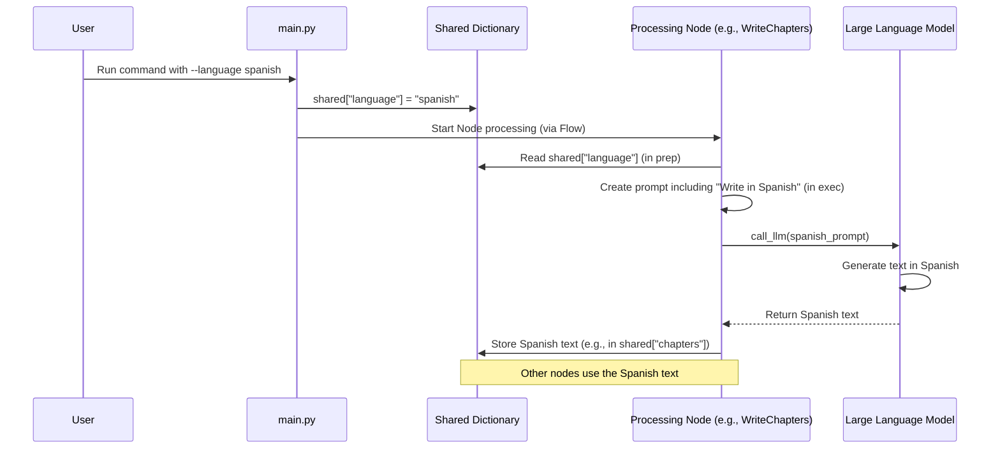

# Chapter 6: Multi-Language Support

In [Chapter 5: Processing Nodes](05_processing_nodes_.md), we learned about the specialized "workers" (like `IdentifyAbstractions` and `WriteChapters`) on our tutorial assembly line. We saw how they use the AI assistant ([LLM](04_llm_powered_content_generation_.md)) to understand code and generate explanations. But what if you want the tutorial explained in a language other than English?

**The Problem:** Software development is global, but many technical resources are primarily in English. Wouldn't it be great if our tool could automatically write tutorials in Spanish, French, German, or other languages?

**Our Solution:** We've built **Multi-Language Support** directly into the process! It's like giving our expert AI writer a specific language instruction before it starts drafting the content.

## Use Case: Un Tutorial en Español

Imagine you want to generate a tutorial for your project, `mi-proyecto`, but you want it written entirely in Spanish for your colleagues. With multi-language support, you can simply tell the tool:

```bash
python main.py --dir ./mi-proyecto --output mi_tutorial_es --language spanish
```

The tool will then instruct the LLM to generate the core explanations – the abstraction descriptions, the project summary, and the chapter content – in Spanish.

## Key Concepts: How We Speak the LLM's Language

Making the tutorial generation multilingual involves a few key steps woven through our existing process:

1.  **Telling the Tool (`--language` argument):** Just like `--repo` or `--output`, we use a command-line argument, `--language`, to specify the desired output language. If you don't provide it, it defaults to "english".

2.  **Packing the Instruction (`shared` dictionary):** When `main.py` starts ([Chapter 1: Entry Point & Configuration](01_entry_point___configuration_.md)), it reads the `--language` argument and stores the chosen language (e.g., "spanish") inside our shared backpack, the `shared` dictionary, typically under the key `"language"`.

3.  **Relaying the Message (Nodes):** As the [Tutorial Generation Flow](02_tutorial_generation_flow_.md) progresses, each Processing Node that interacts with the LLM (like `IdentifyAbstractions`, `AnalyzeRelationships`, `WriteChapters`) does the following:
    *   In its `prep` step, it looks inside the `shared` dictionary and retrieves the target language.
    *   In its `exec` step, when crafting the prompt for the `call_llm` function ([Chapter 4: LLM-Powered Content Generation](04_llm_powered_content_generation_.md)), it includes specific instructions telling the LLM to generate certain text parts *in that specific language*.

4.  **Targeted Translation (LLM Prompts):** We don't just say "translate everything". We strategically tell the LLM *which* parts need to be in the target language. This usually includes:
    *   Abstraction names and descriptions (`IdentifyAbstractions`).
    *   The overall project summary (`AnalyzeRelationships`).
    *   Relationship labels (`AnalyzeRelationships`).
    *   The entire chapter content written by `WriteChapters`.

    Code examples, filenames, and fixed text elements (like the "Generated by..." footer added by `CombineTutorial`) generally remain in their original form (usually English) to avoid confusion.

**Analogy: The Multilingual Expert**

Think of the LLM as our expert writer. The `--language` flag is like telling the expert, "Okay, for this next writing task (like describing a concept or writing a chapter), please write it in Spanish." The Processing Nodes act as the managers, ensuring the expert gets this language instruction along with the writing assignment (the rest of the prompt).

## Behind the Scenes: Code Adjustments

Let's see how this looks in simplified code examples:

**1. Accepting the Language in `main.py`**

We add an argument for language using `argparse`:

```python
# File: main.py (simplified argparse setup)
import argparse

parser = argparse.ArgumentParser(description="Generate a tutorial...")
# ... other arguments ...
parser.add_argument("--language", default="english",
                    help="Language for the generated tutorial (default: english)")
```

And store it in the `shared` dictionary:

```python
# File: main.py (simplified shared dict creation)

args = parser.parse_args()
# ... other argument handling ...

shared = {
    # ... other settings ...
    "language": args.language, # Store the chosen language
    # ... placeholders ...
}
```

**2. Nodes Reading the Language**

In the `prep` method of a Node that needs the LLM, we retrieve the language:

```python
# File: nodes.py (Simplified IdentifyAbstractions.prep)

class IdentifyAbstractions(Node):
    def prep(self, shared):
        # ... get files_data, project_name ...
        language = shared.get("language", "english") # Get language from shared
        # ... prepare context ...
        # Return language along with other needed data for exec
        return context, file_listing, file_count, project_name, language
```

**3. Instructing the LLM in `exec`**

In the `exec` method, the Node uses the retrieved language to modify the prompt sent to `call_llm`.

*Example for `IdentifyAbstractions` (asking for names/descriptions in Spanish):*

```python
# File: nodes.py (Simplified IdentifyAbstractions.exec)

# (Inside exec method)
context, file_listing, file_count, project_name, language = prep_res # Unpack language

language_instruction = ""
name_lang_hint = ""
desc_lang_hint = ""
if language.lower() != "english":
    lang_cap = language.capitalize()
    # Add specific instruction for the LLM
    language_instruction = f"IMPORTANT: Generate the `name` and `description` in **{lang_cap}** language.\n\n"
    name_lang_hint = f" (in {lang_cap})"
    desc_lang_hint = f" (in {lang_cap})"

# Construct the prompt, including the language instruction
prompt = f"""
{language_instruction}Analyze the codebase context.
Identify the top 5-10 core abstractions...
For each abstraction, provide:
1. A concise `name`{name_lang_hint}.
2. A beginner-friendly `description`{desc_lang_hint}.
3. Relevant `file_indices`.
... rest of prompt ...
```yaml
- name: Concept Name{name_lang_hint}
  description: Explanation of concept{desc_lang_hint}.
  file_indices: [0]
```"""

# Call the LLM
llm_response = call_llm(prompt)
# Parse the response (name/description should be in the target language)
```

*Example for `WriteChapters` (asking for the entire chapter in Spanish):*

```python
# File: nodes.py (Simplified WriteChapters.exec - runs for each chapter)

# (Inside exec method for one chapter item)
language = item.get("language", "english") # Get language for this chapter

language_instruction = ""
if language.lower() != "english":
    lang_cap = language.capitalize()
    # Add specific instruction for the LLM
    language_instruction = f"IMPORTANT: Write this ENTIRE tutorial chapter in **{lang_cap}**. Translate ALL generated content including explanations, examples, and technical terms into {lang_cap}. DO NOT use English anywhere except in code syntax itself.\n\n"

# Construct the prompt
prompt = f"""
{language_instruction}Write a very beginner-friendly tutorial chapter... about "{item['abstraction_details']['name']}".

Concept Details (May already be in {language.capitalize()}):
...

Instructions (Generate content in {language.capitalize()}):
- Start with heading...
- Explain concepts... {language.capitalize()}
- Use analogies... {language.capitalize()}
... rest of instructions ...

Now, directly provide the Markdown output in {language.capitalize()}:
"""

# Call the LLM
chapter_content = call_llm(prompt)
# chapter_content should now be the full chapter Markdown in the target language
```

**4. Combining the Tutorial**

The `CombineTutorial` node takes the potentially translated chapter content, abstraction names/descriptions, and summary from the `shared` dictionary. It uses these directly when building the `index.md` file and writing the individual chapter files. It *doesn't* do any translation itself; it just assembles the pieces generated by earlier nodes. Fixed strings, like the attribution footer, remain in English.

## Visualizing the Flow

Here's how the language information travels:



## Conclusion

Multi-language support adds significant value to our `Tutorial-Codebase-Knowledge` tool, making the generated tutorials accessible to a wider audience. By adding a simple `--language` command-line argument, we can store the desired language in the `shared` dictionary. Processing Nodes then retrieve this language setting and incorporate specific instructions into their prompts for the LLM, asking it to generate key textual content (like descriptions, summaries, and chapter text) in the target language. This acts like a translation layer applied during the AI writing process, enabling automated generation of tutorials in various languages.

This concludes our journey through the `Tutorial-Codebase-Knowledge` project! We've seen how it goes from configuration and fetching code to using LLMs and processing nodes to generate structured, potentially multi-language tutorials.

---

Generated by [AI Codebase Knowledge Builder](https://github.com/The-Pocket/Tutorial-Codebase-Knowledge)