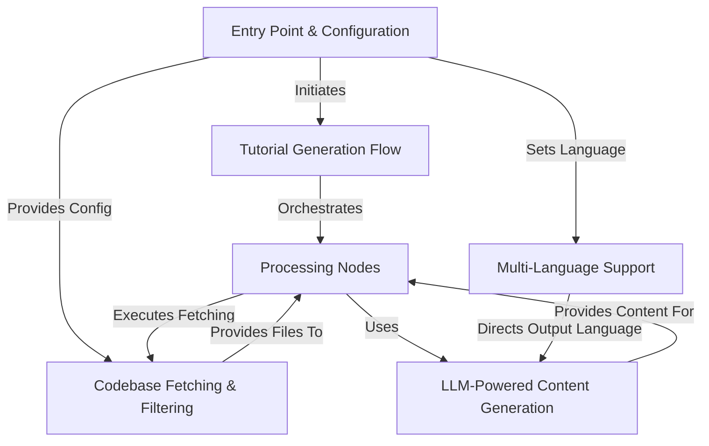

# Tutorial: Tutorial-Codebase-Knowledge

This project, **Tutorial-Codebase-Knowledge**, automatically generates beginner-friendly tutorials for software projects directly from their source code.
It utilizes a defined *Tutorial Generation Flow* (Abstraction 0) which orchestrates several distinct *Processing Nodes* (Abstraction 1). Key steps involve configuring the process via the *Entry Point & Configuration* (Abstraction 4), performing *Codebase Fetching & Filtering* (Abstraction 3) to get the relevant source files, leveraging **LLM-Powered Content Generation** (Abstraction 2) for code analysis and tutorial writing, and incorporating *Multi-Language Support* (Abstraction 5) throughout the process. The ultimate goal is to produce a structured, easy-to-understand Markdown tutorial for newcomers to a given codebase.

**Source Repository:** [None](None)

## Chapters

1. [Entry Point & Configuration
](01_entry_point___configuration_.md)
2. [Tutorial Generation Flow
](02_tutorial_generation_flow_.md)
3. [Codebase Fetching & Filtering
](03_codebase_fetching___filtering_.md)
4. [LLM-Powered Content Generation
](04_llm_powered_content_generation_.md)
5. [Processing Nodes
](05_processing_nodes_.md)
6. [Multi-Language Support
](06_multi_language_support_.md)

---

Generated by [AI Codebase Knowledge Builder](https://github.com/The-Pocket/Tutorial-Codebase-Knowledge)