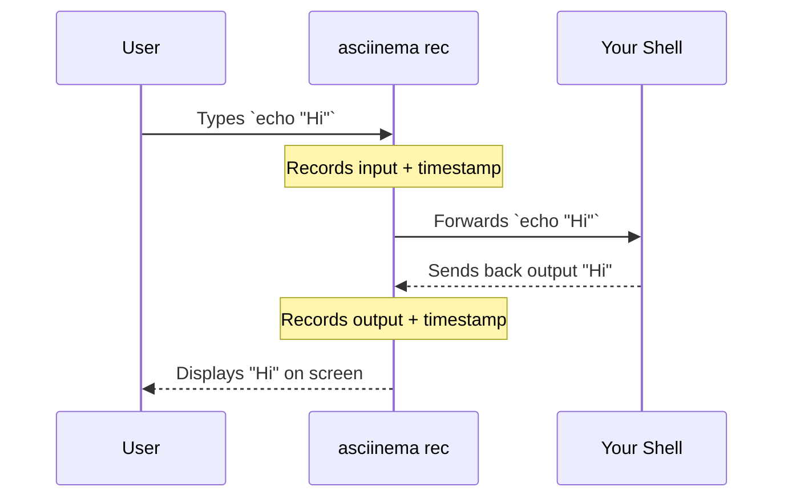

# Chapter 1: Terminal Session Recording

Welcome to the world of `asciinema`! If you've ever wanted to share what you're doing in your terminal—whether to teach a concept, ask for help, or show off a cool command-line trick—you've come to the right place.

The biggest challenge with sharing terminal work is that simply copying and pasting text doesn't tell the whole story. You lose colors, the timing of commands, and the interactive flow of the session. A screen recording video (`.mp4`) can work, but the files are large and the text is often blurry and can't be copied.

`asciinema` solves this problem with its core feature: **Terminal Session Recording**.

Think of it like a court stenographer for your command line. It sits silently in the background, meticulously documenting every key you press and every character that appears on your screen. This entire transcript is saved into a special, lightweight file that can be perfectly replayed later.

### Your First Recording: A "Hello World" Session

Let's jump right in and create our first recording. The primary command for this is `asciinema rec`.

1.  **Start the Recorder**

    Open your terminal and type the following command, then press Enter.

    ```sh
    asciinema rec hello_world.cast
    ```

    This command tells `asciinema` to start recording and save the session into a file named `hello_world.cast`. Your terminal will display a message like this:

    ```
    asciinema: recording asciicast to hello_world.cast
    asciinema: press <ctrl-d> or type "exit" to finish
    ```

    You are now in a new shell session, and everything you do is being recorded!

2.  **Run Some Commands**

    Now, let's perform a few simple actions. Type each command and press Enter.

    ```sh
    echo "Hello, asciinema!"
    ```

    This will print `Hello, asciinema!` to the screen. Let's try another one.

    ```sh
    ls -l
    ```

    This will list the files in your current directory. Notice that `hello_world.cast` is not listed yet, because the recording is still in progress.

3.  **Stop the Recorder**

    Once you are done, you can stop the recording by simply ending the shell session. You can do this in two ways:
    *   Type `exit` and press Enter.
    *   Or, press the key combination `Ctrl+D`.

    After you exit, you will see a final message:

    ```
    asciinema: recording finished
    asciinema: asciicast saved to hello_world.cast
    ```

Congratulations! You've just created your first terminal recording. You now have a file named `hello_world.cast` in your directory. This file contains everything that just happened.

### How Does It Actually Work?

You might be wondering what magic is happening behind the scenes. It's surprisingly simple and clever.

When you run `asciinema rec`, it doesn't just watch your existing terminal. Instead, it starts a *new* shell session inside a special environment called a "pseudo-terminal" (PTY). This PTY acts as a middle-man between you and the shell.

1.  Your keystrokes are sent to `asciinema`.
2.  `asciinema` records your input and the exact time it happened.
3.  `asciinema` passes your input along to the real shell.
4.  The shell processes the command and produces output (text, colors, etc.).
5.  This output is sent back to `asciinema`.
6.  `asciinema` records the output and its timing, and then passes it along to your terminal so you can see it.

This process captures a perfect, timed transcript of the entire session. Here is a simple diagram to visualize the flow:



This whole mechanism is what makes `asciinema` so powerful. It's not a video; it's structured data. The resulting `.cast` file is just a text file containing the stream of characters and timing information. This makes the recordings extremely small and easy to share. We will look closer at the file itself in the next chapter.

### Conclusion

In this chapter, you learned the fundamental concept of `asciinema`: recording everything that happens in a terminal session. You used the `asciinema rec` command to capture your actions into a file. We also took a quick peek under the hood to understand that `asciinema` acts as a clever middle-man, creating a perfect, lightweight transcript of your session.

But what is this `.cast` file we created? What does it look like inside? Let's dive in and explore the anatomy of our recording in the next chapter on the [Asciicast File Format](02_asciicast_file_format_.md).

---

Generated by [AI Codebase Knowledge Builder](https://github.com/The-Pocket/Tutorial-Codebase-Knowledge)