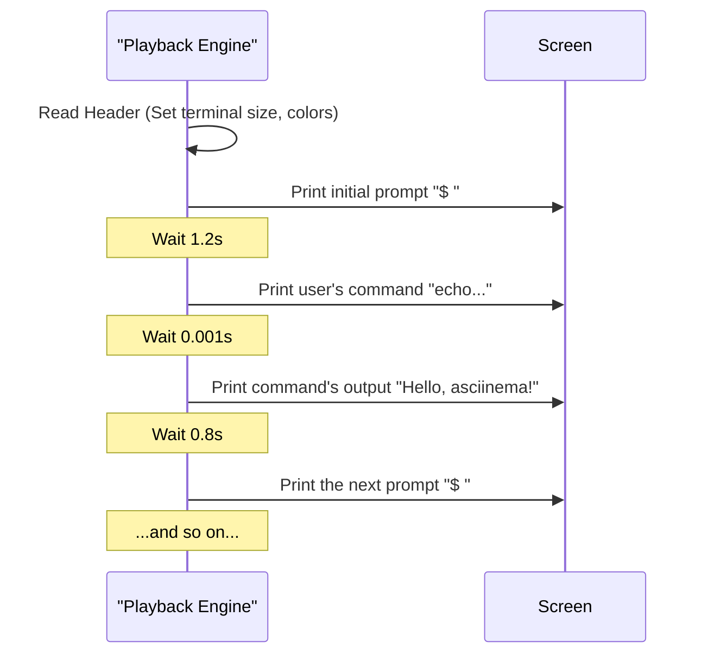

# Chapter 2: Asciicast File Format

In [Chapter 1: Terminal Session Recording](01_terminal_session_recording_.md), you successfully created your first recording and saved it as `hello_world.cast`. But what exactly *is* this `.cast` file? You might be picturing a small video, but the reality is much simpler, lighter, and more powerful.

Let's demystify the "film" on which `asciinema` records.

### Not a Video, but Sheet Music

A screen recording creates a video file (`.mp4`, `.mov`), which is essentially a rapid sequence of pictures. This makes files large, and the text within them becomes part of the picture—blurry and impossible to copy.

An asciicast (`.cast`) file takes a completely different approach. It's a lightweight, text-based file that contains a timed script of everything that happened in the terminal.

Think of it like this: a video recording of a piano performance is like filming the pianist's hands. An asciicast is like the **sheet music** for that performance. It doesn't contain the sound itself, but it has all the notes, timings, and instructions needed for any pianist (or in our case, any computer) to recreate the performance perfectly.

This approach has amazing benefits:
*   **Tiny File Sizes:** A ten-minute session can be just a few hundred kilobytes, not hundreds of megabytes.
*   **Selectable Text:** Since it's just text, you can pause a playback and copy a command right out of the "video"!
*   **Perfect Quality:** The output is rendered by your own terminal, so it's always crystal clear, never blurry.

### Peeking Inside the `.cast` File

Let's look inside the `hello_world.cast` file you created. Since it's just a text file, you can open it with any text editor or view its contents with a command like `cat` or `less`.

```sh
cat hello_world.cast
```

The content will look something like this (we've simplified it for clarity):

```json
{"version": 3, "width": 80, "height": 24, "timestamp": 1678886400, "theme": {"fg": "#d0d0d0", "bg": "#000000"}}
[0.523456, "o", "$ "]
[1.200000, "o", "echo \"Hello, asciinema!\"\r\n"]
[0.001234, "o", "Hello, asciinema!\r\n"]
[0.800000, "o", "$ "]
[1.500000, "o", "ls -l\r\n"]
[0.150000, "o", "-rw-r--r-- 1 user user 245 Mar 15 12:00 hello_world.cast\r\n"]
[1.100000, "o", "$ "]
[0.900000, "o", "exit\r\n"]
```

At first glance, this might seem a little cryptic, but it's built on a very simple structure. The format has two main parts.

#### 1. The Header (The First Line)

The very first line is a single line of JSON that acts as the "cover page" for our sheet music. It contains metadata about the recording.

```json
{"version": 3, "width": 80, "height": 24, "timestamp": 1678886400, "theme": {"fg": "#d0d0d0", "bg": "#000000"}}
```

Here are the key parts for a beginner:
*   `"version": 3`: This tells us it's an **asciicast version 3** file. This is the latest and greatest format.
*   `"width": 80`, `"height": 24`: This is the size of the terminal (80 columns wide, 24 rows high) when the recording started.
*   `"theme"`: This is a cool feature! `asciinema` automatically saves the colors of your terminal so the playback can look just like the original.

#### 2. The Event Stream (The "Notes")

Every line after the header is an **event**. Each event is a tiny instruction for the playback engine, written as a JSON array. It's one "note" in our sheet music.

Let's break down a single event line:

```json
[1.200000, "o", "echo \"Hello, asciinema!\"\r\n"]
```

Each event has three parts:
1.  **Time Delay:** `1.200000`. This is the number of seconds to wait after the *previous* event before executing this one. This is how `asciinema` captures the pauses while you were thinking or typing.
2.  **Event Type:** `"o"`. This tells the player *what* to do. The most common type is `o`, which stands for **output**. It means "print this text to the screen."
3.  **Event Data:** `"echo \"Hello, asciinema!\"\r\n"`. This is the actual text that was printed to the terminal. The `\r\n` represents the "Enter" key press (a carriage return and a newline).

Putting it all together, the line above means: "Wait 1.2 seconds, then print the text `echo "Hello, asciinema!"` to the screen, followed by a new line."

### How It All Works Together

Now we can understand the whole story of our recording just by reading the file:



The `asciinema` player simply reads this file line-by-line, waits the specified amount of time, and prints the text. It's a beautifully simple system that allows for a perfect, lightweight recreation of the original session.

### Conclusion

In this chapter, you've pulled back the curtain on the magic of `asciinema`. You learned that the `.cast` file isn't a heavy video file, but a simple, text-based "script" of your terminal session. It's made up of a **header** with metadata and a **stream of timed events** that perfectly describe the session.

This format is the heart of `asciinema`, enabling small file sizes and crystal-clear, copy-paste-friendly playback.

Now that we understand the "sheet music," how does `asciinema` actually play it? In the next chapter, we'll explore the musician: the [Terminal Playback Engine](03_terminal_playback_engine_.md).

---

Generated by [AI Codebase Knowledge Builder](https://github.com/The-Pocket/Tutorial-Codebase-Knowledge)