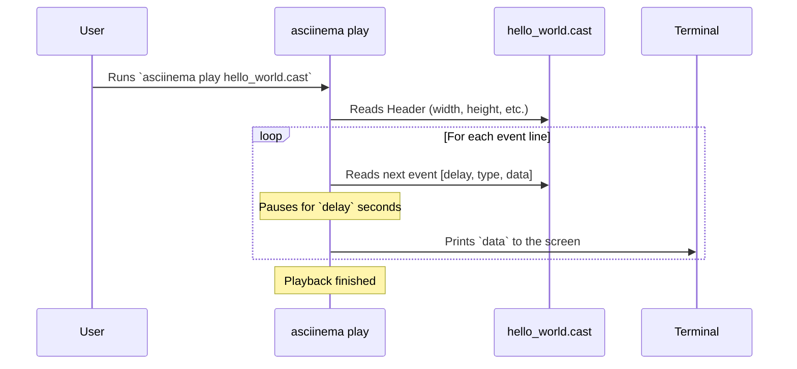

# Chapter 3: Terminal Playback Engine

In [Chapter 2: Asciicast File Format](02_asciicast_file_format_.md), we discovered that a `.cast` file is like sheet music for your terminal session. It contains all the instructions—the notes and the timing—needed to recreate a performance.

But how do you actually play that music? You need a musician, or in our case, a "player piano" for your terminal. This is where `asciinema`'s **Terminal Playback Engine** comes in. It's the mechanism that reads the `.cast` file and performs the session perfectly right inside your own terminal.

### Playing Your First Recording

The primary command for playback is `asciinema play`. Let's use it to watch the `hello_world.cast` file you created in the first chapter.

1.  **Run the Play Command**

    In your terminal, simply type the following command:

    ```sh
    asciinema play hello_world.cast
    ```

2.  **Watch the Magic**

    As soon as you press Enter, your terminal screen will clear, and you'll see your recorded session play back. You will see the text `"Hello, asciinema!"` appear, followed by the output of `ls -l`, exactly as you typed it, and with the exact same pauses you made. It’s a perfect, high-fidelity replay.

    Once the playback is finished, you'll see a message like `asciinema: playback finished` and you'll be returned to your regular command prompt.

That's it! You've just used the playback engine. It takes the "sheet music" and performs it for you.

### Taking Control of the Playback

The playback engine is more than just a simple play button. It gives you interactive controls to inspect the recording more closely.

#### Pausing and Frame-by-Frame Stepping

Sometimes things happen too quickly in a recording. You can easily pause the playback at any time.

*   **Press the `Space` bar** to pause or resume the playback.
*   While paused, **press the `.` (period) key** to advance the playback one "frame" (a single chunk of output) at a time. This is incredibly useful for analyzing a complex command or script.

#### Changing the Speed

Want to watch a long session more quickly, or slow down a fast one? You can use the `--speed` (or `-s`) option.

*   To play back at **double speed**, use `-s 2`:
    ```sh
    asciinema play -s 2 hello_world.cast
    ```
*   To play back at **half speed**, use `-s 0.5`:
    ```sh
    asciinema play -s 0.5 hello_world.cast
    ```

This works by dividing all the time delays in the `.cast` file by the speed factor you provide.

### How Does It Work Under the Hood?

The logic of the playback engine is beautifully straightforward. When you run `asciinema play`, it performs a simple loop:

1.  **Read the Header:** First, it reads the header line of the `.cast` file to learn about the recording's metadata, like the original terminal's dimensions (`width`, `height`).
2.  **Read an Event:** It reads the next event line from the file. For example: `[1.2, "o", "echo ..."]`.
3.  **Wait:** It looks at the first number (the time delay) and pauses for that amount of time. In our example, it waits for `1.2` seconds.
4.  **Print:** It looks at the event type (`"o"` for output) and the data, and it prints that data directly to your terminal. Your own terminal is responsible for rendering the text, the colors, and moving the cursor.
5.  **Repeat:** It repeats steps 2-4 until it reaches the end of the file.

This simple, step-by-step process is what ensures a perfect reproduction.

Here is a diagram illustrating the flow:



Because the playback engine sends the raw text and control codes from the recording to *your* terminal, the output is always rendered perfectly. It's not a blurry video; it's crisp text, just as if you were typing it yourself. This also means you can often select and copy text right out of the playback window!

### Conclusion

In this chapter, you learned about the "musician" in the `asciinema` orchestra: the **Terminal Playback Engine**. You've seen how the simple `asciinema play` command can bring a `.cast` file to life. You've also learned how to take control of the performance by pausing, stepping through frames, and changing the speed.

We now understand how to record a session and how to play it back. But what if you want someone to watch your terminal session *as it happens*? In the next chapter, we'll explore one of `asciinema`'s most exciting features: [Live Terminal Streaming](04_live_terminal_streaming_.md).

---

Generated by [AI Codebase Knowledge Builder](https://github.com/The-Pocket/Tutorial-Codebase-Knowledge)