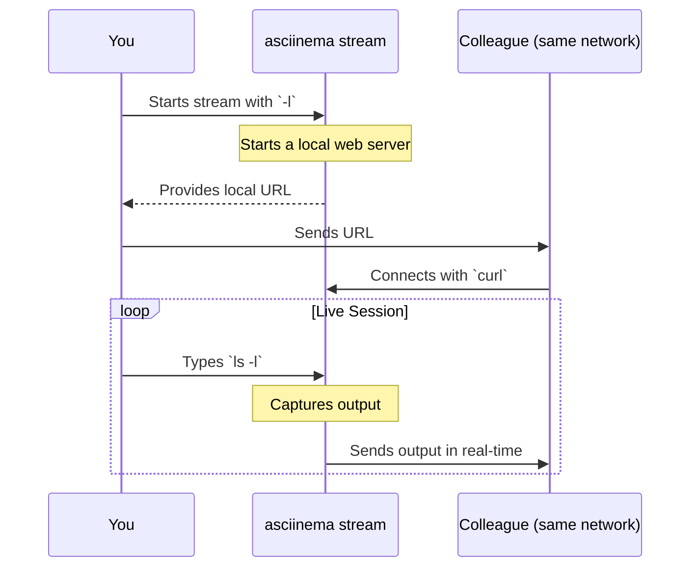
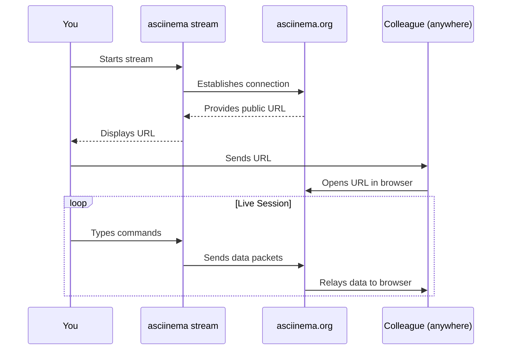

# Chapter 4: Live Terminal Streaming

In [Chapter 3: Terminal Playback Engine](03_terminal_playback_engine_.md), you mastered the art of playing back recorded terminal sessions. This is perfect for sharing work you've already done. But what if you need to show someone what you're doing *right now*, as it happens?

This is where `asciinema`'s most dynamic feature comes into play: **Live Terminal Streaming**.

### Going Live: From Recorded Show to Live Broadcast

Think about the difference between watching a pre-recorded movie and watching a live sports game. Recording a session with `asciinema rec` is like making a movie. You can edit it (if you're clever), share it, and people can watch it whenever they want.

**Live Streaming** is the sports game. It's happening in real-time. You can broadcast your terminal session so that others can connect and watch your every keystroke, command, and output as you type it. It's the ultimate tool for live demos, pair programming, or getting real-time help from a colleague.

This powerful feature is enabled by the `asciinema stream` command.

### Use Case: Showing a Colleague a Command

Imagine your colleague is struggling with a tricky command-line tool, and they're in a different office. You could try to explain it over chat, but it's complicated. With live streaming, you can just say, "Here, watch my terminal," and guide them through it live.

Let's explore the two ways you can do this.

#### Method 1: Local Streaming (On the Same Network)

If your colleague is in the same building and connected to the same Wi-Fi or office network, you can use local streaming. This method starts a mini web server directly on your computer that broadcasts your terminal session only to others on your local network.

1.  **Start the Stream**

    On your machine, run the `stream` command with the `-l` (local) flag.

    ```sh
    asciinema stream -l
    ```

    `asciinema` will start a new shell session, just like with `rec`, but it will also display a message with the local URL your colleague can use to watch.

    ```
    asciinema: streaming viewable at http://192.168.1.10:8998
    asciinema: press <ctrl-d> or type "exit" to finish
    ```
    *(Your IP address and port might be different.)*

2.  **Have Your Colleague Tune In**

    Your colleague can now watch your stream in their own terminal using a tool like `curl` or in their web browser. They just need to use the URL provided.

    ```sh
    # On your colleague's machine
    curl http://192.168.1.10:8998
    ```
    As you type commands in your terminal, they will see the output appear live in theirs!

3.  **End the Stream**

    Just like with recording, type `exit` or press `Ctrl+D` to stop the broadcast.

This is fast, private, and perfect for quick collaboration within a trusted network.

#### Method 2: Remote Streaming (Across the Internet)

What if your colleague is working from home or is in another country? That's where remote streaming comes in. This method uses an asciinema server (like the public asciinema.org) to act as a "relay station," broadcasting your stream to anyone in the world who has the link.

1.  **Start the Stream**

    To start a remote stream, simply run the `stream` command. You can also use the `-r` (remote) flag, but remote is the default.

    ```sh
    asciinema stream
    ```

    After a moment, it will connect to the server and give you a public URL.

    ```
    asciinema: streaming viewable at https://asciinema.org/s/your-unique-id
    asciinema: press <ctrl-d> or type "exit" to finish
    ```

2.  **Share the Link**

    Now you can send this `https://asciinema.org` link to anyone, anywhere. When they open it in their web browser, they'll see your terminal session, broadcast live through the asciinema web player.

### How Does Streaming Work?

The concept behind streaming is very similar to recording. `asciinema` still sits in the middle, capturing all the input and output from your shell.

The key difference is what it does with that data. Instead of writing the events to a local `.cast` file, it sends them over the network in real-time to a server or directly to a viewer.

Here’s a simplified view of the process for **local streaming**:



And here's how it works for **remote streaming** through a server:



### Bonus: Stream and Record at the Same Time

What if you want to stream a session for a live audience but also save a copy of it as a `.cast` file to share later? `asciinema` has a special command for that: `session`.

```sh
asciinema session my_demo.cast
```

This command will start a remote stream and simultaneously record everything to `my_demo.cast`. It’s the best of both worlds!

### Conclusion

In this chapter, you've unlocked the power of real-time collaboration with `asciinema`'s live streaming capabilities. You learned how to broadcast your terminal session both locally to colleagues on your network and remotely to a global audience using an asciinema server.

We've now covered recording, playing back, and streaming. These are the core functions of `asciinema`. But how can you customize its behavior to fit your needs? In the next chapter, we will explore the [Configuration System](05_configuration_system_.md) to see how you can tweak settings and personalize your `asciinema` experience.

---

Generated by [AI Codebase Knowledge Builder](https://github.com/The-Pocket/Tutorial-Codebase-Knowledge)